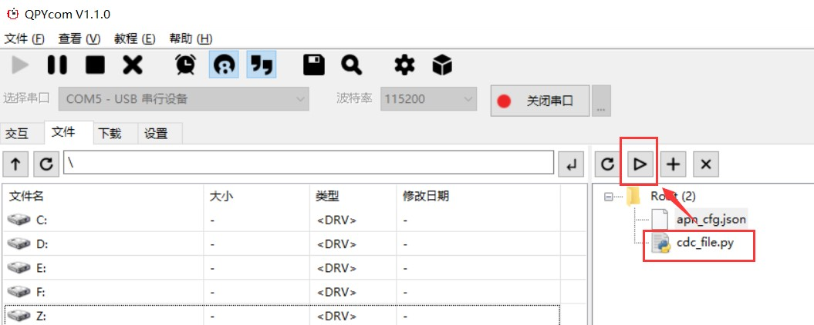
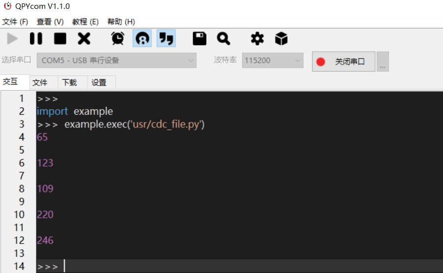

## ADC实验

文档主要基于 EC600S 介绍如何使用 QuecPython_ADC，Analog-to-Digital Converter的缩写。指的是模/数转换器或者模拟/数字转换器，可将连续变量的模拟信号转换为离散的数字信号的器件，简单地说就是将模拟电压值，转换成对应的肉眼可读数值。通过本文你将了解到EC600S_ADC 的所有设置参数及使用方法。

### 硬件描述  

目前开放共 2 路 ADC。2 路 ADC 连接位置如下表所示：

 

对应关系如下表：

| 模组 PIN 脚编号 | 说明       |
| --------------- | ---------- |
| 19              | ADC 通道 0 |
| 20              | ADC 通道 1 |

### 软件设计 

#### 常量说明 

| 常量     | 说明       |
| -------- | ---------- |
| ADC.ADC0 | ADC 通道 0 |
| ADC.ADC1 | ADC 通道 1 |

#### 创建 **ADC** 对象 

adc = ADC()。无参数，无返回值。

#### ADC功能初始化

adc.open()，无参数。

返回值：成功返回整型 0，失败返回整型-1。

#### 读取电压值 

adc.read(ADCn)：读取指定通道的电压值，单位 mV。

| 参数 | 参数类型 | 参数说明                                                     |
| ---- | -------- | ------------------------------------------------------------ |
| ADCn | int      | ADC 通道  注：EC600S 平台支持 ADC0，ADC1，对应引脚如下  ADC0 – 引脚号 19  ADC1 – 引脚号 20 |

#### 关闭 ADC

adc.close()，无参数。

返回值：成功返回整型 0，失败返回整型-1。

### 交互操作

使用 QPYcom 工具和模组进行交互，下面实例是基于 ADC0。

>    
>
>   注意：

1.  from misc import ADC 即为让 ADC 模块在当前空间可见。

2.  只有 from misc import ADC 模块，才能使用 ADC 内的函数和变量。

3.  上述操作是在 ADC0 连接了光敏电阻（EC600S 开发板已外接）的情况下操作的，对于
    ADC1 需要自己连接外设进行相应操作。

### 下载验证 

#### 软件代码

配套 demo 的参考代码为文档同目录下的 Timer.py 文件。下载.py文件到模组运行，代码如下：

```python
from misc import ADC # 导入 ADC 模块
import utime # 导入定时模块
read_time = 5 # 设定读取次数
adc = ADC()
while read_time:
   adc.open()
   read_data = adc.read(ADC.ADC0)
   print(read_data)
   adc.close()
   read_time -= 1
   utime.sleep(1) # 延时 1S

```


#### 硬件连接 

无需另外的硬件连接，EC600S 的 ADC0接口已经外接光敏电阻，本文的下载验证就是利用光敏电阻进行辅助验证。

#### 运行效果 

1.  打开 QPYcom 运行adc_file.py（运行同时保证光敏电阻接收不同程度的光照），如下图：

<span><div style="text-align: center;">

</div></span>

1.  在 QPYcom 交互界面查看输出结果（数值会有所不同）

<span><div style="text-align: center;">

</div></span>

### 配套代码

[下载代码](code/adc_file.py)