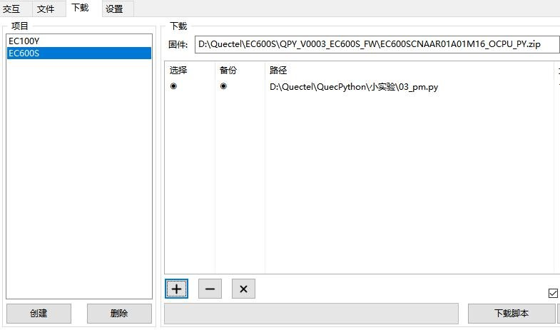

## 待机唤醒实验

文档主要介绍如何实现产品低功耗，许多便携式、手持式、移动式产品为拥有较长的续航能力，需要用低功耗设计，能在较低功耗的环境下正常工作。下面主要从软件设计方面讲解，通过阅读本文，您将了解到pm 模块的实现低功耗处理和验证实验理论。

### 硬件描述

模组内置自动低功耗功能，无需外置器件，仅用软件就可以实现低功耗。

### 软件设计

>   模组内置的低功耗模式，在无业务处理时使系统进入休眠状态，进入低功耗模式，具备自动休眠控制。

通俗点说，就是只要程序调用 utime.sleep()函数，系统就自动进入低功耗模式。

设计低功耗程序的时候，要考虑什么时候执行业务，什么时候进入休眠，休眠多长时间，执行业务时通常尽量在极短的时间完成，然后进入第一段较长的休眠时间，这样的程序领产品的续航时间更长。

以下示例代码，开启自动休眠模式控制，然后执行 utime.sleep()就可以休眠了。

```python
def main():
	lpm_fd = pm.create_wakelock("test_lock", len("test_lock")) # 创建 wake_lock 锁
    pm.autosleep(1) # 自动休眠模式控制
	while True:
		print("sleep")
        utime.sleep(5) # 延时 并 休眠 5 秒钟
        res = pm.wakelock_lock(lpm_fd) # 加锁 禁止进入休眠状态
        print(res)
        print("ql_lpm_idlelock_lock, g_c1_axi_fd = %d" % lpm_fd) 
        print("not sleep")
        utime.sleep(5) # 只延时，不休眠
        res = pm.wakelock_unlock(lpm_fd) # 解锁 继续 自动休眠模式
        print(res)
        print("ql_lpm_idlelock_unlock, g_c1_axi_fd = %d" % lpm_fd) 
        num = pm.get_wakelock_num() # 获取已创建锁的数量
        print(num) # 打印已创建锁的数量
```

接下来就可以下载验证了，python 代码不需要编译，直接通过 QPYcom 工具把.py
文件下载到模块中运行。

### 下载验证

下载.py 文件到模组运行：

<span><div style="text-align: center;">


</div></span>

下载之后，代码在延时的时候自动进入休眠，功耗降低。

### 配套代码

[下载代码](code/03_pm.py)