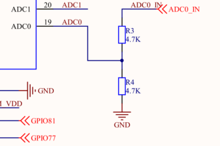
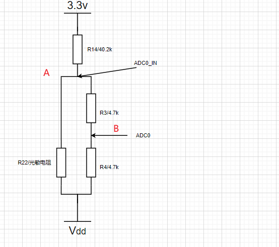
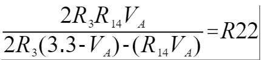

## 光敏传感器实验

本片文章主要简介EC600S ADC 硬件资源， 介绍quecpython ADC API，以及使用ADC来检测当前光敏电阻的阻值。

### 硬件资源

EC600 引出了两个ADC接口。参考 EC600S_QuecPython_EVB_V1.0_SCH.pdf 文档。



| 外设 | 引脚 |
| ---- | ---- |
| ADC0 | 19   |
| ADC1 | 20   |

并且提供了一个光敏电阻。


### 软件资源

#### 创建ADC对象

**ADC()**

返回一个adc对象。

#### 打开设备 – open

ADC功能初始化。

参数

无

返回值

成功返回整型0，失败返回整型-1。

#### 读取电压值 – read

读取指定通道的电压值，单位mV。

参数

| 参数 | 参数类型 | 参数说明                                    |
| ---- | -------- | ------------------------------------------- |
| ADCn | int      | EC600平台： ADC0 – 引脚号19 ADC1 – 引脚号20 |

#### 关闭设备 – close

关闭ADC。

参数:无

返回值:

0关闭成功，-1关闭失败。

### 光敏电阻实验

#### 光敏电阻原理简介

定义

光敏电阻是用硫化隔或硒化隔等半导体材料制成的特殊电阻器，表面还涂有防潮树脂，具有光电导效应。

特性

光敏电阻对光线十分敏感。光照愈强，阻值就愈低。随着光照强度的升高，电阻值迅速降低，可降低至1KΩ以下。包含了以下几个特性。

- 伏安特性：

  光敏传感器在一定的入射照度下，光敏元件的电流 I 与所加电压 U之间的关系称为光敏 器件的伏安特性。

- 光照特性

  光敏传感器的光谱灵敏度与入射光强之间的关系称为光照特性，有时光敏传感器的输出电压或电流与入射光强之间的关系也称为光照特性。

#### 实验设计

设计一个实验，根据当前光照强度，实时打印当前的光敏电阻的阻值。下图是光敏电阻的原理图。



ADC0 是我们可以使用ADC外设测试的电压点。


最终可以计算出，按照如下算式计算R22阻值。



#### 实验代码

```python
'''

File: Photoresistor.py

Project: adc

File Created: Thursday, 24th December 2020 5:44:08 pm

Author: chengzhu.zhou

-----

Last Modified: Wednesday, 30th December 2020 10:10:33 am

Modified By: chengzhu.zhou

-----

Copyright 2020 - 2020 quectel

'''

from misc import ADC

import utime as time

import _thread


# unit as Ω

		def Voltage_to_Resistance(Volt):

		#

		Va = 2 * Volt

		resistance = (2 * 4700 * 40200 * Va)/(2 * 4700 * (3300 - Va) - (40200 *Va))

		return resistance


def Photoresistor_thread(delay, retryCount):

 		# creat a adc device

		AdcDevice = ADC()

		while retryCount:

				retryCount = retryCount - 1

 				# get ADC.ADC0 value

				adcvalue = AdcDevice.read(ADC.ADC0)

				print("get ADC.ADC0 Voltage value as {0}mv".format(adcvalue))

 				# Converted to resistance

				resistance = Voltage_to_Resistance(adcvalue)

				print("Photoresistor resistance as {0}Ω".format(resistance))

				time.sleep(delay)

		pass


if __name__ == "__main__":

 		# creat a thread Convert ADC to Voltage

		_thread.start_new_thread(Photoresistor_thread, (1, 10))

		print("creent main thread has exit")
```


#### 实验操作

1.将代码烧录进开发板运行。

2.用物品挡住光敏电阻，改变照射到光敏电阻的光强，

3.查看串口输出的阻值的变化。

最终我们可以在串口看到，阻值输出的变化如下。

```python
import example

example.exec('usr/adc1.py')

creent main thread has exit

get ADC.ADC0 Voltage value as 151mv

Photoresistor resistance as 7114.343Ω

get ADC.ADC0 Voltage value as 152mv

Photoresistor resistance as 7206.022Ω

get ADC.ADC0 Voltage value as 279mv

Photoresistor resistance as 63070.42Ω

get ADC.ADC0 Voltage value as 272mv

Photoresistor resistance as 50913.1Ω

get ADC.ADC0 Voltage value as 199mv

Photoresistor resistance as 13333.95Ω

get ADC.ADC0 Voltage value as 296mv

Photoresistor resistance as 135022.3Ω
```


### 专业名词

> ***ADC：模数转换***

### 配套代码

[下载代码](code/Photoresistor.py)