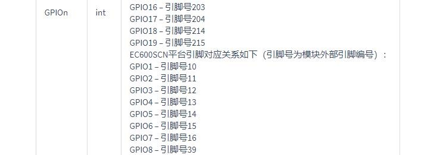
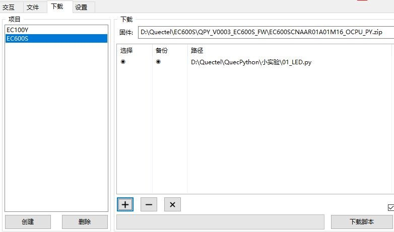
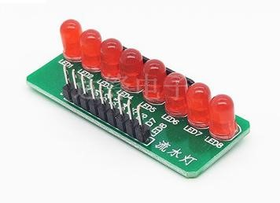
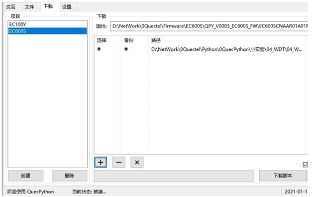
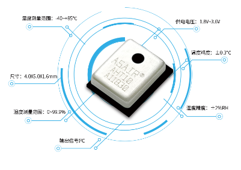
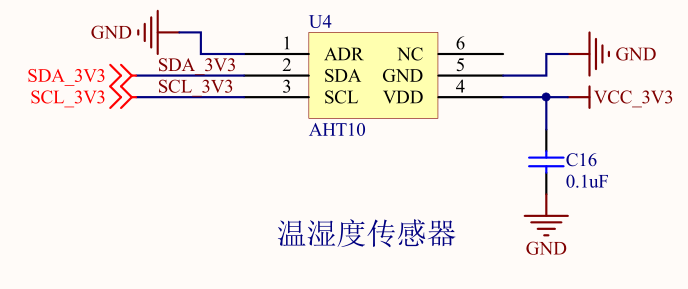
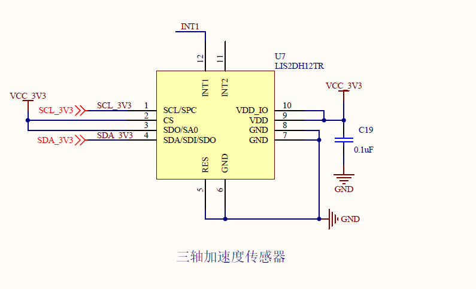
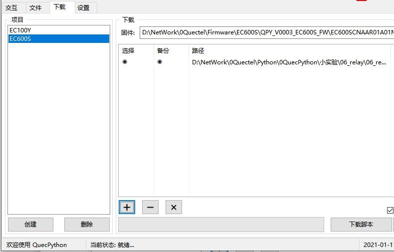

# QuecPython 小实验

***以上实验均可在模块中直接运行***

> 适用模块：

> -   EC600S-CN

***

## 跑马灯实验

文档主要介绍如何实现 GPIO控制外部器件，从硬件设计和软件设计两方面讲解，通过阅读本文，您将学会查看硬件连接关系、代码编写思路和验证实验理论。

### 硬件描述

GPIO是最常用的外设之一，可以输出高电平和低电平，以便控制外部的器件。如查看原理图，标有GPIO 的 Pin 就是我们想要找的引脚。


### 软件设计

3.1. 首先确定要控制硬件的哪个引脚，然后通过官网的 API 类库找到 Pin
介绍，查看引脚号对应的 GPIO，如图：

>   GPIO1–引脚号 10 对应硬件 Pin10，GPIO2–引脚号 11 对应硬件
>   Pin11......如此类推。



开始编写代码，在.py 文件里加入下面代码，用于对 GPIO 读写：

```python
IOdictRead = {} # 记录已经初始化的 GPIO 口
IOdictWrite = {} # 记录已经初始化的 GPIO 口
def GPIO_Read(gpioX, Pull=Pin.PULL_DISABLE, level=1):
	f IOdictWrite.get(gpioX, None):
    	del IOdictWrite[gpioX]
    gpioIO = IOdictRead.get(gpioX, None) 
    if gpioIO:
    	return gpioIO.read()
    else:
        IOdictRead[gpioX] = (Pin(gpioX, Pin.IN, Pull, level)) 
        gpioIO = IOdictRead.get(gpioX, None)
		return gpioIO.read()
def GPIO_Write(gpioX, level, Pull=Pin.PULL_DISABLE):
    if IOdictRead.get(gpioX, None):
    	del IOdictRead[gpioX]
    gpioIO = IOdictWrite.get(gpioX, None) 
    if gpioIO:
    	gpioIO.write(level)
    else:
        IOdictWrite[gpioX] = (Pin(gpioX, Pin.OUT, Pull, level)) 
        gpioIO = IOdictWrite.get(gpioX, None)
		gpioIO.write(level)
```

定义需要控制的 GPIO 别名：

| **LED1 = Pin.GPIO1** | **# 定义 LED 引脚** |
| -------------------- | -------------------- |
| **LED2 = Pin.GPIO2** | **# 定义 LED 引脚** |
| **LED3 = Pin.GPIO3** | **# 定义 LED 引脚** |
| **LED4 = Pin.GPIO4** | **# 定义 LED 引脚** |
| **LED5 = Pin.GPIO5** | **# 定义 LED 引脚** |
|                      |                      |

对某一个引脚实现控制：

```python
def IO_On(gpioX):	# 某个引脚置 0
	GPIO_Write(gpioX, 0)	# 调用写函数
def IO_Off(gpioX):	# 某个引脚置 1
	GPIO_Write(gpioX, 1)	# 调用写函数

```

对全部引脚实现控制：

```python
def IO_All_Off():	# 全部引脚置 1
    IO_Off(LED1)
    IO_Off(LED2)
    IO_Off(LED3)
    IO_Off(LED4)
    IO_Off(LED5)

```

完成上面的代码后，我们可以编写主程序
main()，主要实现思路，亮-灭-亮-灭，如此循环；仅点亮 LED1，延时 200 毫秒，看到
LED1 亮，LED1 灭；仅点亮 LED2，延时 200 毫秒，LED2 灭；仅点亮 LED3，延时

200 毫秒，LED3 灭；这样就能看到 LED 轮流点亮的效果。

```python
def main():
    while True:
        IO_All_Off()	# 灭 IO_On(LED1)	# 亮
        utime.sleep_ms(200)	# 延时
        IO_All_Off()	# 灭 IO_On(LED2)	# 亮
        utime.sleep_ms(200)	# 延时
        IO_All_Off()	# 灭 IO_On(LED3)	# 亮
        utime.sleep_ms(200)	# 延时
        IO_All_Off()	# 灭 IO_On(LED4)	# 亮
        utime.sleep_ms(200)	# 延时
        IO_All_Off()	# 灭 IO_On(LED5)	# 亮
        utime.sleep_ms(200)	# 延时
```

接下来就可以下载验证了，python 代码不需要编译，直接通过 QPYcom 工具把.py文件下载到模块中运行。

### 下载验证

下载.py 文件到模组运行：

<span><div style="text-align: center;">


</div></span>

下载之后，看到 LED 逐个点亮，有流水灯的效果：

<span><div style="text-align: center;">


</div></span>

### 配套代码

[下载代码](code/01_LED.py)

## 蜂鸣器实验

### 基本概述

本片文章主要简介使用EC600S GPIO 来驱动外部蜂鸣器模块。

#### 硬件资源

淘宝链接：
<https://detail.tmall.com/item.htm?id=41251333522&spm=2013.1.1997525049.3.ffec2c43XoQVcT>

淘宝： 无源频率可控


### 使用说明

无源蜂鸣器通过PWM开关三极管驱动。 我们只需要电源，以及2k~5K 的pwm方波即可。

### 实验步骤

#### 实验环境准备

 **引脚连接**

按照下面的链接方式链接引脚

| **蜂鸣器** | **EC600开发板**   | **对应的函数标号** |
| ---------- | ----------------- | ------------------ |
| IO (PWM)   | GPIO81 (引脚号16) | PWM2               |
| VCC        | 5_5V电源          | 无                 |
| GND        | 地                | 无                 |

#### 实验代码

```
'''

File: pwm_buzzer.py

Project: pwm

File Created: Wednesday, 30th December 2020 5:02:46 pm

Author: chengzhu.zhou

-----

Last Modified: Wednesday, 30th December 2020 5:02:48 pm

Modified By: chengzhu.zhou

-----

Copyright 2020 - 2020 quectel

'''

from misc import PWM

import utime as time

import urandom as random

import log

# API https://python.quectel.com/wiki/#/zh-cn/api/?id=pwm

# 蜂鸣器模块 https://detail.tmall.com/item.htm?id=41251333522
无源蜂鸣器-频率可控版

"""

pwm0 = PWM(PWM.PWMn,PWM.ABOVE_xx,highTime,cycleTime)

注：EC600SCN平台，支持PWM0-PWM3，对应引脚如下：

PWM0 – 引脚号52

PWM1 – 引脚号53

PWM2 – 引脚号70

PWM3 – 引脚号69

"""

"""

| 蜂鸣器 | EC600开发板 | 对应的函数标号 |

| ---------- | ------------------ | ------- |

| IO (PWM) | GPIO81 (引脚号16) | PWM2 |

| VCC | 3_3V电源 | 无 |

| GND | 地 | 无 |

"""

buzzer_log = log.getLogger("buzzer_test")


# Duration 为 ms

def outputpwm(HZ, duty_cycle, Duration):

# 将HZ 转化为 10us 级别

cycleTime = int((10000000/HZ)/10)

		highTime = int(cycleTime * duty_cycle)

		buzzer_log.debug(

				"""out put pin70 cycleTime {0} * 10us,

				highTime {1} * 10us, Duration of {2}"""

				.format(cycleTime, highTime, Duration))

				pwm1 = PWM(PWM.PWM2, PWM.ABOVE_10US, highTime, cycleTime)

		pwm1.open()

		time.sleep_ms(Duration)

		pwm1.close()

		pass


def test_Buzzer():

		log.basicConfig(level=log.DEBUG)

		for i in range(10):

				# 建议输出2000~5000HZ 的PWM波形

				# 范围可以自己选择， 0~1

				duty_cycle = random.uniform(0.1, 0.8)

				HZ = random.randint(2000, 5000)

				outputpwm(HZ, duty_cycle, 500)

				time.sleep_ms(1500)

		pass


if __name__ == "__main__":

		# creat a thread Check key status

		test_Buzzer()

将代码下载运行，可以听到蜂鸣器产生随机的声音。
```

### 配套代码

[下载代码](code/pwm_buzzer.py)

## 按键输入实验

### 基本概述 

本片文章主要简介 EC600S ADC  硬件资源，  介绍 quecpython   ADC API，以及使用 ADC  来检 测当前光敏电阻的阻值。

### 硬件资源 

EC600   引出了四个按键接口。参考 [EC600S_QuecPython_EVB_V1.0_SCH.pdf ](#_page11_x51.00_y610.92)  文档。  


| 按键 | 引脚   |
| ---- | ------ |
| S1   | -      |
| S2   | -      |
| S3   | GPIO72 |
| S4   | GPIO71 |

当按键按下的时候，  我们可以检测到对应的引脚由 1 变为 0. 


### 实验设计

代码一直轮询检测引脚状态。  分别检测两个按键，单击，双击，以及长按。


### 代码实现 

```python
'''
File: buttonclass.py
Project: button
File Created: Thursday, 24th December 2020 5:52:44 pm
Author: chengzhu.zhou
 
-----
Last Modified: Friday, 25th December 2020 5:30:48 pm
Modified By: chengzhu.zhou
-----
Copyright 2020 - 2020 quectel
'''

# copy from https://blog.csdn.net/qq997758497/article/details/80606710
from machine import Pin
import _thread
import utime as time

def Processing_button_fun(Alias, actionKey):
    print("{0} has {1} action".format(Alias, actionKey))
    pass

class ButtonClass():
    Alias = None
    Gpio_obj = None
    # check quiet click and long
    Status2 = None
    Status1 = None
    callbackfun = None
    timercount2 = None
    timercount1 = None
    # macro
    # readonly
    KEY_ACTION_QUIET = "quiet"
    KEY_ACTION_CLICK = "click"
    KEY_ACTION_DOUBLE = "double"
    KEY_ACTION_LONG = "long"
    # KEY_ACTION = {"quiet": "No key is generated ", "click": "Single key generation",
    #               "double": "Double click the event", "long": "There are long press events"}

    # KeyValue
    KEY_VALUE = {"press": 0, "normal": 1}

    #
    KEY_LONG_MAX_TIME = 2000

 
    def SetButtonStatu2(self, status="state0", time=0x00):
        self.Status2 = status
        self.timercount2 = time

    def SetButtonStatu1(self, status="state0", time=0x00):
        self.Status1 = status
        self.timercount1 = time

    def __nextstatus(self):
        pass

    def init(self, pin, callbackfun, Alias="gpio0"):
        self.Gpio_obj = Pin(pin, Pin.IN, Pin.PULL_DISABLE, 0)
        self.Alias = Alias
        self.callbackfun = callbackfun
        self.SetButtonStatu2("state0", 0x0)
        self.SetButtonStatu1("state0", 0x0)
        pass

        # return quiet click and long
    def __button_read_key(self):
        _Status = self.Status2
        keyValue = self.Gpio_obj.read()
        if _Status == "state0":
            if keyValue == self.KEY_VALUE["press"]:
                self.SetButtonStatu2("state1", 0x00)
            return self.KEY_ACTION_QUIET

            # Software chattering elimination
        if _Status == "state1":
            if keyValue == self.KEY_VALUE["press"]:
                self.SetButtonStatu2("state2", time.ticks_ms())
            else:
                # reset status
                self.SetButtonStatu2("state0", 0x00)
            return self.KEY_ACTION_QUIET
        elif _Status == "state2":
            if keyValue == self.KEY_VALUE["normal"]:
                # has click occur
                self.SetButtonStatu2("state0", self.timercount2)
                return self.KEY_ACTION_CLICK
            else:
                difftime = time.ticks_ms() - self.timercount2
                if difftime > self.KEY_LONG_MAX_TIME:
                    self.SetButtonStatu2("state0", 0x00)
                    return self.KEY_ACTION_LONG
        elif _Status == "state3":
            # Wait for the key to release
            if keyValue == self.KEY_VALUE["normal"]:
                self.SetButtonStatu2("state0", 0x00)
        return self.KEY_ACTION_QUIET

    def polling(self):
        # check has double click
        _Status = self.Status1
        _KeyStatus = self.__button_read_key()
        if _Status == "state0":
            if _KeyStatus != self.KEY_ACTION_CLICK:
                return _KeyStatus
            else:
                self.SetButtonStatu1("state1", time.ticks_ms())
                # No report
                return self.KEY_ACTION_QUIET
        elif _Status == "state1":
            difftime = time.ticks_ms() - self.timercount1
            if _KeyStatus == self.KEY_ACTION_CLICK:
                # Second time detected in a short time
                self.SetButtonStatu1("state0", 0x00)
                return self.KEY_ACTION_DOUBLE
            elif difftime >= 500:
                self.SetButtonStatu1("state0", 0x00)
                return self.KEY_ACTION_CLICK
        return _KeyStatus

#
def button_polling_thread(delay, PinList):
    ButtonList = []
    i = 0
    # init button
    for _pin in PinList:
        _temp = ButtonClass()
        _temp.init(_pin, Processing_button_fun, "button{0}".format(i))
        ButtonList.append(_temp)
        i = i + 1
    # Polling button
    i = 10
    while i:
        for button in ButtonList:
            action = button.polling()
            if action != ButtonClass.KEY_ACTION_QUIET:
                # has press
                button.callbackfun(button.Alias, action)
                i = i - 1
        time.sleep_ms(10)
    print("button thread has exited")

if __name__ == "__main__":
    # creat a thread Check key status
    _thread.start_new_thread(button_polling_thread,
                             (1, [Pin.GPIO1, Pin.GPIO2]))

```


### 实验操作

（1）将 buttonclass.py 烧录到 /usr 目录下。 

（2）使用下面的命令执行脚本。

```python
>>> uos.getcwd()
'/'
>>> uos.listdir()
['usr', 'bak']
>>> uos.chdir('usr')
>>> uos.listdir()
['apn_cfg.json', 'maonv.mp3', 'test.py', 'buttonclass.py']
>>> import example 
>>> example.exec('usr/buttonclass.py')
```

（3）按下板卡按键，查看打印日志。

最终我们可以在串口看到，阻值输出的变化如下：

```
button0 has double action

button0 has click action

button0 has click action

button0 has long action

button0 has long action

button0 has click action

button1 has click action

button1 has double action

button0 has double action

button0 has double action
```


### 其他实验引用 buttonclass 脚本

#### 测试代码 

```python
'''
File: test_buttonclass.py
Project: button
File Created: Friday, 25th December 2020 5:42:17 pm
Author: chengzhu.zhou
-----
Last Modified: Friday, 25th December 2020 5:42:41 pm
Modified By: chengzhu.zhou
-----
Copyright 2020 - 2020 quectel
'''
import utime as time
from buttonclass import ButtonClass
from machine import Pin
import _thread

def Processing_button_fun(Alias, actionKey):
    if actionKey == ButtonClass.KEY_ACTION_CLICK:
        print("test: has click trigger")
        pass
    elif actionKey == ButtonClass.KEY_ACTION_DOUBLE:
        print("test: has double click trigger")
        pass
    elif actionKey == ButtonClass.KEY_ACTION_LONG:
        print("test: has long click trigger")
        pass
    pass

def button_polling_thread(delay, PinList):
    ButtonList = []
    i = 0
    # init button
    for _pin in PinList:
        _temp = ButtonClass()
        _temp.init(_pin, Processing_button_fun, "button{0}".format(i))
        ButtonList.append(_temp)
        i = i + 1
    # Polling button
    i = 10
    while i:
        for button in ButtonList:
            action = button.polling()
            if action != ButtonClass.KEY_ACTION_QUIET:
                # has press
                button.callbackfun(button.Alias, action)
                i = i - 1
        time.sleep_ms(10)
    print("button thread has exited")

if __name__ == "__main__":
    # creat a thread Check key status
    _thread.start_new_thread(button_polling_thread,
                             (1, [Pin.GPIO1, Pin.GPIO2]))

```


#### 测试步骤

（1）首先将 test_buttonclass.py  将  烧录到和 buttonclass.py  同级目录。


（2）然后使用命令行的方式切换到对应目录。我这里是 /usr 目录。 

```python
>>> uos.getcwd()
'/'
>>> uos.listdir()
['usr', 'bak']
>>> uos.chdir('usr')
>>> uos.listdir()
['apn_cfg.json', 'maonv.mp3', 'test.py', 'buttonclass.py', 'test_buttonclass.py']   
>>> import example 
>>> example.exec('usr/test_buttonclass.py')

```

运行脚本以后，按下按键即可。下面是测试 log 

```
test: has click trigger

test: has click trigger

test: has double click trigger

test: has double click trigger

test: has click trigger

test: has long click trigger
test: has long click trigger

test: has long click trigger

test: has long click trigger

test: has click trigger
button thread has exited
```

### 配套代码

[下载代码](code/buttonclass.py)

## 串口实验

主要简介 EC600S  串口硬件资源，  介绍 quecpython串口 API，  以及实现一个 demo程序 展示怎样使用串口。

### 硬件资源 

EC600 包含了 4 个串口外设，  分别命名为

- DEBUG PORT 

- BT PORT 

- MAIN PORT 

- USB CDC PORT 

  

### 软件资源 

#### 创建 uart 对象   - uart

> **uart = UART(UART.UARTn, buadrate, databits, parity, stopbits, flowctl) **

| 参数     | 类型 | 说明                                                         |
| -------- | ---- | ------------------------------------------------------------ |
| UARTn    | int  | 端口号   EC600SCN平台,UARTn作用如下：   <br>UART0 - DEBUG PORT<br/>UART1 – BT PORT<br/>UART2 – MAIN PORT<br/>UART3 – USB CDC PORT |
| buadrate | int  | 波特率，常用波特率都支持，如4800、9600、19200、38400、57600、115200、230400等 |
| databits | int  | 数据位（5~8）                                                |
| parity   | int  | 奇偶校验（0 – NONE，1 – EVEN，2 - ODD）                      |
| stopbits | int  | 停止位（1~2）                                                |
| flowctl  | int  | 硬件控制流（0 – FC_NONE， 1 – FC_HW）                        |


#### 查看 buffer 容量  – any 

> **uart.any() **

功能 ：返回接收缓存器中有多少字节的数据未读。

参数 ： 无 

返回值 ： 返回接收缓存器中有多少字节的数据未读。


#### 读取 buffer – read 

> **uart.read(nbytes)**

功能 ： 从串口读取数据。

参数 ：

| 参数   | 类型 | 说明           |
| ------ | ---- | -------------- |
| nbytes | int  | 要读取的字节数 |

返回值：返回读取的数据。


#### 写数据  – write 

> **uart.write(data) **

功能 ：发送数据到串口。

参数 ：

| 参数 | 类型   | 说明       |
| ---- | ------ | ---------- |
| data | string | 发送的数据 |

返回值：返回发送的字节数。


#### 关闭 uart 对象  – close 

> **uart.close() **

功能 ：关闭串口。

参数 ：无

返回值 ：成功返回整型 0，失败返回整型 -1。 

  

### 实验步骤

#### 实验环境准备

首先将 EC600 开发板上面的 TXD1  和 RXD1，焊上排针  ，使用杜邦线连接到 USB 转串口模块上。


使用另外一个串口终端上位机（比如 xshell）接受消息。 接下来我们将使用 MAIN PORT  串口打印消息。


#### 交互实验

```
>>> from machine import UART
>>> uart1 = UART(UART.UART1, 115200, 8, 0, 1, 0) #串口1
>>> uart1.any()
10
>>> uart1.read(5)
b’12345’
>>> uart1.any()
5
```


### 实验代码 

```python
'''
File: timer.py
Project: timer
File Created: Monday, 28th December 2020 2:44:33 pm
Author: chengzhu.zhou
-----
Last Modified: Friday, 8th January 2021 9:19:55 am
Modified By: chengzhu.zhou
-----
Copyright 2021 - 2021 quectel
'''

# refs for http://qpy.quectel.com/wiki/#/zh-cn/api/?id=timer
from machine import Timer
import utime as time


# 创建一个执行函数，并将timer实例传入
num = 0
state = 1


def CallBack(t):
    global num
    global state
    print('num is %d' % num)
    num += 1
    if num > 10:
        print('num > 10, timer exit')
        state = 0
        t.stop()


def main():
    # 创建一个定时器对象
    T = Timer(Timer.Timer1)
    # 设置周期为1秒，
    T.start(period=1000, mode=Timer.PERIODIC, callback=CallBack)   # 启动定时器
    # wait
    while state:
        time.sleep_ms(1)
        pass
    T.stop()   # 结束该定时器实例
    print("The main function has exited")


if __name__ == "__main__":
    main()

```

### 配套代码

[下载代码](code/uart_demo1.py)

## 外部中断实验

### 概述

本文档主要基于EC600介绍如何使用QuecPython类库API来快速开发使用外部中断功能。

EC600 14个 外部中断引脚。 从GPIO1~GPIO14。 具体的映射看下后文函数的讲解。

### 使用说明

#### Exint创建对象

extint = ExtInt(GPIOn, mode, pull, callback)

| 参数     | 类型 | 说明                                                         |
| -------- | ---- | ------------------------------------------------------------ |
| GPIOn    | int  | 引脚号   <br />EC100YCN平台引脚对应关系如下（引脚号为外部引脚编号）：   <br />GPIO1 – 引脚号22   <br />GPIO2 – 引脚号23   <br />GPIO3 – 引脚号38   <br />GPIO4 – 引脚号53   <br />GPIO5 – 引脚号54   <br />GPIO6 – 引脚号104   <br />GPIO7 – 引脚号105   <br />GPIO8 – 引脚号106   <br />GPIO9 – 引脚号107   <br />GPIO10 – 引脚号178   <br />GPIO11 – 引脚号195   <br />GPIO12 – 引脚号196   <br />GPIO13 – 引脚号197   <br />GPIO14 – 引脚号198   <br />GPIO15 – 引脚号199   <br />GPIO16 – 引脚号203   <br />GPIO17 – 引脚号204  <br />GPIO18 – 引脚号214   <br />GPIO19 – 引脚号215   <br />EC600SCN平台引脚对应关系如下（引脚号为模块外部引脚编号）：   <br />GPIO1 – 引脚号10   <br />GPIO2 – 引脚号11   <br />GPIO3 – 引脚号12   <br />GPIO4 – 引脚号13   <br />GPIO5 – 引脚号14   <br />GPIO6 – 引脚号15   <br />GPIO7 – 引脚号16   <br />GPIO8 – 引脚号39   <br />GPIO9 – 引脚号40   <br />GPIO10 – 引脚号48  <br />GPIO11 – 引脚号58   <br />GPIO12 – 引脚号59   <br />GPIO13 – 引脚号60   <br />GPIO14 – 引脚号61 |
| mode     | int  | 设置触发方式   <br />IRQ_RISING – 上升沿触发   <br />IRQ_FALLING – 下降沿触发   <br />IRQ_RISING_FALLING – 上升和下降沿触发 |
| pull     | int  | PULL_DISABLE – 浮空模式   <br />PULL_PU – 上拉模式  <br />PULL_PD – 下拉模式 |
| callback | int  | 中断触发回调函数                                             |

#### enable 使能外部中断

使能extint对象外部中断，当中断引脚收到上升沿或者下降沿信号时，会调用callback执行。

参数：无

返回值：使能成功返回整型值0，使能失败返回整型值-1。

#### disable 禁止外部中断

禁用与extint对象关联的中断 。

参数：无

返回值：使能成功返回整型值0，使能失败返回整型值-1。

#### line 返回映射行号 

返回引脚映射的行号。

参数：无

返回值：引脚映射的行号。

### 代码示例

将外部中断映射在GPIO71引脚上。 也就是S4按键.按下S4按键。 回调函数。

```
'''

File: External_interrupt.py

Project: button

File Created: Monday, 28th December 2020 3:03:43 pm

Author: chengzhu.zhou

-----

Last Modified: Monday, 28th December 2020 3:03:47 pm

Modified By: chengzhu.zhou

-----

Copyright 2020 - 2020 quectel

'''

from machine import ExtInt

import utime as time

'''

EC600SCN平台引脚对应关系如下：

GPIO1 – 引脚号71

GPIO2 – 引脚号72

GPIO3 – 引脚号73

GPIO4 – 引脚号74

GPIO5 – 引脚号75

GPIO6 – 引脚号76

GPIO7 – 引脚号77

'''

# 参考自 http://qpy.quectel.com/wiki/#/zh-cn/api/?id=extint

state = 2


def callBack(args):

	global state

	print("###interrupt %d ###" % args)

	state = state - 1


def main():

 	# 映射GPIO71的下降沿触发回调函数

	extint = ExtInt(ExtInt.GPIO1, ExtInt.IRQ_FALLING, ExtInt.PULL_PU, callBack)

 	# 等待按键按下，触发

	 while state:

		time.sleep_ms(10)

		pass

	# 停止映射外部中断

	extint.disable()

	print("The main function has exited")


if __name__ == "__main__":

	main()
```

### 配套代码

[下载代码](code/External_interrupt.py)

## 独立看门狗实验

文档主要介绍看门狗的用处和使用技巧，量产后生产的设备难免有个会有瑕疵，或者软件工程师做的代码有意想不到的地方，又或者硬件的寿命受自然条件所影响，导致产品死机，死机后不再运作可能会造成不可估量的后果，为了解决这样的问题，那么就要使用看门狗了，看门狗能够使产品死机后复位重新运作，本文里看门狗简称WDT。

### 硬件描述

模组内置 WDT 功能，无需外置器件，仅用软件就能解决死机复位功能。

### 软件设计

模组内置的 WDT 模式，在初始化 WDT 时要指定最长喂狗时间，使用 WDT后，就必须在指定内喂狗，否则将导致程序复位。我们利用 print打印函数，在喂狗时打印信息，不为狗超时导致程序复位自然就看不到打印信息。

```python
def Watchdog(): # 2 秒钟内调用喂狗函数，否则系统复位
	global wdt # 声明全部变量
    if wdt is None:
    	wdt = WDT(2) # 启动看门狗，间隔时长 单位 秒
    wdt.feed() # 喂狗
def main():
    print('喂狗')
    Watchdog() # 2 秒钟内调用喂狗函数
    func_1() # 用户程序
    print('喂狗')
    Watchdog() # 2 秒钟内调用喂狗函数
    func_2() # 用户程序
    print('喂狗')
    print('喂狗') # 2 秒钟内调用喂狗函数
    func_3() # 用户程序
    print('喂狗')
    Watchdog() # 2 秒钟内调用喂狗函数
    func_4() # 用户程序
```

一秒钟后打印信息，print 能正常输出，说明程序正常往下执行。

```python
def func_1():
	utime.sleep_ms(1000) # 延时 1 秒
    print('功能函数 1')
def func_2():
    utime.sleep_ms(1000) # 延时 1 秒
	print('功能函数 2')
```

如下面的函数，内部处理超过两秒，那么就需要在函数内也要喂狗一次，确保程序正常执行是不被复位。

```python
def func_3():
    utime.sleep_ms(1000) # 延时 1 秒
    print('功能函数 3')
    Watchdog() # 2 秒钟内调用喂狗函数
    utime.sleep_ms(1000) # 延时 1 秒
    print('功能函数 3_2')
```

下面的函数有个utime.sleep_ms(5000)五秒钟的延时，明显超过两秒，执行到此处时模拟程序死机，就像设备在某个地方卡住不动，然后系统就会复位。

```python
def func_4():
	utime.sleep_ms(1000)
    print('功能函数 4')
    Watchdog() # 2 秒钟内调用喂狗函数
    print('尝试在 5s 后喂狗')
    utime.sleep_ms(5000) # 延时 5 秒
    Watchdog()
    print('来不及喂狗，系统已经复位')
```

接下来就可以下载验证了，python 代码不需要编译，直接通过 QPYcom 工具把.py文件下载到模块中运行。

### 下载验证

下载.py 文件到模组运行：

<span><div style="text-align: center;">

</div></span>

<span><div style="text-align: center;">

</div></span>

下载之后，执行代码在延时 5 秒的时候，系统复位。

### 配套代码

[下载代码](code/04_WDT.py)

## 定时器中断实验 

### 基本概述

本文档主要基于EC600介绍如何使用QuecPython类库API来快速开发使用定时器功能。

### 使用说明

#### Timer创建对象

from machine import Timer

timer = Timer(Timern)

| 常量         | 说明    |
| ------------ | ------- |
| Timer.Timer0 | 定时器0 |
| Timer.Timer1 | 定时器1 |
| Timer.Timer2 | 定时器2 |
| Timer.Timer3 | 定时器3 |

#### start启动定时器

timer.start(period, mode, callback)

| 参数     | 类型     | 说明                                                         |
| -------- | -------- | ------------------------------------------------------------ |
| period   | int      | 中断周期，单位毫秒，大于等于1                                |
| mode     | int      | 运行模式 Timer.ONE_SHOT 单次模式，定时器只执行一次 Timer.PERIODIC 周期模式，循环执行 |
| callback | function | 定时器执行函数                                               |

返回值

启动成功返回整型值0，失败返回整型值-1。

#### stop停止定时器

关闭定时器。

参数:无

返回值:

成功返回整型值0，失败返回整型值-1。

### 实验设计

#### 实验步骤

1. 分配一个定时器。

2. 定义一个回调函数， 配置成为1秒回调一次。

3. 在回调函数里面设置，回调10次。关闭定时器。

#### 实验代码

```
'''File: timer.py

Project: timer

File Created: Monday, 28th December 2020 2:44:33 pm

Author: chengzhu.zhou

-----

Last Modified: Friday, 8th January 2021 9:19:55 am

Modified By: chengzhu.zhou

-----

Copyright 2021 - 2021 quectel

'''

# refs for http://qpy.quectel.com/wiki/#/zh-cn/api/?id=timer

from machine import Timer

import utime as time


# 创建一个执行函数，并将timer实例传入

num = 0

state = 1


def CallBack(t):

	global num

	global state

	print('num is %d' % num)

	num += 1

	if num > 10:

		print('num > 10, timer exit')

		state = 0

		t.stop()


def main():

	# 创建一个定时器对象

	T = Timer(Timer.Timer1)

	# 设置周期为1秒，

	T.start(period=1000, mode=Timer.PERIODIC, callback=CallBack) # 启动定时器

	# wait

	while state:

		time.sleep_ms(1)

		pass

	T.stop() # 结束该定时器实例

	print("The main function has exited")


if __name__ == "__main__":

	main()
```

### 配套代码

[下载代码](code/timer.py)

## PWM输出实验

本文档主要基于 EC600 介绍如何使用 QuecPython 类库 API 来快速开开发使用 **pwm** 功能。 EC600 拥有   6 个 pwm 外设。  暂时还没有引脚重映射的功能。只能将外设固定对应的引脚使用。

1. PWM0 –  引脚号 52 

1. PWM1 –  引脚号 53 

1. PWM2 –  引脚号 57 

1. PWM3 –  引脚号 56 

1. PWM4 –  引脚号 70 

1. PWM5 –  引脚号 69 

   

### 使用说明

#### pwm 创建对象

示例代码参考以下代码清单：

```
from misc import PWM
pwm0 = PWM(PWM.PWMn,PWM.ABOVE_xx,highTime,cycleTime) 
```

| 参数          | 参数类型       | 参数说明                               |
| ------------- | -------------- | -------------------------------------- |
| PWM.PWMn      | PWM.PWM0       | PWM0                                   |
|               | PWM.PWM1       | PWM1                                   |
|               | PWM.PWM2       | PWM2                                   |
|               | PWM.PWM3       | PWM3                                   |
| PWM.ABOVE_xx | PWM.ABOVE_MS  | ms 级  取值 (0,1023)                   |
|               | PWM.ABOVE_1US | us 级  取值 (0,157)                    |
|               | PWM.ABOVE_10U | Sus 级  取值 (1,1575)                  |
| highTime      | int            | ms 级时：单位 ms<br> us 级时：单位 us  |
| cycleTime     | int            | ms 级时：单位 ms <br/>us 级时：单位 us |

#### pwm.open 打开设备

开启 PWM 输出。 

参数 ： 无 

返回值 ： 成功返回整型 0，失败返回整型 -1。 

#### pwm.cloes  关闭设备 

关闭 PWM 输出。 

参数 ： 无 

返回值 ： 成功返回整型 0，失败返回整型 -1。 


### 代码示例

```python
'''
File: pwm_demo.py
Project: pwm
File Created: Wednesday, 23rd December 2020 11:21:14 am
Author: chengzhu.zhou
-----
Last Modified: Tuesday, 29th December 2020 4:38:49 pm
Modified By: chengzhu.zhou
-----
Copyright 2020 - 2020 quectel
'''


from misc import PWM
import utime as time
"""
PWM号
注：EC100YCN平台，支持PWM0-PWM5，对应引脚如下：
PWM0 – 引脚号19
PWM1 – 引脚号18
PWM2 – 引脚号16
PWM3 – 引脚号17
PWM4 – 引脚号23
PWM5 – 引脚号22
注：EC600SCN平台，支持PWM0-PWM5，对应引脚如下：
PWM0 – 引脚号52
PWM1 – 引脚号53
PWM2 – 引脚号57
PWM3 – 引脚号56
PWM4 – 引脚号70
PWM5 – 引脚号69
"""


def main():
    # config cysle 200ms , config high voltage 100ms ,
    # in other words , config duty cycle as %50
    pwm_obj = PWM(PWM.PWM0, PWM.ABOVE_MS, 100, 200)
    #
    pwm_obj.open()
    time.sleep(10)
    pwm_obj.close()
    print("pwm Demo run successfully")
    pass


if __name__ == "__main__":
    main()

```


代码串讲：   将 PWM0 设备  设置为周期 200ms，  高电平为 100ms 的输出。  运行代码，使用示波器抓取 PWM 0  对应的 52 号引脚电压。可得到如下图案。


### 配套代码

[下载代码](code/pwm_demo.py)

<!-- ## LCD触摸屏显示实验 -->

## 待机唤醒实验

文档主要介绍如何实现产品低功耗，许多便携式、手持式、移动式产品为拥有较长的续航能力，需要用低功耗设计，能在较低功耗的环境下正常工作。下面主要从软件设计方面讲解，通过阅读本文，您将了解到pm 模块的实现低功耗处理和验证实验理论。

### 硬件描述

模组内置自动低功耗功能，无需外置器件，仅用软件就可以实现低功耗。

### 软件设计

>   模组内置的低功耗模式，在无业务处理时使系统进入休眠状态，进入低功耗模式，具备自动休眠控制。

通俗点说，就是只要程序调用 utime.sleep()函数，系统就自动进入低功耗模式。

设计低功耗程序的时候，要考虑什么时候执行业务，什么时候进入休眠，休眠多长时间，执行业务时通常尽量在极短的时间完成，然后进入第一段较长的休眠时间，这样的程序领产品的续航时间更长。

以下示例代码，开启自动休眠模式控制，然后执行 utime.sleep()就可以休眠了。

```python
def main():
	lpm_fd = pm.create_wakelock("test_lock", len("test_lock")) # 创建 wake_lock 锁
    pm.autosleep(1) # 自动休眠模式控制
	while True:
		print("sleep")
        utime.sleep(5) # 延时 并 休眠 5 秒钟
        res = pm.wakelock_lock(lpm_fd) # 加锁 禁止进入休眠状态
        print(res)
        print("ql_lpm_idlelock_lock, g_c1_axi_fd = %d" % lpm_fd) 
        print("not sleep")
        utime.sleep(5) # 只延时，不休眠
        res = pm.wakelock_unlock(lpm_fd) # 解锁 继续 自动休眠模式
        print(res)
        print("ql_lpm_idlelock_unlock, g_c1_axi_fd = %d" % lpm_fd) 
        num = pm.get_wakelock_num() # 获取已创建锁的数量
        print(num) # 打印已创建锁的数量
```

接下来就可以下载验证了，python 代码不需要编译，直接通过 QPYcom 工具把.py
文件下载到模块中运行。

### 下载验证

下载.py 文件到模组运行：

<span><div style="text-align: center;">


</div></span>

下载之后，代码在延时的时候自动进入休眠，功耗降低。

### 配套代码

[下载代码](code/03_pm.py)

## RTC实验

文档主要介绍 RTC，RTC 是实时时钟的英文缩写(Real_TimeClock)，日常生活中，我们都习惯按时吃饭，按时约会，按时送货，可以实时时钟对我们是非常重要的，RTC就是模组内置的实时时钟功能。下面主要从软件设计方面讲解，通过阅读本文，您将了解到RTC 模块的使用方法。

### 硬件描述

模组内置 RTC 功能，无需外置器件。

### 软件设计

模组内置 RTC 可读可写，用户随时可以更改当前的时间，在打印 log的时候，需要伴随着时间一起记录，此时就可以读取 RTC+log一起打印，这样就清楚地知道问题所发生的时间点。

以下示例代码，定义时间的变量，方便后面读改写。

```python
from machine import RTC
rtc = None # 定义全局变量
year = 0 # 定义全局变量
month = 0 # 定义全局变量
day = 0 # 定义全局变量
week = 0 # 定义全局变量
hour = 0 # 定义全局变量
minute = 0 # 定义全局变量
second = 0 # 定义全局变量
```

读 RTC函数，把读出来的时间：年、月、日、星期、时、分、秒保存在上面的变量中。

```python
def readTime():
	global rtc # 声明全部变量
    if rtc is None: # 判断是否已经被创建
    	rtc = RTC() # 创建一个 RTC 对象
    time = rtc.datetime() # 读 RTC 时间
    global year, month, day, week, hour, minute, second # 声明全部变量
    year = time[0] # 提取变量
    month = time[1] # 提取变量
    day = time[2] # 提取变量
    week = time[3] # 提取变量
    hour = time[4] # 提取变量
    minute = time[5] # 提取变量
    second = time[6] # 提取变量
```

设置时间函数，把上面定义的变量带有时间的值写入到RTC 中，RTC 会从这个时间开始继续行走。

```python
def setTime(year, month, day, hour, minute, second):
	global rtc # 声明全部变量
	if rtc is None: # 判断是否已经被创建
        rtc = RTC() # 创建一个 RTC 对象
	rtc.datetime([year, month, day, 0, hour, minute, second, 0]) # 设置 RTC 时间
```

主函数，读-打印，写-打印，方便查看实验结果。

```python
def main():
	readTime() # 读时间
    print(year, month, day, week, hour, minute, second,) # 打印信息
    # 设置时间
    setTime(year - 1, month - 1, day - 1, hour - 1, minute - 1, second - 1) 
    readTime() # 读时间
    print(year, month, day, week, hour, minute, second, ) # 打印信息
```

接下来就可以下载验证了，python 代码不需要编译，直接通过 QPYcom 工具把.py文件下载到模块中运行。

### 下载验证

下载.py 文件到模组运行：

<span><div style="text-align: center;">


</div></span>

<span><div style="text-align: center;">


</div></span>

下载之后，运行代码看到两次打印的 RTC 时间。

### 配套代码

[下载代码](code/05_RTC.py)

## 内部温湿度传感器实验 

本片文章主要基于 EC600S 板载温湿度传感器AHT10，做一个温湿度检测的小实验。

### 硬件资源



AHT10是一款高精度，完全校准，贴片封装的温湿度传感器，MEMS的制作工艺，确保产品具有极高的可靠性与卓越的长期稳定性。传感器包括一个电容式感湿元件和一个高性能CMOS微处理器相连接。该产品具有品质卓越、超快响应、抗干扰能力强、性价比极高等优点。具体可以参考[aht10产品手册 a220201221.pdf](http://www.aosong.com/userfiles/files/media/AHT10%E4%BA%A7%E5%93%81%E6%89%8B%E5%86%8C%20A2%2020201221.pdf)。

AHT10 通过I2C 接口通讯。按照说明书的简介。只需要按照下面的方式，发送数据就可以获取数据了。

1.  上电等待校准数据。 发送 0xE1 0x08 0x00 。 （只需要校准一次就可以）

2.  触发测量，发送 0xAC, 0x33， 0x00 . 即可。

3.  读取数据， 等待70ms 转换。 读取6字节即可。



查看原理图和数据手册 可以确定从机地址为 0x38

### 实验记录

由于是板载的模块，不需要其他外部模块。

### 实验设计

1.  初始化AHT10 传感器
2.  触发测量
3.  延时70ms
4.  读取数据
5.  转换温湿度
6.  持续第2步

### 实验代码

```
'''

File: i2c_aht10.py

Project: i2c

File Created: Monday, 28th December 2020 5:17:28 pm

Author: chengzhu.zhou

-----

Last Modified: Tuesday, 29th December 2020 9:01:35 pm

Modified By: chengzhu.zhou

-----

Copyright 2020 - 2020 quectel

'''

import log

from machine import I2C

import utime as time

"""

1. calibration

2. Trigger measurement

3. read data

"""

# API 手册 http://qpy.quectel.com/wiki/#/zh-cn/api/?id=i2c

# AHT10 说明书

# https://server4.eca.ir/eshop/AHT10/Aosong_AHT10_en_draft_0c.pdf


class aht10class():

​	i2c_log = None

​	i2c_dev = None

​	i2c_addre = None


 	# Initialization command

​	 AHT10_CALIBRATION_CMD = 0xE1

 	# Trigger measurement

​	AHT10_START_MEASURMENT_CMD = 0xAC

​	# reset

​	AHT10_RESET_CMD = 0xBA


​	def write_data(self, data):

​		self.i2c_dev.write(self.i2c_addre,

​											bytearray(0x00), 0,

​											bytearray(data), len(data))

​		pass


def read_data(self, length):

​	r_data = [0x00 for i in range(length)]

​	r_data = bytearray(r_data)

​	self.i2c_dev.read(self.i2c_addre,

​										bytearray(0x00), 0,

​										r_data, length,0)

​	return list(r_data)


def aht10_init(self, addre=0x38, Alise="Ath10"):

​	self.i2c_log = log.getLogger(Alise)

​	self.i2c_dev = I2C(I2C.I2C1, I2C.STANDARD_MODE) # 返回i2c对象

​	self.i2c_addre = addre

​	self.sensor_init()

​	pass


def aht10_transformation_temperature(self, data):

​	r_data = data

 	# 根据数据手册的描述来转化温度

​	humidity = (r_data[0] << 12) | (

​		r_data[1] << 4) | ((r_data[2] & 0xF0) >> 4)

​	humidity = (humidity/(1 << 20)) * 100.0

​	print("current humidity is {0}%".format(humidity))

​	temperature = ((r_data[2] & 0xf) << 16) | (

​		r_data[3] << 8) | r_data[4]

​	temperature = (temperature * 200.0 / (1 << 20)) - 50

​	print("current temperature is {0}°C".format(temperature))


def sensor_init(self):

 	# calibration

​	self.write_data([self.AHT10_CALIBRATION_CMD, 0x08, 0x00])

​	time.sleep_ms(300) # at last 300ms

​	pass


def ath10_reset(self):

​	self.write_data([self.AHT10_RESET_CMD])

​	time.sleep_ms(20) # at last 20ms


def Trigger_measurement(self):

 	# Trigger data conversion

​	self.write_data([self.AHT10_START_MEASURMENT_CMD, 0x33, 0x00])

​	time.sleep_ms(200) # at last delay 75ms

 	# check has success

​	r_data = self.read_data(6)

 	# check bit7

​	if (r_data[0] >> 7) != 0x0:

​		print("Conversion has error")

​	else:

​		self.aht10_transformation_temperature(r_data[1:6])


def i2c_aht10_test():

​	ath_dev = aht10class()

​	ath_dev.aht10_init()


​	 # 测试十次

​	for i in range(10):

​		ath_dev.Trigger_measurement()

​		time.sleep(1)


if __name__ == "__main__":

​		i2c_aht10_test()
```

### 配套代码

[下载代码](code/i2c_aht10.py)

## 光敏传感器实验

本片文章主要简介EC600S ADC 硬件资源， 介绍quecpython ADC API，以及使用ADC来检测当前光敏电阻的阻值。

### 硬件资源

EC600 引出了两个ADC接口。参考 EC600S_QuecPython_EVB_V1.0_SCH.pdf 文档。


| 外设 | 引脚 |
| ---- | ---- |
| ADC0 | 19   |
| ADC1 | 20   |

并且提供了一个光敏电阻。


### 软件资源

#### 创建ADC对象

**ADC()**

返回一个adc对象。

#### 打开设备 – open

ADC功能初始化。

参数

无

返回值

成功返回整型0，失败返回整型-1。

#### 读取电压值 – read

读取指定通道的电压值，单位mV。

参数

| 参数 | 参数类型 | 参数说明                                    |
| ---- | -------- | ------------------------------------------- |
| ADCn | int      | EC600平台： ADC0 – 引脚号19 ADC1 – 引脚号20 |

#### 关闭设备 – close

关闭ADC。

参数:无

返回值:

0关闭成功，-1关闭失败。

### 光敏电阻实验

#### 光敏电阻原理简介

定义

光敏电阻是用硫化隔或硒化隔等半导体材料制成的特殊电阻器，表面还涂有防潮树脂，具有光电导效应。

特性

光敏电阻对光线十分敏感。光照愈强，阻值就愈低。随着光照强度的升高，电阻值迅速降低，可降低至1KΩ以下。包含了以下几个特性。

- 伏安特性：

  光敏传感器在一定的入射照度下，光敏元件的电流 I 与所加电压 U之间的关系称为光敏 器件的伏安特性。

- 光照特性

  光敏传感器的光谱灵敏度与入射光强之间的关系称为光照特性，有时光敏传感器的输出电压或电流与入射光强之间的关系也称为光照特性。

#### 实验设计

设计一个实验，根据当前光照强度，实时打印当前的光敏电阻的阻值。下图是光敏电阻的原理图。


ADC0 是我们可以使用ADC外设测试的电压点。


最终可以计算出，按照如下算式计算R22阻值。


#### 实验代码

```
'''

File: Photoresistor.py

Project: adc

File Created: Thursday, 24th December 2020 5:44:08 pm

Author: chengzhu.zhou

-----

Last Modified: Wednesday, 30th December 2020 10:10:33 am

Modified By: chengzhu.zhou

-----

Copyright 2020 - 2020 quectel

'''

from misc import ADC

import utime as time

import _thread


# unit as Ω

​		def Voltage_to_Resistance(Volt):

​		#

​		Va = 2 * Volt

​		resistance = (2 * 4700 * 40200 * Va)/(2 * 4700 * (3300 - Va) - (40200 *Va))

​		return resistance


def Photoresistor_thread(delay, retryCount):

 		# creat a adc device

​		AdcDevice = ADC()

​		while retryCount:

​				retryCount = retryCount - 1

 				# get ADC.ADC0 value

​				adcvalue = AdcDevice.read(ADC.ADC0)

​				print("get ADC.ADC0 Voltage value as {0}mv".format(adcvalue))

 				# Converted to resistance

​				resistance = Voltage_to_Resistance(adcvalue)

​				print("Photoresistor resistance as {0}Ω".format(resistance))

​				time.sleep(delay)

​		pass


if __name__ == "__main__":

 		# creat a thread Convert ADC to Voltage

​		_thread.start_new_thread(Photoresistor_thread, (1, 10))

​		print("creent main thread has exit")
```


#### 实验操作

1.将代码烧录进开发板运行。

2.用物品挡住光敏电阻，改变照射到光敏电阻的光强，

3.查看串口输出的阻值的变化。

最终我们可以在串口看到，阻值输出的变化如下。

import example

>>> example.exec('usr/adc1.py')

creent main thread has exit

>>> get ADC.ADC0 Voltage value as 151mv

Photoresistor resistance as 7114.343Ω

get ADC.ADC0 Voltage value as 152mv

Photoresistor resistance as 7206.022Ω

get ADC.ADC0 Voltage value as 279mv

Photoresistor resistance as 63070.42Ω

get ADC.ADC0 Voltage value as 272mv

Photoresistor resistance as 50913.1Ω

get ADC.ADC0 Voltage value as 199mv

Photoresistor resistance as 13333.95Ω

get ADC.ADC0 Voltage value as 296mv

Photoresistor resistance as 135022.3Ω

### 专业名词

> ***ADC：模数转换***

### 配套代码

[下载代码](code/Photoresistor.py)

## 加速度传感器实验

本片文章主要基于 EC600S 板载 三轴加速度传感器LIS2DH12TR，做一个检测加速度的小实验。

### 硬件资源


LIS2DH12 是属于“nano”系列的超低功耗高性能 3 轴线性加速度计，具有数字 I2C、SPI串行接口标准输出。 器件具有超低功耗工作模式，可实现高级节能、智能
睡眠唤醒以及恢复睡眠功能。 LIS2DH12 具有 ±2g/±4g/±8g/±16g 的动态用户可选满量程，并能通过 1 Hz 到 5 kHz 的输出数据速率测 量加速度。器件可配置为通过独立的惯性唤醒 / 自由落体事件以及通过器件自身的位置生成中断信号。中断发生器的阈值 和时序可由终端用户动态设定。

LIS2DH12 通过I2C 接口通讯。查看说明书和原理图。



可以发现SD0/SA0 引脚高电平。 因此可以确认加速度传感器的从机地址为0x19。

#### LIS2SH12 单击中断使用步骤

LIS2DH12 支持的功能：

1.  单双击检测

2.  自由落体检测

3.  倾斜角测量

4.  切换横屏/竖屏模式

我们使用其单击检测功能，出现单击事件，将其映射到INT1 引脚上面，其处理逻辑大致如下：


**LIS2SH12 初始化**

1.  设置 CTRL_REG2 寄存器，开启高通滤波。
2.  设置 CTRL_REG3 ，将中断引到INT1 引脚上面。
3.  设置 CTRL_REG4 ，配置Full-scale selection

**配置单击中断**

1.  配置CLICK_CFG寄存器，使能需要检测的感应轴，X,Y,Z
2.  配置CLICK_THS 设置阈值
3.  配置TIME_LIMIT 设置窗口限制
4.  配置TIME_LATENCY 设置延时

**LIS2SH12 使能传感器**

1.  配置CTRL_REG1 开始使能传感器。

### 实验步骤

#### 实验设计

1.  使用LIS2DH12 传感器的 INT1 引脚产生中断。
2.  轮询此引脚的状态，检测到上升沿以后， 表示中断产生，处理中断。
3.  在中断函数里面读取三轴的状态。

#### 实验代码

```
'''

File: i2c_lis2dh12.py

Project: i2c

File Created: Monday, 4th January 2021 8:04:35 pm

Author: chengzhu.zhou

-----

Last Modified: Tuesday, 5th January 2021 8:27:48 pm

Modified By: chengzhu.zhou

-----

Copyright 2021 - 2021 quectel

'''

import utime as time

import _thread

import log

from machine import I2C

from machine import Pin

import ustruct as struct


# 参考文档

# http://qpy.quectel.com/wiki/#/zh-cn/api/?id=i2c

# http://qpy.quectel.com/wiki/#/zh-cn/api/?id=extint

# https://www.st.com/resource/en/datasheet/lis2dh12.pdf


# 寄存器地址

LIS2DH12_OUT_X_L = 0x28

LIS2DH12_OUT_X_H = 0x29

LIS2DH12_OUT_Y_L = 0x2A

LIS2DH12_OUT_Y_H = 0x2B

LIS2DH12_OUT_Z_L = 0x2C

LIS2DH12_OUT_Z_H = 0x2D

LIS2DH12_FIFO_CTRL_REG = 0x2E


# 控制寄存器

LIS2DH12_CTRL_REG1 = 0x20

LIS2DH12_CTRL_REG2 = 0x21

LIS2DH12_CTRL_REG3 = 0x22

LIS2DH12_CTRL_REG4 = 0x23

LIS2DH12_CTRL_REG5 = 0x24

LIS2DH12_CTRL_REG6 = 0x25

LIS2DH12_REFERENCE_REG = 0x26

LIS2DH12_STATUS_REG = 0x27


# 状态寄存器

LIS2DH12_STATUS_REG_AUX = 0x7


# 中断寄存器

LIS2DH12_INT1_CFG = 0x30

LIS2DH12_INT1_SRC = 0x31

LIS2DH12_INT1_THS = 0x32

LIS2DH12_INT1_DURATION = 0x33


# 身份寄存器

LIS2DH12_WHO_AM_I = 0x0F


# 单击有关的寄存器

LIS2DH12_CLICK_CFG = 0x38

LIS2DH12_CLICK_SRC = 0x39

LIS2DH12_CLICK_THS = 0x3A

LIS2DH12_TIME_LIMIT = 0x3B

LIS2DH12_TIME_LATENCY = 0x3C

"""

EC600SCN平台引脚对应关系如下（引脚号为模块外部引脚编号）：

GPIO1 – 引脚号10

GPIO2 – 引脚号11

GPIO3 – 引脚号12

GPIO4 – 引脚号13

GPIO5 – 引脚号14

GPIO6 – 引脚号15

GPIO7 – 引脚号16

GPIO8 – 引脚号39

GPIO9 – 引脚号40

GPIO10 – 引脚号48

GPIO11 – 引脚号58

GPIO12 – 引脚号59

GPIO13 – 引脚号60

GPIO14 – 引脚号61

"""

# 将其和外部的中断引脚绑定到一起。


class lis2dh12():

​		i2c_dev = None

​		address = None

​		int_pin = None

​		dev_log = None

​				def init(self, slave_address):

​				self.dev_log = log.getLogger("I2C")

​				self.address = slave_address

​				self.i2c_dev = I2C(I2C.I2C1, I2C.STANDARD_MODE)

​				self.int_pin = Pin(Pin.GPIO3, Pin.IN, Pin.PULL_PU, 0)

​				self.sensor_init()

 				# 配置单击检测

​				self.Single_tap_enable()

​				self.start_sensor()

​				pass

def read_data(self, regaddr, datalen, debug=True):

​		r_data = [0x00 for i in range(datalen)]

​		r_data = bytearray(r_data)

​		reg_addres = bytearray([regaddr])

​		self.i2c_dev.read(self.address,

​				reg_addres, 1, r_data, datalen, 1)

​		ret_data = list(r_data)

​		if debug is True:

​				self.dev_log.debug(

​						" read 0x{0:02x} from 0x{1:02x}".format(ret_data[0], regaddr))

​		return ret_data


def write_data(self, regaddr, data, debug=True):

​		w_data = bytearray([regaddr, data])

​		# 临时将需要传送的地址放在数据位

​		self.i2c_dev.write(self.address, bytearray(0x00), 0,

​				bytearray(w_data), len(w_data))

​		if debug is True:

​				self.dev_log.debug(

​						" write 0x{0:02x} to 0x{1:02x}".format(data, regaddr))


def sensor_reset(self):

​		self.dev_log.debug("Sensor restart Ing")

 		# 重置chip

​		self.write_data(LIS2DH12_CTRL_REG5, 0x80)

​		time.sleep_ms(100)

​		r_data = self.read_data(LIS2DH12_WHO_AM_I, 1)

 	   # 确定重启成功

​		while r_data[0] != 0x33:

​				r_data = self.read_data(LIS2DH12_WHO_AM_I, 1)

​				time.sleep_ms(5)

​		self.dev_log.debug("Sensor restart successful")

​		pass


def sensor_init(self):

 		# 1. 重置设备

​		self.sensor_reset()

 		# 2. 初始化传感器

​		self.write_data(LIS2DH12_CTRL_REG2, 0x04) # 使能高分辨率

​		self.write_data(LIS2DH12_CTRL_REG3, 0x80) # 将中断引到INT1 引脚上面，默认高电平有效

​		self.write_data(LIS2DH12_CTRL_REG4, 0x08) # ±2g， High-resolution mode


def Single_tap_enable(self):

 		# self.write_data(LIS2DH12_CLICK_CFG, 0x15) # 使能 XYZ 三轴单击中断，

​		self.write_data(LIS2DH12_CLICK_CFG, 0x10) # 使能 Z 轴单击中断，

​		self.write_data(LIS2DH12_CLICK_THS, 0x30) # 设置阈值

​		self.write_data(LIS2DH12_TIME_LIMIT, 0x18) # 设置时间窗口限制

​		self.write_data(LIS2DH12_TIME_LATENCY, 0x02) # 设置延时


def start_sensor(self):

​		self.write_data(LIS2DH12_CTRL_REG1, 0x77) # 设置ODR 400HZ ,enable XYZ.

 		# self.write_data(LIS2DH12_CTRL_REG1, 0x74) # 设置ODR ,enable Z轴.

​		time.sleep_ms(20) # (7/ODR) = 18ms


# Xl,Xh,Yl,Yh,Zl,Zh

def ReadXYZ(self):

​		data = []

​		for i in range(6):

​				r_data = self.read_data(LIS2DH12_OUT_X_L+i, 1)

​				data.append(r_data[0])

​		return data

# 检测到上升沿了


def ProcessingData(self):

​		self.dev_log.debug("An interrupt has been detected")

​		data = self.ReadXYZ()

​		self.dev_log.info("xL:{0},xH:{1},yL:{2},yH:{3},zL:{4},zH:{5}".format(

​				data[0], data[1], data[2], data[3], data[4], data[5]))

​		self.dev_log.info("X:{0} Y:{1} Z:{2}".format(

​				data[0] & data[1], data[2] & data[3], data[4] & data[5]))

​		pass


def run(self):

 		# 提示上下抬起开发板， 给传感器一个分量

​		 self.dev_log.info("Lift the development board up and down")

​		while True:

​				value = self.int_pin.read()

 				# 检测到中断信号了

​				if value == 1:

​						self.ProcessingData()


def is2dh12_thread(delay, retryCount):

​		log.basicConfig(level=log.INFO)

 		# log.basicConfig(level=log.DEBUG)

​		dev = lis2dh12()

​		dev.init(0x19)

​		dev.run()

​		print("thread has exited")


if __name__ == "__main__":

 		# creat a thread Convert ADC to Voltage
 	
 		_thread.start_new_thread(is2dh12_thread, (100, 100))

​		print("creent main thread has exit")
```

### 配套代码

[下载代码](code/i2c_lis2dh12.py)

## ADC实验

文档主要基于 EC600S 介绍如何使用 QuecPython_ADC，Analog-to-Digital Converter的缩写。指的是模/数转换器或者模拟/数字转换器，可将连续变量的模拟信号转换为离散的数字信号的器件，简单地说就是将模拟电压值，转换成对应的肉眼可读数值。通过本文你将了解到EC600S_ADC 的所有设置参数及使用方法。

### 硬件描述  

目前开放共 2 路 ADC。2 路 ADC 连接位置如下表所示：

 

对应关系如下表：

| 模组 PIN 脚编号 | 说明       |
| --------------- | ---------- |
| 19              | ADC 通道 0 |
| 20              | ADC 通道 1 |

### 软件设计 

#### 常量说明 

| 常量     | 说明       |
| -------- | ---------- |
| ADC.ADC0 | ADC 通道 0 |
| ADC.ADC1 | ADC 通道 1 |

#### 创建 **ADC** 对象 

adc = ADC()。无参数，无返回值。

#### ADC功能初始化

adc.open()，无参数。

返回值：成功返回整型 0，失败返回整型-1。

#### 读取电压值 

adc.read(ADCn)：读取指定通道的电压值，单位 mV。

| 参数 | 参数类型 | 参数说明                                                     |
| ---- | -------- | ------------------------------------------------------------ |
| ADCn | int      | ADC 通道  注：EC600S 平台支持 ADC0，ADC1，对应引脚如下  ADC0 – 引脚号 19  ADC1 – 引脚号 20 |

#### 关闭 ADC

adc.close()，无参数。

返回值：成功返回整型 0，失败返回整型-1。

### 交互操作

使用 QPYcom 工具和模组进行交互，下面实例是基于 ADC0。

>    
>
>   注意：

1.  from misc import ADC 即为让 ADC 模块在当前空间可见。

2.  只有 from misc import ADC 模块，才能使用 ADC 内的函数和变量。

3.  上述操作是在 ADC0 连接了光敏电阻（EC600S 开发板已外接）的情况下操作的，对于
    ADC1 需要自己连接外设进行相应操作。

### 下载验证 

#### 软件代码

配套 demo 的参考代码为文档同目录下的 Timer.py 文件。下载.py文件到模组运行，代码如下：

```python
from misc import ADC # 导入 ADC 模块
import utime # 导入定时模块
read_time = 5 # 设定读取次数
adc = ADC()
while read_time:
   adc.open()
   read_data = adc.read(ADC.ADC0)
   print(read_data)
   adc.close()
   read_time -= 1
   utime.sleep(1) # 延时 1S

```


#### 硬件连接 

无需另外的硬件连接，EC600S 的 ADC0接口已经外接光敏电阻，本文的下载验证就是利用光敏电阻进行辅助验证。

#### 运行效果 

1.  打开 QPYcom 运行adc_file.py（运行同时保证光敏电阻接收不同程度的光照），如下图：

<span><div style="text-align: center;">

</div></span>

1.  在 QPYcom 交互界面查看输出结果（数值会有所不同）

<span><div style="text-align: center;">

</div></span>

### 配套代码

[下载代码](code/adc_file.py)

## IIC 实验

本文档主要基于 EC600 介绍如何使用 QuecPython 类库 API 来快速开发使用 I2C 功能。 EC600 拥有 1 个 I2C 板载 外设。连接着加速度传感器和温湿度传感器。

### 使用说明

#### I2C 创建对象

```
from machine import I2C 
i2c_obj = I2C(I2Cn, MODE) 
```


| 参数 | 类型 | 说明                                                         |
| ---- | ---- | ------------------------------------------------------------ |
| I2Cn | int  | i2c  通路索引号 :<br> I2C.I2C0 : 0  （EC100Y）<br/> I2C.I2C1 : 1  （EC600S） |
| MODE | int  | i2c  的工作模式 : <br/>I2C.STANDARD_MODE : 0  标准模式 <br/>I2C.FAST_MODE  ： 1  快速模式 |


#### read 读取数据

```
I2C.read(slaveaddress, addr,addr_len, r_data, datalen, delay) 
```

| 参数         | 类型      | 说明                              |
| ------------ | --------- | --------------------------------- |
| slaveaddress | int       | i2c  设备地址                     |
| addr         | int       | i2c  寄存器地址                   |
| addr_len    | int       | 寄存器地址长度                    |
| r_data      | bytearray | 接收数据的字节数组                |
| datalen      | int       | 字节数组的长度                    |
| delay        | int       | 延时，数据转换缓冲时间（单位 ms） |


#### write 写数据

```
I2C.write(slaveaddress, addr, addr_len, data, datalen) 
```

| 参数         | 类型      | 说明            |
| ------------ | --------- | --------------- |
| slaveaddress | int       | i2c  设备地址   |
| addr         | int       | i2c  寄存器地址 |
| addr_len    | int       | 寄存器地址长度  |
| data         | bytearray | 写入的数据      |
| datalen      | int       | 写入数据的长度  |


### 代码示例

写板载加速度传感器的寄存器，  并且回读。

```python
'''
File: i2c_base.py
Project: i2c
File Created: Wednesday, 30th December 2020 3:09:07 pm
Author: chengzhu.zhou
-----
Last Modified: Thursday, 7th January 2021 7:20:51 pm
Modified By: chengzhu.zhou
-----
Copyright 2021 - 2021 quectel
'''
from machine import I2C
'''
I2C使用示例 
'''

# 参考 http://qpy.quectel.com/wiki/#/zh-cn/api/?id=i2c
# 设置日志输出级别


def test_i2c():
    i2c_dev = I2C(I2C.I2C1, I2C.STANDARD_MODE)
    addres = 0x19
    LIS2DH12_WHO_AM_I = 0x0F  # 板载三轴加速度传感器 身份寄存器
    r_data = bytearray([0x00])  # 存储数据
    i2c_dev.read(addres, bytearray(LIS2DH12_WHO_AM_I), 1,
                 r_data, 1, 1)
    print("read data lis2dh12 who_am_i reg 0x{0:02x}".format(list(r_data)[0]))
    # 读写寄存器
    LIS2DH12_CTRL_REG2 = 0x21  #
    w_data = [0x04]  # 想要写的数据
    print("write 0x04 to 0x21")
    i2c_dev.write(addres, bytearray(LIS2DH12_CTRL_REG2), 1,
                  bytearray(w_data), len(w_data))
    i2c_dev.read(addres, bytearray(LIS2DH12_CTRL_REG2), 1,
                 r_data, 1, 1)
    print("read 0x{0:02x} from 0x{1:02x}".format(
        list(r_data)[0], LIS2DH12_CTRL_REG2))
    print("test_i2c funcation has exited")
    pass
    
if __name__ == "__main__":
    test_i2c()
```

### 配套代码

[下载代码](code/i2c_base.py)

<!-- ## SPI 实验-->

<!-- ## 音频播放实验--> 

## 录音实验

文档主要基于 EC600S 介绍如何使用 QuecPython  的录音功能 。同时说明录音功能的相关 API 的用法。 硬件描述 。

### 硬件设计

录音功能的硬件设计电路如下：


​																	图1 录音模块电路原理图


​																	图2 开发板录音硬件

注意事项 

（1）  焊接 MIC 时，要注意区分正负极，咪头正负极区分方法如下：

咪头两个引脚中，有 铜皮连接到了外壳 的那个引脚 就是负极，或者用万用表量， 与外壳连通的引脚 就是负极。


​																	图3  咪头正负极说明

（2）  外接喇叭播放录音文件时，请使用规格型号为 4Ω 3W 的喇叭。 

### 软件设计

#### 录音 API 说明

**创建对象**

> ***import audio*** 
>
> ***record_obj = audio.Reocrd(filename, callback)*** 

参数说明：

**filename**  ：保存录音的文件名

**callback**  ：录音回调函数，用于通知用户录音结果、录音文件大小以及文件名 回调函数形式如下：

```python
def record_callback(args):  
    print('file_name:{}'.format(args[0]))  
    print('file_size:{}'.format(args[1]))  
    print('record_sta:{}'.format(args[2]))  
```


**开始录音**

> ***record_obj.start(seconds)*** 

参数说明：

**seconds**  ：指定录音时长，单位 s 

返回值： 

**0**  ：正常

**-1**  ： 文件覆盖失败

**-2**  ： 文件打开失败

**-3**  ： 文件正在使用

**-4**  ： 通道设置错误（只能设置 0 或 1） 

**-5**  ： 定时器资源申请失败


**停止录音**

> ***record_obj.stop()*** 

参数说明：无参数 。 

返回值： 无返回值 。 


**判断录音文件是否存在**

> ***record_obj.exists()*** 

参数说明：无参数 

返回值： 

**true**  ：文件存在

**false**  ：文件不存在


**获取录音文件保存的路径**

> ***record_obj.getFilePath()*** 

参数说明：无参数 。 

返回值： 返回 string 类型的录音文件保存路径。


**读取录音数据**

> ***record_obj.getData(offset, size)*** 

参数说明：

**offset**  ：偏移位置

**size**  ：读取的长度，单位字节

返回值： 正常返回读取的数据 ，失败返回错误码，如下

**-1**  ： 读取数据错误

**-2**  ： 文件打开失败

**-3**  ： 偏移量设置错误

**-4**  ： 文件正在使用

**-5**  ： 设置超出文件大小（ offset+size > file_size） 


**读取录音文件大小**

> ***record_obj.getSize()*** 

参数说明：无参数 。 

返回值： 

成功返回录音文件大小（ 此文件有 44byte 的文件头，所以比创建对象传入回调的值大 44），单位字节，失败返回错误码，如下

**-1**  ：获取文件 size 失败 **-2**  ： 文件打开失败

**-3**  ： 文件正在使用


**删除录音文件**

> ***record_obj.Delete()*** 

参数说明：无参数 。 

返回值： 

**0**  ：删除成功

**-1**  ：文件不存在

**-2**  ：文件正在使用


**判断是否正在处理录音**

> ***record_obj.isBusy()*** 

参数说明：无参数 。 

返回值： 

**0**  ：idle 

**1**  ：busy 


### 下载验证

#### 实验代码 

```python
# -*- coding: UTF-8 -*-

import utime
import checkNet
import audio
from machine import Pin
'''
下面两个全局变量是必须有的，用户可以根据自己的实际项目修改下面两个全局变量的值，
在执行用户代码前，会先打印这两个变量的值。
'''
PROJECT_NAME = "QuecPython_Record_example"
PROJECT_VERSION = "1.0.0"

checknet = checkNet.CheckNetwork(PROJECT_NAME, PROJECT_VERSION)

'''
外接喇叭播放录音文件，参数选择0
'''
aud = audio.Audio(0)
tts = audio.TTS(0)

'''
外接喇叭播放录音文件，需要下面这一句来使能
'''
audio_EN = Pin(Pin.GPIO11, Pin.OUT, Pin.PULL_PD, 1)


def record_callback(args):
    print('file_name:{}'.format(args[0]))
    print('file_size:{}'.format(args[1]))
    print('record_sta:{}'.format(args[2]))

    record_sta = args[2]
    if record_sta == 3:
        print('The recording is over, play it')
        tts.play(1, 0, 2, '录音结束,准备播放录音文件')
        aud.play(1, 0, record.getFilePath())
    elif record_sta == -1:
        print('The recording failure.')
        tts.play(1, 0, 2, '录音失败')


if __name__ == '__main__':
    '''
    手动运行本例程时，可以去掉该延时，如果将例程文件名改为main.py，希望开机自动运行时，需要加上该延时,
    否则无法从CDC口看到下面的 poweron_print_once() 中打印的信息
    '''
    # utime.sleep(5)
    checknet.poweron_print_once()

    '''
    如果用户程序包含网络相关代码，必须执行 wait_network_connected() 等待网络就绪（拨号成功）；
    如果是网络无关代码，可以屏蔽 wait_network_connected()
    '''
    # checknet.wait_network_connected()

    # 用户代码
    '''######################【User code star】########################################'''
    print('the recording will begin in 2 seconds. Please be ready!')
    utime.sleep(2)
    print('start recording!')
    record = audio.Record('recordfile.wav', record_callback)
    record.start(10)
    '''######################【User code end 】########################################'''

```

### 配套代码

[下载代码](code/record.py)

## 输入捕获实验

文档主要基于 EC600S 介绍如何使用 QuecPython 的输入捕获，在日常应用中，输入捕获主要用于检测 GPIO 的电平，判断电平的时间长短；或者对于一个规律的 PWM 波形，计算占空比等等。

### 硬件描述

输入捕获主要就是检测 GPIO 口的电平时间，硬件的话，可以参考“ QuecPython GPIO 及中断开发 ”文

档。 

### 实验 1：检测 GPIO 触发时间长短

#### 实验目的

EC600S 的 PIN10 和 PIN11 外接两个按键，一个按键（ PIN10）模拟触发，进行检测，对于短时间的触 发，默认输出短按状态显示，对于长时间的触发，输出长按状态显示，如果超过一定时间的长按，默认溢 出；另外一个按键（ PIN11）用于触发，中断循环。

#### 参考代码

下载 .py 文件到模组运行，代码如下：

```python
import log
import _thread
import utime
from machine import Pin
from machine import Timer
from machine import ExtInt

Time_mun_low = 0
key_time = 0
key_short = 10
key_log = 500
key_out = 3000
state = 1
gpio1 = Pin(Pin.GPIO1, Pin.OUT, Pin.PULL_PU, 1)
gpio2 = Pin(Pin.GPIO2, Pin.OUT, Pin.PULL_PU, 1)
log.basicConfig(level=log.NOTSET)
KEY_log = log.getLogger("KEY")

def Time1_fun(args):
    global Time_mun_low
    Time_mun_low += 1
    
def I_C_fun(args):
    global Time_mun_low
    global key_time
    if gpio1.read() == 0:
    	Time_mun_low = 0
    elif gpio1.read() == 1:
    	key_time = Time_mun_low
    else:
    	pass

def Input_Capture():
    KEY_log.debug("I_C start!")
    global state
    global key_time
    timer1 = Timer(Timer.Timer1) #定时器 1
    timer1.start(period=1, mode=timer1.PERIODIC, callback=Time1_fun)
    extint1 = ExtInt(ExtInt.GPIO1, ExtInt.IRQ_RISING_FALLING, ExtInt.PULL_PU, I_C_fun)
    extint1.enable()
    while True:
        if gpio2.read() == 0:
        	utime.sleep_ms(10)
        	if gpio2.read() == 0:
                KEY_log.info("GPIO2 levels:{}".format(gpio2.read()))
                break
        if key_time != 0:
            KEY_log.info("key_time:{}ms".format(key_time))
            if key_time <= key_short:
            	pass
            elif key_short < key_time <= key_log:
            	print(" key short input ")
            elif key_log < key_time <= key_out:
            	print(" key log input ")
            else:
            	print(" key out ")
            	pass
            key_time = 0
    state = 0
    KEY_log.debug("I_C end!")
    
if __name__ == "__main__":
    KEY_log.info("in_capture thread start")
    _thread.start_new_thread(Input_Capture, ())
    while True:
        if state == 0:
        	KEY_log.info("in_capture thread end")
        	break
        else:
        	pass
```

 [下载代码](code/gpio_check.py)

#### 硬件连接

本文验证 无需外接外设。

#### 运行效果

(1）  打开 QPYcom 运行 gpio_check.py，如下图：


(2）  运行后，手动按键 1（PIN10）不同时间会输出不同的打印，尝试多次后，可以使用按键 2（PIN11） 中断循环， QPYcom 交互界面输出结果 如下 所示 ：


### 实验 2：模拟计算 PWM 波占空比

#### 实验目标

利用按键 1，简单模拟 PWM 波，由于计算占空比至少需要两个周期，所以对于按键来说，需要输入两 次触发，两次触发后，计算占空比。


#### 参考代码

下载 .py 文件到模组运行，代码如下：

```
import utime
import log
import _thread
from machine import ExtInt
from machine import Pin

count_num = 0
low_ratio = 0
count_high_num = 0
count_low_num1 = 0
count_low_num2 = 0

log.basicConfig(level=log.INFO)
Testlog = log.getLogger("Quectel")
gpio1 = Pin(Pin.GPIO1, Pin.IN, Pin.PULL_DISABLE, 0)

def fun(args):
    gpio1_data = gpio1.read()
    global count_low_num1
    global count_low_num2
    global count_high_num
    global low_ratio
    global count_num
    if gpio1_data == 0:
        Testlog.info("GPIO_data:{}".format(gpio1_data))
        if count_low_num1 == 0 and count_high_num == 0 and count_low_num1 != count_num:
            count_num = 0
            count_low_num1 = count_num
            Testlog.info("count_num reset")
        elif count_high_num != 0:
            if count_low_num2 == 0:
                count_low_num2 = count_num
                Testlog.info("count_low_num1:{}ms".format(count_low_num1))
                Testlog.info("count_low_num2:{}ms".format(count_low_num2))
                low_ratio = (count_high_num-count_low_num1)/(count_low_num2-count_low_num1)
                print('low_ratio: {:.2%}'.format(low_ratio))
            else:
                pass
        else:
            pass
    elif gpio1_data == 1:
        Testlog.info("GPIO_data:{}".format(gpio1_data))
        if count_low_num2 == 0 and count_num != 0 and count_high_num != count_num:
            count_high_num = count_num
            Testlog.info("count_high_num:{}ms".format(count_high_num))
        elif count_low_num2 != 0 and count_high_num != count_num:
            count_low_num1 = 0
            count_low_num2 = 0
            count_high_num = 0
            Testlog.info("count_high_num count_low_num1_2 reset")
        else:
            pass
    else:
        pass
def extint_gpio1():
    Testlog.debug("thread start")
    global extint
    extint = ExtInt(ExtInt.GPIO1, ExtInt.IRQ_RISING_FALLING, ExtInt.PULL_PU, fun)

def time_num():
    global count_num
    while True:
        utime.sleep_us(1)
        count_num += 1

if __name__ == "__main__":
    Testlog.info("main start")
    _thread.start_new_thread(extint_gpio1, ())
    _thread.start_new_thread(time_num,())
    while True:
        pass

```

[下载代码](code/in_capture.py)

#### 硬件连接

本文验证无需外接外设。


#### 运行效果

(1）  打开 QPYcom 运行 in_capture.py，如下图：


(2）  两次一个循环，计算占空比（如有不足，请指出）。 QPYcom 交互界面输出结果 如下所示： 

```python
import example
>>> example.exec('usr/in_capture.py')
INFO:Quectel:main start

INFO:Quectel:GPIO_data:0
INFO:Quectel:count_num reset

INFO:Quectel:GPIO_data:1
INFO:Quectel:count_high_num:6ms

INFO:Quectel:GPIO_data:0
INFO:Quectel:count_low_num1:0ms
INFO:Quectel:count_low_num2:12ms
low_ratio: 50.00%

INFO:Quectel:GPIO_data:1
INFO:Quectel:count_high_num count_low_num1_2 reset

INFO:Quectel:GPIO_data:0
INFO:Quectel:count_num reset

INFO:Quectel:GPIO_data:1
INFO:Quectel:count_high_num:5ms

INFO:Quectel:GPIO_data:0
INFO:Quectel:count_low_num1:0ms
INFO:Quectel:count_low_num2:13ms
low_ratio: 38.46%
INFO:Quectel:GPIO_data:1
INFO:Quectel:count_high_num count_low_num1_2 reset

INFO:Quectel:GPIO_data:0
INFO:Quectel:count_num reset

INFO:Quectel:GPIO_data:1
INFO:Quectel:count_high_num:5ms

INFO:Quectel:GPIO_data:0
INFO:Quectel:count_low_num1:0ms
INFO:Quectel:count_low_num2:13ms
low_ratio: 38.46%

INFO:Quectel:GPIO_data:1
INFO:Quectel:count_high_num count_low_num1_2 reset

INFO:Quectel:GPIO_data:0
INFO:Quectel:count_num reset

INFO:Quectel:GPIO_data:1
INFO:Quectel:count_high_num:3ms

INFO:Quectel:GPIO_data:0
INFO:Quectel:count_low_num1:0ms
INFO:Quectel:count_low_num2:27ms
low_ratio: 11.11%

INFO:Quectel:GPIO_data:1
INFO:Quectel:count_high_num count_low_num1_2 reset

INFO:Quectel:GPIO_data:0
INFO:Quectel:count_num reset

INFO:Quectel:GPIO_data:1
INFO:Quectel:count_high_num:6ms

INFO:Quectel:GPIO_data:0
INFO:Quectel:count_low_num1:0ms
INFO:Quectel:count_low_num2:17ms
low_ratio: 35.29%
INFO:Quectel:GPIO_data:1
INFO:Quectel:count_high_num count_low_num1_2 reset

INFO:Quectel:GPIO_data:0
INFO:Quectel:count_num reset

INFO:Quectel:GPIO_data:1
INFO:Quectel:count_high_num:4ms

INFO:Quectel:GPIO_data:0
INFO:Quectel:count_low_num1:0ms
INFO:Quectel:count_low_num2:13ms
low_ratio: 30.77%

INFO:Quectel:GPIO_data:1
INFO:Quectel:count_high_num count_low_num1_2 reset
```


## 步进电机驱动实验

本片文章主要描述使用 EC600S 来驱动野火家的步进电机控制器，从而驱动步进电机。

### 使用说明

#### 硬件说明

本次实验使用到了下面两个外部模块

（1）EBF_MSD4805  步进电机控制器

（2）42 步进电机 

购买地址为野火家的淘宝店： [https://item.taobao.com/item.htm?ft=t&id=543053172983 ](https://item.taobao.com/item.htm?ft=t&id=543053172983)


#### 驱动说明

野火家的这款电机驱动器只需要控制三个引脚，就可以驱动电机了。

（1）控制方向引脚，确定顺时针或者是逆时针。

（2）控制 pul  脉冲引脚，  给控制器脉冲。

（3）控制使能引脚，  使能驱动器驱动电机。


### 实验步骤

#### 实验准备

（1）一台直流电源可以输 出 12V~48V  的直流电。

（2）一个 EBF_MSD4805  的步进电机控制器。

（3）一个 42 步进电机。

参考 EBF_MSD4805  的开发手册，使用共阳极的连接方式。


#### 引脚连接


| 电机驱动器     | EC600S 开发板        | 对应的函数标号 |
| -------------- | -------------------- | -------------- |
| ENA （GPIO）   | GPIO81 (引脚号16)    | GPIO7          |
| DIR (GPIO)     | GPIO77 （引脚号15）  | GPIO6          |
| PUL （PWM）    | GPIO2_1V8 (引脚号70) | PWM2           |
| ENA+ DIR+ PUL+ | 1V8 （电源）         | 无             |


驱动器和电机连接方式


（1）连接好 24V  电源。 

（2）将驱动器  和  步进电机连接好。

（3）将驱动器和 EC600S 开发板连接好。


### 实验代码

```python
'''
File: EBF_SMD4805.py
Project: others
File Created: Wednesday, 6th January 2021 2:16:52 pm
Author: chengzhu.zhou
-----
Last Modified: Wednesday, 6th January 2021 2:56:42 pm
Modified By: chengzhu.zhou
-----
Copyright 2021 - 2021 quectel
'''

"""
参考资料
1. API
https://python.quectel.com/wiki/#/zh-cn/api/?id=pwm
https://python.quectel.com/wiki/#/zh-cn/api/?id=pin
2. 模块资料
https://item.taobao.com/item.htm?ft=t&id=543053172983
步进电机驱动器 + 42步进电机
2.1 模块开发资料
https://ebf-products.readthedocs.io/zh_CN/latest/module/motor/ebf-msd4805.html
"""

"""
引脚连接
| 电机         | EC600开发板           | 对应的函数标号 |
| ---------- | ------------------ | ------- |
| ENA- （GPIO） | GPIO81   (引脚号16)   | GPIO7   |
| DIR- (GPIO) | GPIO77 （引脚号15）     | GPIO6   |
| PUL- （PWM）  | GPIO2_1V8  (引脚号70) | PWM2    |
| ENA+   DIR+  PUL+ |       1V8(电源)        |  无      |
"""

from misc import PWM
from machine import Pin
import utime as time
import urandom as random
import log
def delay_500us():
    for i in range(600):
        pass

def delay_250us():
    for i in range(310):
        pass

ENABLE_MOTOR = 0x1
DISABLE_MOTOR = 0x0

DIR_CLOCKWISE = 0x1
DIR_ANTI_CLOCKWISE = 0x0


class ebf_smd4805():
    dev_log = None

    # 步进电机的参数
    sm_para_step = None  # 步进角度
    # 控制器的参数
    env_pin = None  # 使能引脚
    dir_pin = None  # 方向引脚
    pul_pwm = None  # 脉冲输出引脚
    ctrl_divstep = None  # 细分参数，具体请参考控制器手册

    def init(self, step, divstep):
        self.dev_log = log.getLogger("ebf_smd4805")
        self.env_pin = Pin(Pin.GPIO7, Pin.OUT, Pin.PULL_DISABLE, 0)
        self.dir_pin = Pin(Pin.GPIO6, Pin.OUT, Pin.PULL_DISABLE, 0)
        # 配置电机的参数
		self.sm_para_step = step
        # 配置控制器的参数
        self.ctrl_divstep = divstep

    def reset(self):
        self.env_pin.write(DISABLE_MOTOR)
        self.dir_pin.write(DIR_ANTI_CLOCKWISE)
        if self.pul_pwm is not None:
            self.pul_pwm.close()

    # 根据频率 初始化PWM
    def outputpwm(self, HZ, duty_cycle):
        # 将HZ 转化为 us 级别
        cycleTime = int(1000000/HZ)
        highTime = int(cycleTime * duty_cycle)
        return highTime, cycleTime

    # 根据速度,设置PWM的输出
    def enable_pwm(self, speed):
        # 1. 首先根据步进电机的步进角度，计算旋转一圈需要多少个脉冲
        Count_pulse = int(360/self.sm_para_step)
        self.dev_log.debug("sm motor step as {0}".format(Count_pulse))
        # 2. 根据控制器的细分参数，计算控制器控制步进电机旋转一圈，需要多少的脉冲
        Count_pulse = int(Count_pulse * self.ctrl_divstep)
        # 3. 最后计算出1秒旋转speed圈,需要多少个脉冲 , 换句话说 就是频率
        Count_pulse = int(Count_pulse * speed)
        # 4. 初始化PWM, 默认占空比%50
        highTime, cycleTime = self.outputpwm(Count_pulse, 0.1)
        self.dev_log.debug(
            """config  frequency  is {0}HZ,cycleTime {1}us, hightime {2}us"""
            .format(Count_pulse, cycleTime, highTime))
        self.pul_pwm = PWM(PWM.PWM2, PWM.ABOVE_10US,
                           int(highTime), int(cycleTime))
        self.pul_pwm.open()
        pass

    def disable_pwm(self):
        self.pul_pwm.close()
        pass

    # speed 为速度， 每秒多少圈
    # Duration 为持续时间， ms
    # dir 表示方向
    def run(self, speed, Duration, dir=DIR_CLOCKWISE):
        self.dir_pin.write(dir)
        self.dev_log.info(
            "Configure the motor to rotate {0} revolutions per second".format(speed))
        self.enable_pwm(speed)
        self.env_pin.write(1)
        # delay
        for i in range(int(Duration * 4)):
            delay_250us()
        self.env_pin.write(0)

        self.reset()
        pass


def test_ebf_smd4805():
    log.basicConfig(level=log.DEBUG)
    # log.basicConfig(level=log.INFO)
    ebf_smd4805_dev = ebf_smd4805()
    ebf_smd4805_dev.init(step=1.8, divstep=2)
    for i in range(2, 10):
        ebf_smd4805_dev.run(i, Duration=1000, dir=DIR_CLOCKWISE)
    print("test_ebf_smd4805  Function exit,!!!")
    pass


if __name__ == "__main__":
    # creat a thread Check key status
    test_ebf_smd4805()

```

### 配套代码

[下载代码](code/ebf_smd4805.py)

<!-- ## DMA实验 -->

<!-- ## PWM DAC实验-->

## 继电器实验 

文档主要介绍如何操作继电器，继电器是电子行业中最常用的控制设备之一，许多设备通常都需要用低压控制高压，如5V 控制220V，以保障操作人员的安全。下面主要从硬件设计和软件设计方面讲解，通过阅读本文，您将了解到继电器的操作原理和验证实验理论。

### 硬件描述

模组的 GPIO 输出电压为1.8V，为了能够稳定地控制继电器，搭配电压转换电路，可用电压转换IC，也可以直接用三极管，然后用三极管驱动继电器。高电平三极管导通，继电器吸合；低电平三极管截止，继电器断开。

<span><div style="text-align: center;">


</div></span>

### 软件设计

找到和继电器连接的 GPIO 口，初始化 GPIO 后，控制继电器通断，就是控制 GPIO的高低电平变化，要继电器吸合，就往 GPIO 写入 1，要断开，就往 GPIO 写入
0，这样轻易的实现我们的目的了。

以下示例代码，初始化 GPIO，包括一个读函数、一个写函数。

```python
IOdictRead = {} # 记录已经初始化的GPIO口
IOdictWrite = {} # 记录已经初始化的GPIO口

def GPIO_Read(gpioX, Pull=Pin.PULL_DISABLE, level=1):
    if IOdictWrite.get(gpioX, None):
    del IOdictWrite[gpioX]
    gpioIO = IOdictRead.get(gpioX, None)
    if gpioIO:
    	return gpioIO.read()
    else:
        IOdictRead[gpioX] = (Pin(gpioX, Pin.IN, Pull, level))
        gpioIO = IOdictRead.get(gpioX, None)
        return gpioIO.read()

def GPIO_Write(gpioX, level, Pull=Pin.PULL_DISABLE):
	if IOdictRead.get(gpioX, None):
    	del IOdictRead[gpioX]
    gpioIO = IOdictWrite.get(gpioX, None)
    if gpioIO:
    	gpioIO.write(level)
    else:
        IOdictWrite[gpioX] = (Pin(gpioX, Pin.OUT, Pull, level))
        gpioIO = IOdictWrite.get(gpioX, None)
        gpioIO.write(level)
```

定义了两个继电器的 GPIO 口，

```python
Relay_1 = Pin.GPIO3 # 定义继电器引脚
Relay_2 = Pin.GPIO4 # 定义继电器引脚
def relayIO_On(gpioX): # 某个引脚置0
	GPIO_Write(gpioX, 0)
def relayIO_Off(gpioX): # 某个引脚置1
	GPIO_Write(gpioX, 1)
```

定义了两个按键的GPIO 口，用按键操作继电器的吸合、断开

```python
KEY_1 = Pin.GPIO1 # 定义按键引脚
KEY_2 = Pin.GPIO2 # 定义按键引脚

def readKey(): # 读取按键，返回按键值
	if (GPIO_Read(KEY_1) == low): # 判断是否为低电平
		utime.sleep_ms(20) # 防抖
		if (GPIO_Read(KEY_1) == low): # 判断是否为低电平
			return KEY_1 # 返回按键值
	elif (GPIO_Read(KEY_2) == low): # 判断是否为低电平
		utime.sleep_ms(20) # 防抖
		if (GPIO_Read(KEY_2) == low): # 判断是否为低电平
			return KEY_2 # 返回按键值
	else:
		return None # 返回空
```

主函数，无限循环检测按键是否被按下，某个按键按下后两个继电器互换跳动。

```python
while True:
	if(readKey() == KEY_1): # 判断是否KEY_1 被按下
		relayIO_On(Relay_1) # Relay_1 ON
		relayIO_Off(Relay_2) # Relay_2 OFF
	elif (readKey() == KEY_1): # 判断是否KEY_1 被按下
		relayIO_Off(Relay_1) # Relay_1 OFF
		relayIO_On(Relay_2) # Relay_2 ON
```

接下来就可以下载验证了，python 代码不需要编译，直接通过 QPYcom 工具把.py文件下载到模块中运行。

### 下载验证

>   下载.py 文件到模组运行：

<span><div style="text-align: center;">


</div></span>

下载之后，代码在延时的时候自动进入休眠，功耗降低。

### 配套代码

[下载代码](code/06_relay.py)