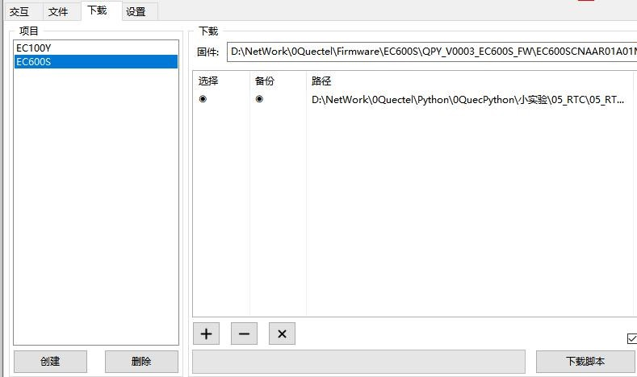

## RTC实验

文档主要介绍 RTC，RTC 是实时时钟的英文缩写(Real_TimeClock)，日常生活中，我们都习惯按时吃饭，按时约会，按时送货，可以实时时钟对我们是非常重要的，RTC就是模组内置的实时时钟功能。下面主要从软件设计方面讲解，通过阅读本文，您将了解到RTC 模块的使用方法。

### 硬件描述

模组内置 RTC 功能，无需外置器件。

### 软件设计

模组内置 RTC 可读可写，用户随时可以更改当前的时间，在打印 log的时候，需要伴随着时间一起记录，此时就可以读取 RTC+log一起打印，这样就清楚地知道问题所发生的时间点。

以下示例代码，定义时间的变量，方便后面读改写。

```python
from machine import RTC
rtc = None # 定义全局变量
year = 0 # 定义全局变量
month = 0 # 定义全局变量
day = 0 # 定义全局变量
week = 0 # 定义全局变量
hour = 0 # 定义全局变量
minute = 0 # 定义全局变量
second = 0 # 定义全局变量
```

读 RTC函数，把读出来的时间：年、月、日、星期、时、分、秒保存在上面的变量中。

```python
def readTime():
	global rtc # 声明全部变量
    if rtc is None: # 判断是否已经被创建
    	rtc = RTC() # 创建一个 RTC 对象
    time = rtc.datetime() # 读 RTC 时间
    global year, month, day, week, hour, minute, second # 声明全部变量
    year = time[0] # 提取变量
    month = time[1] # 提取变量
    day = time[2] # 提取变量
    week = time[3] # 提取变量
    hour = time[4] # 提取变量
    minute = time[5] # 提取变量
    second = time[6] # 提取变量
```

设置时间函数，把上面定义的变量带有时间的值写入到RTC 中，RTC 会从这个时间开始继续行走。

```python
def setTime(year, month, day, hour, minute, second):
	global rtc # 声明全部变量
	if rtc is None: # 判断是否已经被创建
        rtc = RTC() # 创建一个 RTC 对象
	rtc.datetime([year, month, day, 0, hour, minute, second, 0]) # 设置 RTC 时间
```

主函数，读-打印，写-打印，方便查看实验结果。

```python
def main():
	readTime() # 读时间
    print(year, month, day, week, hour, minute, second,) # 打印信息
    # 设置时间
    setTime(year - 1, month - 1, day - 1, hour - 1, minute - 1, second - 1) 
    readTime() # 读时间
    print(year, month, day, week, hour, minute, second, ) # 打印信息
```

接下来就可以下载验证了，python 代码不需要编译，直接通过 QPYcom 工具把.py文件下载到模块中运行。

### 下载验证

下载.py 文件到模组运行：

<span><div style="text-align: center;">


</div></span>

<span><div style="text-align: center;">


</div></span>

下载之后，运行代码看到两次打印的 RTC 时间。

### 配套代码

[下载代码](code/05_RTC.py)