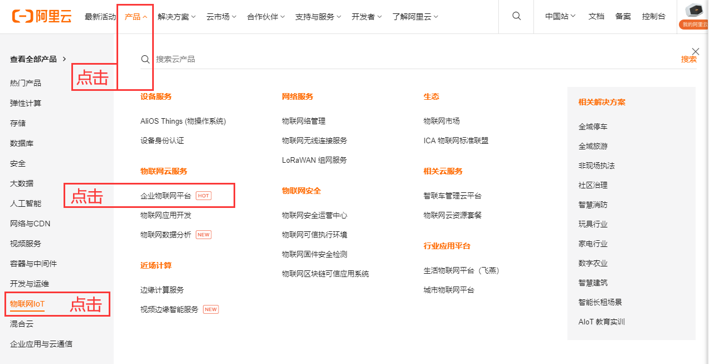
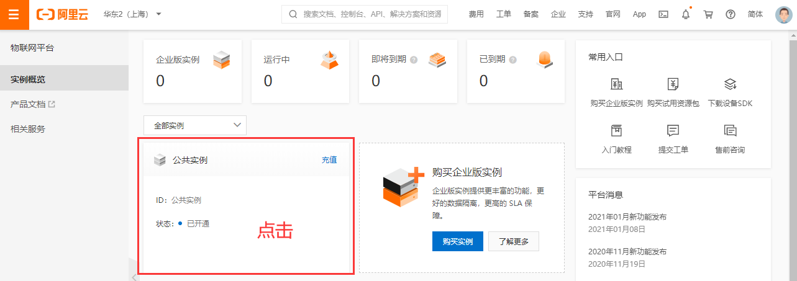
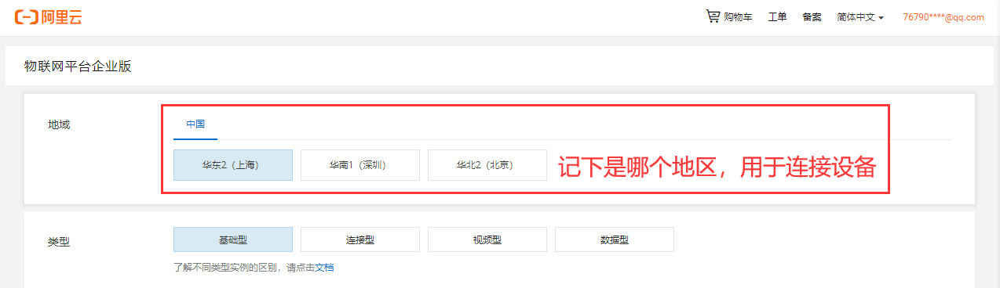
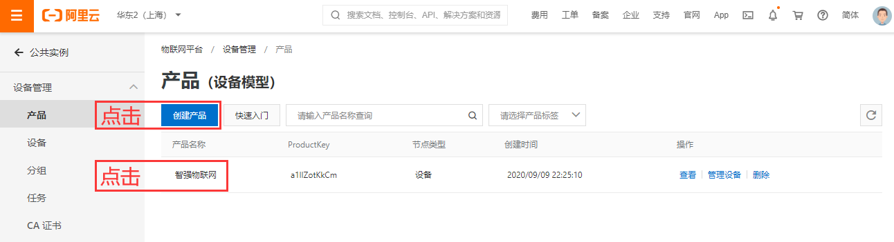
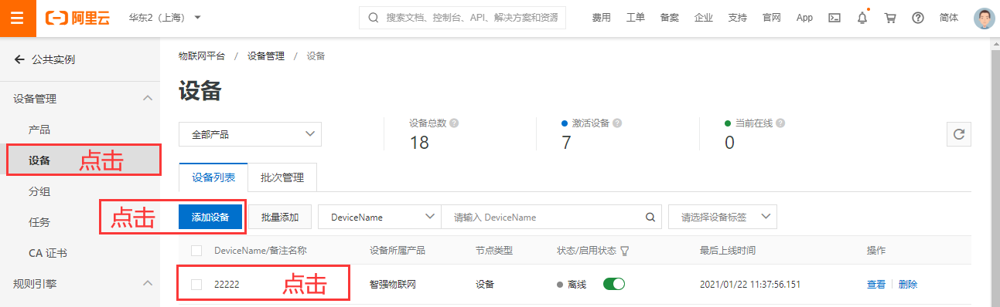
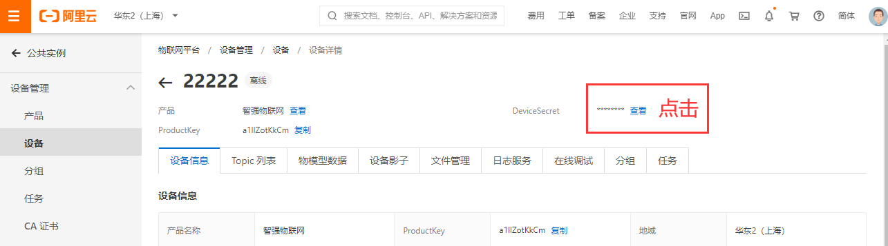
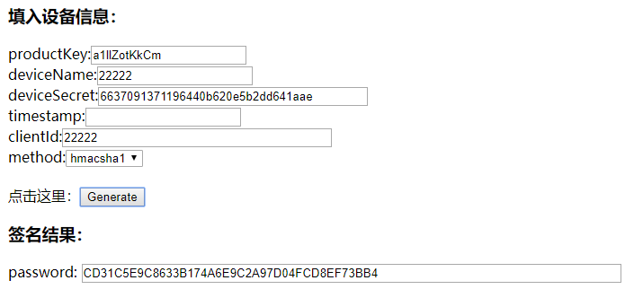
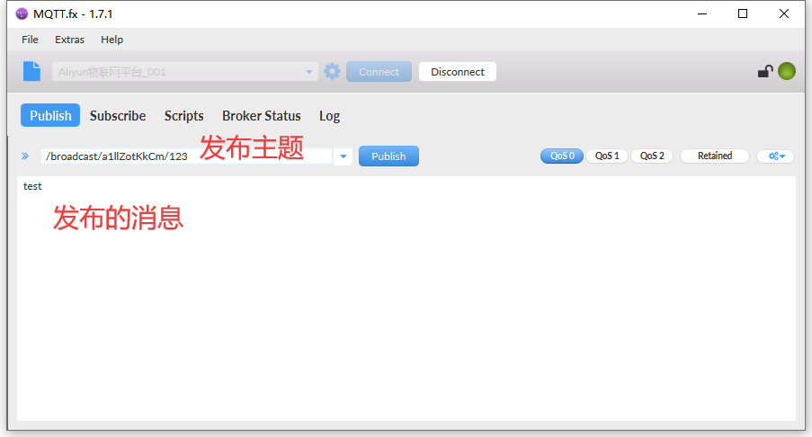
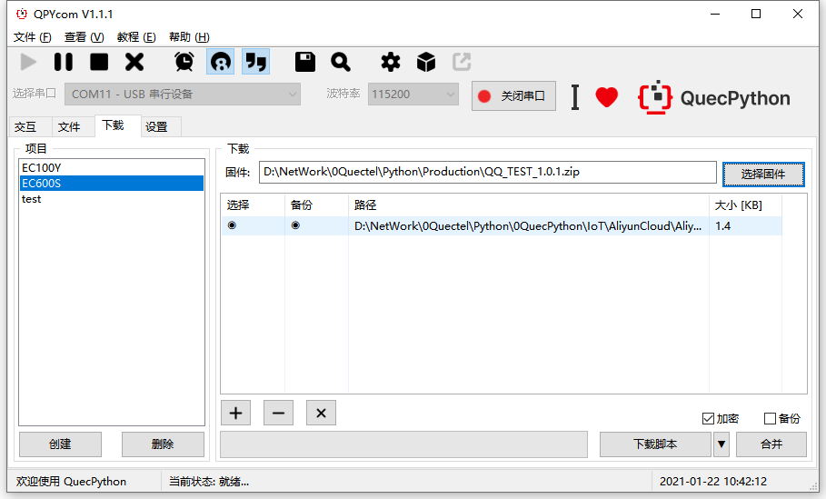
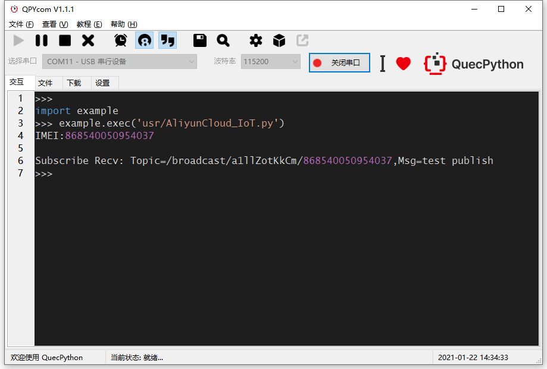

# QuecPython 接入阿里云

文档主要介绍如何使用“企业物联网平台”，企业物联网平台提供全托管的实例服务，无需自建物联网的基础设施即可便捷地接入和管理设备，具有低成本、高可靠、高性能、易运维的优势。下面主要从MQTT连接方式讲解，通过阅读本文，您将了解到QuecPython连接“企业物联网平台”的过程操作和验证实验理论。

## 云端设置

阿里云首页：<https://www.aliyun.com>

### 进入平台

点击【产品】---【物联网IoT】---【企业物联网平台】



### 创建实例





### 创建产品



### 添加设备



### 获取三元组

三元组ProductKey、DeviceName、DeviceSecret用于下个步骤生成连接密码



### 生成连接信息

单击下载Password生成小工具

http://docs-aliyun.cn-hangzhou.oss.aliyun-inc.com/assets/attach/189223/cn_zh/1605168543507/MQTT_Password.7z?spm=a2c4g.11186623.2.19.373573a8XfigN5&file=MQTT_Password.7z

其中clientid是自定义，一般和deviceName同名即可，用于MQTT连接。

method加密方式要和连接MQTT时的设置一致。



计算签名后，可获得Password，即可连接平台。

```
CLIENT_ID = b'22222\|securemode=3,signmethod=hmacsha1\|'

SERVER = b'a1llZotKkCm.iot-as-mqtt.cn-shanghai.aliyuncs.com'

PORT = 1883

USER = b'22222&a1llZotKkCm'

PASSWORD = b'CD31C5E9C8633B174A6E9C2A97D04FCD8EF73BB4'
```

**CLIENT_ID：**格式固定：\${clientId}\|securemode=3,signmethod=hmacsha1\|

​                       完整示例：22222\|securemode=3,signmethod=hmacsha1\|

**USER：**固定格式：\${YourDeviceName}&\${YourProductKey}

​             完整示例：device&alxxxxxxxxx

**PASSWORD：**即上面工具生成的字符串

**PORT：**固定1883

**SERVER：**\${YourProductKey}.iot-as-mqtt.\${YourRegionId}.aliyuncs.com，其中：

​				  ${YourProductKey}：请替换为设备所属产品的的ProductKey，可从物联网平台控制台设备详情页获取。

​				  ${YourRegionId}：在创建实例时选择的地区，替换为您的 Region ID。

​				  https://help.aliyun.com/document_detail/40654.html?spm=a2c4g.11186623.2.21.7b967908BJu7SZ


### 上报和下发数据

在上面创建的Topic名称如：test，只要以test/为开头的Topic都可以订阅发布。

示例Topic如：test、test/123，test/123/ABC




## 软件设计

在AliyunCloud平台取得UserName、Password、ClientID之后，即可在umqtt连接云平台，连接云平台的地址和端口固定不变，因此在程序中设定相应连接信息之后，就可以运行实验了。

示例代码：

```python
from umqtt import MQTTClient

import modem

CLIENT_ID = b'22222|securemode=3,signmethod=hmacsha1|'

SERVER = b'a1llZotKkCm.iot-as-mqtt.cn-shanghai.aliyuncs.com'

PORT = 1883

USER = b'22222&a1llZotKkCm'

PASSWORD = b'CD31C5E9C8633B174A6E9C2A97D04FCD8EF73BB4'

IMEI = None # modem.getDevImei()

SUB_TOPIC = '/broadcast/a1llZotKkCm/{}'

PUB_TOPIC = SUB_TOPIC

def GetDevImei():

	global IMEI

	IMEI = modem.getDevImei()

	print('IMEI:{}'.format(IMEI))

state = 0

def sub_cb(topic, msg):

	global state

	print(

		"Subscribe Recv: Topic={},Msg={}".format(

			topic.decode(),

			msg.decode()))

	state = 1

def MQTT_Init():

	# 创建一个mqtt实例

		c = MQTTClient(

		client_id=CLIENT_ID,

		server=SERVER,

		port=PORT,

		user=USER,

		password=PASSWORD,

		keepalive=30) # 必须要 keepalive=30 ,否则连接不上

	# 设置消息回调

	c.set_callback(sub_cb)

	# 建立连接

	try:

		c.connect()

	except Exception as e:

		print('!!!,e=%s' % e)

	# c.connect()

	# 订阅主题

	c.subscribe(SUB_TOPIC.format(IMEI))

	# 发布消息

	c.publish(PUB_TOPIC.format(IMEI), b"test publish")

	while True:

		c.wait_msg()

		if state == 1:

			break

	# 关闭连接

	c.disconnect()

def main():

	GetDevImei()

	MQTT_Init()

if __name__ == "__main__":

	main()
```

接下来就可以下载验证了，python代码不需要编译，直接通过QPYcom工具把.py文件下载到模块中运行。

## 下载验证

下载.py文件到模组运行：



下载之后，手动让脚本运行起来。



## 配套代码
