# QuecPython AmazonCloud实验介绍

​		本文主要介绍如何使用AWS IoT亚马逊物连网云。AWS IoT提供了可用于实施IoT解决方案的云服务和设备支持，同时提供众多云服务支持基于IoT的应用程序，用户可以访问IoT设备以及这些设备所连接的云服务所提供的功能。下面主要从MQTT连接方式讲解，通过阅读本文，您将了解到QuecPython连接AWS IoT的过程操作和验证实验理论。

## 云端设置

亚马逊云首页：https://amazonaws-china.com/cn/

#### 【进入平台】

点击【我的账户】---【AWS 管理控制台】---【IoT Core】

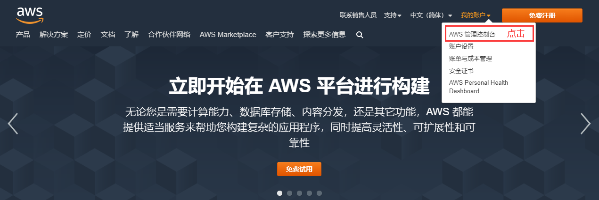

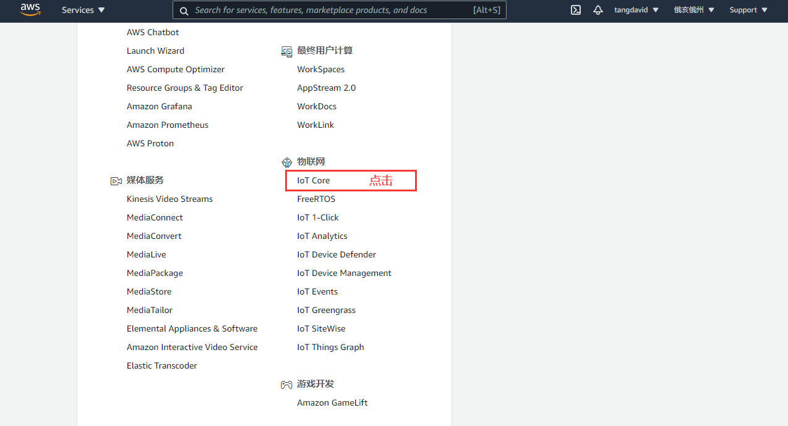

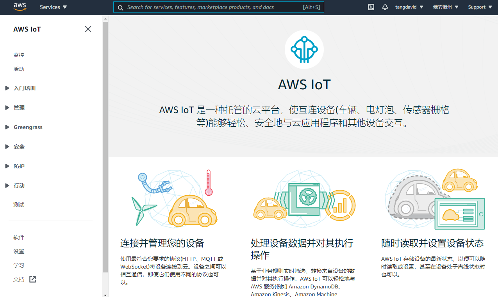

#### 【创建策略】

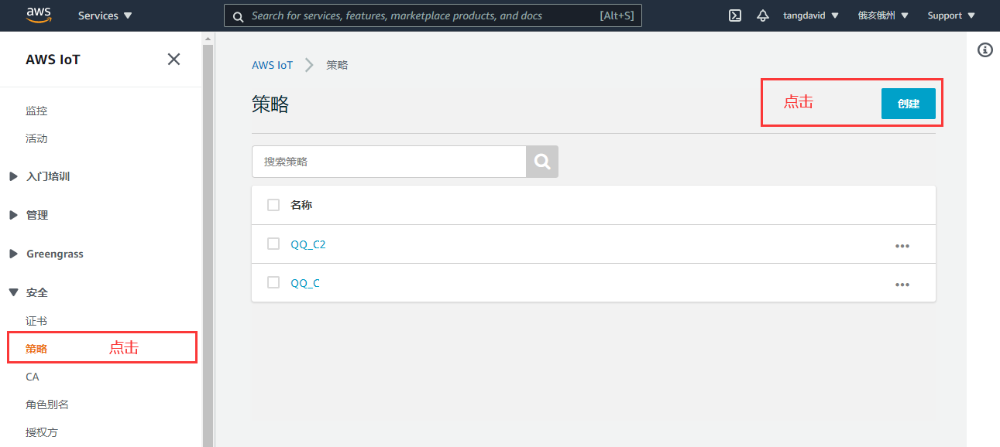

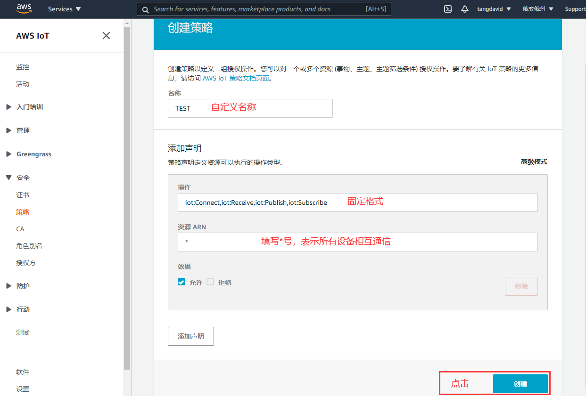

#### 【创建物品】

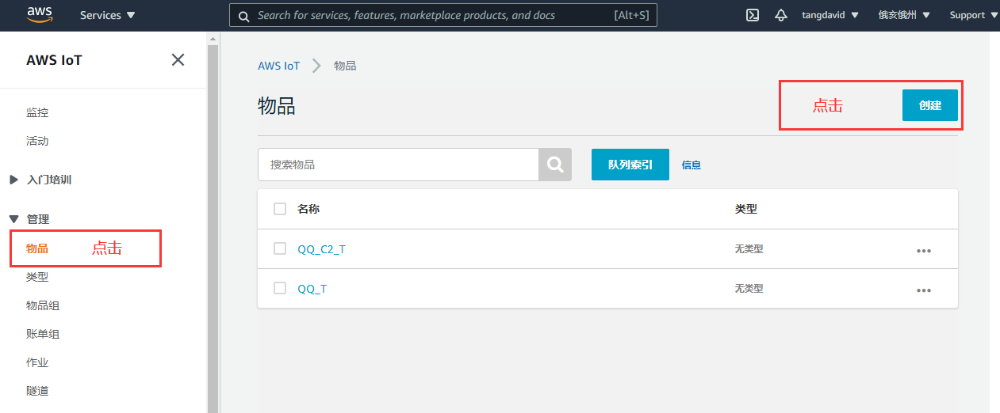

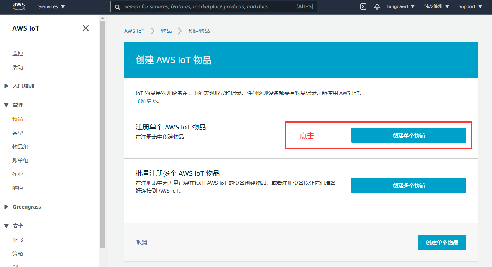

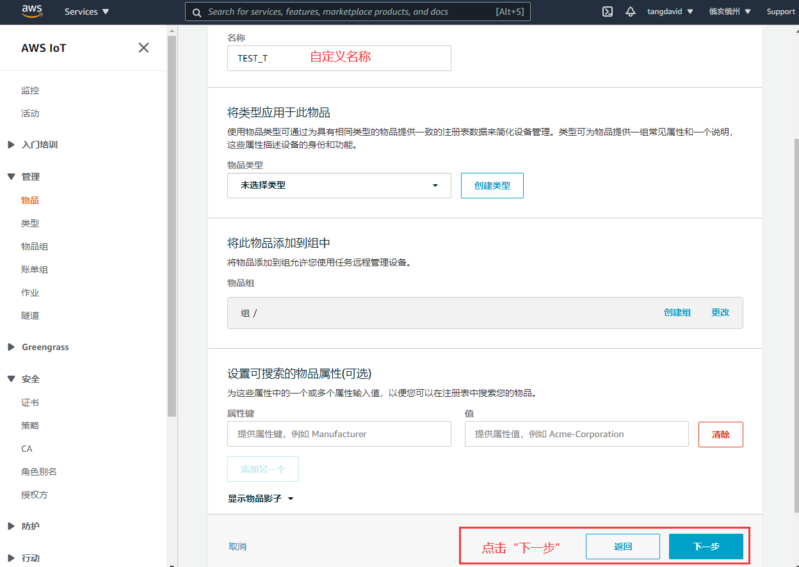

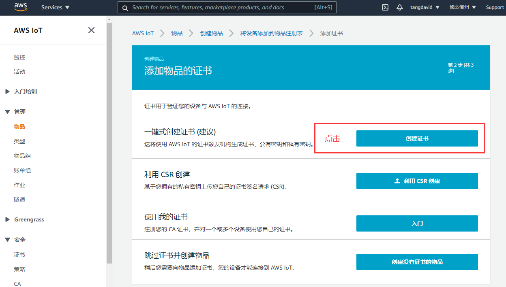

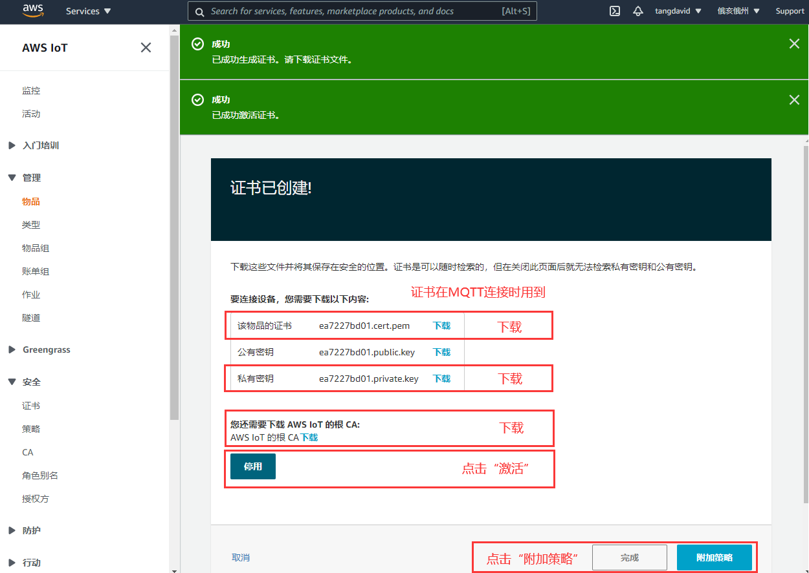

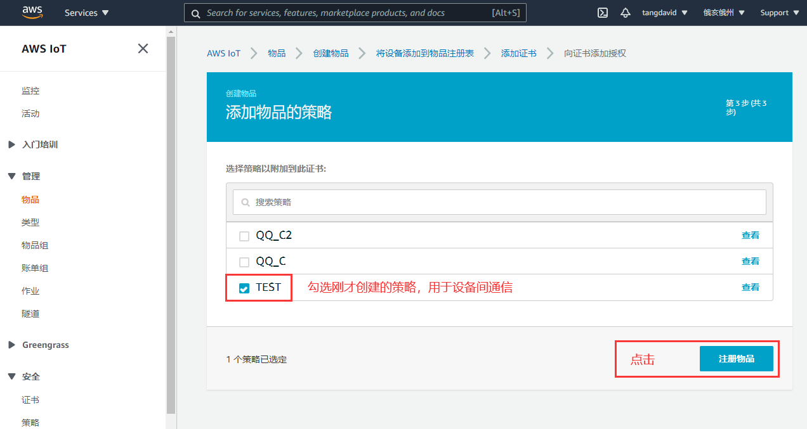

至此完成“创建物品”。用证书连接AWS IoT平台，同一个证书可以用于多个设备，不同设备的Client ID保持唯一。

#### 【设备通信】

获取AWS服务器的MQTT连接地址、端口：

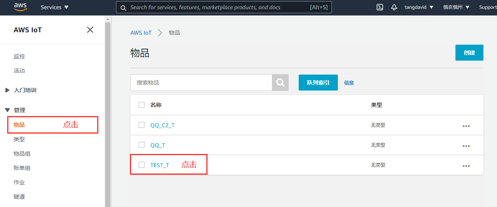

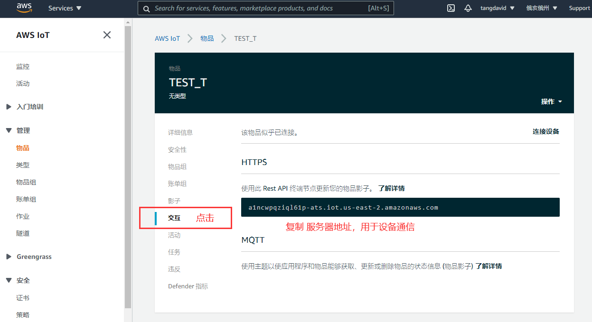

使用MQTT.fx工具测试通信，在订阅主题栏填写“#”，表示接收所有主题。

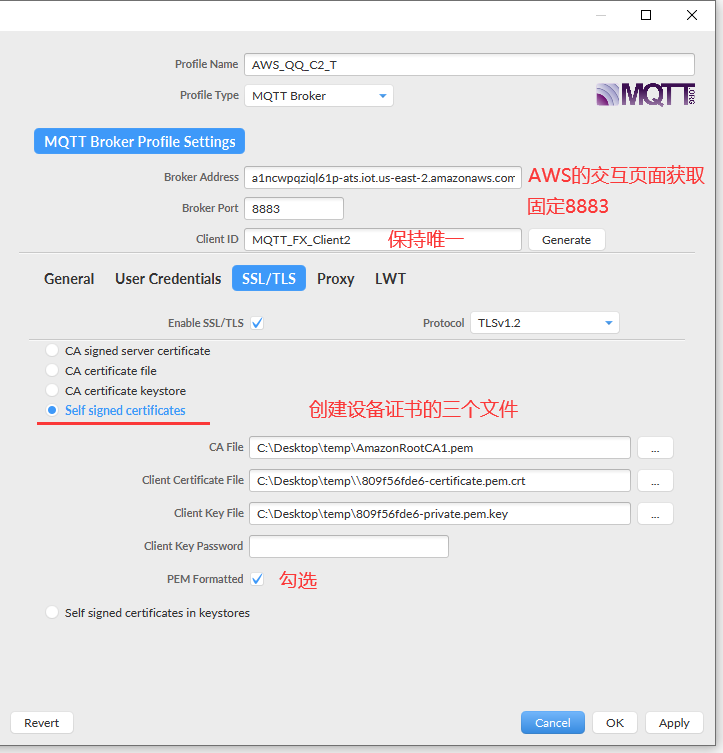

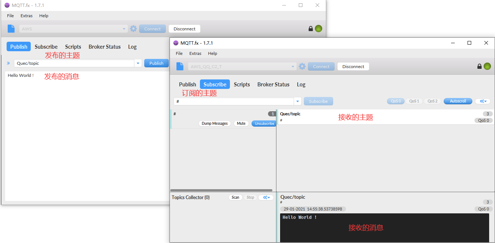

 

