# QuecPython  接入华为云

文档主要介绍如何使用HuaweiCloud华为云，HuaweiCloud设备接入服务（IoTDA）是华为云的物联网平台，提供海量设备连接上云、设备和云端双向消息通信、批量设备管理、远程控制和监控、OTA升级、设备联动规则等能力，并可将设备数据灵活流转到华为云其他服务。

下面主要从QuecPython的MQTT连接方式讲解，通过阅读本文，您将了解到QuecPython连接HuaweiCloud的过程操作和验证实验理论。

## 云端设置

打开华为云连接 [www.huaweicloud.com](http://www.huaweicloud.com)

### 进入平台

在首页点击【产品】---【IoT物联网】---【设备接入IoTDA】

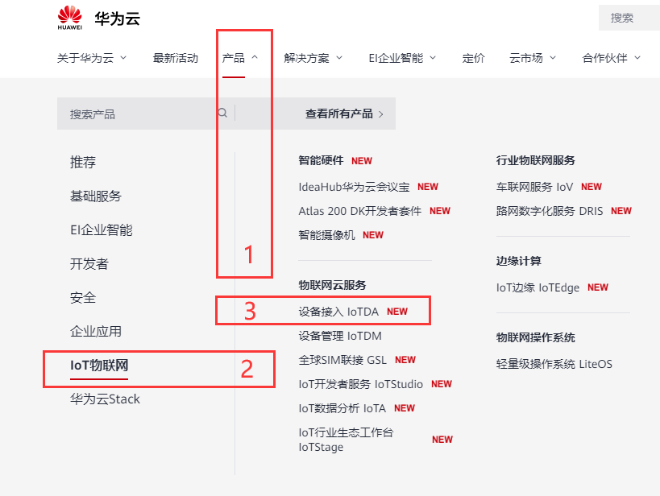

### 创建产品

点击【产品】---【创建产品】

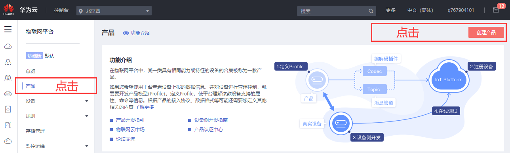

产品的“协议类型”选择MQTT

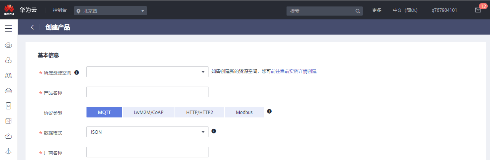

### 添加设备

点击【设备】---【所有设备】

>   [https://console.huaweicloud.com/iotdm/?region=cn-north-4\#/dm-portal/device/all-device](https://console.huaweicloud.com/iotdm/?region=cn-north-4#/dm-portal/device/all-device)


注册设备后自动生成的【设备ID】和【设备密钥】，用于下一步骤生成连接平台的信息。

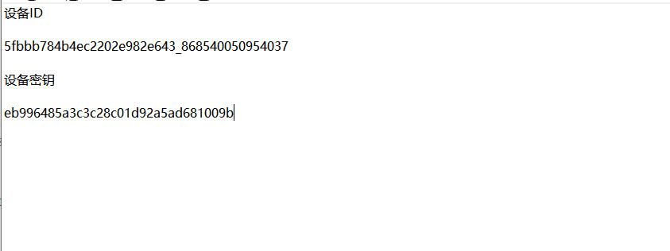

### 生成连接信息

访问[这里](https://iot-tool.obs-website.cn-north-4.myhuaweicloud.com/)，填写[注册设备](https://support.huaweicloud.com/qs-iothub/iot_05_0006.html#ZH-CN_TOPIC_0251997880__li1261073102011)后生成的设备ID（DeviceId）和密钥（DeviceSecret），生成连接信息（ClientId、Username、Password）。

<https://iot-tool.obs-website.cn-north-4.myhuaweicloud.com/>

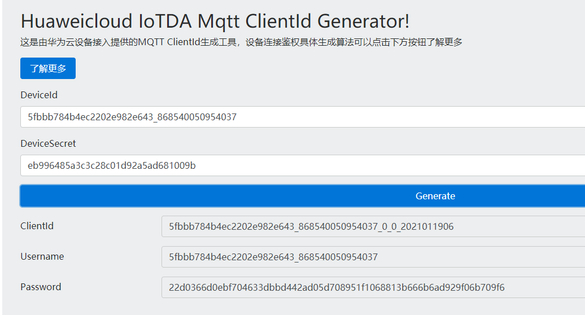

```
CLIENT_ID = b'5fbbb784b4ec2202e982e643_868540050954037_0_0_2021011909'

SERVER = b'a15fbbd7ce.iot-mqtts.cn-north-4.myhuaweicloud.com'

PORT = 1883

USER = b'5fbbb784b4ec2202e982e643_868540050954037'

PASSWORD =b'8001a12405743199b3396943a2ed397286117a9ebab4f5dfda8dd6fafe341d94'
```

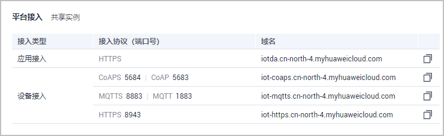

说明：

针对不支持用域名接入的设备，通过在cmd命令框中执行“ping
域名”获取IP地址，用IP地址接入平台。由于IP地址不固定，您需要将IP地址做成可配置项。

a15fbbd7ce.iot-mqtts.cn-north-4.myhuaweicloud.com

1883

使用生成工具生成的clientId格式，默认不校验时间戳：设备ID_0_0\_时间戳。

-   当采用“HMACSHA256”校验时间戳方式时，会先校验消息时间戳与平台时间是否一致，再判断密码是否正确。

-   当采用“HMACSHA256”不校验时间戳方式时，鉴权消息也必须带时间戳，但不检验时间是否准确，仅判断密码是否正确。

### 上报数据

填写接口地址，此处以“\$oc/devices/{device_id}/sys/properties/report”为例，如“\$oc/devices/5e4e2e92ac-164aefa8fouquan1/sys/properties/report”。

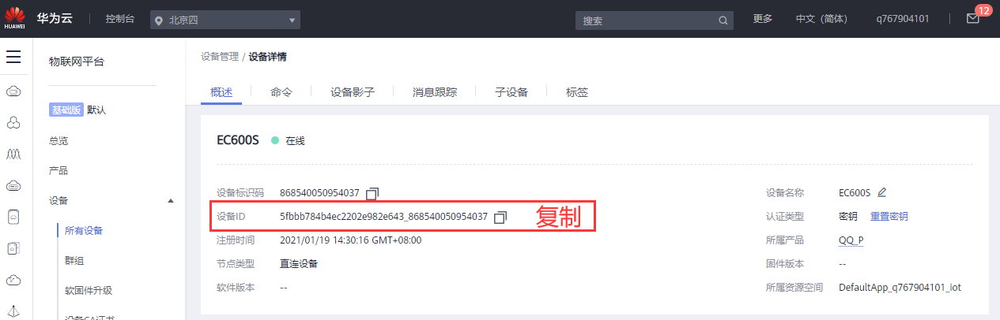

\$oc/devices/{device_id}/sys/properties/report

\$oc/devices/5fbbb784b4ec2202e982e643_868540050954037/sys/properties/report

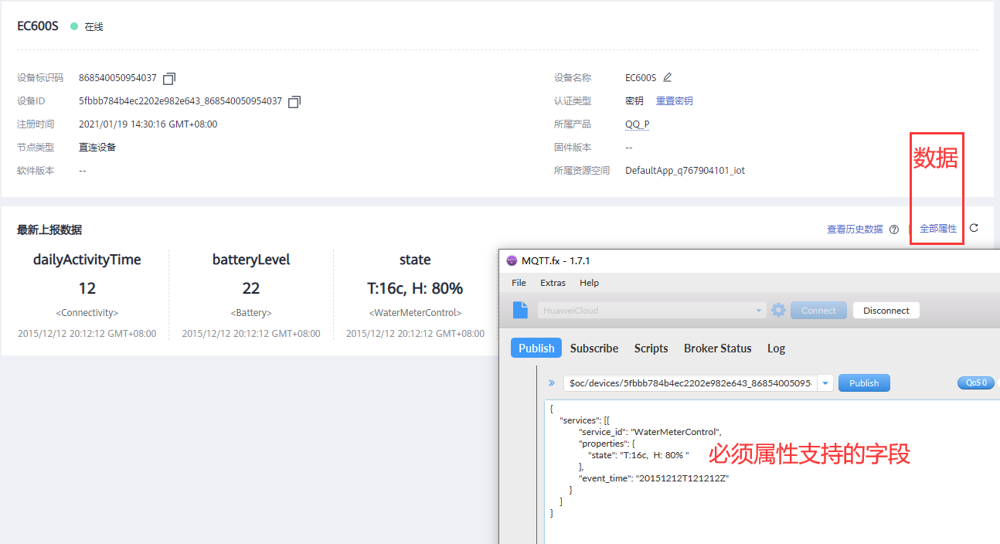

### 下发数据

下发数据只能通过应用端的API请求。

URI

请求方法 POST

URI /v5/iot/{project_id}/devices/{device_id}/messages

传输协议 HTTPS

下发数据说明：

<https://support.huaweicloud.com/api-iothub/iot_06_v5_0059.html>

API调试页面：

<https://apiexplorer.developer.huaweicloud.com/apiexplorer/debug?product=IoTDA&api=CreateMessage>

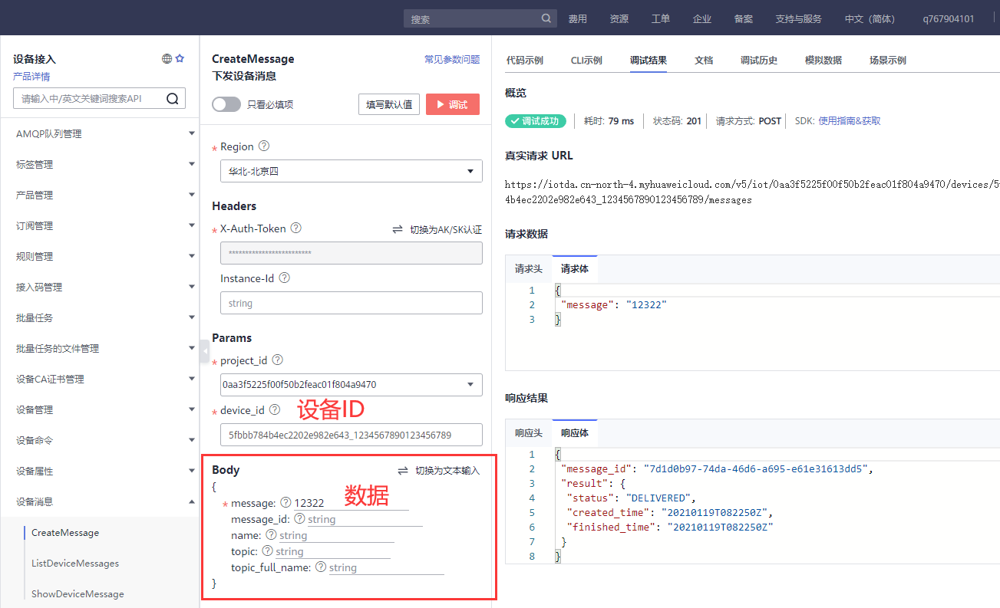

Topic: \$oc/devices/{device_id}/sys/messages/down

\$oc/devices/5fbbb784b4ec2202e982e643_1234567890123456789/sys/messages/down

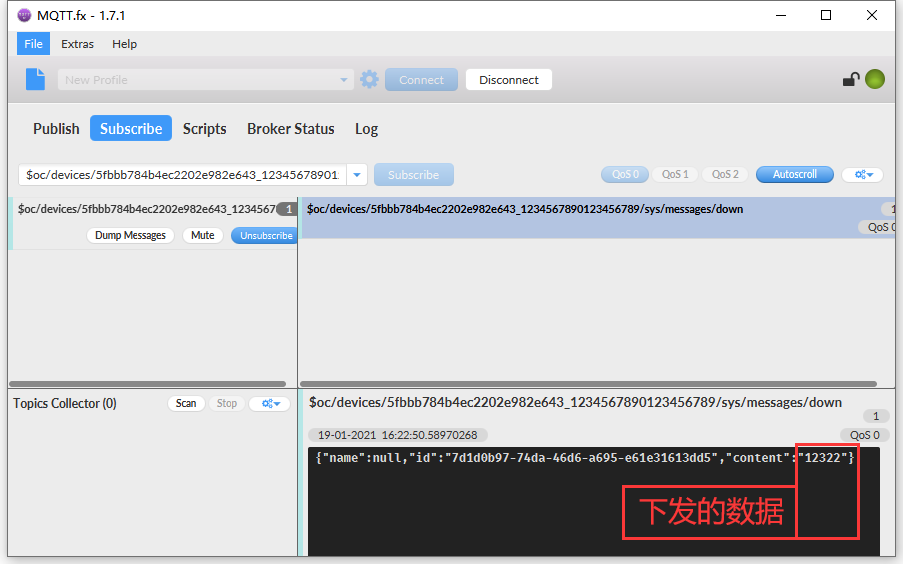

## 软件设计

在HuaweiCloud平台取得ClientId、Username、Password之后，即可通过QuecPython的umqtt连接云平台，连接云平台的地址和端口固定不变，接下来就可以编写代码实验了。

示例代码：

```python
from umqtt import MQTTClient

CLIENT_ID = b'5fbbb784b4ec2202e982e643_868540050954037_0_0_2021011909'

SERVER = b'a15fbbd7ce.iot-mqtts.cn-north-4.myhuaweicloud.com'

PORT = 1883

USER = b'5fbbb784b4ec2202e982e643_868540050954037'

PASSWORD = b'8001a12405743199b3396943a2ed397286117a9ebab4f5dfda8dd6fafe341d94'

DEVICE_ID = '5fbbb784b4ec2202e982e643_868540050954037'

state = 0

def sub_cb(topic, msg):

	global state

	print(

		"Subscribe Recv: Topic={},Msg={}".format(

			topic.decode(),

			msg.decode()))

	state = 1

def MQTT_Init():

	# 创建一个mqtt实例

	c = MQTTClient(

		client_id=CLIENT_ID,

		server=SERVER,

		port=PORT,

		user=USER,

		password=PASSWORD,

		keepalive=30) # 必须要 keepalive=30 ,否则连接不上

	# 设置消息回调

	c.set_callback(sub_cb)

	# 建立连接

	c.connect()

	# 订阅主题

	c.subscribe('$oc/devices/{}/sys/messages/down'.format(DEVICE_ID))

	msg = b'''{

		"services": [{

			"service_id": "WaterMeterControl",

			"properties": {

				"state": "T:15c, H: 85% "

			},

			"event_time": "20151212T121212Z"

		}

		]

	}'''

	# 发布消息

	c.publish('$oc/devices/{}/sys/properties/report'.format(DEVICE_ID), msg)

	while True:
	
		c.wait_msg()

		if state == 1:

			break

	# 关闭连接

	c.disconnect()

def main():

	MQTT_Init()

if __name__ == "__main__":

	main()
```

接下来就可以下载验证了，python代码不需要编译，直接通过QPYcom工具把.py文件下载到模块中运行。

## 下载验证

下载.py文件到模组运行：

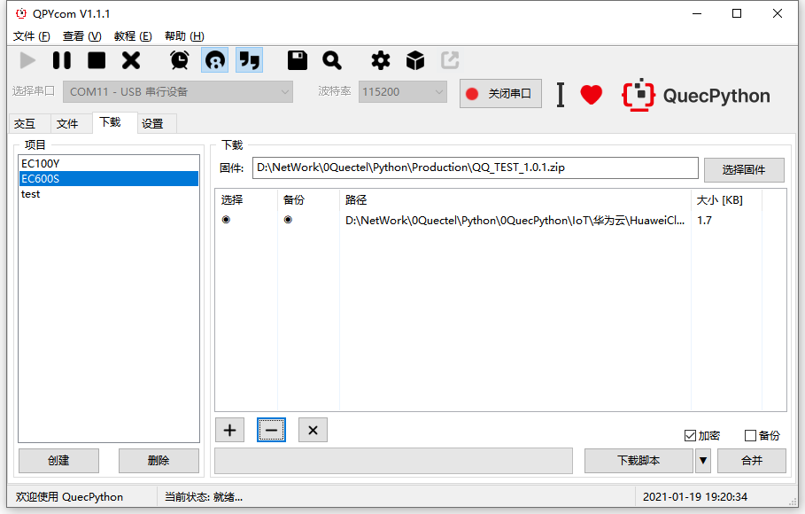

下载之后，手动让脚本运行起来。

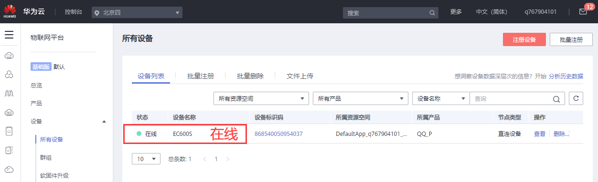

发送数据后，看到实验结果：

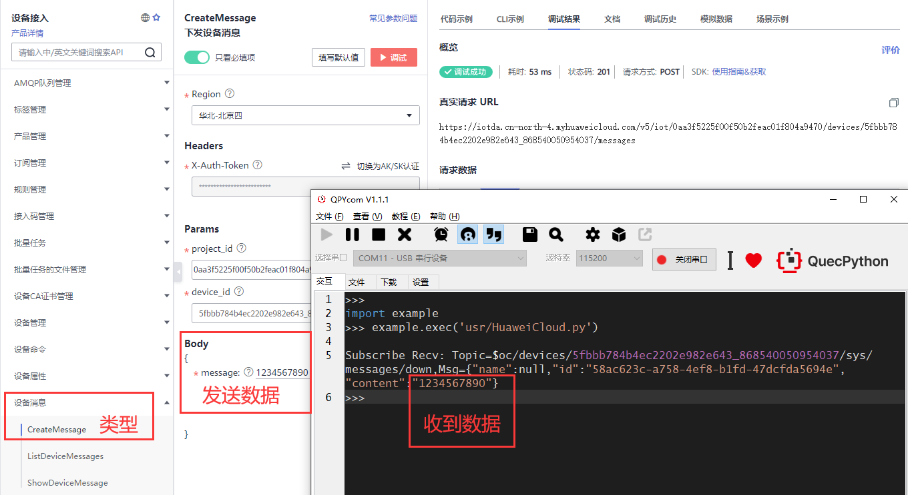

## 配套代码


