# QuecPython  接入QuecCloud

文档主要介绍如何使用QuecCloud移远云，QuecCloud物联网平台，为客户的多种终端设备提供安全可靠的网络快速接入、数据传输、数据存储、数据管理等完整的交互服务。可通过云端调用API实现海量设备和应用的数据传输，达到控制设备和采集数据的目的。

下面主要从MQTT连接方式讲解，通过阅读本文，您将了解到QuecPython连接QuecCloud的过程操作和验证实验理论。

## 云端设置

移远云首页：<https://iot.quectel.com/>

### 进入平台

点击【控制台】

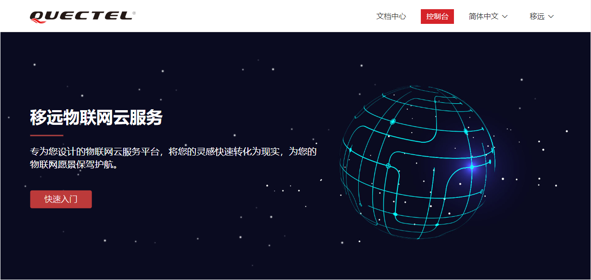

### 创建产品

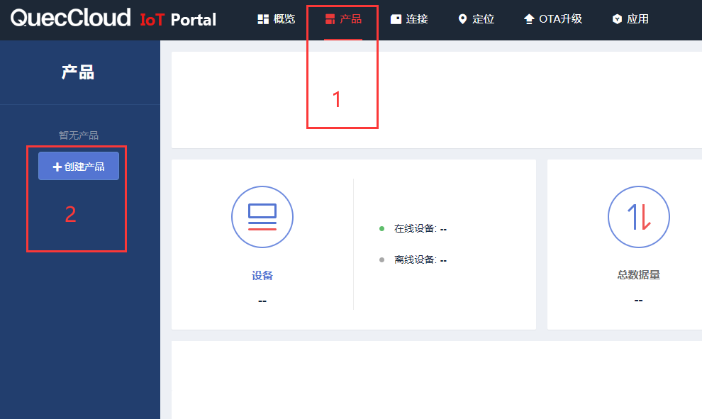

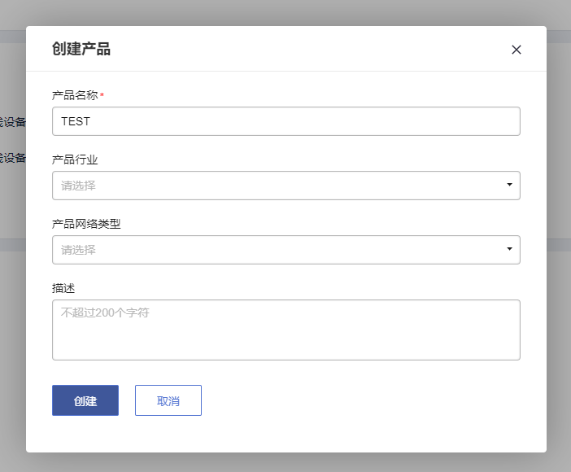

### 添加设备

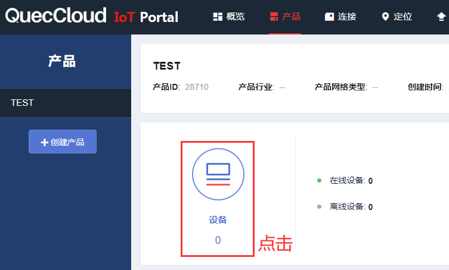

进入【设备列表】后，点击【＋添加设备】

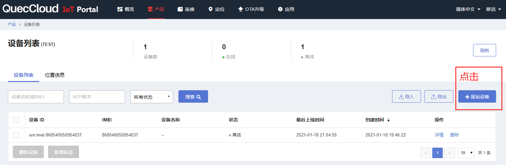

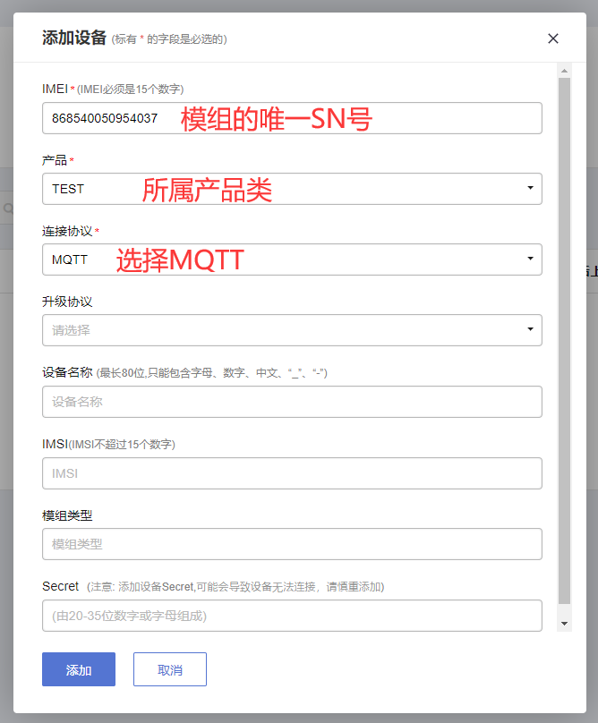

IMEI在模组的丝印面上可以找到，也可以通过AT指令“AT+GSN”读取。

至此，手动添加设备已经完成。

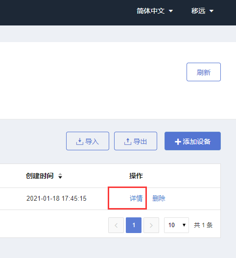

### 获取Secret

在设备详情页面里面记下Secret，用于连接移远云平台。

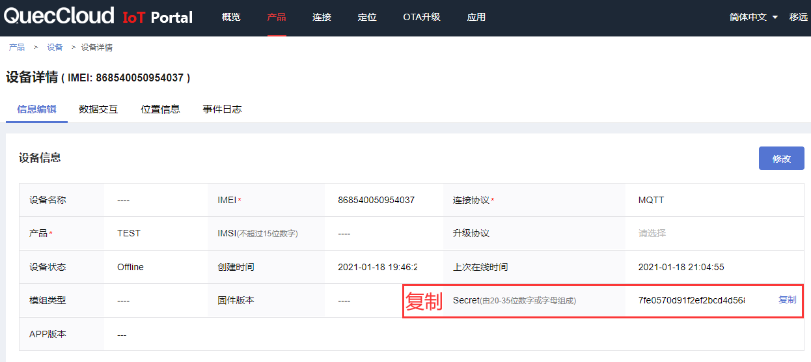

批量时可通过API接口获取Secret，用于连接移远云平台

文档中心说明：[https://iot.quectel.com/doc_getStart.html\#api_AcquireTheInformation](https://iot.quectel.com/doc_getStart.html#api_AcquireTheInformation)

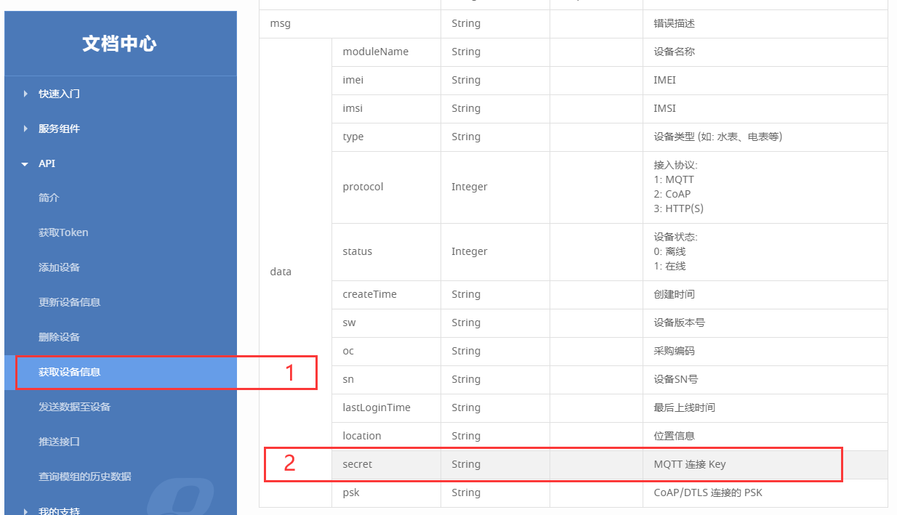

### 生成连接信息

```
CLIENT_ID = IMEI

SERVER = b"southbound.quectel.com"

PORT = 1883

USER = IMEI

PASSWORD = b '7fe0570d91f2ef2bcd4d5683f68521e5'
```

**CLIENT_ID：**固定为IMEI

**SERVER：**固定为"southbound.quectel.com"

**PORT：**固定为1883

**USER：**固定为IMEI

**PASSWORD：**上一步骤获取的Secret

### 上报和下发数据

调试设备时，上传、下发的数据都可以在【设备详情】---【数据交互】查看：

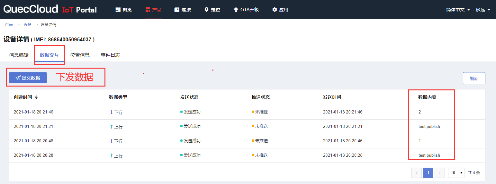

## 软件设计

在QuecCloud平台取得Secret之后，即可在umqtt连接云平台，模块的IMEI在代码中自动获取，其IMEI号和Secret号码在平台中添加的设备一一对应，连接云平台的地址和端口固定不变，因此在程序中设定Secret的值之后，就可以运行实验了。

示例代码：

```python
from umqtt import MQTTClient

import modem

import utime

import _thread

IMEI = None # modem.getDevImei()

Secret = '7fe0570d91f2ef2bcd4d5683f68521e5'

address = "southbound.quectel.com"

Port = 1883

def GetDevImei():

	global IMEI

	IMEI = modem.getDevImei()

	#print(IMEI)

state = 0

def sub_cb(topic, msg):

	global state

	print(

		"Subscribe Recv: Topic={},Msg={}".format(

			topic.decode(),

			msg.decode()))

	state = 1

def MQTT_Init():

	# 创建一个mqtt实例

	c = MQTTClient(

		IMEI,

		address,

		Port,

		user=IMEI,

		password=Secret)

	# 设置消息回调

	c.set_callback(sub_cb)
	
	# 建立连接

	c.connect()

	# 订阅主题

	c.subscribe('quec/{}/down'.format(IMEI))

	# 发布消息

	c.publish('quec/{}/up'.format(IMEI), b"test publish")

	while True:

		c.wait_msg()

		if state == 1:

		break

	# 关闭连接

	c.disconnect()

def main():

	GetDevImei()

	MQTT_Init()

if __name__ == "__main__":

	main()
```

接下来就可以下载验证了，python代码不需要编译，直接通过QPYcom工具把.py文件下载到模块中运行。

## 下载验证

下载.py文件到模组运行：

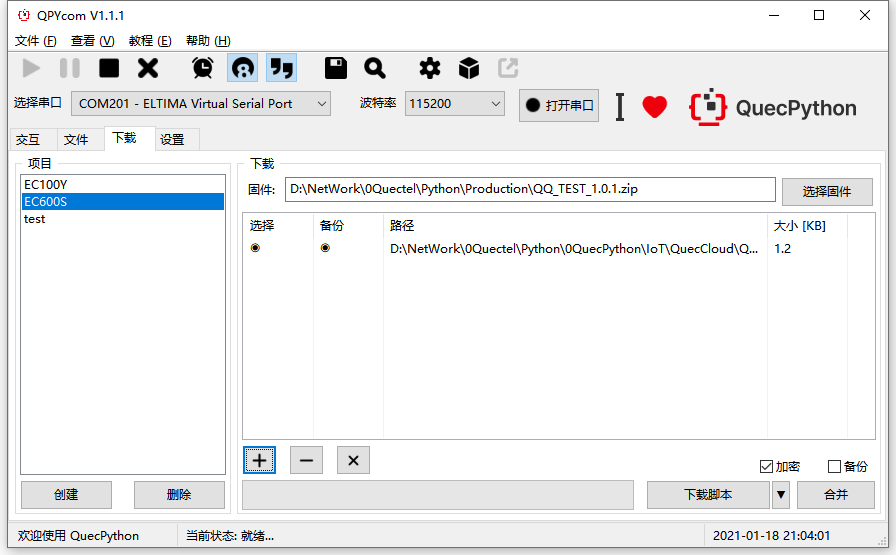

下载之后，手动让脚本运行起来。

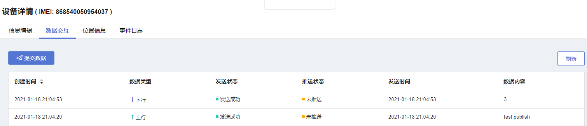

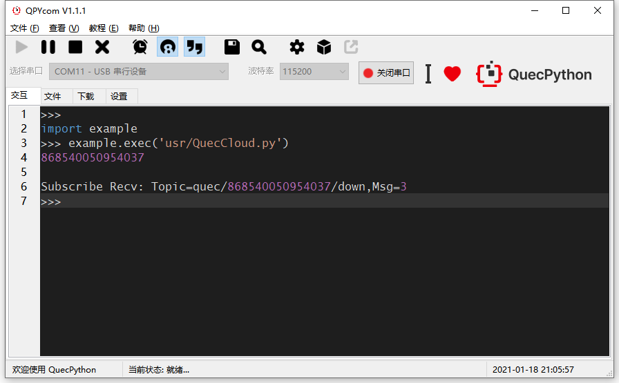

## 配套代码
