# QuecPython  接入腾讯云

文档主要介绍如何使用TencentCloud腾讯云，腾讯云物联网通信（Internet of Things Hub， IoT Hub）旨在提供一个安全、稳定、高效的连接平台，帮助开发者低成本、快速地实现“设备-设备”、“设备-用户应用”、“设备-云服务”之间可靠、高并发的数据通信。不仅可以实现设备之间的互动、设备的数据上报和配置下发，还可以基于规则引擎和腾讯云产品打通，方便快捷地实现海量设备数据的存储、计算以及智能分析。下面主要从MQTT连接方式讲解，通过阅读本文，您将了解到QuecPython连接TencentCloud的过程操作和验证实验理论。

## 云端设置

腾讯云首页：<https://cloud.tencent.com/>

### 进入平台

点击左上角的“控制台”

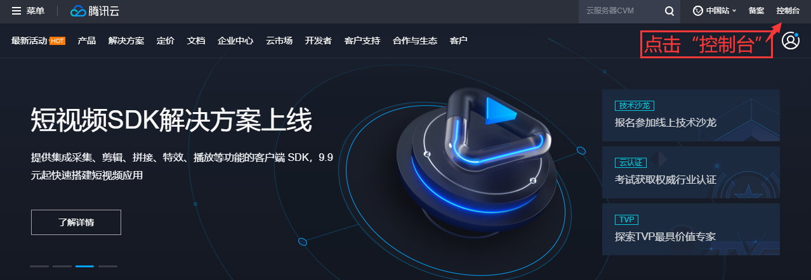

点击“云产品”---“物联网通信”

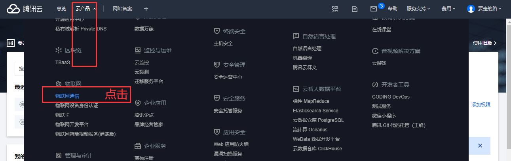

### 创建产品

在创建产品时的“认证方式”选择“秘钥认证”

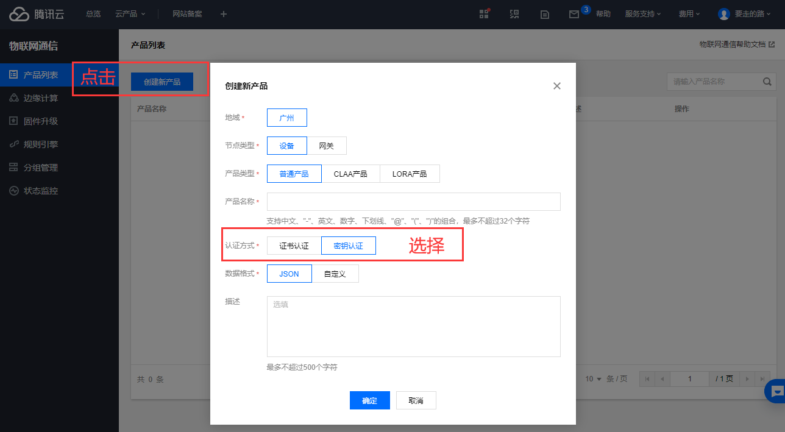

### 添加设备

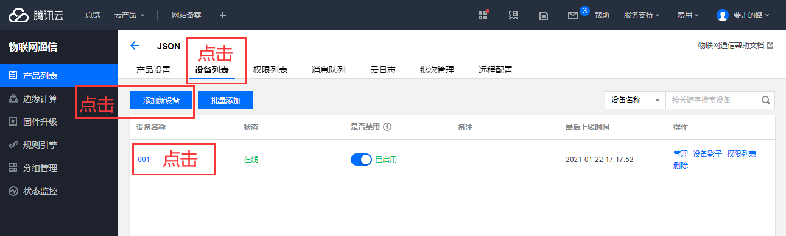

### 生成连接信息

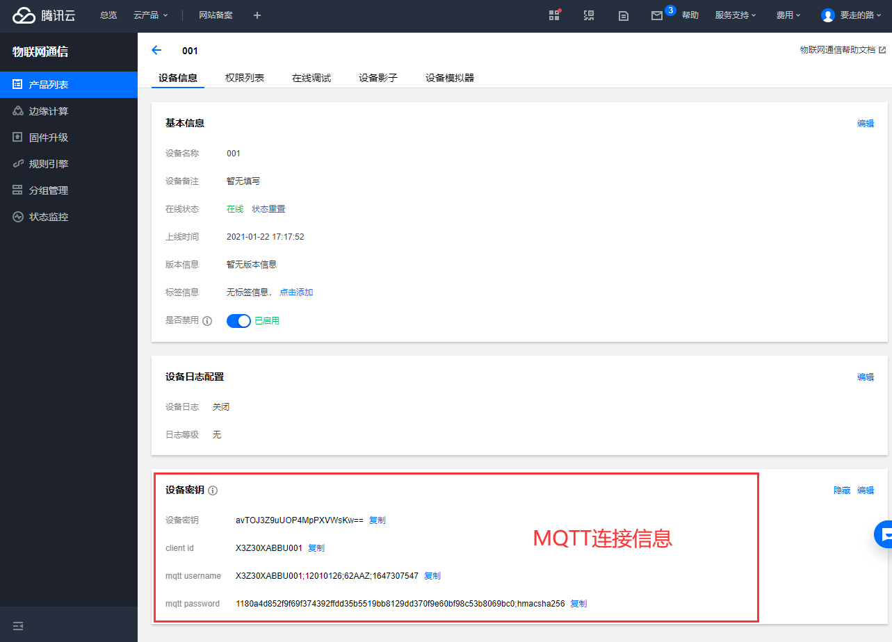

**Broker Address：** 广州域设备填入：PRODUCT_ID.iotcloud.tencentdevices.com，这里PRODUCT_ID 为变量参数，用户需填入创建产品时自动生成的产品 ID

**Broker Port：**证书认证型端口：8883；密钥认证型：1883

```
CLIENT_ID = b'X3Z30XABBU001'

SERVER = b'X3Z30XABBU.iotcloud.tencentdevices.com'

PORT = 1883

USER = b'X3Z30XABBU001;12010126;M8STP;1647306844'

PASSWORD=b'e181d0cfaf5540c8e3f173a6e88efa1f3d34db2db7a9ff845aedc67f48d9d607;hmacsha256'
```


### 规则引擎

规则引擎用于主题消息转发

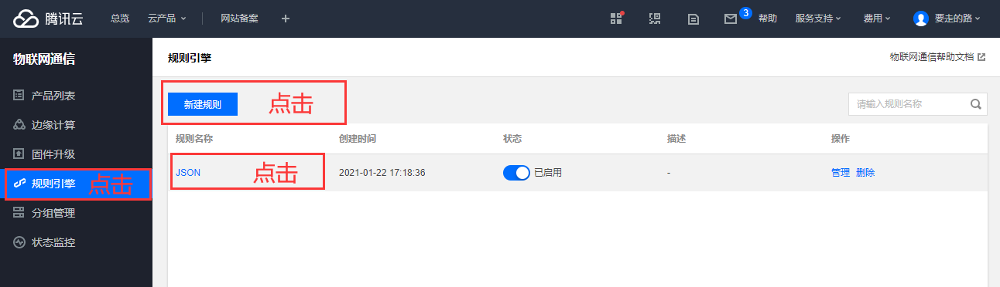

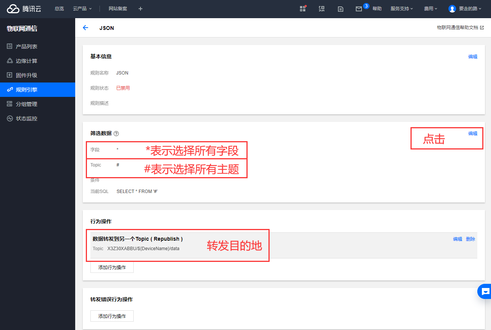

### 筛选数据

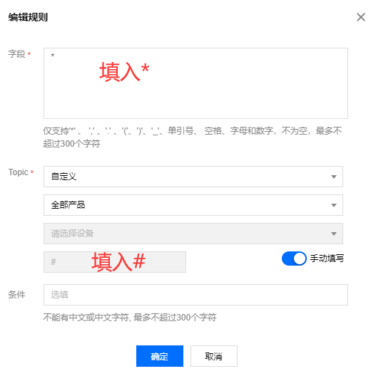

### 行为操作

这里设定平台转主题消息的目的地

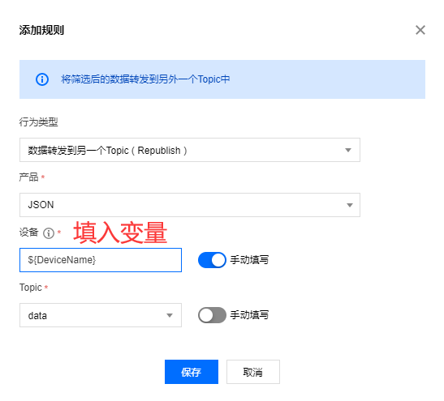

填入变量\${DeviceName}，在发布topic的Payload中设定DeviceName的值，消息就会转发到对应主题，如：A设备订阅“X3Z30XABBU/001/data”；B设备发布“{"DeviceName":"001","msg":"test publish"}”，那么目的地就是“X3Z30XABBU/\${DeviceName}/data”=“X3Z30XABBU/001/data”；A设备收到数据。

### 上报和下发数据

设备的主题格式：X3Z30XABBU/\${deviceName}/data

在发布的消息内容必须包含"DeviceName":"001"，消息才会转发到主题“X3Z30XABBU/001/data”。

如：{"DeviceName":"001", "msg":"test publish" }”

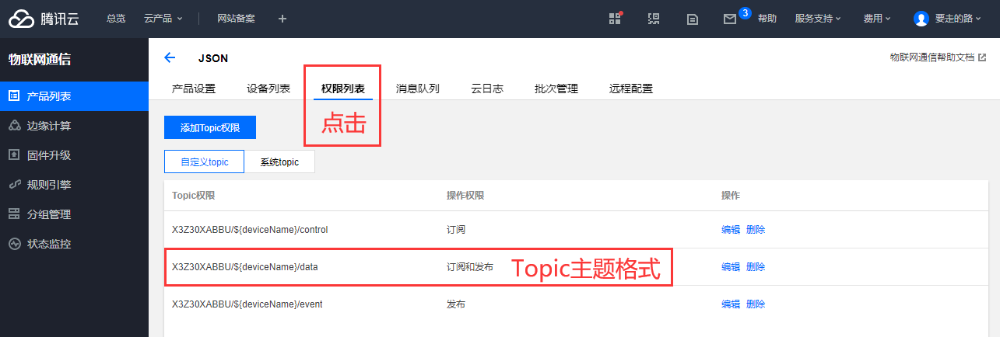

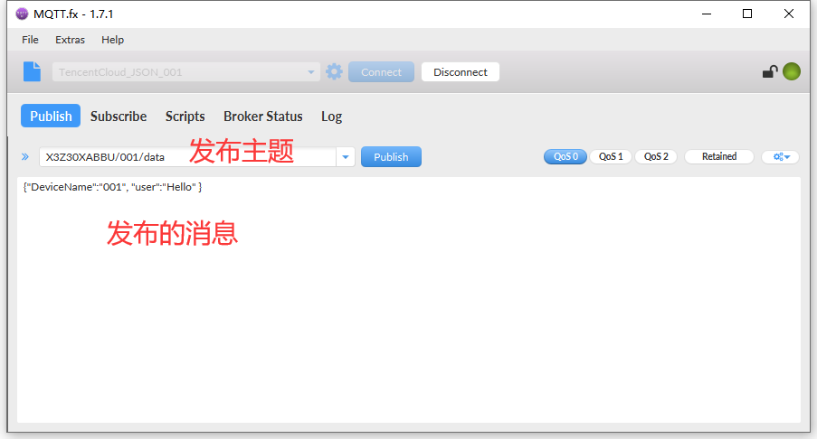

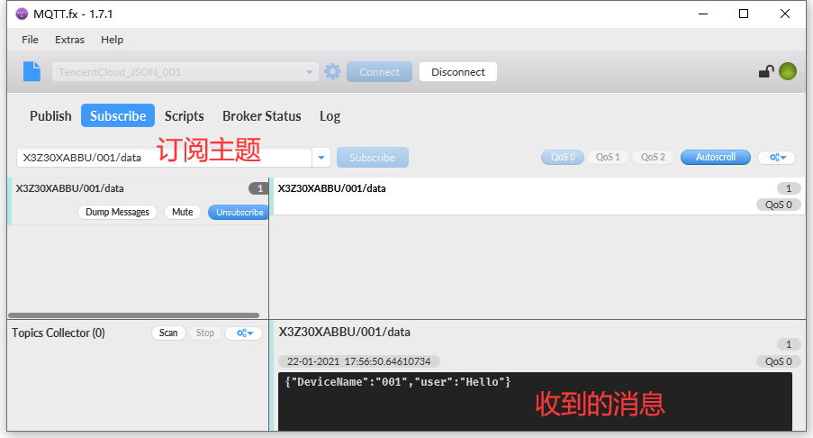

## 软件设计

在QuecCloud平台取得连接信息之后，即可在umqtt连接云平台，连接云平台的地址和端口固定不变，因此在程序中设定连接信息的值之后，就可以运行实验了。

示例代码：

```python
CLIENT_ID = b'X3Z30XABBU001'

SERVER = b'X3Z30XABBU.iotcloud.tencentdevices.com'

PORT = 1883

USER = b'X3Z30XABBU001;12010126;M8STP;1647306844'

PASSWORD=b'e181d0cfaf5540c8e3f173a6e88efa1f3d34db2db7a9ff845aedc67f48d9d607;hmacsha256'

IMEI = None # modem.getDevImei()

SUB_TOPIC = 'X3Z30XABBU/{}/data'

PUB_TOPIC = SUB_TOPIC

def GetDevImei():

	global IMEI

	# IMEI = modem.getDevImei()

	IMEI= '001'

	print(IMEI)

state = 0

def sub\_cb(topic, msg):

	global state

	print(

		"Subscribe Recv: Topic={},Msg={}".format(

			topic.decode(),

			msg.decode()))

	state = 1

def MQTT_Init():

	# 创建一个mqtt实例

	c = MQTTClient(

		client_id=CLIENT_ID,

		server=SERVER,

		port=PORT,

		user=USER,

		password=PASSWORD,

		keepalive=30) # 必须要 keepalive=30 ,否则连接不上

	# 设置消息回调

	c.set_callback(sub_cb)

	# 建立连接

	try:

		c.connect()

	except Exception as e:

		print('!!!,e=%s' % e)

	# c.connect()

	# 订阅主题

	c.subscribe(SUB_TOPIC.format(IMEI))

	# 发布消息

	Payload = '{"DeviceName":"{}","msg":"test publish"}'.format(IMEI)

	c.publish(PUB_TOPIC.format(IMEI), Payload)

	while True:

		c.wait_msg()

		if state == 1:

			break

	# 关闭连接

	c.disconnect()

def main():

	GetDevImei()

	MQTT_Init()

if __name__ == "__main__":

	main()
```

接下来就可以下载验证了，python代码不需要编译，直接通过QPYcom工具把.py文件下载到模块中运行。

## 下载验证

下载.py文件到模组运行：

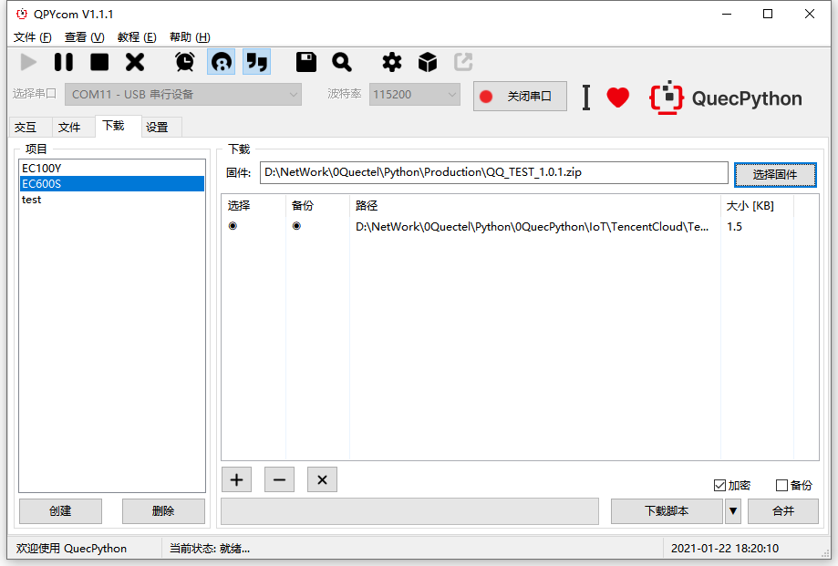

下载之后，手动让脚本运行起来。

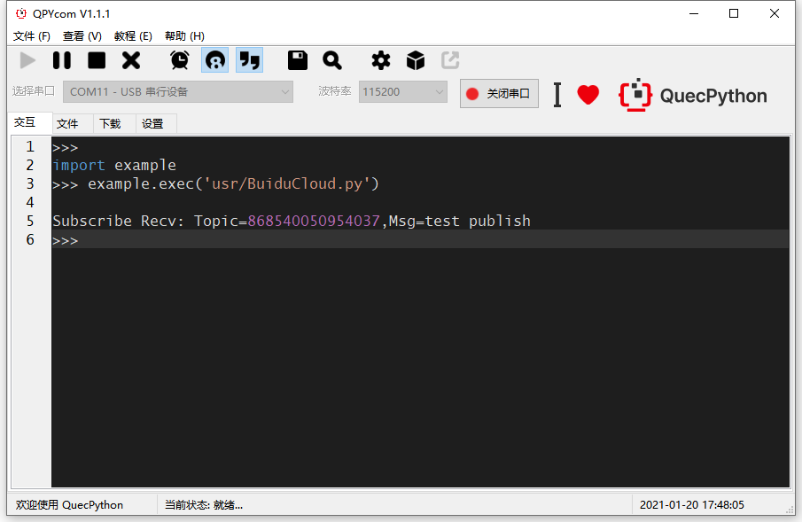

## 配套代码


