# EC600S开发板及其使用场景介绍

##  描述

EC600S\_QuecPython_EVB_V1.x
开发板是一款搭载多款传感器的Cat.1通信模块开发板，本文将介绍这款开发板的使用方法和注意事项。

EC600S\_QuecPython_EVB_V1.x的命名规则如下：

EC600S\_QuecPython_EVB_V1.x
开发板（下简称“开发板”）是一款小巧便携的“口袋型”开发板。体型虽小，但是功能丰富，拥有温湿度传感器、SIM卡座、板载天线、LCD接口、光敏电阻、MIC等元件。

开发者仅需一条USB Type-C 数据线即可轻松玩转开发板。

## 开发板资源

-   Quectel移远 EC600S_CNAA Cat.1 通信模组

-   PCB天线

-   NANO SIM自弹卡座

-   保留SMA天线座焊盘

-   USB Type-C数据接口

-   一个PWRKEY按键，一个RST按键

-   两个自定义功能按键

-   音频功放，支持最高4Ω2W喇叭

-   温湿度传感器

-   G-Sensor 三轴加速度传感器

-   （不支持）LED彩灯

-   （需焊接）驻极体MIC

-   （需焊接）Speaker 音频输出

-   （需焊接）光敏电阻

-   （需焊接）GPIO排针

-   （需焊接）LCD排针

## 开发板能做的事情

### 小实验

开发板包含诸多接口、外设，方便开发者开发调试。以下便为读者介绍几个使用开发板就能做的“小实验”：

1.  继电器小实验

    使用开发板的GPIO操作继电器，实现远程控制强电，可用于路灯控制、泵站自动化、智能家居等。

    [阅读“继电器小实验”详情](https://python.quectel.com/wiki/study/zh-cn/study/QuecPythonTest/QuecPythonTest/#_120)

2.  串口小实验

    远程控制开发板读写串口数据，实现数据透传，可用于工控机、DTU、RTK定位等。

    [阅读“串口小实验”详情](https://python.quectel.com/wiki/study/zh-cn/study/QuecPythonTest/QuecPythonTest/#_23)

    [不过瘾？点此了解更多“小实验”…](https://python.quectel.com/wiki/study/zh-cn/study/QuecPythonTest/QuecPythonTest/#_23)

### 实现产品原型

基于开发板自带的众多传感器、按键、液晶屏等外设，开发者甚至可以直接以开发板为基础，快速做出产品原型。接下来试举几例以开发板板载的传感器为基础，可以做的某些产品原型：

1.  **防盗损装置**

**背景**：无人值守的设备如快递柜、充电站、充电桩等，存在被盗或破坏的风险。需要实现远程控制、防盗、异常状态上报等

**装置**：Quectel通信模组+加速度传感器+GPIO（搭配振动传感器、微动开关、继电器、LED等）+喇叭

**方法**：Quectel通信模组连接云端，保存云端下发的参数。读取传感器上报的参数，判断当前姿态、震动状态是否超过阈值，LED闪烁、报警，并通过网络上报到云端

1.  **微型天气服务站**

**背景**：在野外假设无人值守的微型天气服务站，通过网络定时上报温湿度、风力等数据，以供记录、分析、预报

**装置**：Quectel通信模组+温湿度传感器+ADC（风力检测、电池电压检测）
\+GPIO（电池充放电状态检测）

**方法**：Quectel通信模组连接云端，保存云端下发的参数。通过NTP同步内部时钟；读取温湿度传感器、ADC器上报的参数，并按照云端的要求，将数据序列化通过网络上报到云端。网络不佳情况下，离线存储数据，待网络通畅再上报数据到云端

1.  **微型自动售货机**

**背景**：很多酒店的miniBar不能满足客户的需求，而客房内的微型自动售货机则可以很好地弥补这个缺陷。售卖如零食、口香糖、充电线等小件商品，同时提供手机充电等服务

**装置**：Quectel通信模组+GPIO（搭配步进电机、继电器/MOS管）+光照传感器+
LCD+GSensor+喇叭

**方法**：Quectel通信模组连接到云端，注册并鉴权，收到云端下发的数据，LCD屏幕显示对应的二维码；用户使用微信或者支付宝扫描LCD显示的二维码，进入小程序选购。选购完成并支付后，云端下发控制指令，通信模组接到指令，解析指令内容，控制GPIO实现步进电机旋转出货，并通过光照传感器确认出货完毕；或控制继电器/MOS管，实现手机充电功能；出货完毕后，可使用TTS语音朗读相应的信息如“*出货完毕，欢迎再次选购*”。当G-Sensor检测到倾倒或者暴力破坏时，可自动上报信息到云端，以便运维处理

1.  **扫码把枪**

**背景**：日常场景，可以使用把枪实现批量录入条形码、二维码。但是传统把枪无法脱离电脑使用，而使用手机扫码颇为繁琐，且稳定性差、耗电量高。使用无线扫码把枪，可以实现远程扫码、无线扫码、连续扫码等

**装置**：Quectel通信模组+SPI Camera+LCD+GPIO（搭配矩阵键盘）

方法：Quectel通信模组开机后连接云端，LCD显示对应信息，使用者通过按键确认，然后开启
Camera
扫描条形码或二维码（可选单次扫描、连扫等操作），模块识别条形码或二维码的信息，并上报到云端

1.  **智能控制**

**背景**：云端下发运行参数，模块实现自动化监测设备、控制，节省人工成本。

**装置**：Quectel通信模组+SPI Camera+SPI+I2C+LCD+GPIO（搭配按键、继电器等）

**方法**：Quectel通信模组开机后连接云端，获取运行参数并保存。在LCD显示相应的控制内容和运行状态；当检测到传感器的数值超过阈值，则根据保存的参数执行对应动作，并上报云端（如湿度超过80%则打开继电器，控制除湿机开启），实现自动化控制。

## 开发板介绍

开发板是为方便开发者使用QuecPython，而设计的一款基于EC600S\_CNAA
Cat.1通信模块的开发板，其上集成了等开发常用的配置，可以满足开发者的开发需求。

### 开发板接口（正面）

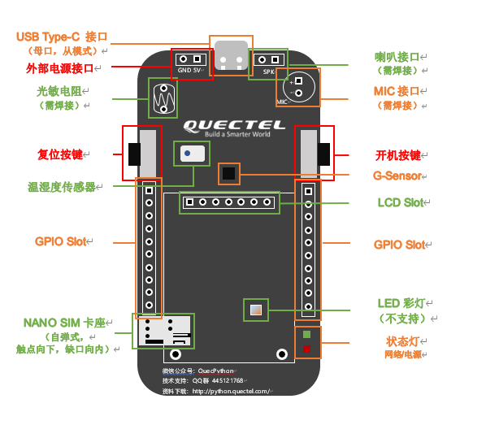

### 开发板接口（背面）

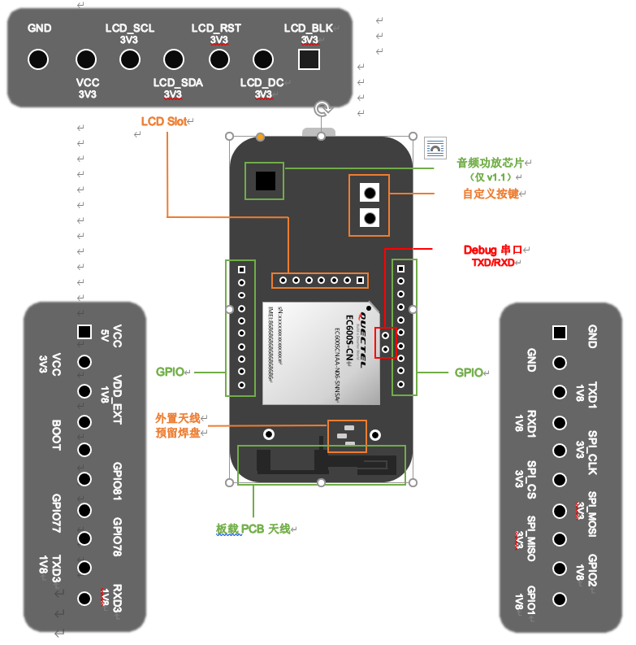

| 小提示                                                                                                   |
|----------------------------------------------------------------------------------------------------------|
| 开发板的丝印请参考 本手册的 附录内容 开发板的更多资料，请访问 <https://python.quectel.com/download.html> |

### 开发板配置

开发板配备了多种传感器，以及其他外设。明细如下：

| 序号 | 名称                         | 型号          | 是否支持 | 接口类型 |
|------|------------------------------|---------------|----------|----------|
| 1    | 三轴加速度传感器             | LIS2DH12TR    | 是       | SPI      |
| 2    | 温湿度传感器                 | AHT10         | 是       | SPI      |
| 3    | 光敏电阻                     | GL5528        | 是       | ADC      |
| 4    | 微动按键                     | -             | 是       | GPIO     |
| 5    | 麦克风                       | GMI6050P-66DB | 是       | SPK      |
| 6    | 功放芯片                     | AW8733ATQR    | 是       | SPK      |
| 7    | LED彩灯                      | WS2812B-MINI  | 否       | PWM      |
| 8    | LCD 显示屏（需选择含屏套餐） | ST7789        | 是       | SPI      |

## 功能详解

### LCD接口

开发板集成了LCD接口，开发者可以通过该接口点亮LCD屏幕，显示图片文字等内容。搭配LVGL还能显示更多有趣内容哦（点此了解“LCD”的小实验）。

目前，QuecPython支持的屏幕：

-   GC9305

-   HX8347

-   ST7789

-   ST7735

-   更多屏幕，正在适配中…

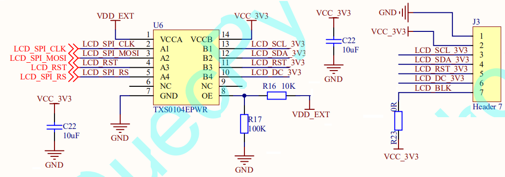

LCD 相关原理图

| 请注意                                              |
|-----------------------------------------------------|
| LCD Slot 没有CS，请选择没有CS的屏，或者将屏的CS接地 |

### 加速度传感器

开发板集成了LIS2DH12三轴加速度传感器。该三轴加速度传感器是具有体积小巧、耗电低、灵敏度高的特点。开发者通过该加速度传感器，可以采集开发板的运动状态，姿态等数据。

点此了解：[“加速度传感器”小实验](https://python.quectel.com/wiki/study/zh-cn/study/QuecPythonTest/i2c_lis2dh/)

**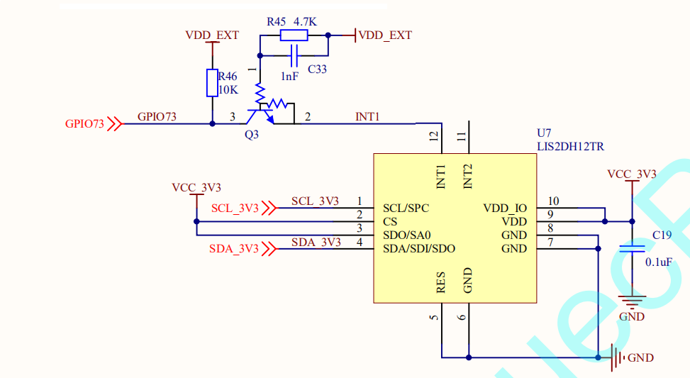**

加速度传感器 相关原理图

### 光敏电阻

开发板集成了GL5528高灵敏度光敏电阻。

光敏电阻对光线十分敏感，其在无光照时，呈高阻状态，暗电阻一般可达1.5MΩ；而在光照时，阻值可小至1KΩ以下。使用该光敏电阻，开发者可以采集环境光照度信息。

点此了解：[ADC实验](https://python.quectel.com/wiki/study/zh-cn/study/QuecPythonTest/ADC/)

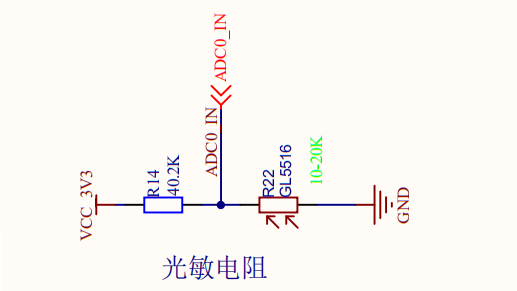

光敏电阻 相关原理图

### 温湿度传感器

开发板集成了AHT10温湿度传感器。该传感器具有低功耗、体积小、计量准确的特点。

开发者可以使用该传感器采集环境温度、湿度等信息。

点此了解：[温湿度传感器实验](https://python.quectel.com/wiki/study/zh-cn/study/QuecPythonTest/i2c_aht/)

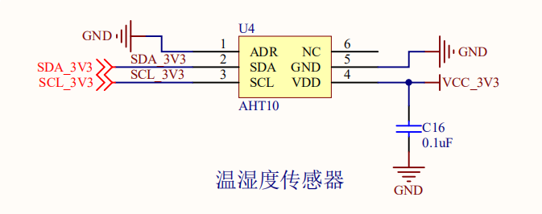

温湿度传感器 相关原理图

### 音响功率放大器（功放芯片）

开发板集成了AW8733ATQR音响功率放大器。该功放芯片是K 类音响功率放大器,具有超强
TDD 抑制、超大音量、防破音、超低 EMI、输出功率
2.0W的特点。使用该芯片后，开发板可以推动至多 4Ω2w的喇叭。

点此了解：[Audio模块开发](https://python.quectel.com/wiki/study/zh-cn/study/QuecPythonSub/Audio/)

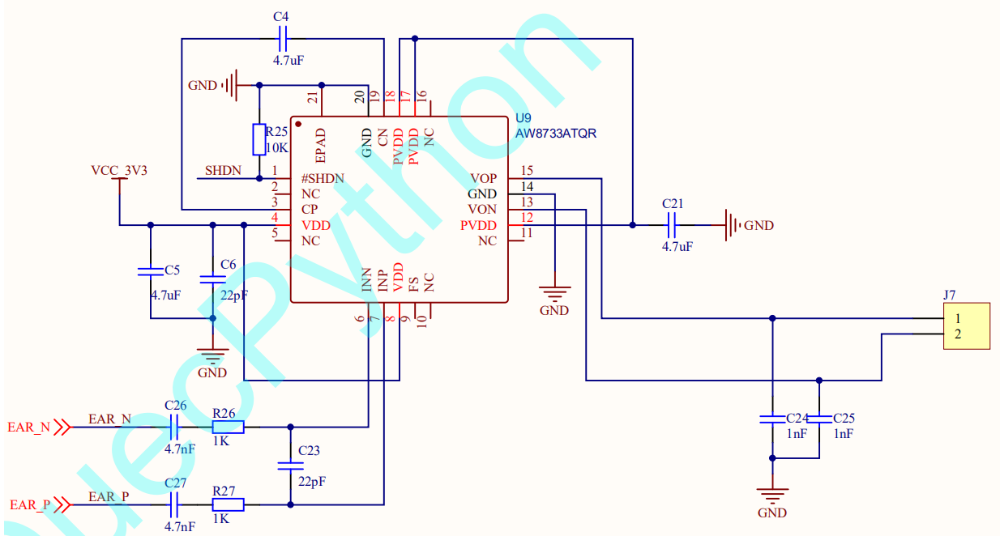

音频功放芯片 相关原理图

| 请注意                                                                                                                                                                      |
|-----------------------------------------------------------------------------------------------------------------------------------------------------------------------------|
| v1.0版开发板没有功放芯片，放音可能失败 v1.1版开发板有功放芯片，需要拉高PIN58使能 audio_EN = Pin(Pin.GPIO11, Pin.OUT, Pin.PULL_PD, 1)  v1.1版开发板录音存在问题，需要拿掉R28 |

### 自定义按键

开发板集成了2个自定义微动按键，开发者可以自行定义其功能。

点此了解：[按键输入实验](https://python.quectel.com/wiki/study/zh-cn/study/QuecPythonTest/button/)


自定义按键 相关原理图

| 请注意                                           |
|--------------------------------------------------|
| 开发板丝印错误，微动开关实际连接的是GPIO1、GPIO2 |

## 准备工作

### 安装USB驱动 

使用开发板前，需要在电脑上安装USB驱动。正确安装后，电脑可以识别开发板。

| 驱动程序 相关信息                                                                                                                                                                                                                             |
|-----------------------------------------------------------------------------------------------------------------------------------------------------------------------------------------------------------------------------------------------|
| 驱动程序名称： Quectel_ASR_Series_UMTS&LTE_Windows_USB_Driver_Customer 驱动程序版本： V1.0.3 驱动程序体积： 34.3MB 驱动程序支持系统： Windows7、Windows8、Windows8.1、Windows10 驱动程序下载地址： <https://python.quectel.com/download.html> |

开发者下载驱动程序的压缩包后，完整解压该压缩包到任意目录，双击运行setup.exe：

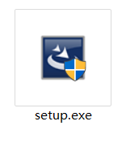

按照提示，点击Install即可：

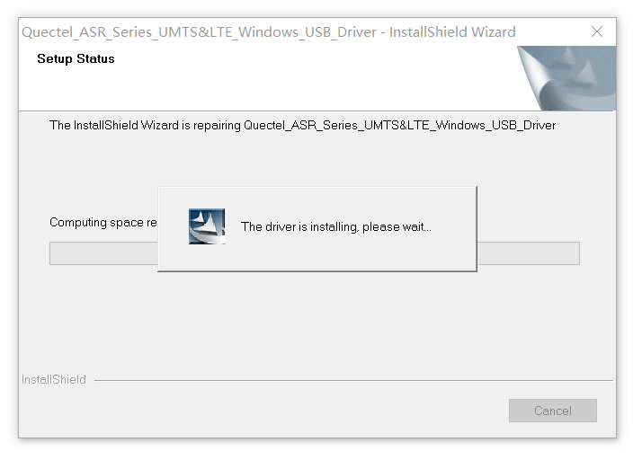

安装成功后，点击“Finish”结束：

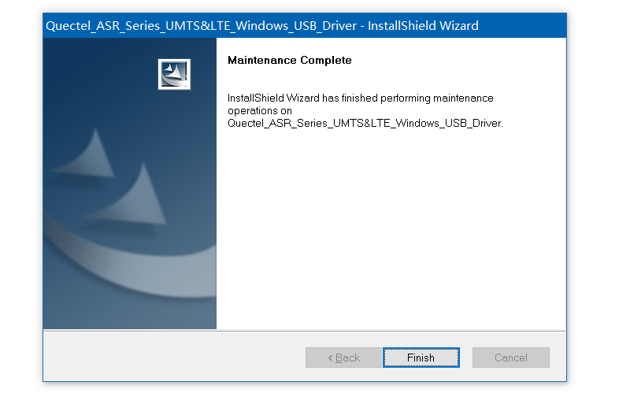

至此，USB 驱动安装结束。

| 小提示                                                                                                                                                                                                                                |
|---------------------------------------------------------------------------------------------------------------------------------------------------------------------------------------------------------------------------------------|
| 安装前，请备份您的重要文件，并保存您的工作进度，以免发生意外情况，导致文件丢失 安装成功后，无需重启电脑 如需修复或者卸载驱动程序，再次运行该 驱动安装程序，选择“修复”或“卸载” 即可 如若安装失败，请联系我们的在线支持：QQ群 445121768 |

### 验证驱动安装

驱动安装成功后，使用USB
TypeA-TypeC数据线，将开发板连接到电脑上，并长按POWKY开机。

| 请注意                                                                                                                                |
|---------------------------------------------------------------------------------------------------------------------------------------|
| v1.0版开发板，上电自动开机，无需长按 POWKY v1.1版开发板，需要长按POWKY开机 开发板的USB Type-U为母口，仅可当作从设备，接口类型为USB2.0 |

在电脑上打开“设备管理器”，进入电脑的设备管理器，展开**“端口(COM 和
LPT)”**，应出现三个串口设备：

1.  **Quectel USB AT Port (COMx)**

2.  **Quectel USB DIAG Port (COMx)**

3.  **USB 串行设备 (COMx)**

| 小提示                                                                       |
|------------------------------------------------------------------------------|
| 如何打开“设备管理器”呢？ 很简单，请跟我来：我的电脑—“此电脑”—属性—设备管理器 |

如果您的电脑没有识别到任何串口设备，请检查：

1.  开发板是否正确连接到电脑（数据线损坏，或者插口损坏、供电不足等）

2.  开发板是否正确开机

3.  USB驱动是否正确安装

4.  电脑是否正确安装主板驱动。

如果无法排除，请联系我们的在线支持：QQ群 445121768

如果您的电脑只识别了两个串口设备（没有“USB串行设备”），那么可能是因为没有刷入QuecPython固件的缘故。别着急，请阅读下一章节，刷入QuecPython固件就可以啦。

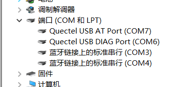

没有“*USB串行设备*”

如果您的电脑正确识别了三个串口设备，那么恭喜您，一切准备就绪，可以开始QuecPython之旅啦\~！

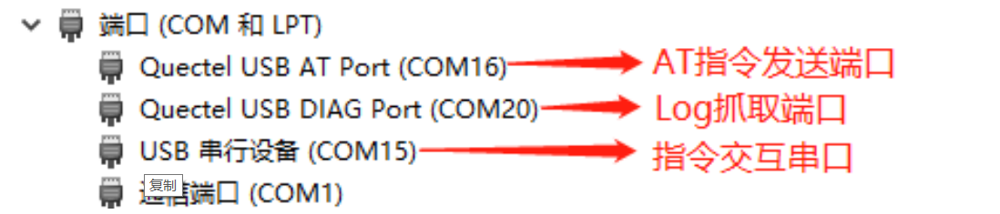

正确识别了三个串口设备

### 验证固件版本

使用串口工具，打开“Quectel USB AT Port”对应的串口（波特率选择 115200，停止位 1
位，无奇偶校验，8 位数据位，无硬件控制流）。勾选“发送新行”（Send With
Enter），发送指令“**AT+GMR**”，查看模块返回的信息，即当前固件版本：

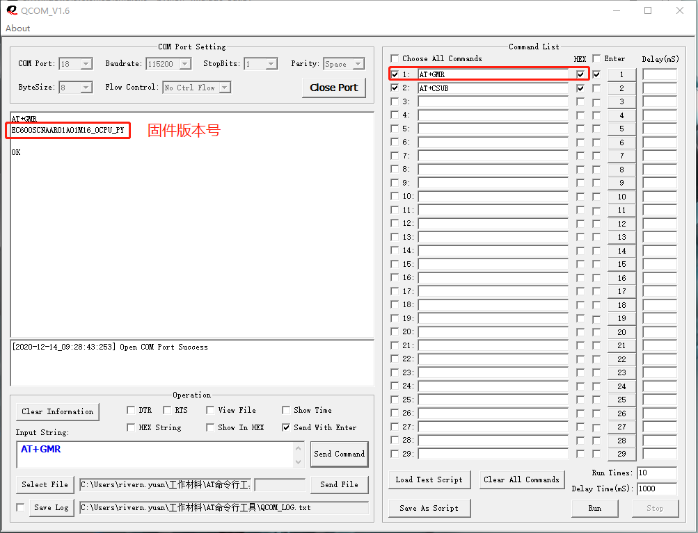

如果是QuecPython的固件，通常以PY或者Python结尾。

使用官方的图形化工具——QPYcom，同样也可以验证当前固件版本是否为QuecPython固件。

| QPYcom 相关信息                                                                                                                                                          |
|--------------------------------------------------------------------------------------------------------------------------------------------------------------------------|
| 程序名称： QPYcom 程序版本： V1.1.1 程序体积： 33.1MB 程序支持系统： Windows7、Windows8、Windows8.1、Windows10 程序下载地址： <https://python.quectel.com/download.html> |

使用QPYcom工具查看固件版本的步骤如下：

1.  下载QPYcom工具后，完整解压到任意目录，双击QPYcom.exe运行

2.  将开发板连接到电脑并开机；

3.  选择“USB串行设备”串口，默认波尔率，打开串口

4.  点击“**交互**”标签，进入交互页

5.  键入如下命令，然后查看模块返回的内容：

    *import uos*

    *uos.uname()*

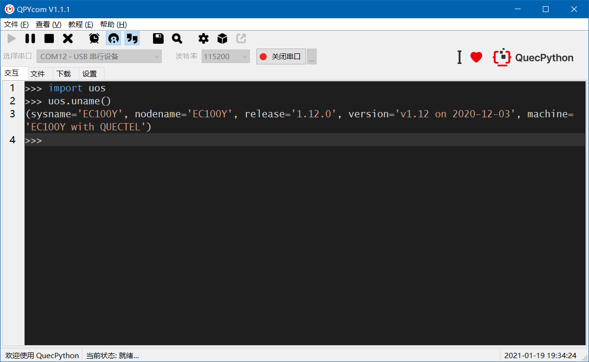

如图所示，如果可以正常返回内容，则证明当前运行的是QuecPython固件。

如果没有“USB串行设备”
串口，或者无法输入，输入无返回等情况，则模组内运行的都不是QuecPython固件，需要下载QuecPython固件。

### 下载固件

| 小提示                                                                                                                                                                                                                                                                                                                                                                                                                                                           |
|------------------------------------------------------------------------------------------------------------------------------------------------------------------------------------------------------------------------------------------------------------------------------------------------------------------------------------------------------------------------------------------------------------------------------------------------------------------|
| 什么是QuecPython 固件（下简称“固件”）？为什么要下载它呢？ 固件是包含驱动、BL、FS、VM等资源的一个二进制程序，没有固件的模块，就像没有辣椒的火鸡面，寡淡无味。下载固件后，模块就可以“跑起来”啦。  通俗来讲，“固件相对于Quectel通信模组”，类似于“操作系统相对于电脑”；”用户脚本相对于QuecPython固件”，类似于”应用程序相对于操作系统”。 只有把操作系统安装到电脑上（下载固件），再把应用程序安装好（下载用户脚本），才能让电脑发挥相应的功能，执行相应的操作和指令。 |

| 请注意                                                                                                |
|-------------------------------------------------------------------------------------------------------|
| 下载固件前，建议优先需要确认固件版本。以免降级或者下错版本。 下载固件后，所有用户区的内容都将被清空。 |

使用QPYcom工具下载固件的步骤如下：

1.  下载QPYcom工具后，完整解压到任意目录，双击QPYcom.exe运行

2.  将开发板连接到电脑并开机；

3.  点击“**下载**”标签，进入下载页

4.  在下载页面左侧导航栏创建项目，然后点击“**选择固件**”选择固件包

5.  左键点击页面右下角倒三角形，在弹出的菜单中选择“**下载固件**”菜单，点击“**下载固件**”按钮，工具自动开始固件下载

| 小提示                                                                                                                |
|-----------------------------------------------------------------------------------------------------------------------|
| 下载固件时，无需选择串口，工具将自动选择并开始下载 请勿同时插入两个或两个以上的开发板，以免工具无法识别，导致下载出错 |

| 请注意                                                                                                                                                                                      |
|---------------------------------------------------------------------------------------------------------------------------------------------------------------------------------------------|
| 下载固件过程中，请勿退出工具，或者拔掉串口，可能致使模块变砖。 如果模块确已变砖，则只有关机，拉高BOOT开机，强制进入下载模式（出现donwload下载口），并使用QPYcom重新下载固件成功，才能救砖。 |

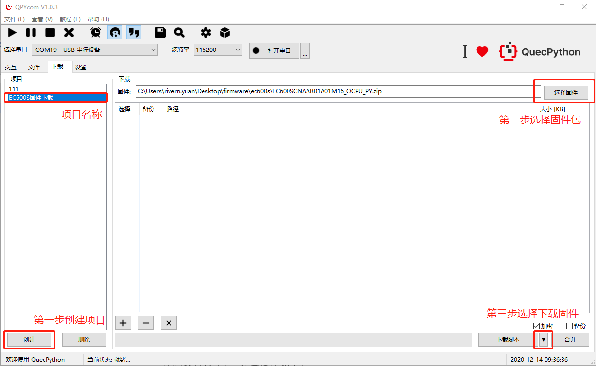

创建项目、选择固件文件

>   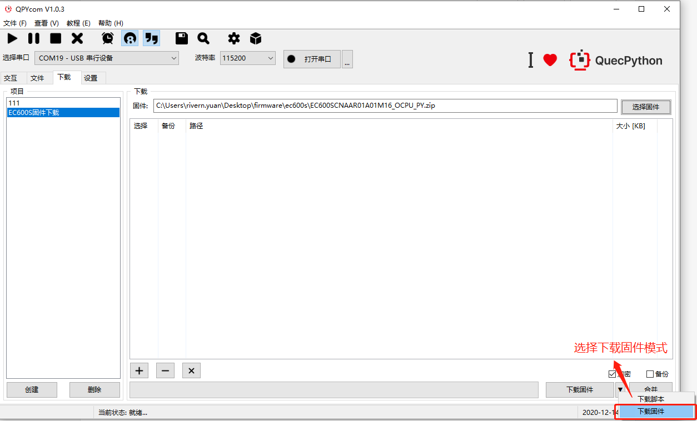

>   选择 **下载固件** 菜单

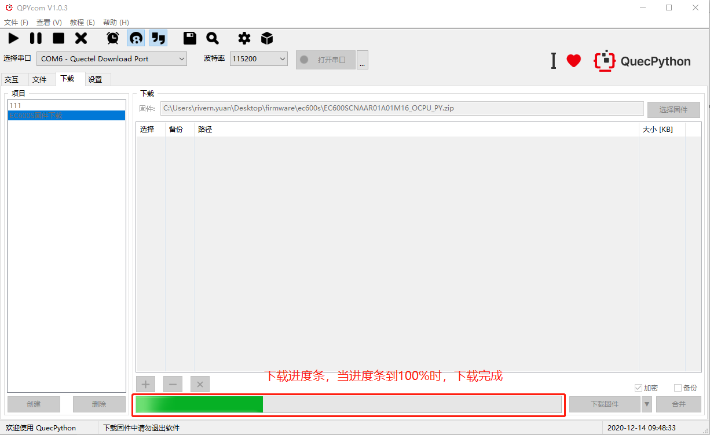

点击 **下载固件** 按钮，开始下载固件。

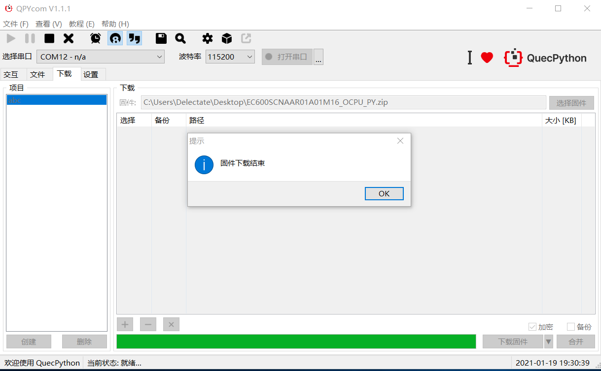

固件下载成功

下载完成后，可以使用上一章的方法，发送AT指令，或者使用“交互”页测试，固件是否正确下载。

| 小提示                                                                                                                                                                                         |
|------------------------------------------------------------------------------------------------------------------------------------------------------------------------------------------------|
| 哪里可以获取到QuecPython 固件？ 请到QuecPython官方网站下载：<https://python.quectel.com/download.html>  下载失败如何处理？模块变砖怎么办？ 请加入我们的QQ 群 445121768，工程师在线为您答疑解惑 |

### 下载helloworld.py程序到开发板

使用QPYcom工具，我们可以将自己的 Python 脚本文件下载到模块中。

hello world.py 文件内容：

```python
import utime

while True:

	print(“hello world”)

	utime.sleep(1)
```

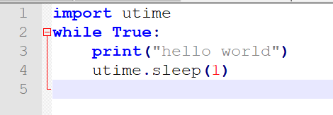

具体的操作步骤如下：

1.  下载QPYcom工具后，完整解压到任意目录，双击QPYcom.exe运行

2.  将开发板连接到电脑并开机

3.  选择“USB串行设备”串口，默认波尔率，打开串口

4.  点击“**文件**”标签，进入文件页（左侧为电脑本地的文件；右侧为模块端的文件）

5.  左侧浏览电脑的文件，并选择对应的.py文件，拖动该文件到右侧的“Root”根节点，松开鼠标左键，即可自动下载文件到模块（也可以点击右侧栏的“**+**”按钮，浏览并选择文件，将文件下载到模块内）

6.  文件下载过程中，页面底部状态栏有下载进度，进度到100%表示文件下载成功。


>   如图所示，此时 hello world.py
>   文件已经下载到模块主目录下，可以通过QPYcom工具的“交互”查看，操作如下：

**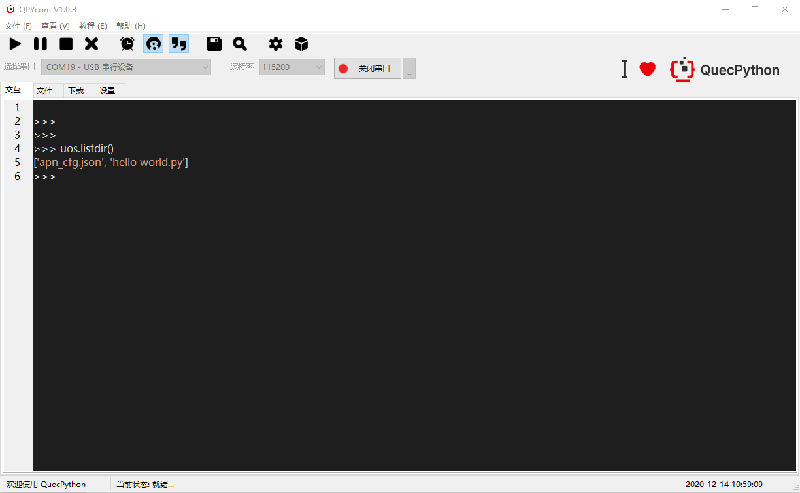**

| 小提示                                                                                                                                       |
|----------------------------------------------------------------------------------------------------------------------------------------------|
| 新版固件使用双文件系统，根目录 / 可读不可写；备份分区 /bak 不可读不可写；用户分区 /usr 可读可写。 用户的所有file io 操作，都应在 /usr 进行。 |

### 运行hello world.py程序

运行模块内的python脚本，有两个方式：

1.  手动运行

    1.下载QPYcom工具后，完整解压到任意目录，双击QPYcom.exe运行

    2.将开发板连接到电脑并开机

    3.选择“USB串行设备”串口，默认波尔率，打开串口

    4.点击“文件”标签，进入文件页（左侧为电脑本地的文件；右侧为模块端的文件）

    5.右侧浏览模块内的文件，选中需要运行的py文件，点击“三角”按钮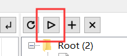，QPYcom将自动跳转到“**交互**”页，并运行该脚本文件

    6.也可以导入 example 模块，并使用exec方法运行 python 脚本程序：

    *import example*

    *example.exec(‘hello world.py’)*

| 小提示                                                                                     |
|--------------------------------------------------------------------------------------------|
| 如果是双文件系统，则应执行如下命令： *import example* *example.exec(‘usr/hello world.py’)* |

>   运行结果如下图所示：

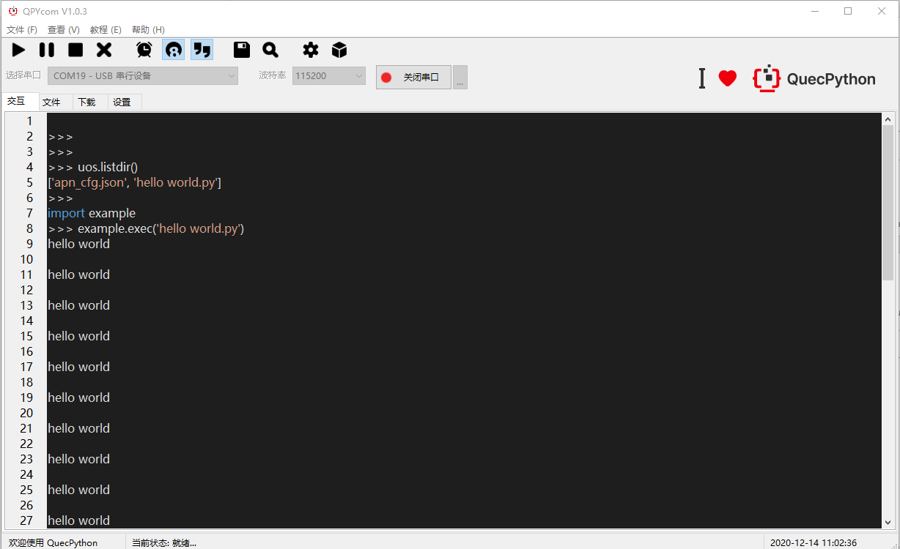

1.  开机后自动运行

    QuecPython支持上电自动执行用户代码。

    Quectel 通信模组上电运行后，QuecPython会查找用户分区下名成为 main.py
    的程序文件并自动执行该文件。所以如果用户希望能上电后自动运行自己的代码，需要将自己的程序命名为
    main.py，连同它的依赖等文件，一起下载到模块内。

| 小提示                                                                                                                                 |
|----------------------------------------------------------------------------------------------------------------------------------------|
| 文件名必须是main.py（大小写完全一致），必须放在用户区内，才能实现开机后自动运行。 如果main.py调用其他py、mpy文件，需要一同下载到用户。 |

>   以hello world.py 为例说明：将hello world.py 文件提供方法 2s 周期性打印“hello
>   world!”字符串； main.py 文件中调用 hello world.py 中的方法。

helloworld.py：

```python
import utime

def prtHelloworld():

	while True:
	
		print("hello world")

		utime.sleep(1)
```

main.py

```python
# 调用helloworld.py文件

import helloworld

# 调用helloworld.py 文件的 prtHelloworld() 函数

helloworld.prtHelloworld()
```


| 小提示                                                                                                                                                                                                                                                                                                                                                                                                                                                                             |
|---------------------------------------------------------------------|
| 需要import的文件名，不建议包含空格等特殊字符，建议以纯英文命名。 |
| 如果是双文件系统，用户的py文件，则需要使用如下方法import： |
*from usr import helloworld  #helloworld表示py文件名* 
*helloworld.prtHelloworld()* 
*import usr.helloworld #意为usr目录下的helloworld.py 文件* 
*usr.helloworld.prtHelloworld() #注意，此方式一定要带上usr的前缀*  
上边两种方法结合，可以引申为： 
*from usr.helloworld import  \** 
*prtHelloworld() #因为已经import \*，所以此处直接调用函数名即可* 

>   将上面两个文件都下载到模块中。

>   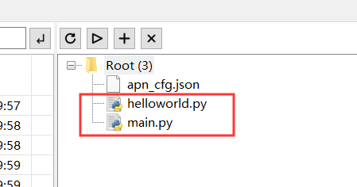

>   按一下开发板上的 RESET 按键，系统启动后，重新连接主串口，电脑键盘按下 Enter
>   键，进入交互界面即可看到自动运行结果：

>   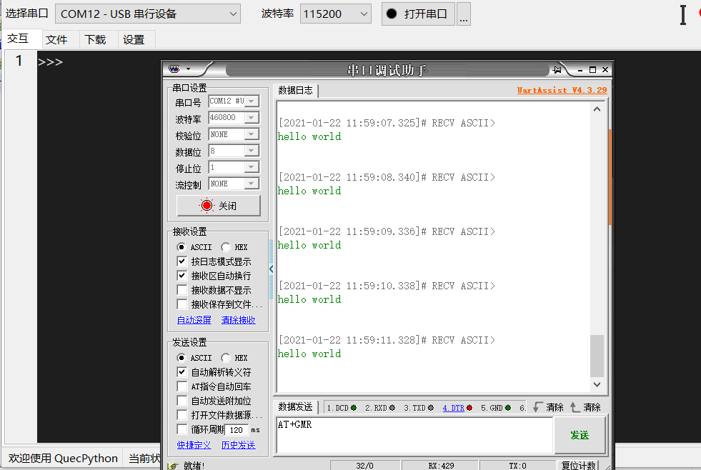

| 小提示                                                     |
|------------------------------------------------------------|
| 自动运行失败，请检查py文件是否存在语法错误、调用错误的情况 |

| 请注意                                                                                                                        |
|-------------------------------------------------------------------------------------------------------------------------------|
| 自动运行的脚本，或者循环输出的脚本，将无法使用Ctrl+C停止运行； 锁死交互的模块，也无法终止脚本运行；  唯一的方法是：重刷固件。 |

### 常见问题解决

**Q：模块的固件在哪？**

A：请登录QuecPython网站下载：[http://python.quectel.com/download.html\#firmware](http://python.quectel.com/download.html#firmware)

**Q：哪里有开发板和其他常用资料？**

A：请登录QuecPython网站下载：<http://python.quectel.com/download.html>

P.S. 如果您遇到任何问题，请联系我们的在线支持：QQ群 445121768

## 附录 开发板丝印图

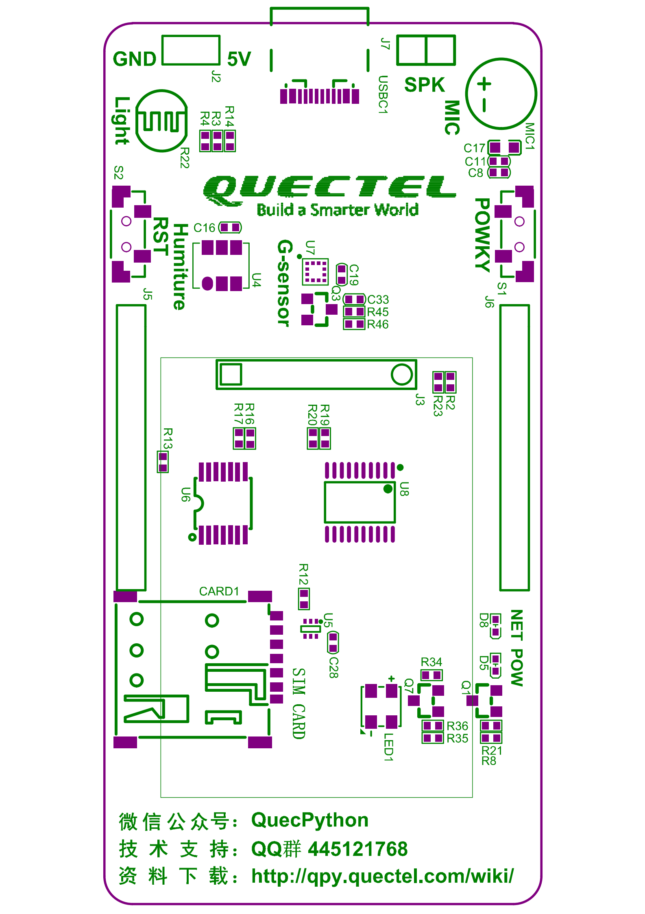

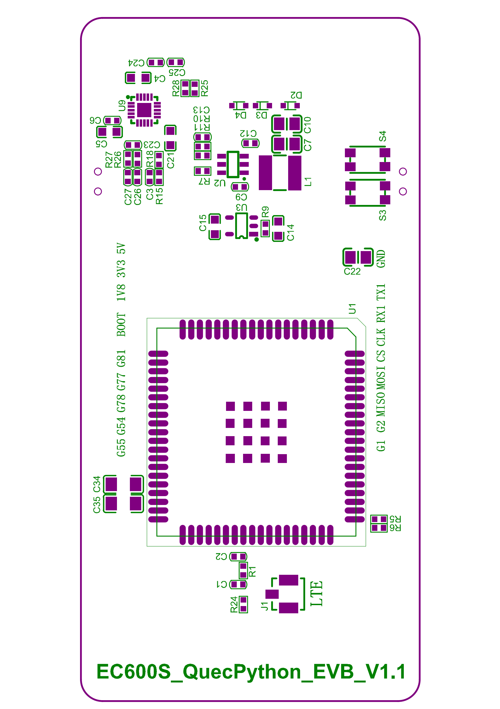
