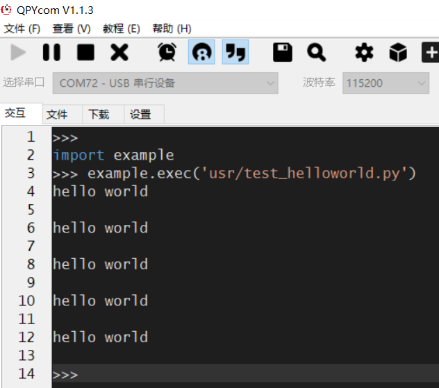
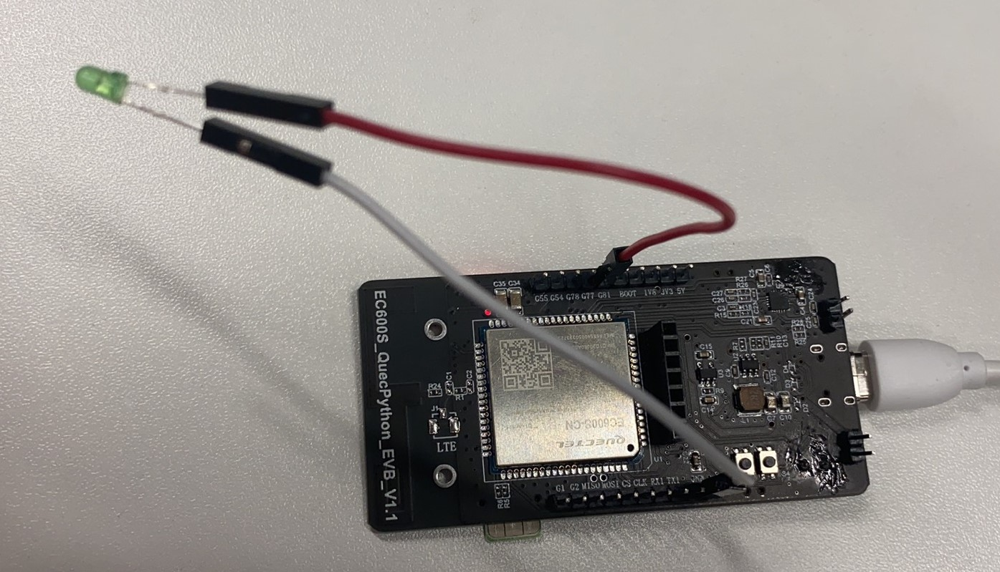
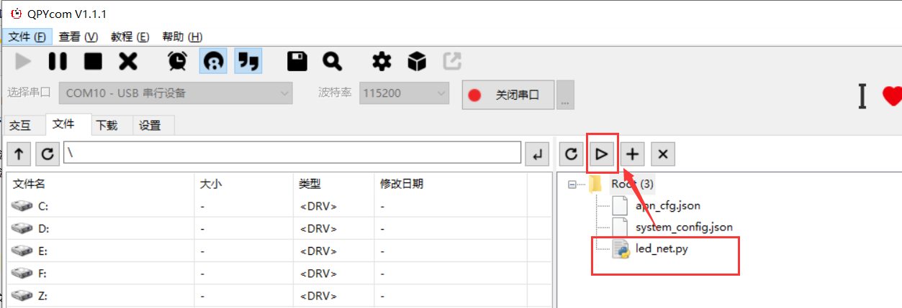
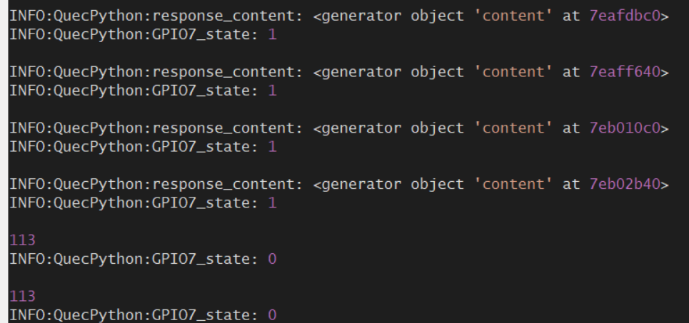

# QuecPython快速入门

本文档主要说明 QuecPython快速入门，主要包括三个方面：打印Hello World；点亮LED灯；HTTP获取网页源代码。

适用模块：

- EC100Y-CN
- EC600S-CN

## Hello World打印

1.开发板接入电脑，需要安装驱动和烧录模块固件，具体的操作方法参照《Quectel QuecPython_QPYcom工具使用说明》

2.hello world打印

（1）交互窗口打印

如下图所示，使用QPYcom工具，端口连接”USB串行设备”，选择“交互”界面，进行如下交互打印。

```python
>>> print('hello world')
hello world
>>> print("hello world")
hello world
```

（2）编写*test_helloworld.py*文件打印

创建*test_helloworld.py*文件，编写脚本如下所示：

```python
import utime    # 导入定时模块
print_num = 5   # 定义打印次数
while print_num:
    print("hello world")
    print_num -= 1   # 自减
    utime.sleep(2)   # 延迟2秒
```

运行结果如下：



## 点亮LED灯与HTTP获取网页源代码

对于点亮LED灯和HTTP获取网页源代码，本章节将两者结合，目的是实现联网后，获取网页源代码的同时，点亮LED灯；如果无法获取，灯灭。

### 硬件连接

1.准备一个LED灯，两根杜邦线

2.将LED灯的地段（扁平的一段）通过杜邦线连接到GND（具体随意）

3.将LED灯的另一端通过杜邦线连接到一个GPIO口上（以EC600S-CN为例，连接模块的PIN16，对应开发板的G81）。

实物连接如下所示。




### 软件代码

```python
import utime  # 导入utime模块
import request  # 导入request模块
from machine import Pin  # 导入Pin模块
import log  # 导入log模块
g7 = Pin(Pin.GPIO7, Pin.OUT, Pin.PULL_DISABLE, 0)  # GPIO7配置成输出模式，默认输出0
log.basicConfig(level=log.INFO)  # LOG等级为INFO
QuecPython = log.getLogger("QuecPython")  # 指定LOG对象name
account = 30
while account:
    try:
        url = "www.baidu.com"
        response = request.get(url)  # 发送GET请求
        QuecPython.info("response_content: {}".format(response.content))  
        # LOG打印“响应内容的生成器对象”（具体信息如何打印见相关API介绍）
        g7.write(1)  # 写入1（输出高电平）
        QuecPython.info("GPIO7_state: {}".format(g7.read()))  # LOG打印GPIO7的电平
    except:
        g7.write(0)  # 写入0（输出低电平）
        QuecPython.info("GPIO7_state: {}".format(g7.read()))   # LOG打印GPIO7的电平
    account -= 1  # 自减
    utime.sleep(2)  # 延时2S
```

### 运行效果

1.打开QPYcom运行*led_net.py*，如下图所示。



2.运行中，看到request获取成功后，拔掉SIM卡（模拟无法注网的状态），部分LOG如下：



说明：

（1）在拔出SIM卡后，仍有几次获取到GPIO状态是1的，这是正常的，因为request获取会有存在一定的缓存；

（2）对于运行中出现的"113"等，是HTTP的错误码，具体可参考HTTP的错误码表（可自行百度）。