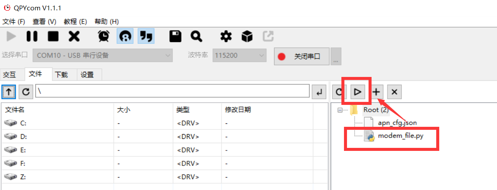
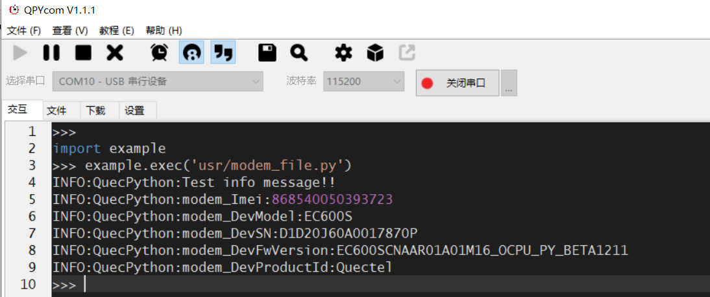
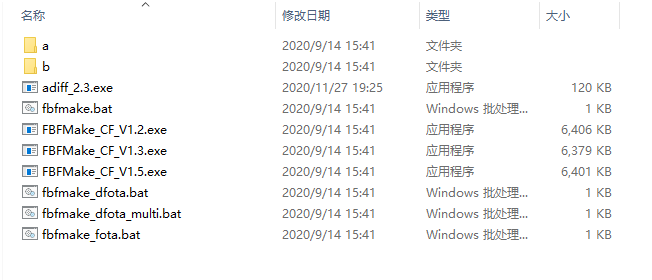
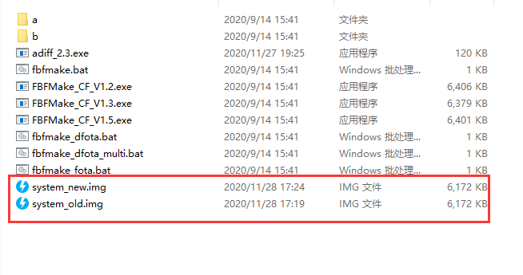
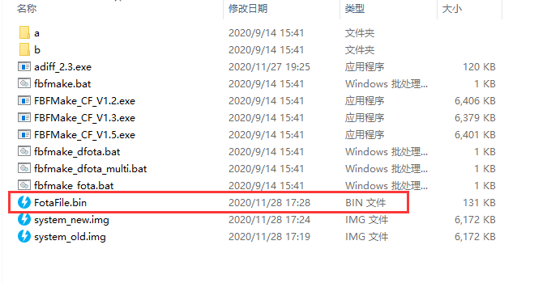
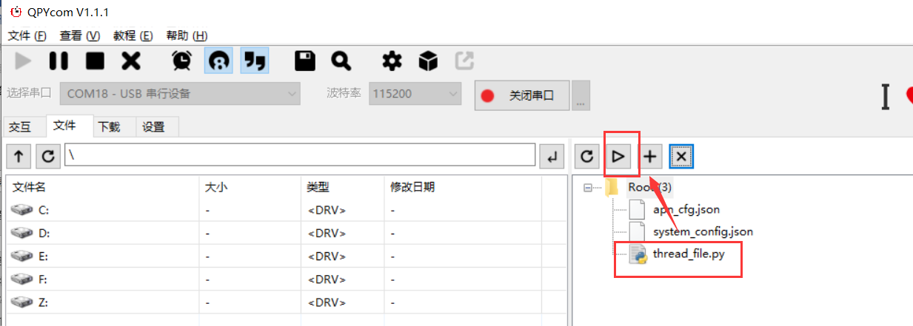
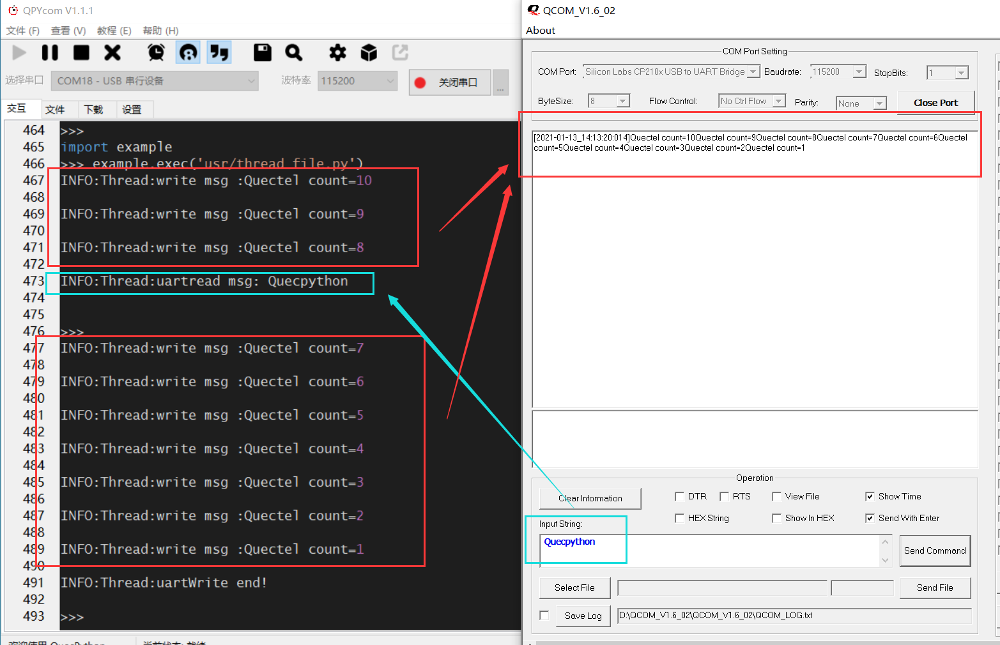

# QuecPython 平台性接口

## **QuecPython modem 获取设备信息**

本文主要基于EC600S-CN介绍如何使用QuecPython modem模块获取设备信息。通过本文您将了解到EC600S-CN线程的所有设置参数及使用方法。 

适用模块：

- EC100Y-CN

- EC600S-CN

### 软件设计

modem 模块提供获取设备各类信息的接口，下面具体介绍每个接口的功能。

#### 获取设备的IMEI

**modem.getDevImei()**

**参数说明**

无

**返回值**

成功则返回字符串类型设备的IMEI；

失败则返回整型值-1。

#### 获取设备型号

**modem.getDevModel()**

**参数说明**

无

**返回值**

成功则返回字符串类型的设备型号；

失败则返回整型值-1。

#### 获取设备序列号

**modem.getDevSN()**

**参数说明**

无

**返回值**

成功则返回字符串类型设备序列号；

失败则返回整型值-1。

#### 获取设备固件版本号

**modem.getDevFwVersion()**

**参数说明**

无

**返回值**

成功则返回字符串类型固件版本号；

失败则返回整型值-1。

#### 获取设备的制造商ID

**modem.getDevProductId()**

**参数说明**

无

**返回值**

成功则返回字符串类型设备制造商ID；

失败则返回整型值-1。

### 交互操作

使用QPYcom工具和EC600S-CN进行交互，具体如下：

```Python
>>> import modem
>>> help(modem)
object <module 'modem'> is of type module
  __name__ -- modem
  getDevSN -- <function>
  getDevImei -- <function>
  getDevModel -- <function>
  getDevFwVersion -- <function>
  getDevProductId -- <function>
>>> from modem import *
>>> getDevSN()
'D1D20J60A0017870P'
>>> getDevImei()
'868540050393723'
>>> getDevModel()
'EC600S'
>>> getDevFwVersion()
'EC600SCNAAR01A01M16_OCPU_PY_BETA1211'
>>> getDevProductId()
'Quectel'
```

注意：

1. import modem即为让 modem模块在当前空间可见。

2. 只有import modem模块，才能使用 modem内的函数和变量。

### 下载验证

#### 软件代码

下载.py文件到EC600S-CN上运行，代码如下：

```python
import modem
import log

state = 1
log.basicConfig(level=log.INFO)   # 设置日志输出级别

log = log.getLogger("QuecPython")

def modem_msg():
    global state
    modem_Imei = modem.getDevImei()
    modem_DevModel = modem.getDevModel()
    modem_DevSN = modem.getDevSN()
    modem_DevFwVersion = modem.getDevFwVersion()
    modem_DevProductId = modem.getDevProductId()
    log.info("modem_Imei:{}".format(modem_Imei))
    log.info("modem_DevModel:{}".format(modem_DevModel))
    log.info("modem_DevSN:{}".format(modem_DevSN))
    log.info("modem_DevFwVersion:{}".format(modem_DevFwVersion))
    log.info("modem_DevProductId:{}".format(modem_DevProductId))
    state = 0

if __name__ == "__main__":
    modem_msg()
    while 1:
        if state:
            pass
        else:
            break
```

#### 硬件连接

无需硬件连接

#### 运行效果

打开QPYcom运行*thread_file.py*，如下图：



运行结果如下：



### 配套代码

<!-- * [下载代码](code/modem_file.py) -->
 <a href="zh-cn/QuecPythonInterface/code/modem_file.py" target="_blank">下载代码</a>


## **QuecPython FOTA 固件升级用户指导**

本文档基于QuecPython介绍如何进行FOTA固件升级，从新FOTA方案介绍、升级包制作、固件升级流程等各方面，指导用户使用FOTA升级功能。

本文档适用于以下模块：

-   EC100Y-CN

-   EC600S-CN


### 新FOTA升级方案

FOTA新方案的相较于之前旧的方案，最大的优点即可以降低flash占用。首先CP和DSP采用更高压缩率的LZMA压缩，相较于之前旧的LZOP压缩，CP的镜像可以减少1M+，DSP的镜像可以减少200 K+；其次采用压缩前的差分，差分包可以更小。因为压缩使得文件内容发生了变化，导致差分效果并不好，采用压缩率越高的压缩算法，差分效果会越差。使用LZMA的高压缩率的算法，使得我们必须采用新的FOTA升级方案，既达到了镜像减小，差分包又不会变大，相较于旧的LZOP升级方案，差分包还要小。

### 差分升级包制作方法

升级包制作工具的目录如下图所示。



#### 升级包制作命令及参数说明

>   升级包制作命令如下：

>   adiff_2.3.exe -l [fs][fp] system_old.img system_new.img system_patch.bin

-   *system_old.img*：代表旧版本的固件升级文件；

-   *system_new.img*：代表新版本的固件升级文件；

-   *system_patch.bin*：代表生成的差分升级文件；

-   -l代表差分升级文件存放的位置，若设置为fs则代表差分文件会被放入文件系统；若设置为fp则代表差分文件会被放入fota_pkg分区。

指定文件存放位置是为了在制作差分包阶段就判断出备份区域是否足够，以满足差分还原时的旧固件备份，作为一种安全保护检测。

#### 升级包制作流程

制作差分包时，需要两个不同版本的固件包：旧版本的固件包B（before的简称），新版本的固件包A（after的简称）。制作步骤如下：

1.  将固件包中的*system.img*文件复制至工具根目录下，位置如下图所示：


1.  将A中的*system.img*命名为*systeam_old.img*，再将B中的*system.img*命名为
    *systeam_new.img*，如下图所示：



1.  执行如下命令：

    adiff_2.3.exe -l fs system_old.img system_new.img FotaFile.bin

当需要A和B互相升级时，调换该命令分别制作*a_b.bin*和*b_a.bin*；如下：

>   adiff_2.3.exe -l fs system_new.img system_old.img FotaFile.bin

同理，也可修改镜像名称。


1.  完成差分升级的升级包制作，结果如下图所示：



### FOTA固件升级流程

#### 流程简介

将制作完成的差分升级包上传到模块的文件系统中，再通过提供的demo完成固件升级。

#### FOTA相关API介绍

fota_obj

该函数用于创建FOTA对象。

-   **函数原型**

fota_obj = fota() 


-   **参数**

无

-   **返回值**

返回FOTA对象。

fota_obj.write

该函数用于写入升级包文件数据。

-   **函数原型**

fota_obj.write(bytes, file_size) 


-   **参数**

*bytes*：

[In] 升级包数据。

*file_size*：

[In] 升级包文件总字节大小。

-   **返回值**

*0* 表示写入成功

*-1* 表示写入失败

fota_obj.verify

该函数用于校验升级包文件数据。

-   **函数原型**

fota_obj.verify()


-   **参数**

无

-   **返回值**

*0* 表示校验成功

*-1* 表示校验失败

#### 示例代码

```python
import fota

import utime

import log

import uos

from misc import Power

# 设置日志输出级别

log.basicConfig(level=log.INFO)

fota_log = log.getLogger("Fota")

# 此示例需要升级包文件（差分包等.bin文件），参考本文档升级包制作方法。

def run():

	fota_obj = fota() # 创建Fota对象

	file_size = uos.stat("FotaFile.bin")[6] # 获取文件总字节数

	with open("/usr/FotaFile.bin", "rb")as f: #rb模式打开.bin文件(需要制作升级包文件)

		while 1:

			c = f.read(1024) # read

			if not c:

				break

			fota_obj.write(c, file_size) # 写入.bin文件数据与文件总字节数

			fota_log.info("flush verify...")

			res = fota_obj.verify() # 校验

			if res != 0:

				fota_log.error("verify error")

			return

			fota_log.info("flush power_reset...")

utime.sleep(2)

Power.powerRestart() # 重启模块
```


### 附录A术语缩写

表1：术语缩写

| **缩写** | **英文全称**                 | **中文全称**     |
|----------|------------------------------|------------------|
| CP       | Payload Compression Protocol | IP载荷压缩协议   |
| DSP      | Digital Signal Processing    | 数字信号处理     |
| FOTA     | Firmware Over-The-Air        | 空中下载软件升级 |


## **QuecPython 多线程开发**

本文以EC600S-CN为例介绍如何使用QuecPython的多线程功能。几乎所有操作系统均支持进程（Process）概念，操作系统中正在运行中的任务一般对应一个进程。当一个程序进入内存运行时，即变成一个进程。多线程扩展了多进程的概念，使得同一个进程可以同时并发处理多个任务。线程（Thread）也被称作轻量级进程（Lightweight Process），线程是进程的执行单元。类似进程在操作系统中的地位，线程在程序中是独立的、并发的执行流。

通过本文你将了解EC600S-CN线程的所有设置参数及使用方法。 

### 硬件描述

线程是软件层面的功能实现，硬件方面只需要足够的内存即可，此处不再赘述。

### 软件设计

_thread 模块提供创建新线程的方法，并提供互斥锁，下面具体介绍每个接口的功能。

#### 获取当前线程号

**_thread.get_ident()**

**参数说明**

无

**返回值**

执行成功则返回当前线程号；

其他值表示执行失败。

#### 获取系统剩余内存大小

**_thread.get_heap_size()**

**参数说明**

无

**返回值**

执行成功则返回系统剩余内存大小；

其他值表示执行失败。

#### 设置待创建线程使用的栈大小

**_thread.stack_size(size)**

**参数说明**

| 参数 | 类型 |                       说明                       |
| :--: | :--: | :----------------------------------------------: |
| size | 整型 | 待创建线程使用的栈大小。单位：字节；默认值：8k。 |

**返回值**

执行成功则返回0；

其他值表示执行失败。

#### 创建一个新线程

**_thread.start_new_thread(function, args)**

**参数说明**

|   参数   | 类型 |      说明      |
| :------: | :--: | :------------: |
| function |  -   |  接收执行函数  |
|   args   |  -   | 被执行函数参数 |

**返回值**

创建成功则无返回；

创建失败则返回错误。

#### 创建一个互斥锁对象

**_thread.allocate_lock()**

**参数说明**

无

**返回值**

创建成功则无返回；

创建失败则返回错误。

#### 获取互斥锁

**lock.acquire()**

**参数说明**

无

**返回值**

获取成功则返回*Ture*；

获取失败则返回*False*。

#### 释放互斥锁

**lock.release()**

**参数说明**

无

**返回值**

释放成功则无返回；

释放失败则返回错误。

#### 查询互斥锁状态

**lock.locked()**

**参数说明**

无

**返回值**

互斥锁被某个线程获取则返回*True*；

互斥锁未被线程获取则返回*False*。

### 交互操作

使用QPYcom工具和EC600S-CN进行交互，具体如下截图。

```python
>>> import _thread
>>> _thread.get_ident()
2126467632
>>> _thread.get_heap_size()
748032
>>> lock = _thread.allocate_lock() 
>>> lock.acquire()
True
>>> lock.locked()
True
>>> lock.release()
>>> lock.locked()
False
```

注意：

1. import _thread即为让 _thread模块在当前空间可见。

2. 只有import _thread模块，才能使用 _thread内的函数和变量。

### 下载验证

#### 软件代码

配套demo的参考代码为文档同目录下的*thread_file.py*文件。下载.py文件到EC600S-CN并运行，代码如下：

```python
import _thread
import utime
import log
from machine import UART  

# 设置日志输出级别
log.basicConfig(level=log.INFO)
uart_log = log.getLogger("Thread")

state = 1
msglen = 0
count = 10
uart = UART(UART.UART2, 115200, 8, 0, 1, 0)

def uartwrite():
    global count
    while count:
        write_msg = "Quectel count={}".format(count)  # 发送数据
        uart.write(write_msg)
        uart_log.info("write msg :{}".format(write_msg))
        utime.sleep(1)
        count -= 1
        if count == 0:
            break
    uart_log.info("uartWrite end!")

def uartread():
    global state
    global msglen
    while 1:
        utime.sleep_ms(10)
        msgLen = uart.any()   # 返回是否有可读取的数据长度
        if msgLen:
            msg = uart.read(msgLen)  # 当有数据时进行读取
            utf8_msg = msg.decode()  # 初始数据是字节类型（bytes）,将字节类型数据转STR
            uart_log.info("uartread msg: {}".format(utf8_msg))
            state = 0
            break
        else:
            continue

def run():
    _thread.start_new_thread(uartread, ())  # 创建一个线程来监听接收uart消息
    _thread.start_new_thread(uartwrite, ())


if __name__ == "__main__":
    run()
    while 1:
        if state:
            pass
        else:
            break

```

#### 硬件连接

通过type-c接口给EC600S-CN供电，UART与TTL转USB模块的连接如下表（仅供参考）：

| 模块UART_pin脚 | TTL转USB模块 |
| :------------: | :----------: |
|      Rx1       |      Tx      |
|      Tx1       |      Rx      |
|      GND       |     GND      |

硬件连接展示图如下所示：


#### 运行效果

（1）打开QPYcom运行*thread_file.py*，如下图：



（2）由于两个线程同时进行，故UART写数据的同时，可向EC600S-CN串口发送数据（如下只表示读写的同时进行，但是具体的log输出顺序取决于手动发送的时间）。如下是在EC600S-CN写数据的第三和第四间隙，通过TTL转USB向EC600S-CN发送“Quecpython”。



### 配套代码

<!-- * [下载代码](zh-cn/QuecPythonInterface/code/thread_file.py) -->

<a href="zh-cn/QuecPythonInterface/code/thread_file.py" target="_blank">下载代码</a>

