# QuecPython 产线下载方案

本文档以移远通信EC100Y-CN模块为例介绍QuecPython固件包量产下载方案。

本文档主要适用于以下移远通信模块：

-   EC100Y-CN

-   EC600S-CN

## 量产工具

### QPYcom工具

QPYcom是一种用于生成和调试QuecPython量产固件包的工具，其功能包括固件下载、在线调试、量产固件包的生成等。

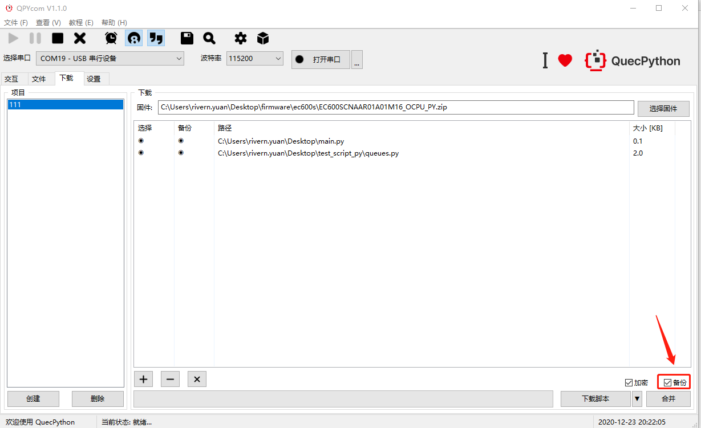

### Q_Multi_DL工具

Q_Multi_DL移远通信提供给客户的多口下载工具，支持一拖多下载，有关详细信息，参见《Quectel_QMulti_DL\_用户指导》。

## 产线下载方案

QuecPython量产固件包包括三个部分：系统镜像文件，客户脚本/配置文件镜像和客户脚本/配置备份文件镜像。

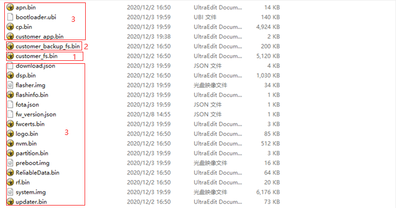

在上图中，标有数字1的*customer_fs.bin*代表客户脚本/配置文件的镜像；标有数字2的*customer_backup_fs.bin*表示客户脚本/配置备份文件的镜像；标有数字3的其他文件代表系统镜像文件。

### 支持QuecPython运行环境的固件

用户可以从移远通信提供的SDK中获取固件包，然后通过QPYcom工具将其下载到模块中，以生成量产固件。当前，对于EC100Y-CN，最新固件版本是V09；对于EC600S-CN，最新固件版本为V03。

### 包含客户脚本/配置文件的镜像

*customer_fs.bin*由QPYcom工具生成，在下载界面选择要合并的脚本/配置文件点击合并按钮生成*customer_fs.bin*。

### 包含客户脚本/配置文件备份的镜像

*customer_backup_fs.bin*为客户脚本/配置文件备份镜像，由QPYcom工具生成。脚本如需备份，需要在QPYcom工具的下载界面中勾选备份选项，文件合成后，在合成时会在*customer_backup_fs*中放置相应文件的备份。若*customer_fs*中的文件发生损坏或者丢失，会从备份区还原成工厂版本。

用户在工具下载页面选择固件和脚本，勾选备份按钮开启备份还原机制，再选择需要备份的文件，当勾选了备份按钮时点击合并按钮会生成*checksum.json*文件，包含需要备份的文件名和文件名的sha256值，连同需要备份的文件一起生成*customer_backup_fs.bin*。选中需要合并入固件的文件会连同checksum.json文件生成customer_fs.bin。备份方式与现有合并方式一致，对固件进行解压后重新生成*customer_backup_fs.bin*和*customer_fs.bin*替换原有的镜像再重新压缩生成量产文件。

## 产线下载流程

### 使用QPYcom生成量产固件包

**步骤1**：进入在QPYcom工具的“**下载**”页面，点击左下角“**创建**”按钮创建一个项目名称，根据提示创建固件下载项目。

**步骤2**：选择对应项目后点击页面右侧“**选择固件**”选择要合并的固件。

**步骤3**：点击页面下方的按钮“**+**”，选择要合并的文件和需要备份的文件。注意，选择需要备份的文件后，可通过勾选“**加密**”和“**备份**”按钮来实现Python脚本加密和文件备份。

**步骤4**：点击“**合并**”按钮生成量产文件，合并完成后会弹出“合并处理完成”窗口。

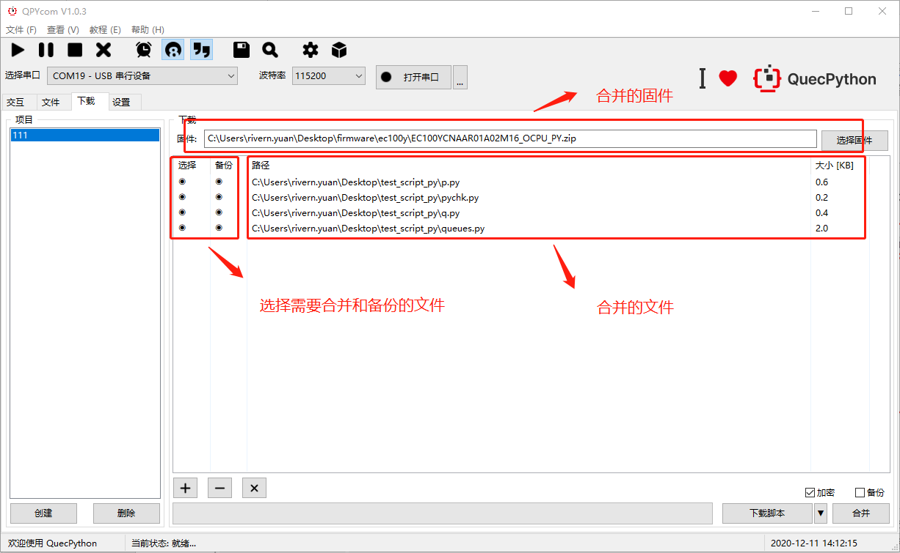

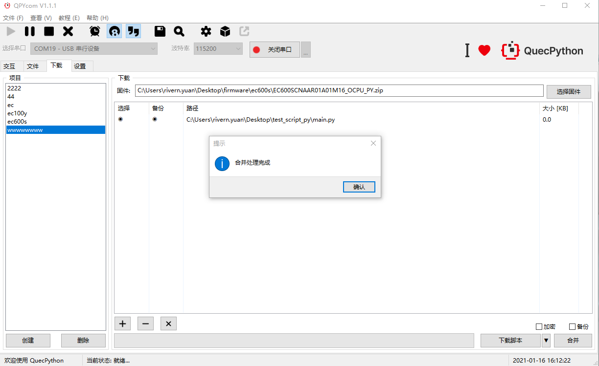

### 使用Q_Multi_DL多口下载工具下载

生成量产固件包后，通过Q_Multi_DL多口下载工具将生成的固件包下载到模块，具体步骤如下：

```
备注：使用Q_Multi_DL工具前，需安装相应USB驱动。 
```

**步骤1**：打开Q_Multi_DL工具，点击“**Load FW Files**”按钮。

**步骤2**：选择需要下载到模块的的固件包文件，文件后缀为.zip，固件的存储路径不能有空格，否则可能导致升级失败，推荐使用英文字符。将模块与电脑连接，自动加载下载端口。

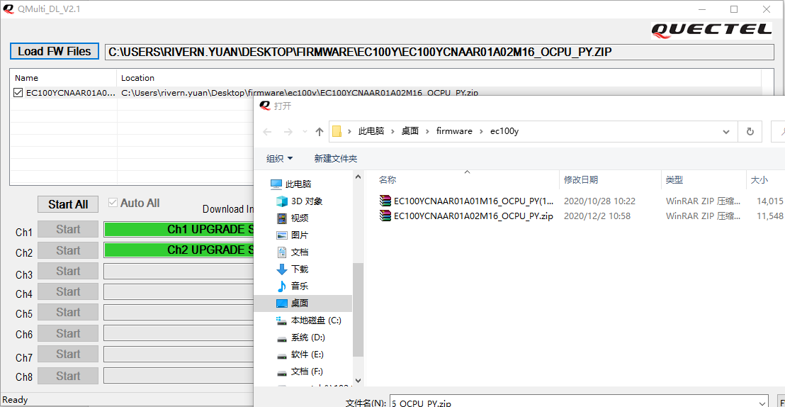

**步骤3**：下载端口加载完成后，工具将自动识别下载端口，如下图。

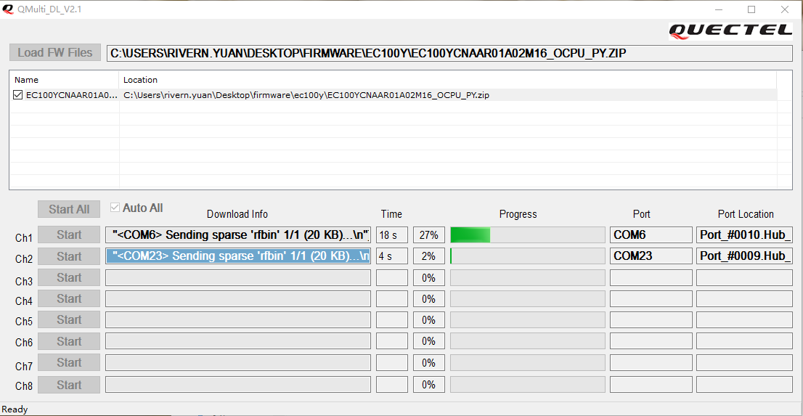

**步骤4**：升级固件。

不勾选“**Auto All**”按钮可进行手动升级。文件和端口成功加载后，单击“**Start**”按钮，或者直接单击“**Auto All**”按钮升级固件。

EC100Y-CN模块的升级，选择固件包后，只支持“AutoAll”模式，即开机后模块自动升级，无需点击“**Start**”按钮。连接模块后，开始自动升级，升级成功后，将显示以下界面：

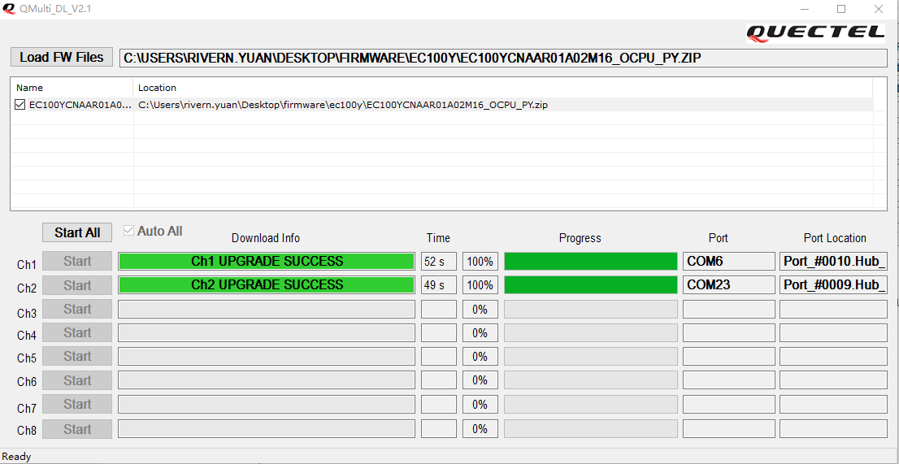

## 异常处理

### AT口与USB串口未识别

检查串口驱动是否安装。若安装了驱动，设备管理器界面将显示如下：

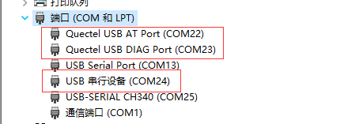

### Windows 7安装USB驱动命令交互串口未识别

**现象**：

安装EC100Y-CN模块所需SDK包中的驱动Quectel_ASR_Series_UMTS&LTE_Windows_USB_Driver_Customer_V1.0.3.zip后，出现Windows7下未正常识别出模块的命令交互串口。

**原因**：

Windows7下无法使用Microsoft的USB串行设备驱动程序。

**解决方案**：

详见文档《EC100Y-CN\_Windows7安装USB驱动指令交互串口未识别解决方法》。

### 模块运行main.py脚本文件

**现象**：

上传py文件且文件名为*main.py*到模块后，无法任何执行指令（包括上传文件等）

**原因**：

模块在开机后会自动寻找运行文件名为*main.py*的脚本文件，如果*main.py*中存在*while*、*for(,,)*这种循环语句，会导致程序阻塞，串口被占用，无法进行其他操作。

**解决方案**：

目前版本只能通过重刷固件解决此问题，建议在测试阶段尽量不要使用*main.py*作为入口文件，可使用*start.py*或其它命名来手动拉起项目，避免重刷固件。

### 生成量产文件失败

先检查要合并的文件列表中是否存在*main.py*，且*main.py*中是否有如下两个全局变量：

-   PROJECT_NAME (str)

-   PROJECT_VERSION (str)

可通过弹窗提示判断错误原因，再确认合并的固件包完整性。

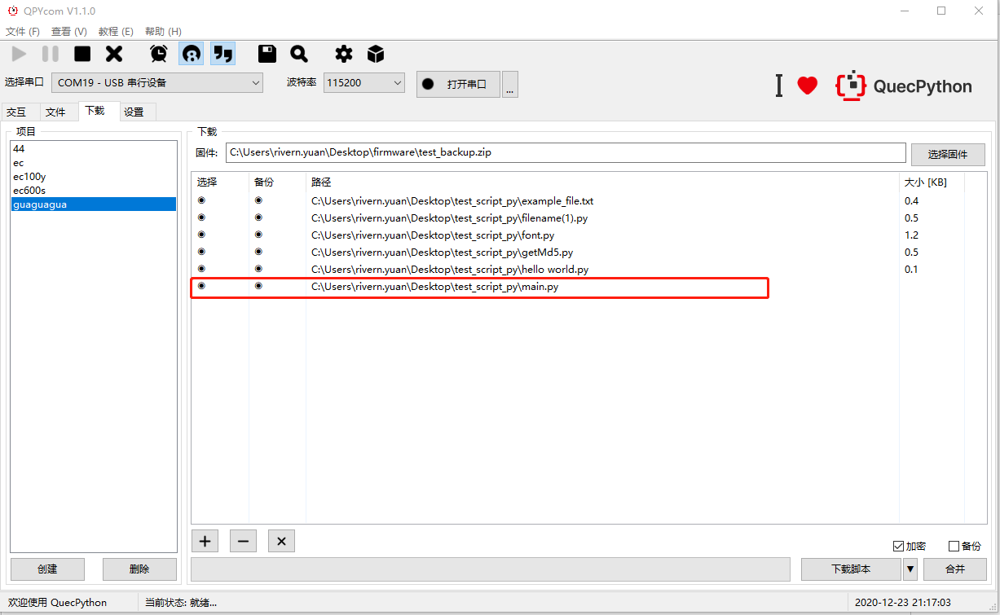

## 附录A参考文档及术语缩写

表1：参考文档

| **序号** | **文档名称**                                            | **备注**                                     |
|----------|---------------------------------------------------------|-----------------------------------------------|
| [1]      | Quectel QuecPython_QPYcom_用户指导                     | QPYcom工具使用说明                            |
| [2]      | Quectel_QMulti_DL_用户指导                             | QMulti_DL工具使用说明                         |
| [3]      | EC100Y-CN_Windows7安装USB驱动指令交互串口未识别解决方法 | Windows7安装USB驱动指令交互串口未识别解决方法 |

表2：术语缩写

| **术语** | **英文全称**             | **中文全称**   |
|----------|--------------------------|----------------|
| USB      | Universal Serial Bus     | 通用串行总线   |
| SDK      | Software Development Kit | 软件开发工具包 |

# QuecPython 产品开发及量产方案

本文档主要介绍QuecPython 产品开发及量产方案。

本文档适用于移远通信如下模块：

- EC100Y-CN

- EC600S-CN


## 代码保护

登录官方网站“[资源下载](https://python.quectel.com/download)”，在**“工具”**栏中找到【QPYcom 图形化工具】

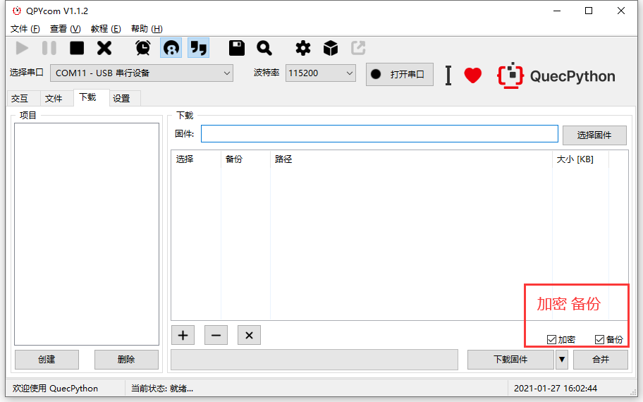

打开QPYcom工具后，在**“下载”**选项中有【加密】【备份】的选项。加密功能用于保护用户的APP代码，解密后使源代码被掩盖；备份功能用于投入市场后，若APP意外丢失、被改写等，可从备份区恢复。

## 源码合并

合并源码后，用户在生产时，只需烧录一次固件即可完成生产，在合并时已经将用户的APP文件嵌入到固件中，因此烧录合并后的固件已经包含了用户的APP文件。

### 合并条件

1、合并的*.py*文件中必须包含*main.py*代码。

2、*main.py*代码中必须包含以下两行语句：

​		PROJECT_NAME = 'QUEC_TEST'  # 必须要有这行代码才能合并

​		PROJECT_VERSION = '1.0.0'  # 必须要有这行代码才能合并

**注意：**

在合并的所有*.py*文件中，*main.py*作为程序入口文件，工具自动不对其加密，故写代码时，从*main.py*调用其他文件的接口更加安全。

### 示例工程

*main.py*文件：

```python
from usr import user_file  # 用户的.py文件放在usr路径下，要用 from usr 导入APP
import utime


PROJECT_NAME = 'QUEC_TEST'  # 必须要有这行代码才能合并
PROJECT_VERSION = '1.0.0'  # 必须要有这行代码才能合并


if __name__ == "__main__":  # 标准写法，从main.py开始执行
    while True:
        user_file.Qprint()
        user_file.Qlistdir()
        utime.sleep_ms(300)

```

*user_file.py*文件：

```python
import uos


def Qprint():
    print('Hello World !')


def Qlistdir():
    print(uos.listdir('/usr'))

```

将以上*main.py* 和*user_file.py*两个文件添加到要合并的*.py*中。固件建议使用官网发布的最新版本：“资源下载”---“资源”---“下载”中找到对应的固件 。

合并后的固件存放在用户指定的路径下，如《QUEC_TEST_1.0.0.zip》文件，文件名由*mian.py*中的变量**PROJECT_NAME**、**PROJECT_VERSION**组合而成。

**注意：**

合并要和模组交互操作，故合并时需要连接模块，打开QuecPython的交互串口，并保证没有程序在运行，即能正常交互，方能合并：

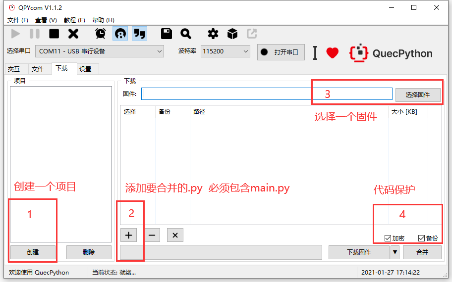

仅需几秒钟，即可完成合并：

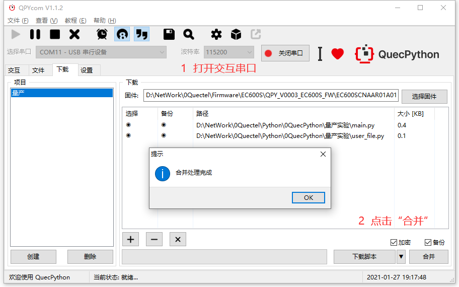

烧录合并后的固件，开机自动运行*main.py*：

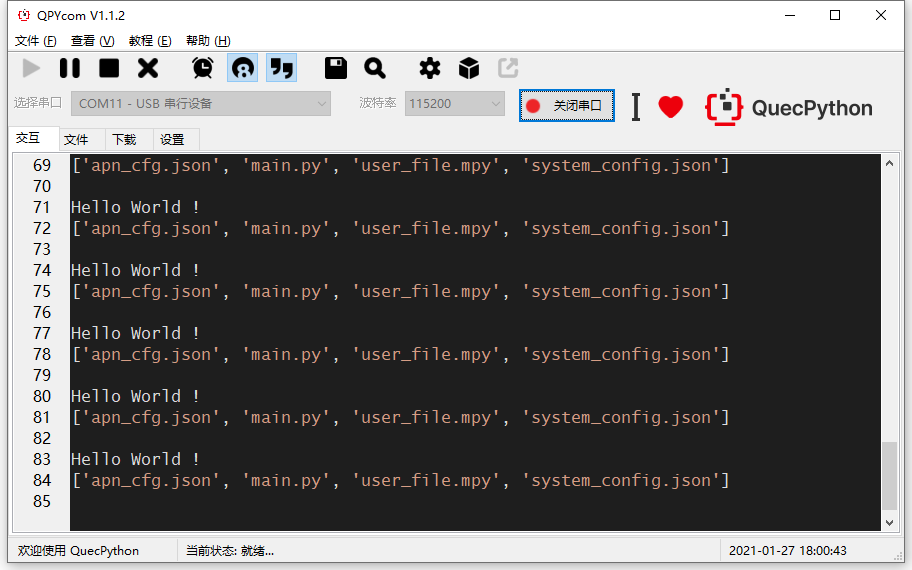

## 量产工具

登录官方网站“[资源下载](https://python.quectel.com/download)”，在**“工具”**栏目中找到【QMulti 批量下载工具】

打开软件后，在**“Load FW Files”**中选择上面合并后的固件，点击**“Auto ALL”**后，即自动检测8个通道直至烧录完毕。

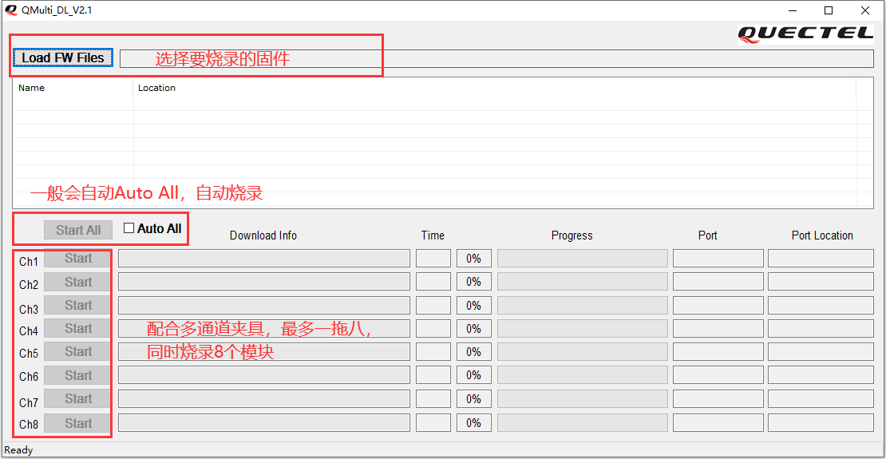

1、夹具通过USB先接入电脑。

2、在电脑打开QMulti 批量下载工具，并选择要烧录的固件，随后软件会自动检测烧录。

3、只要夹具中的任意一个通信有模块接通电源，就会自动烧录。

**注意：**

烧录失败，意外终止时，只需要模块重新上电即可继续烧录。

## 下载配套代码

 <a href="zh-cn/QuecPythonMP/code/main.zip" target="_blank">下载配套代码模板</a>

 <a href="zh-cn/QuecPythonMP/code/fota.zip" target="_blank">下载差分包生成教程和工具</a>

