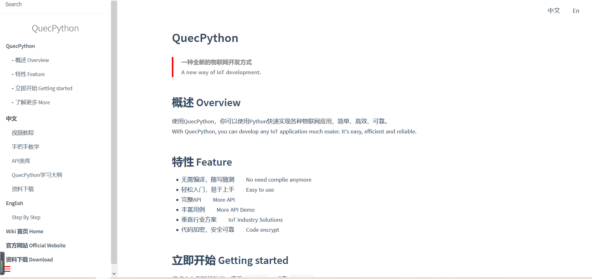
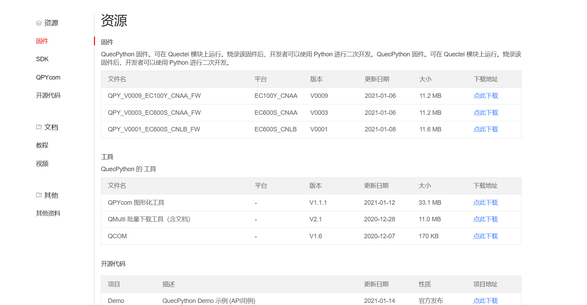
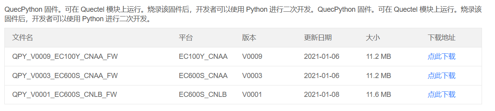
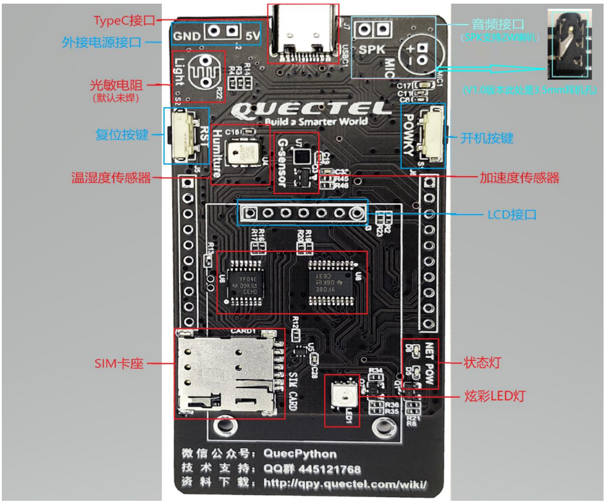
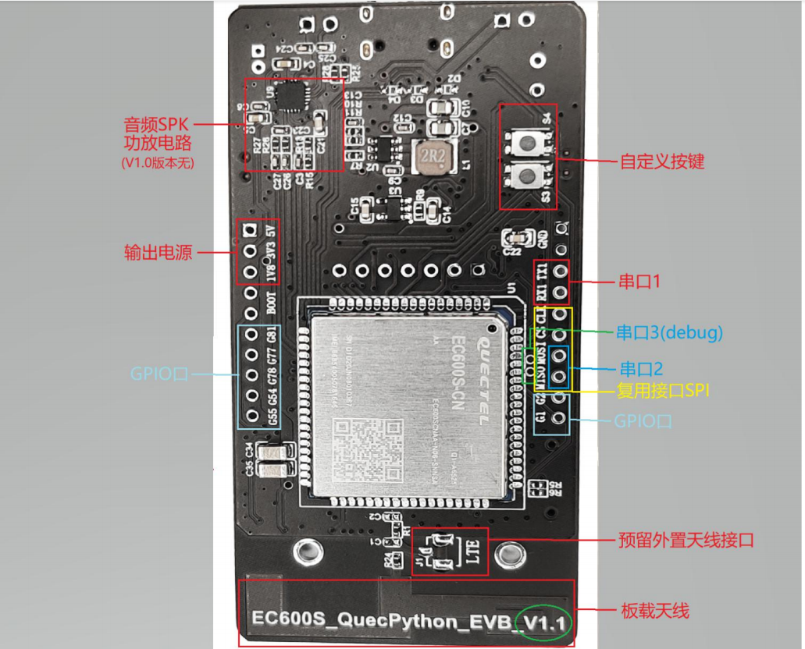
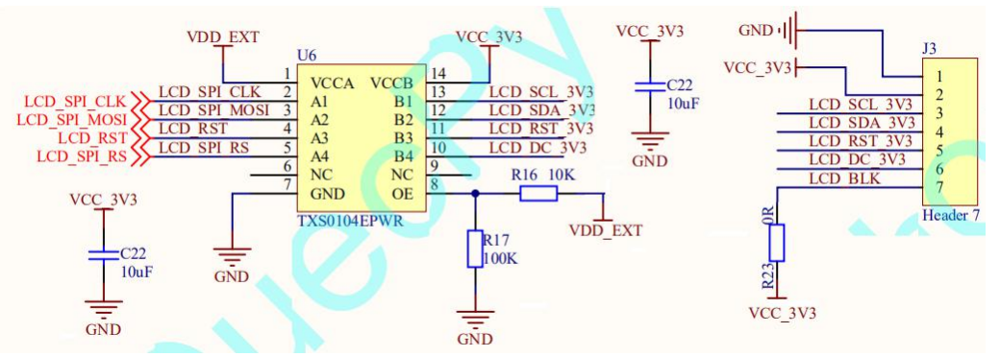
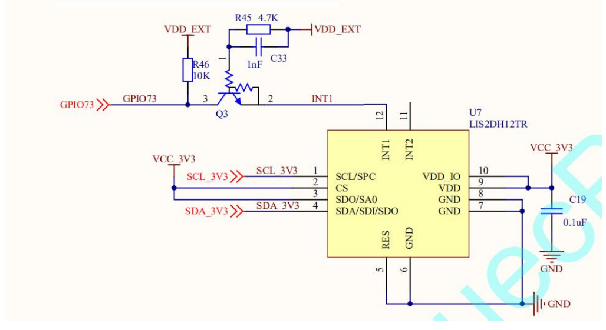
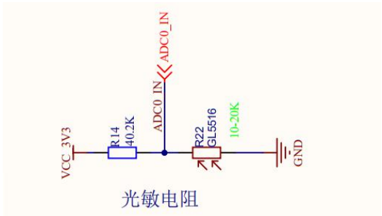
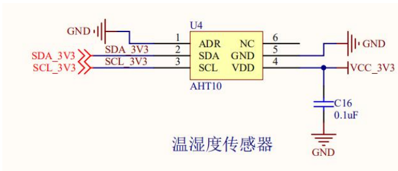
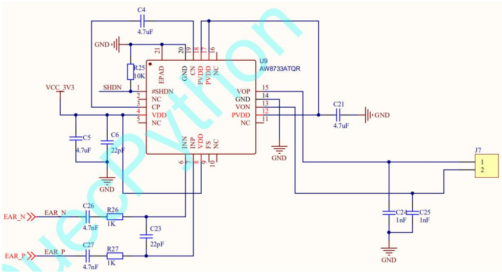

# QuecPython 开发准备

## QuecPython官网介绍及开发资源获取

### 官网介绍

**官网地址： https://python.quectel.com/**

**官网wiki地址：https://python.quectel.com/wiki/#/**

### 开发资源下载

获取开发资源下载地址：https://python.quectel.com/download

## 初识QuecPython开发板

### QuecPython目前支持的平台

**CAT1/CATM/NB**

本文以EC600S_QuecPython_EVB为例进行介绍。

### 开发板介绍

EC600S_QuecPython_EVB_V1.1是专为 EC600S QuecPython开发而设计的一款开发板，其上集成了EC600S-CN 模块、板载 PCB 天线、音频接口、TypeC 接口、NANO SIM 卡座、自定义 KEY、LED 灯、LCD 接口，加速度传感器、温湿度传感器、光敏电阻等开发常用的配置，可以满足开发者的一般开发需求。

### 开发板硬件接口正面

------

### 开发板硬件接口背面

------

### 外设资源库

#### LCD 接口

EC600S_QuecPython_EVB_V1.1开发板集成了 LCD 接口，可以通过 SPI 协议来点亮 LCD 屏幕，其电 路 图 如 下 图 所 示 。QuecPython已 经 适 配 过color_lcd_spi_gc9305 、color_lcd_spi_hx8347、color_std_spi_st7789 和 mono_lcd_spi_st7567，购买开发板时可以选配一块 ST7789 驱动的 1.4 寸彩屏转接板。

#### 加速度传感器

EC600S_QuecPython_EVB_V1.1 开发板集成了三轴加速度传感器，型号为 ST 公司的 LIS2DH12TR。 三轴加速度传感器是基于加速度的基本原理实现工作，具有体积小和重量轻特点。其电路图如下图所示：

#### 光敏电阻

EC600S_QuecPython_EVB_V1.1开发板集成了光敏电阻，型号为 JCHL的GL5516。光敏电阻是用硫化镉或硒化镉等半导体材料制成的特殊电阻器，其工作原理是基于内光电效应。光照愈强，阻值就愈低，随着光照强度的升高，电阻值迅速降低，亮电阻值可小至 1KΩ以下。光敏电阻对光线十分敏感，其在无光照时，高阻状态，暗电阻一般可达1.5MΩ。其电路图如下图所示： 

#### **温湿度传感器** 

EC600S_QuecPython_EVB_V1.1 开发板集成了温湿度传感器，型号为ASAIR的AHT10。温湿度传感器多以温湿度一体式的探头作为测温元件，将温度和湿度信号采集出来，经过稳压滤波、运算放大、非线性校正、V/I 转换、恒流及反向保护等电路处理后，转换成与温度和湿度成线性关系的电流信号或电压信号输出， 也可以直接通过主控芯片进行 485 或 232 等接口输出。其电路图如下图所示：

#### 音箱功率放大器

EC600S_QuecPython_EVB_V1.1 开发板为了满足部分开发者的需求，集成了音响功率放大器，型号为 AWINIC 公司 AW8733ATQR。AW8733ATQR 是一款具有超强 TDD 抑制、超大音量、防破音、超低 EMI、K 类音响功率放大器，输出功率 2.0W。 

#### 自定义按键

EC600S_QuecPython_EVB_V1.1 开发板集成了 2 个自定义 KEY，开发者可以自行开发定义功能。

## QuecPython 开发环境搭建

### 串口驱动安装

在提供的软件工具中，找到如下驱动安装包，进行解压，双击运行 setup.exe 直接安装即可，安装完成点击Finish 即可完成安装： 

驱动安装完成后，插上开发板，进入电脑的设备管理器，点击【端口(COM 和 LPT)】，将出现如下三个端口（实际显示的端口号可能与下图中不一致，但是括号前的名称是一致的）：

打开软件工具中的 QCOM 软件，通过发送一条 AT 指令，确认驱动是否安装成功，如下图所示，如果能正常发送 AT 指令并回复成功，那么驱动安装成功；注意端口号要选择与【Quectel USB AT Port】对应的端口号，波特率选择115200，停止位 1 位，无奇偶校验，8 位数据位，无硬件控制流。 

### QPYcom串口工具

该工具的主要功能：

1. QuecPython固件下载
2. 用户Python代码下载运行
3. 用户python代码交互
4. 用户产品量产文件打包

从该地址https://python.quectel.com/download下载最新的QPYcom工具，下载后解压，可参考工具docs目录下的《Quectel_QuecPython_QPYcom_用户指导》进行工具使用。

### Python代码编辑工具

可以使用Notepad++代码编辑工具，也可以使用Pycharm这种专业的python IDE进行代码编辑。

## QuecPython APP开发流程

本文档主要介绍如何使用QuecPython开发出一个完整的APP。

适用模块：

- EC100Y-CN

- EC600S-CN

### 开发流程

- 准备好开发板，从QuecPython官网获取最新的SDK包及QPYcom下载工具。官网地址：https://python.quectel.com/;
- 从SDK包*tools*目录下获取串口驱动并安装该驱动。安装完成后在设备管理器串口中查看是否识别到了交互串口及AT串口;
- 使用QPYcom工具下载SDK包中*firmware*目录中的固件包;
- 安装代码编辑、调试工具Pycharm或者Notepad++；
- 根据产品需求，细化到所需API，参考[Quectel_QuecPython 类库API说明](https://python.quectel.com/wiki/#/zh-cn/api/)进行APP开发；
- 通过QPYcom工具下载.py脚本文件到模块中运行、调试。

------

**备注：如需进行量产产品开发，需把主程序命名为*main.py*文件。**

