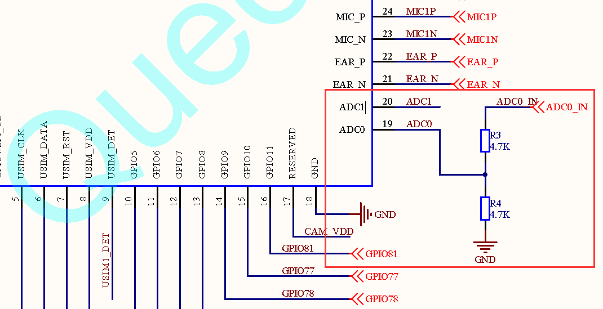
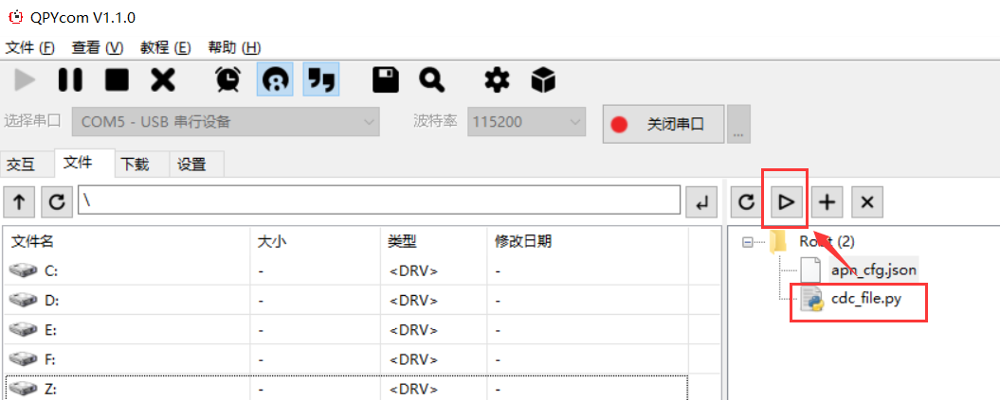

# **QuecPython  ADC采样开发使用说明**

## 硬件描述

目前开放共2路ADC，2路ADC连接位置如下表所示：



对应关系如下表：

| 模组PIN脚编号 | 说明     |
|---------------|----------|
| 19            | ADC通道0 |
| 20            | ADC通道1 |

## 软件设计

### 常量说明

| 常量     | 说明     |
|----------|----------|
| ADC.ADC0 | ADC通道0 |
| ADC.ADC1 | ADC通道1 |

### 创建ADC对象

adc = ADC()：无参数，无返回值。

### ADC功能初始化

adc.open()，无参数。

返回值：成功返回整型0，失败返回整型-1。

### 读取电压值

adc.read(ADCn)：读取指定通道的电压值，单位mV。

| 参数 | 参数类型 | 参数说明                                                                           |
|------|----------|------------------------------------------------------------------------------------|
| ADCn | int      | ADC通道 注：EC600S平台支持ADC0，ADC1，对应引脚如下 ADC0 – 引脚号19 ADC1 – 引脚号20 |

### 关闭ADC

adc.close()，无参数。

返回值：成功返回整型0，失败返回整型-1。

## 交互操作

使用QPYcom工具和模组进行交互，下面实例是基于ADC0。


注意：

1.  from misc import ADC即为让ADC模块在当前空间可见。

2.  只有from misc import ADC模块，才能使用ADC内的函数和变量。

3.  上述操作是在ADC0连接了光敏电阻（EC600S开发板已外接）的情况下操作的，对于ADC1需要自己连接外设进行相应操作。

## 下载验证

### 软件代码

下载.py文件到模组运行，代码如下：

```python
from misc import ADC  # 导入ADC模块 
import utime  # 导入定时模块 
read_time = 5 # 设定读取次数 a
dc = ADC() 
while read_time:  
	adc.open()  
	read_data = adc.read(ADC.ADC0)  
	print(read_data)  
	adc.close()  
	read_time -= 1  
	utime.sleep(1)  # 延时1S
```

### 硬件连接

无需另外的硬件连接，EC600S的ADC0接口已经外接光敏电阻，本文的下载验证就是利用光敏电阻进行辅助验证。

### 运行效果

1. 打开QPYcom运行adc_file.py（运行同时保证光敏电阻接收不同程度的光照），如下图：

   

   

2.  在QPYcom交互界面查看输出结果（数值会有所不同）


## 配套代码

<!-- * [下载代码](code/adc_file.py)  -->

 <a href="zh-cn/QuecPythonSub/code/adc_file.py" target="_blank">下载代码</a>