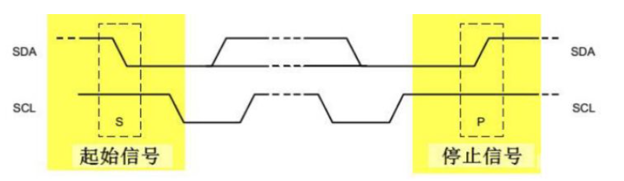

# Quecpython I2C总线开发使用说明

本文以EC600S-CN模块为例，主要介绍QuecPython I2C模块的使用。 I2C模块提供读写函数操作函数。包含的API有：

- **I2C(I2Cn, MODE)**
- **I2C.read(slaveaddress, addr,addr_len, r_data, datalen, delay)**
- **I2C.write(slaveaddress, addr, addr_len, data, datalen)**

具体的API 详解请参考 [QuecPython-machine - 硬件相关功能-I2C](https://python.quectel.com/wiki/api/#i2c)

本文档适用于移远通信如下模块：

- EC100Y-CN
- EC600S-CN


## I2C简介

I2C是一个支持设备的总线。“总线”指多个设备共用的信号线。在一个I2C通讯总线中，可连接多个I2C通讯设备，支持多个通讯主机及多个通讯从机。一个I2C总线只使用两条总线线路：一条双向串行数据线（SDA）、一条串行时钟线（SCL）。数据线即用来表示数据，时钟线用于数据收发同步。

每个连接到总线的设备都有一个独立的地址，主机可以利用这个地址进行不同设备之间的访问。

总线通过上拉电阻接到电源。当I2C设备空闲时，会输出高阻态，而当所有设备都空闲，都输出高阻态时，由上拉电阻把总线拉成高电平。

多个主机同时使用总线时，为了防止数据冲突，会利用仲裁方式决定由哪个设备占用总线。

I2C具有三种传输模式：标准模式传输速率为100Kbit/秒、快速模式为400Kbit/秒、高速模式下传输速率可达3.4Mbit/秒，但目前大多数I2C设备尚不支持高速模式。


## I2C协议层

以主机向从机写数据为例，其基本结构如图所示，依次为：

**起始信号——从机地址——读写信号——数据位——应答位——… … ——停止位**


- 起始信号（S）：当 SCL 为高电平时，SDA 线从高电平向低电平切换；
- 停止信号（P）：当 SCL 是高电平时，SDA 线由低电平向高电平切换。




帧地址：I2C总线上的每个设备都有自己的独立地址，主机发起通讯时，通过SDA信号线发送设备地址（SLAVE_ADDRESS）来查找从机。I2C协议规定设备地址可以是7位或10位，实际中7位的地址应用比较广泛。

I2C使用SDA信号线来传输数据，使用SCL信号线进行数据同步。SDA数据线在SCL的每个时钟周期传输一位数据。传输时，SCL为高电平的时候SDA表示的数据有效，即此时的SDA为高电平时表示数据“1”，为低电平时表示数据“0”。当SCL为低电平时，SDA的数据无效，一般在这个时候SDA进行电平切换，为下一次表示数据做好准备。

I2C的数据和地址传输都带响应。响应包括“应答（ACK）”和“非应答（NACK）”两种信号。

作为数据接收端时，当设备（无论主从机）接收到I2C传输的一个字节数据或地址后，若希望对方继续发送数据，则需要向对方发送“应答（ACK）”信号，发送方会继续发送下一个数据；若接收端希望结束数据传输，则向对方发送“非应答（NACK）”信号，发送方接收到该信号后会产生一个停止信号，结束信号传输。


## 功能展示

我们使用EC600S-CN 开发板， 读写板载加速度传感器寄存器。


### 确定从机地址

详情请参考[EC600S_QuecPython_EVB_V1.1_SCH](https://python.quectel.com/file/Res/EC600S_QuecPython_EVB_V1.1_SCH.pdf)原理图。

传感器型号为 LIS2DH12TR。 您可以参阅LIS2DH12 数据手册（[lis2dh12 datasheet](https://www.stmicroelectronics.com.cn/resource/en/datasheet/lis2dh12.pdf)）了解详情。


与LIS2DH12关联的从机地址（SAD）是001100xb，SDO/SA0焊盘可以用于修改设备地址的低位。如果连接了SA0连接电源，LSb为“1” （地址0011001b），否则如果SA0焊盘连接到地线，LSb值为“0”（地址0011000b），可以确定 SDO/SA0  引脚为高电平。 进而计算出从机地址为**0x19**。


### 实验代码

 ```python
from machine import I2C
'''
I2C使用示例 
'''

# 参考 http://qpy.quectel.com/wiki/#/zh-cn/api/?id=i2c
# 设置日志输出级别


def test_i2c():
    i2c_dev = I2C(I2C.I2C1, I2C.STANDARD_MODE)
    addres = 0x19
    LIS2DH12_WHO_AM_I = 0x0F  # 板载三轴加速度传感器 身份寄存器
    r_data = bytearray([0x00])  # 存储数据
    i2c_dev.read(addres, bytearray(LIS2DH12_WHO_AM_I), 1,
                 r_data, 1, 1)
    print("read data lis2dh12 who_am_i reg 0x{0:02x}".format(list(r_data)[0]))
    # 读写寄存器
    LIS2DH12_CTRL_REG2 = 0x21  #
    w_data = [0x04]  # 想要写的数据
    print("write 0x04 to 0x21")
    i2c_dev.write(addres, bytearray(LIS2DH12_CTRL_REG2), 1,
                  bytearray(w_data), len(w_data))
    i2c_dev.read(addres, bytearray(LIS2DH12_CTRL_REG2), 1,
                 r_data, 1, 1)
    print("read 0x{0:02x} from 0x{1:02x}".format(
        list(r_data)[0], LIS2DH12_CTRL_REG2))
    print("test_i2c funcation has exited")
    pass


if __name__ == "__main__":
    test_i2c()

 ```

## 配套代码


<!-- * [下载代码](code/i2c_base.py)  -->

 <a href="zh-cn/QuecPythonSub/code/i2c_base.py" target="_blank">下载代码</a>