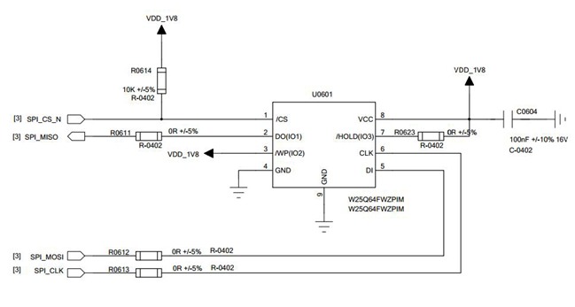
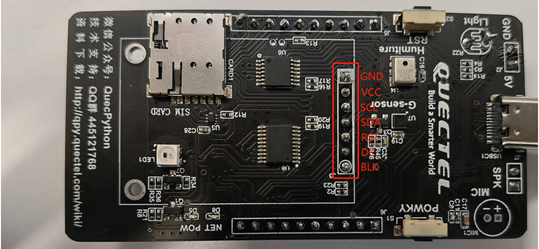
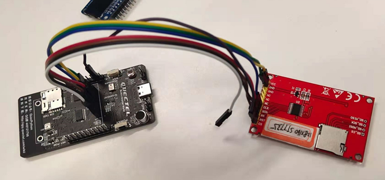
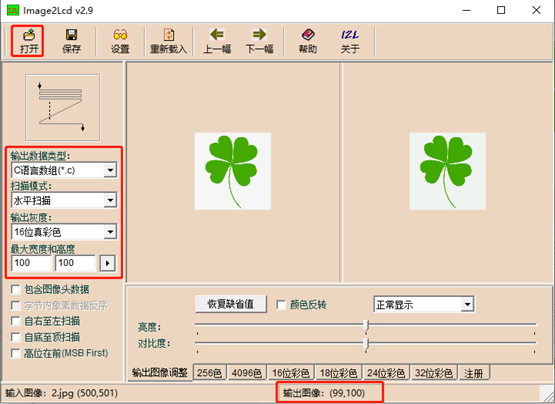
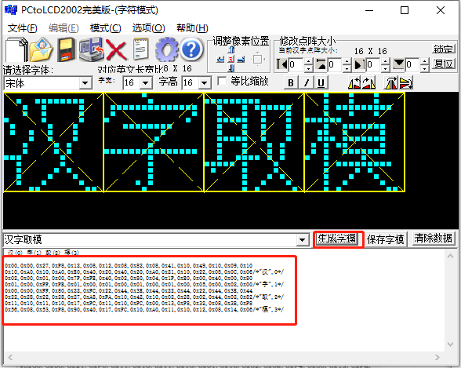
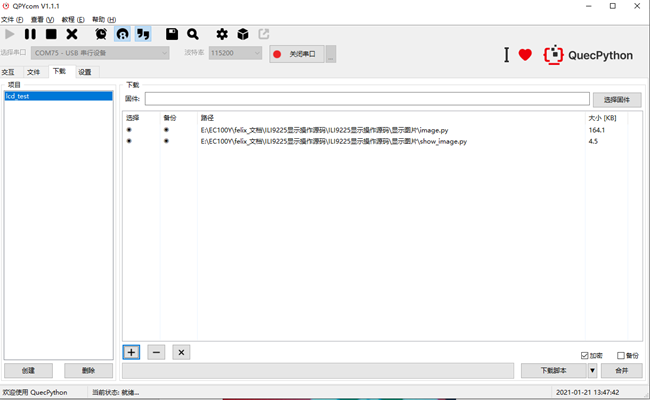
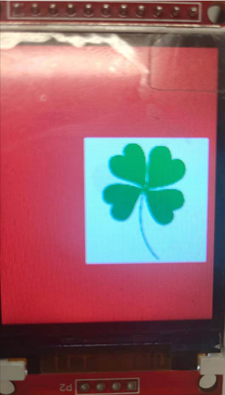
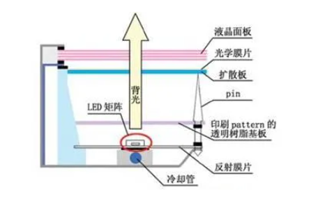

# QuecPython LCD调试流程

SPI是串行外设接口(Serial Peripheral Interface)的缩写。SPI，是一种高速的，全双工，同步的通信总线，并且在芯片的管脚上只占用四根线，节约了芯片的管脚，同时为PCB的布局上节省空间，提供方便，正是出于这种简单易用的特性。

TFT液晶屏为每个像素都设有一个半导体开关，其加工工艺类似于大规模集成电路。由于每个像素都可以通过点脉冲直接控制，因而，每个节点都相对独立，并可以进行连续控制，这样的设计不仅提高了显示屏的反应速度，同时可以精确控制显示灰度，所以TFT液晶的色彩更逼真。

SPI屏幕结合了SPI和TFT屏幕的双重特点，可以使用最少 5 根线来实现CPU对屏幕的控制，它具备占用端口少，刷屏速度适中等特点，可以灵活显示简单字符、汉子、图片等，适用于各种对速度要求不太高的显示场景下。

## QuecPython下SPI屏幕添加

SPI屏幕通常包括 1 块TFT显示屏、 1 个控制芯片（本文使用的是ILI9341）和一个AD芯片（触摸用，可不用），CPU通过SPI总线+2根GPIO线来控制屏幕显示。用户选择控制器芯片不同和GPIO不同，通常需要修改SPI设备驱动的lcd操作部分和GPIO选择引脚部分。

### 硬件连接

EC600S和EC100Y上有专门处理LCD的SPI外设。



以EC600S_QuecPython_EVB_V1.1开发板为例




SPI屏幕通常需要 3 根电源线和 5 根通信线， 3 根电源线包括 1 根地线GND、 1 根控制器电源线VCC和 1 根背光线LED，通信线包括 1 根REST线（复位SPI屏幕控制器，连接到CPU的GPIO线）、 1 根RS线（有的叫D/C线，辨别传输的时数据还是命令，连接到CPU的GPIO线，）、三根spi线（屏幕CLK线链接CPU SPI的CLK、SDI连接CPU SPI的MOSI线、CS线连接CPU SPI的CS线）。

**注意：**CPU对SPI屏幕通常不需要读，因此不需要连接屏幕SDO线。



​																						图 3 ： EC600S_QuecPython_EVB_V1.1实物接线图

### QuecPython下SPI屏幕的软件设计

SPI屏幕设备的片选需要不选中时为高，选中时为低。由于EC600S_QuecPython_EVB_V1.1目前硬件缺陷（CS管脚未引出），用户可用普通gpio口代替。只需上电后将CS拉高后拉低即可。设计时需要了解quecpython lcd的api。详细参考https://python.quectel.com/wiki/api/#lcd。

由于quecpython下LCD的相关api已经开发好，用户可以直接依照api格式，编写spi屏幕驱动。

### 前期准备工作

确定使用的spi屏幕，仔细阅读其datasheet,原理图和驱动IC的技术手册。了解屏幕的特性，确定好屏幕的初始化参数（分辨率，颜色深度，spi时钟等）和必要的控制命令（例如：亮屏，息屏，设置显示区域,背光设置等）。

查看移远QuecPython LCD相关资料 ：https://python.quectel.com/wiki/api/#lcd（LCD API说明）

### 开始编写python脚本代码

1.创建LCD对象

```
from machine import LCD
lcd = LCD()
```
2.编写初始化参数
此部分比较容易出错且比较重要，请重点关注。
参数格式如下所示：
		type + len + value
		Type: 0:cmd 1:data 2:delay
				Len: 若type为cmd: len表示后面接多少个data
				若type为data: len表示data的长度
				若type为delay: len无实际意义。为 0 即可
				Value: 对应值
				若type为delay：表示延时的时长，单位为ms。

重要点：由于lcd_init传入的是buff,需要进行bytearray转换

举例说明：

```python
init = (
0,1,0xXX, #命令，后接一个data, cmd值为0xXX
1,2,0xXX,0xXX, #数据， 数据长度为 2 ， data值为0x
2,0,120 , #延时120ms
0,2,0xXX, #命令，后接 2 个data, cmd值为0xXX
1,1,0xXX, #数据，命令的第一个data,data值为0xXX
1,2,0xXX,0xFF #数据，命令的第二个data,数据的长度为 2 ，data值为0xXXFF
...
)
init_data = bytearray(init) #将列表转换
```

3.编写display_on 命令
		由于每款LCD的亮屏命令不一样，故需要用户提供该配置参数。

​		此参数根据具体的屏幕去驱动而定

```python
display_on = (
	0,1,0xXX 	#命令，后接一个data, cmd值为0xXX
1,2,0xXX,0xYY	#数据， 数据长度为2， data值为0xXXYY
)
display_on_data = bytearray(display_on)
```

4.编写display_off 命令
		由于每款LCD的息屏命令不一样，故需要用户提供该配置参数。

   	此参数根据具体的屏幕去驱动而定

```python
display_off = (
	0,1,0xXX 	#命令，后接一个data, cmd值为0xXX
	1,2,0xXX,0xYY	#数据， 数据长度为2， data值为0xXXYY
)
display_off_data = bytearray(display_off)
```

5.编写设置显示区域的命令
		不同的lcd屏有不同的设置区域方式。 (以ili9225和st7789v为例)

​		一般屏幕设置有两种方式：

​			一：分两次写：高八位和低八位此参数根据具体的屏幕去驱动而定(如st7789v)

​			二：一次写一个short （如ili9225）

```python
XSTART_H = 0xf0 	#代表X起始坐标 高八位 （以此值写入，底层会识别该位是x坐标的高八位）
XSTART_L = 0xf1	#代表X起始坐标 低八位 （以此值写入，底层会识别该位是x坐标的低八位）
YSTART_H = 0xf2	#代表Y起始坐标的高八位
YSTART_L = 0xf3	#代表Y起始坐标的低八位
XEND_H = 0xE0		#代表X结束坐标的高八位
XEND_L = 0xE1		#代表X结束坐标的低八位
YEND_H = 0xE2		#代表Y结束坐标的高八位
YEND_L = 0xE3		#代表Y结束坐标的低八位

XSTART = 0xD0		#代表X的起始坐标
XEND = 0xD1		#代表X的结束坐标
YSTART = 0xD2		#代表Y的起始坐标
YEND = 0xD3		#代表Y的结束坐标

ili9225_invalid = (
0,1,0x36,
1,2,XEND,
0,1,0x37,
1,2,XSTART,
0,1,0x38,
1,2,YEND,
0,1,0x39,
1,2,YSTART,
0,1,0x20,
1,2,XSTART,
0,1,0x21,
1,2,YSTART,
0,1,0x22,
)
st7789_invalid = (
0,4,0x2a,
1,1,XSTART_H,
1,1,XSTART_L,
1,1,XEND_H,
1,1,XEND_L,
0,4,0x2b,
1,1,YSTART_H,
1,1,YSTART_L,
1,1,YEND_H,
1,1,YEND_L,
0,0,0x2c,
)
invalid_data = bytearray(invalid)

```

6.编写屏幕背光命令
		不同的lcd屏有不同的设置背光方式。有些屏通过控制寄存器调节背光，有些屏通过背光控制管脚控制背光。

​		当由背光控制管脚控制背光时，此处可以不需要，init中该部分填入None即可。

```python
LIGHT_VALUE = 0xFE		#代表背光设置位置
light = (
    0,1,0xXX 			#命令，后接一个data, cmd值为0xXX
	1,1,LIGHT_VALUE，
)
light_data = bytearray(light)
```

7.初始化配置
		按lcd_init参数依次填入。

```
lcd.lcd_init(init_data,width,hight,clk,data_line,line_num,type,invalid_data,display_on_data,display_off_data,light_data/None)

init_data:（1）中，配置的初始化参数
width：屏幕宽度
hight: 屏幕高度
data_line：  数据线
line_num：  线
type：     0:rgb 1:fstn(黑白屏)
lcd_invalid： 区域写屏，设置范围
display_on： 亮屏参数
display_off:  息屏参数
display_light:  亮屏参数，若为None:表示LCD亮度由IO口控制
```

8.清屏
		lcd.lcd_clear(0xXXXX)

9.区域写屏

```python
test_buf = (
0x00,0x1f,0x00,0x1f,0x00,0x1f,0x00,0x1f,0x00,0x1f,0x00,0x1f,0x00,0x1f,0x00,0x1f,0x00,0x1f,0x00,0x1f,
0x00,0x1f,0x00,0x1f,0x00,0x1f,0x00,0x1f,0x00,0x1f,0x00,0x1f,0x00,0x1f,0x00,0x1f,0x00,0x1f,0x00,0x1f,
0x00,0x1f,0x00,0x1f,0x00,0x1f,0x00,0x1f,0x00,0x1f,0x00,0x1f,0x00,0x1f,0x00,0x1f,0x00,0x1f,0x00,0x1f,
0x00,0x1f,0x00,0x1f,0x00,0x1f,0x00,0x1f,0x00,0x1f,0x00,0x1f,0x00,0x1f,0x00,0x1f,0x00,0x1f,0x00,0x1f,
0x00,0x1f,0x00,0x1f,0x00,0x1f,0x00,0x1f,0x00,0x1f,0x00,0x1f,0x00,0x1f,0x00,0x1f,0x00,0x1f,0x00,0x1f,
0x00,0x1f,0x00,0x1f,0x00,0x1f,0x00,0x1f,0x00,0x1f,0x00,0x1f,0x00,0x1f,0x00,0x1f,0x00,0x1f,0x00,0x1f,
0x00,0x1f,0x00,0x1f,0x00,0x1f,0x00,0x1f,0x00,0x1f,0x00,0x1f,0x00,0x1f,0x00,0x1f,0x00,0x1f,0x00,0x1f,
0x00,0x1f,0x00,0x1f,0x00,0x1f,0x00,0x1f,0x00,0x1f,0x00,0x1f,0x00,0x1f,0x00,0x1f,0x00,0x1f,0x00,0x1f,
0x00,0x1f,0x00,0x1f,0x00,0x1f,0x00,0x1f,0x00,0x1f,0x00,0x1f,0x00,0x1f,0x00,0x1f,0x00,0x1f,0x00,0x1f,
0x00,0x1f,0x00,0x1f,0x00,0x1f,0x00,0x1f,0x00,0x1f,0x00,0x1f,0x00,0x1f,0x00,0x1f,0x00,0x1f,0x00,0x1f,
0x00,0x1f,0x00,0x1f,0x00,0x1f,0x00,0x1f,0x00,0x1f,0x00,0x1f,0x00,0x1f,0x00,0x1f,0x00,0x1f,0x00,0x1f,
0x00,0x1f,0x00,0x1f,0x00,0x1f,0x00,0x1f,0x00,0x1f,0x00,0x1f,0x00,0x1f,0x00,0x1f,0x00,0x1f,0x00,0x1f,
0x00,0x1f,0x00,0x1f,0x00,0x1f,0x00,0x1f,0x00,0x1f,0x00,0x1f,0x00,0x1f,0x00,0x1f,0x00,0x1f,0x00,0x1f,
0x00,0x1f,0x00,0x1f,0x00,0x1f,0x00,0x1f,0x00,0x1f,0x00,0x1f,0x00,0x1f,0x00,0x1f,0x00,0x1f,0x00,0x1f,
0x00,0x1f,0x00,0x1f,0x00,0x1f,0x00,0x1f,0x00,0x1f,0x00,0x1f,0x00,0x1f,0x00,0x1f,0x00,0x1f,0x00,0x1f,
0x00,0x1f,0x00,0x1f,0x00,0x1f,0x00,0x1f,0x00,0x1f,0x00,0x1f,0x00,0x1f,0x00,0x1f,0x00,0x1f,0x00,0x1f,
0x00,0x1f,0x00,0x1f,0x00,0x1f,0x00,0x1f,0x00,0x1f,0x00,0x1f,0x00,0x1f,0x00,0x1f,0x00,0x1f,0x00,0x1f,
0x00,0x1f,0x00,0x1f,0x00,0x1f,0x00,0x1f,0x00,0x1f,0x00,0x1f,0x00,0x1f,0x00,0x1f,0x00,0x1f,0x00,0x1f,
0x00,0x1f,0x00,0x1f,0x00,0x1f,0x00,0x1f,0x00,0x1f,0x00,0x1f,0x00,0x1f,0x00,0x1f,0x00,0x1f,0x00,0x1f,
0x00,0x1f,0x00,0x1f,0x00,0x1f,0x00,0x1f,0x00,0x1f,0x00,0x1f,0x00,0x1f,0x00,0x1f,0x00,0x1f,0x00,0x1f,
)
test_buf1 = bytearray(test_buf)
lcd.lcd_write(test_buf1,10,10,20,20)
```


```
#注意：该接口采用低位在前
```
### 运行代码

1.将创建的py文件拷贝到模块的usr目录下；
   利用工具qpycom将文件导入模块中。具体qpycom工具操作参考
   https://python.quectel.com/wiki/#/zh-cn/QuecPythonPrepare/?id=qpycom%e4%b8%b2%e5%8f%a3%e5%b7%a5%e5%85%b7

2.进入模块的命令行模式

模组烧录固件后，连接USB会产生如下图的com口。其中USB串行设备就是我们的python终端接口。


3.键入如下指令,运行创建的py文件：

```python
import example
example.exec('usr/XXXX.py') #XXXX.py 创建的文件名
```


### 工具使用

**工具简介**

Image2Lcd 软件用于图片取模，可以提取单色和彩色图片。

PCtoLCD2002 是一款字符取模软件，可以生成汉字、英文以及标点符号的字模数据。

**如何对图片取模**

1. 打开 Image2Lcd 软件，点击【打开】按钮，选择要显示的图片；

   

2. 输出数据类型选择【C语言数组(*.c)】,扫描方式选择【水平扫描】，输出灰度一定要选择【 16 位真彩色】；

3. 设置图片的最大宽度和高度，实际输出大小以上图中最下方的【输出图像:（xx, yy）】部分显示为准

4. 点击【保存】按钮，得到图片的取模数据，将其放到元组中保存即可。
    （ 3 ） 如何对字符取模

  1. 打开 PCtoLCD2002 软件，依次点击【模式】-【字符模式(W)】；

  2. 根据需要选择字体，设置字体大小等；

     

3. 点击齿轮图标，进入如下所示界面，选择 【阴码】、【逐行式】、【顺向】、【C51格式】，点击确定；


4. 输入要取模的字符后，点击【生成字模】，即可得到对应的字模数据，按照示例 fonts.py
    文件中的格式，将字模数据保存到字典中。
    
    

**简单刷图测试**

按照2.2.4节Image2Lcd使用指导生成图片对应的图片数组。（此处以ili 9225 为例）

详细代码参考LCD小实验


将py文件导入模块的usr目录下。






## 调试注意

1. 初始化前需要一个延时（大概为10ms），使Reset稳定；（此部分在c层已经实现，python关注）
2. 如果出现花屏现象，很大的可能是总线速度问题；
3. 如果调试时发现LCD的亮度有问题，首先检查（考虑）提供给LCD的电流是否一致，再考虑调节电压。
4. 开机花屏问题，最简单的处理方式就是在INIT结束的地方增加一个刷黑屏的功能。（此部分已经在c层实现，python无需关注）
5. 如果出现花屏现象，很大的可能是总线速度问题
6. 如果图像分开显示，起始点不在原点，多半是全屏刷新起始点寄存器没有设好;


## 调试过程中的常见问题

1.背光没点亮-调试屏幕首要工作就是把背光点亮，如果没有点亮背光，屏幕就无法显示，可以按照规格书将背光点亮，或者找技术工程师帮助。



2.LCD的星星点点

在调试的时候，我们会发现LCD上有莫名其妙的星星点点。一般这种情况下，我们首先要看看VGH和VGL电压是否处于datasheet所描述的范围之内。如果属于标准范围之内，但星星点点依旧，很有可能就是时序问题。这时候不妨在代码中变更采样的时序（比如上升沿采样改为下降沿采样）。如果无法在代码中更改，也可以在clk信号线加个100R电阻，也可能解决该问题。