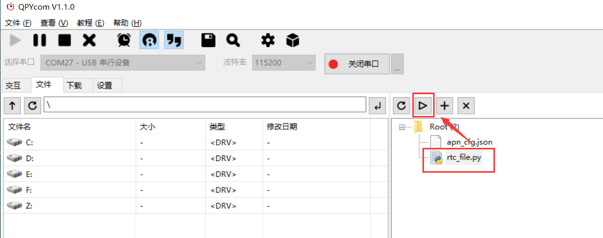

# QuecPython  RTC使用说明

## 软件设计

### 创建RTC对象

rtc = RTC()，无参数，无返回值。

### 设置RTC时间

rtc.datetime([year, month, day, week, hour, minute, second, microsecond])

带参数则可设置时间；设置时间时，参数week不参于设置，microsecond参数保留，暂未使用，默认是0。具体参数如下：

| 参数        | 类型 | 说明                                                         |
|-------------|------|--------------------------------------------------------------|
| year        | int  | 年                                                           |
| month       | int  | 月                                                           |
| day         | int  | 日                                                           |
| week        | int  | 星期，设置时间时，该参数不起作用，保留；获取时间时该参数有效 |
| hour        | int  | 时                                                           |
| minute      | int  | 分                                                           |
| second      | int  | 秒                                                           |
| microsecond | int  | 微秒，保留参数，暂未使用，设置时间时该参数写0即可            |

返回值：启动成功返回整型值0，失败返回整型值-1。

### 获取RTC时间

rtc.datetime()

不带参数时，则用于获取时间。

返回值：获取时间时，返回一个元组，包含日期时间，格式如下：[year, month, day,week, hour, minute, second, microsecond]

## 交互操作

使用QPYcom工具和模组进行交互。


注意：

1.  from machine import RTC即为让RTC模块在当前空间可见。

2.  只有from machine import RTC模块，才能使用RTC内的函数和变量。

3.  上述操作没有连接任何外设，仅作为熟悉指令参考。

## 下载验证

### 软件代码

下载.py文件到模组运行，代码如下：

```
from machine import RTC 
rtc = RTC() 
rtc_before_set = rtc.datetime() # 查询日期时间  
print(rtc_before_set) # 打印时间 
rtc.datetime([2020, 3, 12, 1, 12, 12, 12, 0]) # 设置时间 
rtc_after_set = rtc.datetime() # 查询日期时间  
print(rtc_after_set) # 打印时间 
```

### 运行效果

打开QPYcom运行rtc\_file.py，如下图：



可以在QPYcom交互界面查看输出结果：


## 配套代码

<!-- * [下载代码](code/rtc_file.py) -->
 <a href="zh-cn/QuecPythonSub/code/rtc_file.py" target="_blank">下载代码</a>