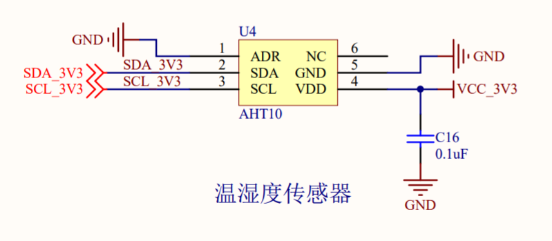
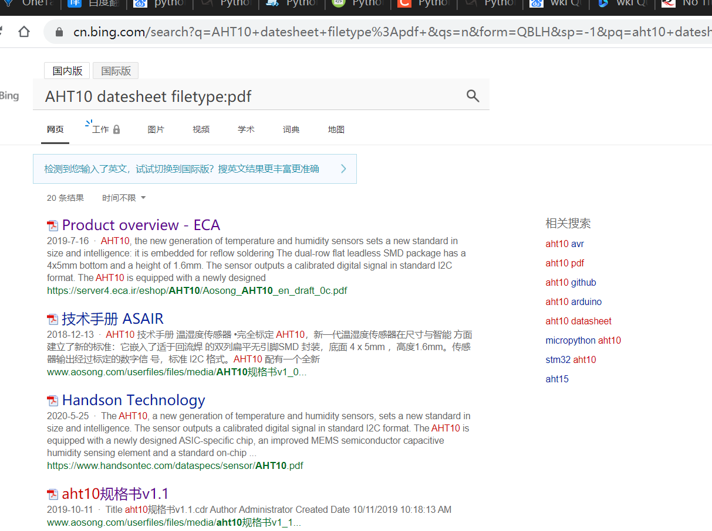
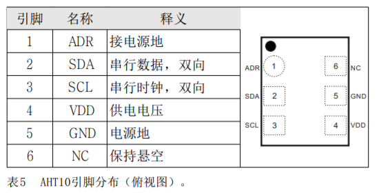
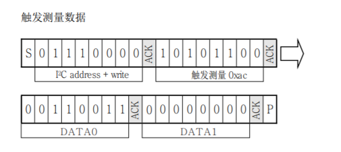
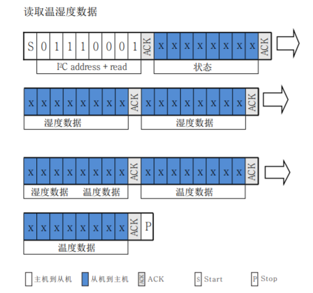

# QuecPython sensor调试流程

本文档主要介绍传感器的调试流程。本文以调试EC600S-CN V1.1 版本的板载温湿度传感器为例，介绍如何调试传感器。

本文档适用于移远通信如下模块：

- EC100Y-CN

- EC600S-CN


## 分析原理图

首先，分析原理图，确定传感器的型号，参数，引脚等配置。

打开[EC600S 开发板 原理图](https://python.quectel.com/download.html#others)。 



即可看到温湿度传感器型号为 AHT10 ,  6个引脚，且通过SDA SCL引脚和外部通信。

##  查阅数据手册

搜索关键词**AHT10 datesheet filetype:pdf** 。找到datasheet，最终找到[aht10规格书v1.1](http://www.aosong.com/userfiles/files/media/aht10%E8%A7%84%E6%A0%BC%E4%B9%A6v1_1%EF%BC%8820191015%EF%BC%89.pdf)



查阅datasheet，即可查阅到以下基本信息。

1. AHT10，新一代温湿度传感器。
2. 数字输出，I2C接口。
3. 引脚定义，如下图所示：



如需在开发板上确定芯片的引脚序号，芯片周围有小白点的引脚即为1号引脚；引脚顺序为逆时针旋转。

## 确定数据交互

获取具体参数后，需要通过总线和传感器交互数据。关于I2C总线的详细信息，请参考 [I²C（IIC）总线协议详解—完整版](https://zhuanlan.zhihu.com/p/149364473)。

阅读数据手册，确定传感器的开发流程。以下步骤都需要在传感器上电后操作：

1. 上电后需要等待40 ms，读取温湿值之前，首先看状态字的校准使能位**Bit[3]**是否为1。若不为1，则发 送**0XE1**命令 （ 初 始 化），该命令参数有两个字节，第一个字节为**0x08**，第二个字节为**0x00**。
2. 发送触发测量命令**0xac**，该命令参数有两个字节，第一个字节为**0x33**，第二个字节为**0x00**。
3. 等待75 ms待测量完成，忙状态**Bit[7]**为 0，然后可以读取6个字节（发送**0X71**命令即可读取）。
4. 计算温湿度值。



```python
write: 0x70 0xac 0x33 0x00
```




```python
write: 0x71  
read: 6个字节
```

## 实验代码

确定了传感器的初始化以及使能命令后，执行以下代码，以使能传感器。

### 声明变量

```python
from machine import I2C
import utime as time
# 声明一个I2C 对象
i2c_dev = I2C(I2C.I2C1, I2C.STANDARD_MODE)
i2c_addre = 0x38
```

### 读写函数

```python
def read_data(length):
    r_data = [0x00 for i in range(length)]
    r_data = bytearray(r_data)
    i2c_dev.read(i2c_addre,
                 bytearray(0x00), 0x0,
                 r_data, length,
                 0)
    return list(r_data)


def write_data(data):
    i2c_dev.write(i2c_addre,
                  bytearray(0x00), 0,
                  bytearray(data), len(data))

```

### 初始化函数,触发检测函数

```python
def init():
    # 设置校准位
    write_data([0xE1, 0x08, 0x00])
    time.sleep_ms(300)  # at last 300ms


def trigger_measure():
    write_data([0xac, 0x33, 0x00])
    pass
```

### 温度转换函数

```python
def aht10_transformation_temperature(data):
    r_data = data
    #　根据数据手册的描述来转化温度
    humidity = (r_data[0] << 12) | (
        r_data[1] << 4) | ((r_data[2] & 0xF0) >> 4)
    humidity = (humidity/(1 << 20)) * 100.0
    print("current humidity is {0}%".format(humidity))
    temperature = ((r_data[2] & 0xf) << 16) | (
        r_data[3] << 8) | r_data[4]
    temperature = (temperature * 200.0 / (1 << 20)) - 50
    print("current temperature is {0}°C".format(temperature))


def read_temperature():
    r_data = read_data(6)
    print(r_data)
    aht10_transformation_temperature(r_data[1:6])
    pass
```

### 运行

```python
init()
while True:
    trigger_measure()
    time.sleep_ms(100)
    read_temperature()
    time.sleep_ms(500)
```

### 完整代码

```python
from machine import I2C
import utime as time
# 声明一个I2C 对象
i2c_dev = I2C(I2C.I2C1, I2C.STANDARD_MODE)
i2c_addre = 0x38


def read_data(length):
    r_data = [0x00 for i in range(length)]
    r_data = bytearray(r_data)
    i2c_dev.read(i2c_addre,
                 bytearray(0x00), 0x0,
                 r_data, length,
                 0)
    return list(r_data)


def write_data(data):
    i2c_dev.write(i2c_addre,
                  bytearray(0x00), 0,
                  bytearray(data), len(data))


def init():
    # 设置校准位
    write_data([0xE1, 0x08, 0x00])
    time.sleep_ms(300)  # at last 300ms


def trigger_measure():
    write_data([0xac, 0x33, 0x00])
    pass

# 温湿度转换函数


def aht10_transformation_temperature(data):
    r_data = data
    #　根据数据手册的描述来转化温度
    humidity = (r_data[0] << 12) | (
        r_data[1] << 4) | ((r_data[2] & 0xF0) >> 4)
    humidity = (humidity/(1 << 20)) * 100.0
    print("current humidity is {0}%".format(humidity))
    temperature = ((r_data[2] & 0xf) << 16) | (
        r_data[3] << 8) | r_data[4]
    temperature = (temperature * 200.0 / (1 << 20)) - 50
    print("current temperature is {0}°C".format(temperature))


def read_temperature():
    r_data = read_data(6)
    print(r_data)
    aht10_transformation_temperature(r_data[1:6])
    pass


init()
while True:
    trigger_measure()
    time.sleep_ms(100)
    read_temperature()
    time.sleep_ms(500)

```

## 配套代码

[代码下载](code/example_sensor_base.py)

