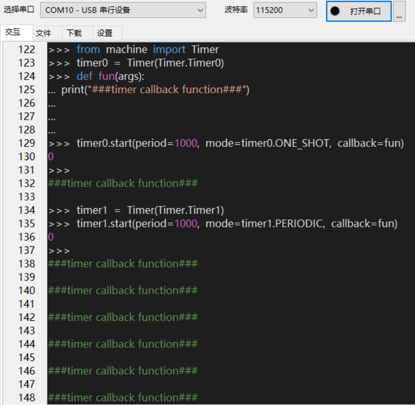

# QuecPython Timer定时器开发

文档主要基于EC600S介绍如何使用QuecPython\_Timer，定时器最常用的就是定时与计数，即可以作为精准延时处理，也可以在接通一个时钟源的前提下，统计总共有多少脉冲。通过本文你将了解到Timer的所有设置参数及使用方法。

## 硬件描述

目前开放共4个定时器

## 软件设计

### 常量说明

| 常量           | 说明                       |
|----------------|----------------------------|
| Timer.Timer0   | 定时器0                    |
| Timer.Timer1   | 定时器1                    |
| Timer.Timer2   | 定时器2                    |
| Timer.Timer3   | 定时器3                    |
| Timer.ONE_SHOT | 单次模式，定时器只执行一次 |
| Timer.PERIODIC | 周期模式，定时器循环执行   |

### 创建Timer对象

timer = Timer(Timern)。创建Timer对象接口参数介绍如下：

| 参数   | 类型 | 说明                                     |
|--------|------|------------------------------------------|
| Timern | int  | 定时器号。EC600S支持定时器Timer0\~Timer3 |

### 启动定时器

timer.start(period, mode, callback)：启动对应的定时器，接口参数介绍如下：

| 参数     | 类型     | 说明                                                                                 |
|----------|----------|--------------------------------------------------------------------------------------|
| period   | int      | 中断周期，单位毫秒                                                                   |
| mode     | int      | 运行模式 Timer.ONE_SHOT 单次模式，定时器只执行一次 Timer.PERIODIC 周期模式，循环执行 |
| callback | function | 定时器执行函数                                                                       |

返回值：启动成功返回整型值0，失败返回整型值-1。

### 关闭定时器

timer.stop()：关闭对应的定时器，无参数。

返回值：成功返回整型0，失败返回整型-1

## 交互操作

使用QPYcom工具和模组进行交互，下面实例是基于Timer0，Timer1。Timer2和Timer3配置类似。

<span><div style="text-align: center;">


</div></span>

注意：

1.  from machine import Timer即为让Timer模块在当前空间可见。

2.  只有from machine import Timer模块，才能使用Timer内的函数和变量。

3.  上述操作没有连接任何外设，仅作为熟悉指令参考

## 下载验证

### 软件代码

配套demo的参考代码为文档同目录下的timer_file.py文件。下载.py文件到模组运行，代码如下：

```python
import log
from machine import Timer
log.basicConfig(level=log.INFO)  # 设置日志输出级别
Timer_Log = log.getLogger("Quectel")  # 获取logger对象
log_print_num = 5
state = 1
timer0 = Timer(Timer.Timer1)
# 创建一个执行函数，并将timer实例传入
def timer_test(t):
    global log_print_num
    global state
    Timer_Log.info('log_print_num is %d' % log_print_num)
    log_print_num -= 1
    if log_print_num <= 0:
        Timer_Log.info('timer exit')
        state = 0
        timer0.stop()  # 结束该定时器实例
timer0.start(period=1000, mode=timer0.PERIODIC, callback=timer_test)  # 启动定时器
while state:
    pass

```


### 硬件连接：

本文验证仅对timer，无需外接外设。

### 运行效果

1.  打开QPYcom运行timer\_file.py，如下图：

<span><div style="text-align: center;">

</div></span>

2. 在QPYcom交互界面查看输出结果如下：

<span><div style="text-align: center;">


</div></span>

## 配套代码

<!-- * [下载代码](code/timer_file.py) -->
 <a href="zh-cn/QuecPythonSub/code/timer_file.py" target="_blank">下载代码</a>