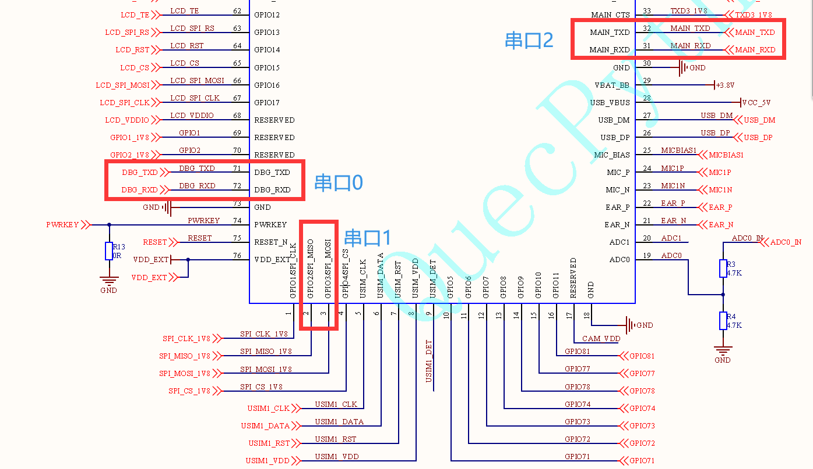
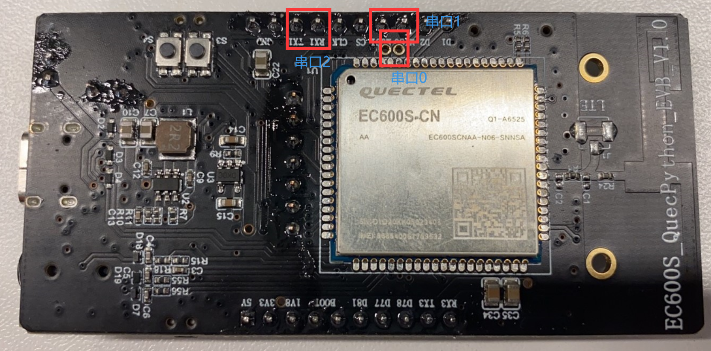
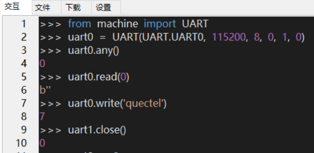

# **QuecPython  UART开发使用说明**

文档主要基于EC600S介绍如何使用QuecPython_UART，UART作为一种通用串行数据总线，用于异步通信，可实现全双工传输和接收。在嵌入式设计中，UART用来与PC进行通信，包括监控调试器和其它器件。通过本文你将了解到EC600S\_UART的所有设置参数及使用方法。


## 硬件描述

目前开放共3路UART，各路UART对应模组的PIN脚如下图所示：



3路UART对应开发板的接口如下图所示：



3路串口对应关系列表如下：

| 串口名   | 模组引脚名     | 模组引脚号 |
|----------|----------------|------------|
| 调试串口 | DBG_RXD        | 72         |
|          | DBG_TXD        | 71         |
| 辅助串口 | GPIO2/SPI_MISO | 2          |
|          | GPIO3/SPI_MOSI | 3          |
| 主串口   | MAIN_DTR       | 39         |
|          | MAIN_RXD       | 31         |
|          | MAIN_TXD       | 32         |
|          | MAIN_CTS       | 33         |
|          | MAIN_RTS       | 34         |
|          | MAIN_DCD       | 48         |
|          | MAIN_RI        | 40         |

## 软件设计

### 创建UART对象

uart = UART(UART.UARTn, buadrate, databits, parity, stopbits,flowctl)。创建UART对象接口参数介绍如下：

| 参数     | 类型 | 说明                                                                          |
|----------|------|-------------------------------------------------------------------------------|
| UARTn    | int  | 端口号 UART0 - DEBUG PORT UART1 – BT PORT UART2 – MAIN PORT                   |
| buadrate | int  | 波特率，常用波特率都支持，如4800、9600、19200、38400、57600、115200、230400等 |
| databits | int  | 数据位（5~8）                                                                 |
| parity   | int  | 奇偶校验（0 – NONE，1 – EVEN，2 - ODD）                                       |
| stopbits | int  | 停止位（1~2）                                                                 |
| flowctl  | int  | 硬件控制流（0 – FC_NONE， 1 – FC_HW                                           |

### 查询串口未读字节数

uart.any()：返回接收缓存器中有多少字节的数据未读，无参数。

返回值：指令执行成功或者不存在未读数据都返回0，否则返回未读字节数。

### 读取数据

uart.read(nbytes)：从串口读取数据，建议先执行上个命令，查询未读数据的字节数，然后读取数据时加上需要读取的字节数。

参数介绍如下：

| 参数   | 类型 | 说明           |
|--------|------|----------------|
| nbytes | int  | 要读取的字节数 |

返回值：返回读取的数据

### 发送数据

uart.write(data)，用于从模组向外发送数据，参数介绍如下：

| 参数 | 类型   | 说明       |
|------|--------|------------|
| data | string | 发送的数据 |

返回值：返回发送的字节数

### 关闭串口

uart.close()：关闭串口，无参数。

返回值：成功返回整型0，失败返回整型-1

## 交互操作

使用QPYcom工具和模组进行交互，下面实例是基于UART0，UART1和UART2操作类似。

<span><div style="text-align: center;">


</div></span>

注意：

1.  from machine import UART即为让UART模块在当前空间可见。

2.  只有from machine import UART模块，才能使用UART内的函数和变量。

3.  上述操作没有连接任何外设，仅作为熟悉指令参考

## 下载验证

### 软件代码

配套demo的参考代码为文档同目录下的example_uart_file.py文件。下载.py文件到模组运行，代码如下：

```python
import _thread  # 导入线程模块
import utime  # 导入定时模块
import log  # 导入log模块
from machine import UART  # 导入UART模块
# 测试该示例代码需要配置uart
# 设置日志输出级别
log.basicConfig(level=log.INFO)
uart_log = log.getLogger("UART")
state = 1
def uartWrite():
    count = 10
    # 配置uart
    uart = UART(UART.UART1, 115200, 8, 0, 1, 0)
    while count:
        write_msg = "Hello count={}".format(count)
        # 发送数据
        uart.write(write_msg)
        uart_log.info("Write msg :{}".format(write_msg))
        utime.sleep(1)
        count -= 1
    uart_log.info("uartWrite end!")
def UartRead():
    global state
    uart = UART(UART.UART1, 115200, 8, 0, 1, 0)
    while 1:
        # 返回是否有可读取的数据长度
        msgLen = uart.any()
        # 当有数据时进行读取
        if msgLen:
            msg = uart.read(msgLen)
            # 初始数据是字节类型（bytes）,将字节类型数据进行编码
            utf8_msg = msg.decode()
            # str
            uart_log.info("UartRead msg: {}".format(utf8_msg))
        else:
            continue
    state = 0
def run():
    # 创建一个线程来监听接收uart消息
    _thread.start_new_thread(UartRead, ())
if __name__ == "__main__":
    uartWrite()
    run()
    while 1:
        if state:
            pass
        else:
            break
```

### 硬件连接

使用type-c给模块供电，UART与TTL转USB模块的连接如下表（仅供参考）：

| 模块UART_pin脚 | TTL转USB模块 |
|----------------|--------------|
| SPI_MISO       | Tx           |
| SPI_MOSI       | Rx           |
| GND            | GND          |

硬件连接展示图如下图所示：

<span><div style="text-align: center;">


</div></span>

### 运行效果

1. 打开QCOM，连接TTL转USB对应的端口，如下图所示：

   <span><div style="text-align: center;">
   

   </div></span>

2.  打开QPYcom运行uart_file.py，可在QCOM查看到UART write数据，现象如下截图红色部分
    
3.  然QCOM上写quectel两次，可在QPYcom上查看读取的数据。现象如下截图蓝色部分

<span><div style="text-align: center;">

</div></span>

## 配套代码

<!-- * [下载代码](code/uart_file.py) -->
 <a href="zh-cn/QuecPythonSub/code/uart_file.py" target="_blank">下载代码</a>