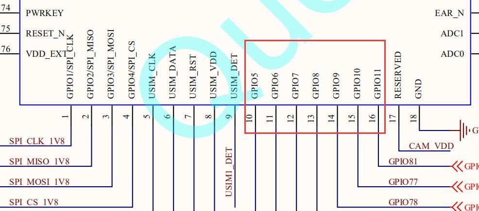

***以上实验均可在模块中直接运行***

> 适用模块：

> -   EC600S-CN

***

## 跑马灯实验

文档主要介绍如何实现 GPIO控制外部器件，从硬件设计和软件设计两方面讲解，通过阅读本文，您将学会查看硬件连接关系、代码编写思路和验证实验理论。

### 硬件描述

GPIO是最常用的外设之一，可以输出高电平和低电平，以便控制外部的器件。如查看原理图，标有GPIO 的 Pin 就是我们想要找的引脚。



### 软件设计

3.1. 首先确定要控制硬件的哪个引脚，然后通过官网的 API 类库找到 Pin
介绍，查看引脚号对应的 GPIO，如图：

>   GPIO1–引脚号 10 对应硬件 Pin10，GPIO2–引脚号 11 对应硬件
>   Pin11......如此类推。


开始编写代码，在.py 文件里加入下面代码，用于对 GPIO 读写：

```python
IOdictRead = {} # 记录已经初始化的 GPIO 口
IOdictWrite = {} # 记录已经初始化的 GPIO 口
def GPIO_Read(gpioX, Pull=Pin.PULL_DISABLE, level=1):
	if IOdictWrite.get(gpioX, None):
    	del IOdictWrite[gpioX]
    gpioIO = IOdictRead.get(gpioX, None) 
    if gpioIO:
    	return gpioIO.read()
    else:
        IOdictRead[gpioX] = (Pin(gpioX, Pin.IN, Pull, level)) 
        gpioIO = IOdictRead.get(gpioX, None)
		return gpioIO.read()
def GPIO_Write(gpioX, level, Pull=Pin.PULL_DISABLE):
    if IOdictRead.get(gpioX, None):
    	del IOdictRead[gpioX]
    gpioIO = IOdictWrite.get(gpioX, None) 
    if gpioIO:
    	gpioIO.write(level)
    else:
        IOdictWrite[gpioX] = (Pin(gpioX, Pin.OUT, Pull, level)) 
        gpioIO = IOdictWrite.get(gpioX, None)
		gpioIO.write(level)
```

定义需要控制的 GPIO 别名：

| **LED1 = Pin.GPIO1** | **# 定义 LED 引脚** |
| -------------------- | ------------------- |
| **LED2 = Pin.GPIO2** | **# 定义 LED 引脚** |
| **LED3 = Pin.GPIO3** | **# 定义 LED 引脚** |
| **LED4 = Pin.GPIO4** | **# 定义 LED 引脚** |
| **LED5 = Pin.GPIO5** | **# 定义 LED 引脚** |
|                      |                     |

对某一个引脚实现控制：

```python
def IO_On(gpioX):	# 某个引脚置 0
	GPIO_Write(gpioX, 0)	# 调用写函数
def IO_Off(gpioX):	# 某个引脚置 1
	GPIO_Write(gpioX, 1)	# 调用写函数

```

对全部引脚实现控制：

```python
def IO_All_Off():	# 全部引脚置 1
    IO_Off(LED1)
    IO_Off(LED2)
    IO_Off(LED3)
    IO_Off(LED4)
    IO_Off(LED5)

```

完成上面的代码后，我们可以编写主程序
main()，主要实现思路，亮-灭-亮-灭，如此循环；仅点亮 LED1，延时 200 毫秒，看到
LED1 亮，LED1 灭；仅点亮 LED2，延时 200 毫秒，LED2 灭；仅点亮 LED3，延时

200 毫秒，LED3 灭；这样就能看到 LED 轮流点亮的效果。

```python
def main():
    while True:
        IO_All_Off()	# 灭 IO_On(LED1)	# 亮
        utime.sleep_ms(200)	# 延时
        IO_All_Off()	# 灭 IO_On(LED2)	# 亮
        utime.sleep_ms(200)	# 延时
        IO_All_Off()	# 灭 IO_On(LED3)	# 亮
        utime.sleep_ms(200)	# 延时
        IO_All_Off()	# 灭 IO_On(LED4)	# 亮
        utime.sleep_ms(200)	# 延时
        IO_All_Off()	# 灭 IO_On(LED5)	# 亮
        utime.sleep_ms(200)	# 延时
```

接下来就可以下载验证了，python 代码不需要编译，直接通过 QPYcom 工具把.py文件下载到模块中运行。

### 下载验证

下载.py 文件到模组运行：

<span><div style="text-align: center;">


</div></span>

下载之后，看到 LED 逐个点亮，有流水灯的效果：

<span><div style="text-align: center;">


</div></span>

### 配套代码

<!--* [下载代码](/#/zh-cn/QuecPythonTest/code/01_LED.py) -->
<a href="zh-cn/QuecPythonTest/code/01_LED.py" target="_blank">下载代码</a>