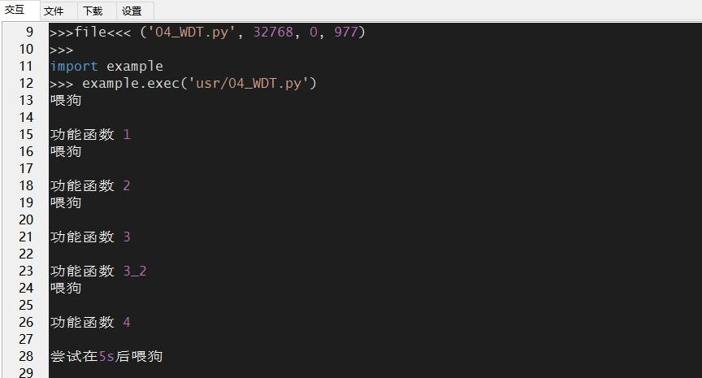

## 独立看门狗实验

文档主要介绍看门狗的用处和使用技巧，量产后生产的设备难免有个会有瑕疵，或者软件工程师做的代码有意想不到的地方，又或者硬件的寿命受自然条件所影响，导致产品死机，死机后不再运作可能会造成不可估量的后果，为了解决这样的问题，那么就要使用看门狗了，看门狗能够使产品死机后复位重新运作，本文里看门狗简称WDT。

### 硬件描述

模组内置 WDT 功能，无需外置器件，仅用软件就能解决死机复位功能。

### 软件设计

模组内置的 WDT 模式，在初始化 WDT 时要指定最长喂狗时间，使用 WDT后，就必须在指定内喂狗，否则将导致程序复位。我们利用 print打印函数，在喂狗时打印信息，不为狗超时导致程序复位自然就看不到打印信息。

```python
def Watchdog(): # 2 秒钟内调用喂狗函数，否则系统复位
	global wdt # 声明全部变量
    if wdt is None:
    	wdt = WDT(2) # 启动看门狗，间隔时长 单位 秒
    wdt.feed() # 喂狗
def main():
    print('喂狗')
    Watchdog() # 2 秒钟内调用喂狗函数
    func_1() # 用户程序
    print('喂狗')
    Watchdog() # 2 秒钟内调用喂狗函数
    func_2() # 用户程序
    print('喂狗')
    print('喂狗') # 2 秒钟内调用喂狗函数
    func_3() # 用户程序
    print('喂狗')
    Watchdog() # 2 秒钟内调用喂狗函数
    func_4() # 用户程序
```

一秒钟后打印信息，print 能正常输出，说明程序正常往下执行。

```python
def func_1():
	utime.sleep_ms(1000) # 延时 1 秒
    print('功能函数 1')
def func_2():
    utime.sleep_ms(1000) # 延时 1 秒
	print('功能函数 2')
```

如下面的函数，内部处理超过两秒，那么就需要在函数内也要喂狗一次，确保程序正常执行是不被复位。

```python
def func_3():
    utime.sleep_ms(1000) # 延时 1 秒
    print('功能函数 3')
    Watchdog() # 2 秒钟内调用喂狗函数
    utime.sleep_ms(1000) # 延时 1 秒
    print('功能函数 3_2')
```

下面的函数有个utime.sleep_ms(5000)五秒钟的延时，明显超过两秒，执行到此处时模拟程序死机，就像设备在某个地方卡住不动，然后系统就会复位。

```python
def func_4():
	utime.sleep_ms(1000)
    print('功能函数 4')
    Watchdog() # 2 秒钟内调用喂狗函数
    print('尝试在 5s 后喂狗')
    utime.sleep_ms(5000) # 延时 5 秒
    Watchdog()
    print('来不及喂狗，系统已经复位')
```

接下来就可以下载验证了，python 代码不需要编译，直接通过 QPYcom 工具把.py文件下载到模块中运行。

### 下载验证

下载.py 文件到模组运行：

<span><div style="text-align: center;">

</div></span>

<span><div style="text-align: center;">

</div></span>

下载之后，执行代码在延时 5 秒的时候，系统复位。

### 配套代码

<!-- * [下载代码](code/04_WDT.py) -->
 <a href="zh-cn/QuecPythonTest/code/04_WDT.py" target="_blank">下载代码</a>