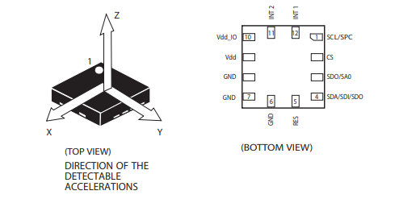
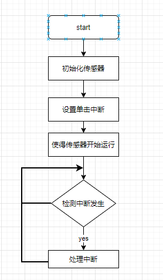

## 加速度传感器实验

本片文章主要基于 EC600S 板载 三轴加速度传感器LIS2DH12TR，做一个检测加速度的小实验。

### 硬件资源



LIS2DH12 是属于“nano”系列的超低功耗高性能 3 轴线性加速度计，具有数字 I2C、SPI串行接口标准输出。 器件具有超低功耗工作模式，可实现高级节能、智能
睡眠唤醒以及恢复睡眠功能。 LIS2DH12 具有 ±2g/±4g/±8g/±16g 的动态用户可选满量程，并能通过 1 Hz 到 5 kHz 的输出数据速率测 量加速度。器件可配置为通过独立的惯性唤醒 / 自由落体事件以及通过器件自身的位置生成中断信号。中断发生器的阈值 和时序可由终端用户动态设定。

LIS2DH12 通过I2C 接口通讯。查看说明书和原理图。


可以发现SD0/SA0 引脚高电平。 因此可以确认加速度传感器的从机地址为0x19。

#### LIS2SH12 单击中断使用步骤

LIS2DH12 支持的功能：

1.  单双击检测

2.  自由落体检测

3.  倾斜角测量

4.  切换横屏/竖屏模式

我们使用其单击检测功能，出现单击事件，将其映射到INT1 引脚上面，其处理逻辑大致如下：



**LIS2SH12 初始化**

1.  设置 CTRL_REG2 寄存器，开启高通滤波。
2.  设置 CTRL_REG3 ，将中断引到INT1 引脚上面。
3.  设置 CTRL_REG4 ，配置Full-scale selection

**配置单击中断**

1.  配置CLICK_CFG寄存器，使能需要检测的感应轴，X,Y,Z
2.  配置CLICK_THS 设置阈值
3.  配置TIME_LIMIT 设置窗口限制
4.  配置TIME_LATENCY 设置延时

**LIS2SH12 使能传感器**

1.  配置CTRL_REG1 开始使能传感器。

### 实验步骤

#### 实验设计

1.  使用LIS2DH12 传感器的 INT1 引脚产生中断。
2.  轮询此引脚的状态，检测到上升沿以后， 表示中断产生，处理中断。
3.  在中断函数里面读取三轴的状态。

#### 实验代码

```
'''

File: i2c_lis2dh12.py

Project: i2c

File Created: Monday, 4th January 2021 8:04:35 pm

Author: chengzhu.zhou

-----

Last Modified: Tuesday, 5th January 2021 8:27:48 pm

Modified By: chengzhu.zhou

-----

Copyright 2021 - 2021 quectel

'''

import utime as time

import _thread

import log

from machine import I2C

from machine import Pin

import ustruct as struct


# 参考文档

# http://qpy.quectel.com/wiki/#/zh-cn/api/?id=i2c

# http://qpy.quectel.com/wiki/#/zh-cn/api/?id=extint

# https://www.st.com/resource/en/datasheet/lis2dh12.pdf


# 寄存器地址

LIS2DH12_OUT_X_L = 0x28

LIS2DH12_OUT_X_H = 0x29

LIS2DH12_OUT_Y_L = 0x2A

LIS2DH12_OUT_Y_H = 0x2B

LIS2DH12_OUT_Z_L = 0x2C

LIS2DH12_OUT_Z_H = 0x2D

LIS2DH12_FIFO_CTRL_REG = 0x2E


# 控制寄存器

LIS2DH12_CTRL_REG1 = 0x20

LIS2DH12_CTRL_REG2 = 0x21

LIS2DH12_CTRL_REG3 = 0x22

LIS2DH12_CTRL_REG4 = 0x23

LIS2DH12_CTRL_REG5 = 0x24

LIS2DH12_CTRL_REG6 = 0x25

LIS2DH12_REFERENCE_REG = 0x26

LIS2DH12_STATUS_REG = 0x27


# 状态寄存器

LIS2DH12_STATUS_REG_AUX = 0x7


# 中断寄存器

LIS2DH12_INT1_CFG = 0x30

LIS2DH12_INT1_SRC = 0x31

LIS2DH12_INT1_THS = 0x32

LIS2DH12_INT1_DURATION = 0x33


# 身份寄存器

LIS2DH12_WHO_AM_I = 0x0F


# 单击有关的寄存器

LIS2DH12_CLICK_CFG = 0x38

LIS2DH12_CLICK_SRC = 0x39

LIS2DH12_CLICK_THS = 0x3A

LIS2DH12_TIME_LIMIT = 0x3B

LIS2DH12_TIME_LATENCY = 0x3C

"""

EC600SCN平台引脚对应关系如下（引脚号为模块外部引脚编号）：

GPIO1 – 引脚号10

GPIO2 – 引脚号11

GPIO3 – 引脚号12

GPIO4 – 引脚号13

GPIO5 – 引脚号14

GPIO6 – 引脚号15

GPIO7 – 引脚号16

GPIO8 – 引脚号39

GPIO9 – 引脚号40

GPIO10 – 引脚号48

GPIO11 – 引脚号58

GPIO12 – 引脚号59

GPIO13 – 引脚号60

GPIO14 – 引脚号61

"""

# 将其和外部的中断引脚绑定到一起。


class lis2dh12():

		i2c_dev = None

		address = None

		int_pin = None

		dev_log = None

				def init(self, slave_address):

				self.dev_log = log.getLogger("I2C")

				self.address = slave_address

				self.i2c_dev = I2C(I2C.I2C1, I2C.STANDARD_MODE)

				self.int_pin = Pin(Pin.GPIO3, Pin.IN, Pin.PULL_PU, 0)

				self.sensor_init()

 				# 配置单击检测

				self.Single_tap_enable()

				self.start_sensor()

				pass

def read_data(self, regaddr, datalen, debug=True):

		r_data = [0x00 for i in range(datalen)]

		r_data = bytearray(r_data)

		reg_addres = bytearray([regaddr])

		self.i2c_dev.read(self.address,

				reg_addres, 1, r_data, datalen, 1)

		ret_data = list(r_data)

		if debug is True:

				self.dev_log.debug(

						" read 0x{0:02x} from 0x{1:02x}".format(ret_data[0], regaddr))

		return ret_data


def write_data(self, regaddr, data, debug=True):

		w_data = bytearray([regaddr, data])

		# 临时将需要传送的地址放在数据位

		self.i2c_dev.write(self.address, bytearray(0x00), 0,

				bytearray(w_data), len(w_data))

		if debug is True:

				self.dev_log.debug(

						" write 0x{0:02x} to 0x{1:02x}".format(data, regaddr))


def sensor_reset(self):

		self.dev_log.debug("Sensor restart Ing")

 		# 重置chip

		self.write_data(LIS2DH12_CTRL_REG5, 0x80)

		time.sleep_ms(100)

		r_data = self.read_data(LIS2DH12_WHO_AM_I, 1)

 	   # 确定重启成功

		while r_data[0] != 0x33:

				r_data = self.read_data(LIS2DH12_WHO_AM_I, 1)

				time.sleep_ms(5)

		self.dev_log.debug("Sensor restart successful")

		pass


def sensor_init(self):

 		# 1. 重置设备

		self.sensor_reset()

 		# 2. 初始化传感器

		self.write_data(LIS2DH12_CTRL_REG2, 0x04) # 使能高分辨率

		self.write_data(LIS2DH12_CTRL_REG3, 0x80) # 将中断引到INT1 引脚上面，默认高电平有效

		self.write_data(LIS2DH12_CTRL_REG4, 0x08) # ±2g， High-resolution mode


def Single_tap_enable(self):

 		# self.write_data(LIS2DH12_CLICK_CFG, 0x15) # 使能 XYZ 三轴单击中断，

		self.write_data(LIS2DH12_CLICK_CFG, 0x10) # 使能 Z 轴单击中断，

		self.write_data(LIS2DH12_CLICK_THS, 0x30) # 设置阈值

		self.write_data(LIS2DH12_TIME_LIMIT, 0x18) # 设置时间窗口限制

		self.write_data(LIS2DH12_TIME_LATENCY, 0x02) # 设置延时


def start_sensor(self):

		self.write_data(LIS2DH12_CTRL_REG1, 0x77) # 设置ODR 400HZ ,enable XYZ.

 		# self.write_data(LIS2DH12_CTRL_REG1, 0x74) # 设置ODR ,enable Z轴.

		time.sleep_ms(20) # (7/ODR) = 18ms


# Xl,Xh,Yl,Yh,Zl,Zh

def ReadXYZ(self):

		data = []

		for i in range(6):

				r_data = self.read_data(LIS2DH12_OUT_X_L+i, 1)

				data.append(r_data[0])

		return data

# 检测到上升沿了


def ProcessingData(self):

		self.dev_log.debug("An interrupt has been detected")

		data = self.ReadXYZ()

		self.dev_log.info("xL:{0},xH:{1},yL:{2},yH:{3},zL:{4},zH:{5}".format(

				data[0], data[1], data[2], data[3], data[4], data[5]))

		self.dev_log.info("X:{0} Y:{1} Z:{2}".format(

				data[0] & data[1], data[2] & data[3], data[4] & data[5]))

		pass


def run(self):

 		# 提示上下抬起开发板， 给传感器一个分量

		 self.dev_log.info("Lift the development board up and down")

		while True:

				value = self.int_pin.read()

 				# 检测到中断信号了

				if value == 1:

						self.ProcessingData()


def is2dh12_thread(delay, retryCount):

		log.basicConfig(level=log.INFO)

 		# log.basicConfig(level=log.DEBUG)

		dev = lis2dh12()

		dev.init(0x19)

		dev.run()

		print("thread has exited")


if __name__ == "__main__":

 		# creat a thread Convert ADC to Voltage
 	
 		_thread.start_new_thread(is2dh12_thread, (100, 100))

		print("creent main thread has exit")
```

### 配套代码

<!-- * [下载代码](code/i2c_lis2dh12.py) -->
 <a href="zh-cn/QuecPythonTest/code/i2c_lis2dh12.py" target="_blank">下载代码</a>