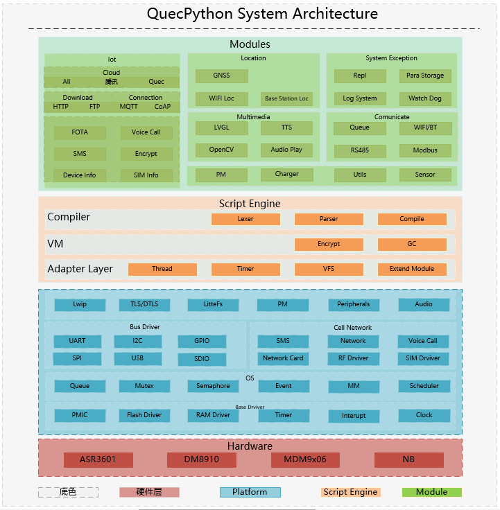
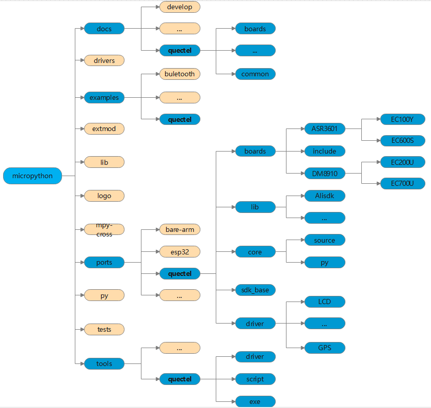

# QuecPython概述

本文档主要讲解QuecPython的技术特性。

本文档适用以下移远通信LTE Standard模块：

-   EC100Y-CN

-   EC600S-CN

## 初识QuecPython

###  QuecPython的由来

Python 是一种跨平台的计算机程序设计语言 ， 是一个结合了解释性、编译性、互动性和面向对象的 高 层次 脚本语言。 Python 最初被设计用于编写自动化脚本 （shell） ，随着版本的不断更新和语言新功能的添加，越 来越 多 地 被 应 用于独立大型项目的开发。Python 的设计哲学是优雅、明确、简单 。Python 开发者的哲学是“用一种方法，最好是只有一种方法来做一件事”， 因此 他们通常难以忍受 Perl 语言中“总是有多种方法来做同一件事”的理念。在设计 Python 语言时，如果面临多种选择， Python 开发者一般会拒绝花俏的语法，而选择明确的没有或者很少有歧义的语法。 这些准则也被称为 Python 格言。 由于这种设计观念的差异， Python 源代码通常被认为比 Perl 具备 更好的可读性，并且能够支撑大规模的软件开发。Python 是完全面向对象的语言 ，并且完全支持继承、重载、派生、多继承，有益于增强源代码的复用 性。 函数、模块、数字、字符串都是对象。Python 本身被设计为可扩充的。 由于 并非所有的特性和功能都集成到语言核心 ，Python 提供了丰富API 和工具，以便程序员能够轻松地使用 C 语言、 C++、Cython 来编写扩充模块。 Python 编译器本身也可 以被集成到其它需要脚本语言的程序内 ，因此 Python 也被 作为一种“胶水语言”（ glue language）用于将 其他语言编写的程序进行集成和封装。

Python 常被 应 用于以下场景 ： 

- Web 和 Internet 开发 
- 科学计算和统计
- 人工智能 
- 桌面界面开发
- 软件开发 
- 后端开发 
- 网络爬虫
- 嵌入式开发

**当 移远通信 和 Python结合在一起，会发生什么？**

QuecPython 是执行 Python 代码的运行环境，是一种全新的物联网开发方式。 Quec 取自 Quectel（ 移 远通信 ） ，是基于移远通信的物联网模块。 而 Python（中文名蟒蛇，俗名爬虫，别名胶水语言）是一种跨 平台的计算机程序设计语言，是一个入门容 易、编写简单快捷、调试方便、开发效率高的脚本语言，已成 为当下最受欢迎的程序设计语言之一。 QuecPython 移植于 MicroPython 开源库，开发者在移远通信模块上 使 用 MicroPython 即可调用模块软件功能和外部硬件接口，进行二次开发。 QuecPython 方便用户更加快捷地在物联网模块上进行二次开发 ， 是一款为用户量身打造的嵌入式操作系统。

###  QuecPython与Micropython关系

#### MicroPython的介绍

从单词的组成来看，MicroPython是由Micro和Python两个部分组成，Micro是微小的意思，而Python是一种编程语言，两者合起来的字面意思就是微型的Python。实际上MicroPython就是用于嵌入式系统上的Python，可以在嵌入式系统中编程，做各种应用。

MicroPython是Python3语言的精简高效实现，包括Python标准库的一小部分，经过优化可在微控制器和受限环境中运行。它包含了诸如交互式提示，任意精度整数，关闭，列表解析，生成器，异常处理等高级功能。MicroPython足够精简，适合运行在只有256
k的代码空间和16k的RAM的芯片上，并且旨在尽可能的与普通Python兼容，让客户可以轻松地将代码从桌面传输到微控制器或嵌入式系统。目前，MicroPython除了可以运行在最初开发的Pyboard微控制器上之外，还可以运行在大量基于ARM的嵌入式系统，如Arduino，这样就可以非常方便地通过Python开发自动控制、机器人等应用。

MicroPython的特点是简单易用、移植性好、程序容易维护，但是采用MicroPython或其他脚本语言(如Javascript)开发的程序，其运行效率肯定没有采用C、C++、汇编等编译型工具的程序高。MicroPython并不会取代传统的C、C++语言，但是在很多情况下，硬件的性能是过剩的，降低一点运行效率并不会有太大影响，而MicroPython带来的整体开发效率的提升，才是最大的好处。如果说Arduino将一般电子爱好者、DIYer和创客带入了嵌入式领域，让他们变得不再畏惧硬件的开发和使用；那么MicroPython就完全可以作为工具去开发真正的产品，让普通工程师和爱好者可以快速开发嵌入式程序，让嵌入式开发和移植变得轻松、简单。

MicroPython使用了非常宽松的MIT授权方式，而不是大公司常用的GPL授权。这意味着任何人都可以去使用、修改和发行它，并可以将它免费应用在商业产品中。获取MicroPython相关源码地址：*https://github.com/micropython/micropython*。

#### QuecPython与MicroPython的关系

1.  QuecPython移植于MicroPython，无论是在功能接口定义还是目录结构形式都与MicroPython保持高度的一致。

2.  两者同样应用于嵌入式场景开发，轻Python开发语言使得开发者上手更快，开发门槛大大降低。

3.  两者同样运行于资源受限类型的微控制器上，最小体积仅256K，运行时仅需16K内存。

#### 获取QuecPython SDK及加入官方交流群

> QuecPython官方网站：*http://python.quectel.com/*。
>
> QuecPython官方QQ开发交流群：445121768。

###  QuecPython与C-SDK关系

从系统架构图中可以看出，从平台底层到用户接口层的架构分层十分清晰，分别是Hardware平台硬件层、平台OS层、QuecPython Adapter Layer平台适配层、QuecPython VM虚拟机层、QuecPython Compiler编译器层和QuecPython Modules用户接口层。

其中Hardware平台硬件层，平台OS层属于C-SDK部分；QuecPython Adapter Layer平台适配层，QuecPython VM虚拟机层，QuecPython Compiler编译器层和QuecPython Modules用户接口层属于完整的QuecPython结构层次。

QuecPython在C-SDK的基础上进行移植和适配。

###  QuecPython技术特性

QuecPython技术主要特性如下：

1.  **高效性**：Python开发高效便捷，轻松入门，快速上手，无需编译，随写随测。
2.  **API接口丰富**：移远通信提供的API接口涵盖了常用的单片机及移动联网模块开发库，最大程度地保证接口的稳定，功能丰富。
3.  **兼容MicroPython**：QuecPython接口与MicroPython无论在目录结构还是接口应用上均保持一致，便于与官方保持一致进行更新迭代。
4.  **数据安全**：无论是在源码方面还是数据传输方面都做了相应的加密处理，最大限度地保证用户使用的安全性及私密性。
5.  **开发语言**：开发语言难度低、上手快、普及性强，简单易学且稳定可靠。
6.  **可移植性强**：QuecPython的设计架构能快速移植适配到不同的应用平台，用户在移植过程中只需要开发移远通信提供出来的平台适配层接口即可，其他App逻辑性应用无需关注。
7.  **丰富的技术支持**：移远通信提供了手把手的入门文档、教学文档、教学视频、建立了官方的技术支持群，用户可以从零入手学习QuecPython的使用，同时丰富的技术支撑全程为用户开发提供服务。

###  QuecPython的适用场景

#### 技术特性

- **高效性** ：Python 开发高效便捷 ， 轻松入门，快速上手 ， 无需编译，随写随测 。 
- **API接口丰富** ： 移远通信 提供的 API 接口涵盖了常用的单片机及移动联网模块开发库，最大程度地保证接口的稳定，功能丰富。

- **兼容MicroPython**：QuecPython 接口与 MicroPython 无论在目录结构还是接口应用上均保持一致，便于与官方保持一致进行更新迭代。
- **数据安全** ：无论是在源码方面还是数据传输方面都做了对应的加密处理，最大限度地保证用户使用的安全性及私密性。
- **开发语言** ：开发语言难度低、上手快、普及性强，简单易学且稳定可靠。
- **可移植性强** ：QuecPython 的设计架构能快速移植适配到不同的应用平台，用户在移植过程中只需要开发移远通信提供出来的平台适配层接口即可，其他APP逻辑性应用无需关注。

- **丰富的技术支持** ：移远通信提供了手把手的入门文档、教学文档、教学视频、官方的技术支持群，用户可以从 0 入手 学习 QuecPython 的使用，同时丰富的技术支撑全程为用户开发提供服务。 详 细资料请访问 QuecPython 官网 或 加入 移远通信 官方 QQ 技术开发交流群，详见 第 ***2.3*** 章 。 

#### 适用场景

QuecPython 使用 Python 语言来控制单片机 或者移动通信模块 ， 因此单片机能做什么基本能反映出它能做什么。 QuecPython 的适用场景有：

- 智能仪器 
- 工业控制 
- 家用电器 
- 网络和通信、远程控制
- 模块化系统
- 汽车电子领域
- 医疗领域 
- 移动支付领域
- 青少年编程教育领域

........ 

目前移远通信已经可以 为 Traker、智能学生卡 、云喇叭 、支付盒子 、工业 DTU 提供包含源码的 解决方案 。 

#### 获取 QuecPython SDK及加入官方交流群

如 需 获 取 QuecPython  SDK 及 相 关 资 料 ， 请访问移 远 通 信 QuecPython 官 方 网 站 ： [http://qpy.quectel.com/。](http://qpy.quectel.com/) 

如需进行技术开发交流 ， 可加入移远通信 QuecPython 官方 QQ 开发交流群： 445121768。 

## 探秘QuecPython技术架构

### 系统架构介绍

从系统架构图中可以直观地看到从平台底层到用户接口层的架构分层，分别是Hardware平台硬件层、平台OS层、QuecPython Adapter Layer平台适配层、QuecPython VM虚拟机层、QuecPython编译器层，QuecPythonModules用户接口层。

其中：

-   **C-SDK**：Hardware平台硬件层、平台OS层；

-   **QuecPython完整结构层**：QuecPython Adapter Layer平台适配层、QuecPython VM虚拟机层，QuecPython编译器层和QuecPython Modules用户接口层。

用户仅需关注QuecPython Modules用户接口层，该层提供了大量的API接口，包括I2C/SPI/GPIO/AUDIO/PWM/POWER/ADC/FOTA/Datacall/Aliyun等模块。

### 目录结构

目录说明：

-   **Micropython----\>docs----\>quectel**：该目录下主要包含移远关于QuecPython的入门教程文档，比如驱动安装、开发板介绍等。

-   **Micropython----\>examples----\>quectel**：该目录下主要包含QuecPython的demo例程。

-   **Micropython----\>ports----\>quectel----\>boards**：该目录下主要包含QuecPython移植到不同平台的适配层接口。

-   **Micropython----\>ports----\>quectel----\>core**：该目录下主要包含QuecPython Modules用户接口层逻辑处理。

-   **Micropython----\>tools----\>quectel**：该目录下主要包含QuecPython相关使用工具。

#### 附录

表1：术语缩写

| **术语** | **英文全称**                      | **中文全称**     |
| -------- | --------------------------------- | ---------------- |
| SDK      | Software Development Kit          | 软件开发工具包   |
| VM       | Virtual Machine                   | 虚拟机           |
| OS       | Operating System                  | 操作系统         |
| DTU      | Data Transfer Uni                 | 数据传输单元     |
| API      | Application Programming Interface | 应用程序编程接口 |
| APP      | Application                       | 应用程序         |

***持续更新中，更多精彩敬请关注！***

> ​	***For full documentation visit [http://python.quectel.com/.](http://python.quectel.com/.)***

