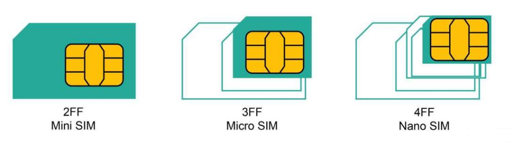
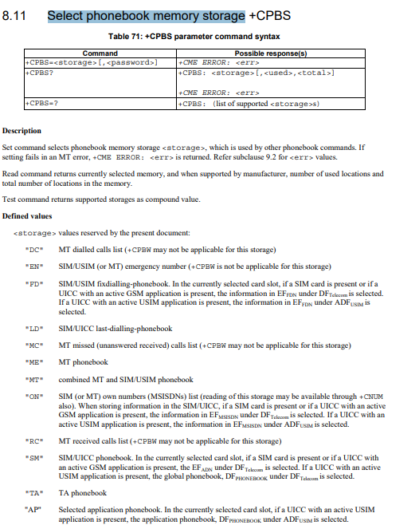

# QuecPython 无线联网开发

## QuecPythonDataCall数据拨号

本片文章主要简介QuecPython datacall 模块的使用。 datacall模块提供数据拨号的等功能。

包含的API如下：

- **dataCall.start(profileIdx, ipType, apn, username, password, authType)**
- **dataCall.setApn(profileIdx, ipType, apn, username, password, authType)**
- **dataCall.setCallback**
- **dataCall.getInfo(profileIdx, ipType)**

具体的API 详解请参考[Quecpython-dataCall - 数据拨号](https://python.quectel.com/wiki/#/zh-cn/api/QuecPythonClasslib?id=datacall-%e6%95%b0%e6%8d%ae%e6%8b%a8%e5%8f%b7)

适用模块：

- EC100Y-CN
- EC600S-CN

### 数据拨号简介

简单理解， 数据拨号即为通过和服务器连接，获取网络访问许可。 

#### 什么是APN

 [APN Configuration](https://prepaid-data-sim-card.fandom.com/wiki/APN_Configuration) 

 [What is Access Point Name (APN)](https://1ot.mobi/resources/blog/iot-hacking-series-3-what-is-access-point-name-apn-and-how-it-works)

所有运营商都使用特定的APN（Access Point Name，接入点名称）。这通常是您的SIM卡预先配置的，但必要时，您需手动进行调整。

APN接入点名称由两部分组成：

- 网络标识符

- 运营商标识符

运营商标识符又由其他两个部分组成：  

- 移动网络代码（MNC）

- 移动国家代码（MCC）

#### APN的类型

我们可以根据APN是连接到公共网络还是专用网络以及IP地址的分配方式来划分APN，有以下四种不同的类型：

- **公用的APN-**通常简称为“ APN”。使用公用APN连接到网关的设备会动态获得IP地址，以便大部分访问互联网；

- **具有静态IP的公用APN-**网关根据公共网络的可用IP池为设备分配静态IP地址；

- **专用APN-**这也被认为是“带有VPN的APN”。具有专用APN配置的设备可以通过网关连接到自己的内部网络；

- **具有静态IP的专用APN-**网关根据专用网络的可用IP池为设备分配静态IP地址。

当我们比较公用APN和专用APN时，我们可以看到后者甚至不需要互联网连接。专用APN永远不允许其访问公共互联网，而同时又保持其在蜂窝网络基础架构上，从而确保了安全的数据处理。

#### 配置APN

对于QuecPython，可使用SIM卡默认APN或者手动配置APN。

### 快速开始

QuecPython使用datacall 模块常规流程：

1. 使用链路拨号，获取进行链路激活。

2. 获取IP信息等基本数据。

3. 注册断网回调函数， 在回调函数里面，判断网络状态，进入重拨等操作。

#### 代码实验

1. 首先链路激活。

2. 打印IP信息等。

3. 注册回调函数。

4. 使用飞行模式模拟离线

5. 在回调函数中重新拨号。

```python
import dataCall
import net
import utime as time


g_net_status = False


def callback(args):
    pdp = args[0]
    nw_sta = args[1]
    if nw_sta == 1:
        g_net_status = True
        print("*** network %d connected! ***" % pdp)
    else:
        g_net_status = False
        print("*** network %d not connected! ***" % pdp)
        # 重新进入
        test_datacall_module()


def test_datacall_module():
    # 拨号
    ret = dataCall.start(1, 0, "3gnet.mnc001.mcc460.gprs", "", "", 0)
    if ret == 0:
        print("datacall start has success")
        g_net_status = True
    # 获取IP地址等信息
    Info = dataCall.getInfo(1, 0)
    print(Info)
    print("test datacall has exit")
    pass


def test_datacall_callback():
    test_datacall_module()
    # 注册回调中断
    ret = dataCall.setCallback(callback)
    if ret == 0x00:
        print("set Callback has success")
    net.setModemFun(4)  # 进入飞行模式
    time.sleep_ms(1000)
    net.setModemFun(1)  # 重新进入正常模式
    print("test_datacall_callback funcation has exited")
    pass


if __name__ == "__main__":
    test_datacall_callback()

```

### 参考资料

[What is Access Point Name (APN)](https://1ot.mobi/resources/blog/iot-hacking-series-3-what-is-access-point-name-apn-and-how-it-works)

[APN Configuration](https://prepaid-data-sim-card.fandom.com/wiki/APN_Configuration) 

[Quecpython-dataCall - 数据拨号](https://python.quectel.com/wiki/#/zh-cn/api/QuecPythonClasslib?id=datacall-%e6%95%b0%e6%8d%ae%e6%8b%a8%e5%8f%b7)

### 配套代码

<!-- * [下载代码](code/datacall_base.py) -->
 <a href="zh-cn/QuecPythonWirelessNetwork/code/datacall_base.py" target="_blank">下载代码</a>

## QuecPython cellLocator基站定位

本片文章主要简介QuecPython cellLocator 模块的使用。

包含的API有

- **cellLocator.getLocation(serverAddr, port, token, timeout, profileID)**

具体的API 详解请参考 [cellLocator - 基站定位](https://python.quectel.com/wiki/api/#celllocator-)

适用模块：

- EC100Y-CN
- EC600S-CN

### cellLocator 概述

定位是指通过特定的定位技术来获取移动手机或终端用户的位置信息(经纬度坐标)，在电子地图上标出被定位对象的位置的技术或服务。定位技术有两种，一种是基于GPS的定位，一种是基于移动运营网的基站的定位。基于GPS的定位方式是利用手机上的GPS定位模块将自己的位置信号发送到定位后台来实现手机定位的。基站定位则是利用基站对手机的距离的测算距离来确定手机位置的。后者不需要手机具有GPS定位能力，但是精度很大程度依赖于基站的分布及覆盖范围的大小，有时误差会超过一公里。前者定位精度较高。此外还有利用Wi-Fi在小范围内定位的方式。

基站定位一般应用于手机用户，手机基站定位服务又叫做移动位置服务(LBS，Location Based Service)，它是通过电信移动运营商的网络(如GSM网)获取移动终端用户的位置信息(经纬度坐标)，在电子地图平台的支持下，为用户提供相应服务的一种增值业务，例如目前中国移动动感地带提供的动感位置查询服务等。在物联网设备中也支持此类的操作。

基站定位的大致原理为:移动电话测量不同基站的下行导频信号，得到不同基站下行导频的TOA(Time of Arrival，到达时刻)或TDOA(Time Difference of Arrival，到达时间差)，根据该测量结果并结合基站的坐标，一般采用三角公式估计算法，就能够计算出移动电话的位置。实际的位置估计算法需要考虑多基站(3个或3个以上)定位的情况，因此算法要复杂很多。一般而言，移动台测量的基站数目越多，测量精度越高，定位性能改善越明显。

###  快速开始

#### 交互实验

进行本次实验， 需要先确定SIM卡状态。 具体请参考SIM模块的文档。

我们使用交互命令来获取当前的坐标信息。

```python
>>> import cellLocator
>>> cellLocator.getLocation("www.queclocator.com", 80, "1111111122222222", 8, 1)
(117.1138, 31.82279, 550)
# 上面使用的密钥仅为测试密钥
```

#### 代码实验

计算当前位置到北京首都的距离， 

```python
import cellLocator
from math import sin, asin, cos, radians, fabs, sqrt

EARTH_RADIUS = 6371           # 地球平均半径，6371km


def hav(theta):
    s = sin(theta / 2)
    return s * s


def get_distance_hav(lat0, lng0, lat1, lng1):
    "用haversine公式计算球面两点间的距离。"
    # 经纬度转换成弧度
    lat0 = radians(lat0)
    lat1 = radians(lat1)
    lng0 = radians(lng0)
    lng1 = radians(lng1)

    dlng = fabs(lng0 - lng1)
    dlat = fabs(lat0 - lat1)
    h = hav(dlat) + cos(lat0) * cos(lat1) * hav(dlng)
    distance = 2 * EARTH_RADIUS * asin(sqrt(h))

    return distance


def test_cellLocator():
    # 测试地点
    lon1, lat1 = (22.599578, 113.973129)  # 深圳野生动物园(起点）
    lon2, lat2 = (39.9087202, 116.3974799)  # 北京天安门(1938.4KM)
    d2 = get_distance_hav(lon1, lat1, lon2, lat2)
    print(d2)
    # 获取当前位置
    # (latitude, longtitude, accuracy)
    ret = cellLocator.getLocation(
        "www.queclocator.com", 80, "1111111122222222", 8, 1)
    lon3, lat3 = ret[1], ret[0]
    d2 = get_distance_hav(lon3, lat3, lon2, lat2)
    print(d2)


if __name__ == "__main__":
    test_cellLocator()

```


### 参考资料

[cellLocator - 基站定位](https://python.quectel.com/wiki/#/zh-cn/api/?id=celllocator-基站定位)

### 配套代码

<!-- * [下载代码](code/cellLocator_base.py) -->
 <a href="zh-cn/QuecPythonWirelessNetwork/code/cellLocator_base.py" target="_blank">下载代码</a>

## QuecPython SIM卡功能开发

本文主要简介QuecPython SIM卡模块的使用。 

其包含的API有

- **sim.getImsi()**
- **sim.getIccid()**
- **sim.getPhoneNumber()**
- **sim.getStatus()**
- **sim.enablePin(pin)**
- **sim.disablePin(pin)**
- **sim.verifyPin(pin)**
- **sim.unblockPin(puk, newPin)**
- **sim.changePin(oldPin, newPin)**
- **sim.readPhonebook(storage, start, end, username)**
- **sim.writePhonebook(storage, index, username, number)**

具体的API 详解请参考[Quecpython sim - SIM卡库](https://python.quectel.com/wiki/api/#sim-sim)

适用模块：

- EC100Y-CN
- EC600S-CN

### SIM卡基本概述

SIM 分为手机卡和物联网卡。区别就是物联网卡没有电话号码不能收发短信，手机可以发短信。 常见的是手机卡。

第二代标准的Mini卡，国内用户俗称的大卡。

第三代标准的Micro卡，俗称小卡。

第四代标准的Nano卡。



EC600S-CN 需要的是第四代标准的 Nano 卡。 

### 常见SIM术语解释

#### IMSI 

IMSI全称为 Internation Mobile Subscriber Identity，即国际移动用户识别码。

-  前三位数字代表移动国家代码（MCC）。
-  接下来的两位或三位数字代表移动网络代码（MNC）。E.212允许使用三位数的MNC代码，但主要在美国和加拿大使用。
-  接下来的数字代表移动用户识别号（MSIN）。

####  ICCID

ICCID全称为Integrated Circuit Card Identifier，即集成电路卡识别码。

- 可以简单理解为SIM卡的卡号（身份证号）。

- 编码格式为：XXXXXX 0MFSS YYGXX XXXX。

- 前六位运营商代码：

  中国移动的为：898600；898602；898604；898607 ，

  中国联通的为：898601、898606、898609，

  中国电信898603、898611。


####  Phonebook Memory Storage

Phonebook Memory Storage即为SIM卡电话薄存储区域。详情可参考 [ts_127007v100300p.pdf](https://www.etsi.org/deliver/etsi_ts/127000_127099/127007/10.03.00_60/ts_127007v100300p.pdf) 。



### 快速开始

#### 交互实验

```python
>>> import sim
>>> sim.getStatus()
1
>>> sim.getImsi()
'460110847679419'
>>> sim.getIccid()
'89860319747555431000'
# 写电话薄，
>>> sim.writePhonebook(9, 1, 'Tom', '18144786859')
0
>>> sim.writePhonebook(9, 2, 'z', '18144786859')
0
>>> sim.readPhonebook(9, 1, 4, "")
(1, [(1, 'Tom', '18144786859')])
>>> sim.readPhonebook(9, 2, 4, "")
(1, [(2, 'z', '18144786859')])
```

#### 代码实验

使用命令行随机写SIM卡中的Phonebook。


```python
# 参考文档
# https://python.quectel.com/wiki/#/zh-cn/api/?id=sim-sim%e5%8d%a1
import sim
import utime as time
import urandom as random
# 打印所有通讯录


def print_sim_phonebook():
    for i in range(1, 1000):
        # 一次读一个
        info = sim.readPhonebook(9, i, i+1, "")
        if info == -1:
            print("read has error")
            break
        else:
            print(info)
            time.sleep_ms(5)

# 生成随机名字


def CreatRandomStr(length):
    # The limit for the extended ASCII Character set
    MAX_LENGTH = 16
    random_string = ''
    if length > MAX_LENGTH:
        length = length % MAX_LENGTH
    if length == 0:
        length = random.randint(1, MAX_LENGTH)
    for _ in range(length):
        # 0 ~ z
        random_integer = random.randint(48, 122)
        # Keep appending random characters using chr(x)
        random_string += (chr(random_integer))
    return random_string


def CreatRandomPhoneNum(count=8):
    pre_lst = ["130", "131", "132", "133", "134", "135", "136", "137", "138", "139", "147", "150",
               "151", "152", "153", "155", "156", "157", "158", "159", "186", "187", "188"]
    # 生成8个随机数个位数
    tail_str = [str(random.randint(0, 9)) for i in range(count)]
    # 将其转化为字符串
    tail_str = ''.join(tail_str)
    return random.choice(pre_lst) + tail_str
    pass


def write_random_sim_phonebook():
    for i in range(1, 10):
        # 一次写一个
        name = CreatRandomStr(random.randint(4, 6))
        number = CreatRandomPhoneNum()
        sim.writePhonebook(9, i, name, number)


def test_sim_base():
    # check sim statsu
    ret = sim.getStatus()
    if ret == 1:
        write_random_sim_phonebook()
        print_sim_phonebook()
    else:
        # 状态不对
        print("sim status has error , value is {0}".format(ret))
    print("test_sim_base has exited")


if __name__ == "__main__":
    test_sim_base()

```

### 参考资料

**[ts_127007v100300p.pdf](https://www.etsi.org/deliver/etsi_ts/127000_127099/127007/10.03.00_60/ts_127007v100300p.pdf)** 

**[Quecpython sim - SIM卡库](https://python.quectel.com/wiki/api/#sim-sim)**

### 配套代码

<!-- * [下载代码](code/sim_base.py) -->
 <a href="zh-cn/QuecPythonWirelessNetwork/code/sim_base.py" target="_blank">下载代码</a>