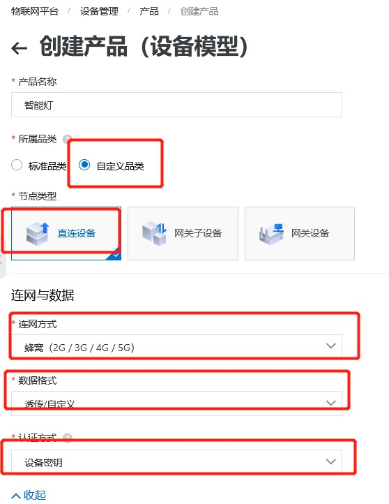
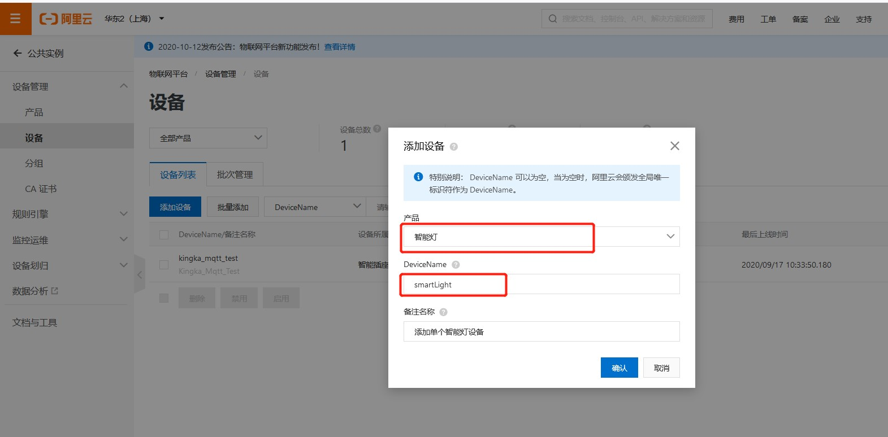
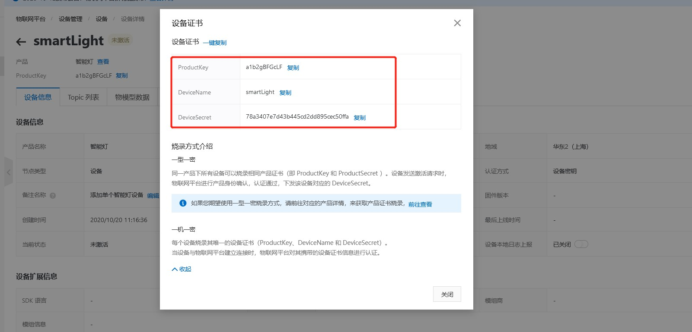
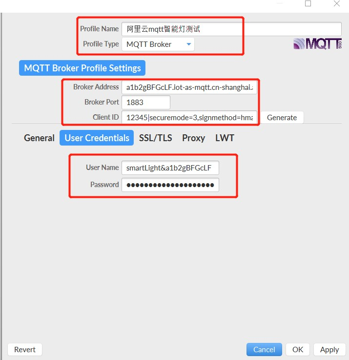
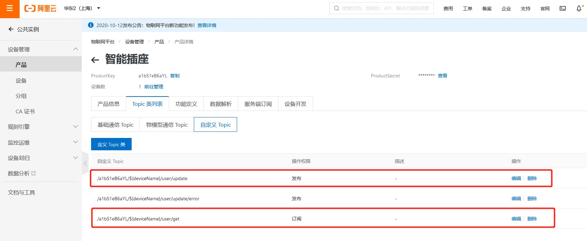
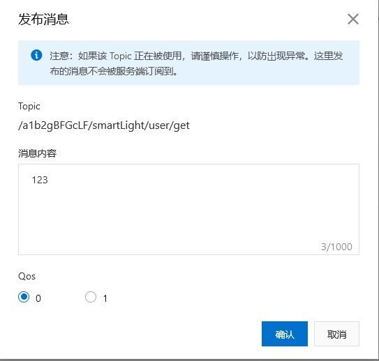
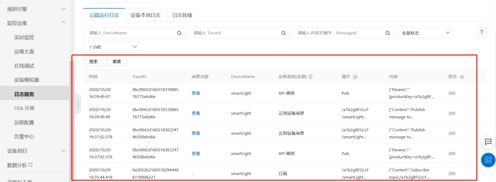
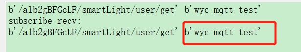

### 接入阿里云应用 开发指导

阿里云物联网平台介绍

阿里云物联网平台为设备提供安全可靠的连接通信能力，向下连接海量设备，支撑设备数据采集上云；向上提供云端API，服务端通过调用云端 API将命令下发至设备端，实现远程控制。物联网平台也提供了其他连接管理能力，如设备管理、规则引擎、安全能力等，为各类IoT 场景和行业开发者赋能。

阿里云物联网平台文档：<https://help.aliyun.com/product/30520.html>[。](https://help.aliyun.com/product/30520.html)开发者可以登录该网址进一步了解该物联网平台及设备接入相关知识。

#### 阿里云物联网平台关键的名词解释

如下表格中简单介绍了阿里云物联网平台中关键的名词解释，详细信息可参考阿里云官方文档（URL：
<https://help.aliyun.com/document_detail/30524.html>[）](https://help.aliyun.com/document_detail/30524.html)。

>   表 **1**：关键名词解释

| 关键名词      | 名词解释                                                     |
| ------------- | ------------------------------------------------------------ |
| 产品          | 设备的集合，通常指一组具有相同功能的设备。物联网平台为每个产品颁发全局唯一的 ProductKey。 |
| 设备          | 归属于某个产品下的具体设备。物联网平台为设备颁发产品内唯一的证书 DeviceName。设备可以直接连接物联网平台，也可以作为子设备通过网关连接物联网平台。 |
| 子设备        | 本质上也是设备。子设备不能直接连接物联网平台，只能通过网关连接。 |
| 网关          | 能够直接连接物联网平台的设备，且具有子设备管理功能，能够代理子设备连接云端。 |
| 设备证书      | 设备证书指 ProductKey、DeviceName、DeviceSecret 的组合，用于设备认证以及建立连接。 ProductKey：物联网平台为产品颁发的全局唯一标识。该参数很重要，在设备认证以及通信中都会用到，因此需要您保管好。 DeviceName：在注册设备时，自定义的或系统生成的设备名称，具备产品维度内的唯一性。该参数很重要，在设备认证以及通信中都会用到，因此需要您保管好。  DeviceSecret：物联网平台为设备颁发的设备密钥，和 DeviceName 成对出现。 该参数很重要，在设备认证时会用到，因此需要您保管好并且不能泄露。 |
| ProductSecret | 由物联网平台颁发的产品密钥，通常与 ProductKey 成对出现，用于一型一密的认证方案。该参数很重要，需要您保管好，不能泄露。 |
| 一机一密      | 每个设备烧录其唯一的设备证书（ProductKey、DeviceName 和 DeviceSecret）。当设备与物联网平台建立连接时，物联网平台对其携带的设备证书信息进行认证。 |
| 一型一密      | 同一产品下所有设备可以烧录相同的 ProductKey 和 ProductSecret。设备发送激活 请求时，物联网平台对其携带的 ProductKey 和 ProductSecret 进行认证，认证通过，下发该设备接入所需信息。设备再携带这些信息与物联网平台建立连接。 |
| 设备 ID²认证  | ID²（Internet Device ID）是一种物联网设备的可信身份标识，具备不可篡改、不可伪造、全球唯一等安全属性。物联网平台支持设备使用 ID²进行身份认证。 |
| Topic         | Topic 是 UTF-8 字符串，是设备发布（Pub）、订阅（Sub）消息的传输中介。 发布：设备可以往该 Topic 发布消息。 订阅：设备可以订阅该 Topic 获取消息。 |
| 规则引擎      | 通过创建、配置规则，以实现服务端订阅、数据流转和场景联动。   |
| 物模型        | 是对设备在云端的功能描述，包括设备的属性、服务和事件。物联网平台通过定义一种物的描述语言来描述物模型，称之为 TSL（即 Thing Specification Language），采用 JSON 格式，开发者可以根据 TSL 组装上报设备的数据。 |

#### 阿里云接口详解

**aLiYun**

>   该方法用于配置阿里云物联网套件的产品信息和设备信息。

-   函数原型

aLiYun(productKey, productSecret, DeviceName, DeviceSecret)

- 参数

  *productKey*：

  产品标识

  *productSecret*：产品密钥。可选参数，默认为 None。

  一机一密认证方案时，此参数传入
  None（不可以为空字符串）；一型一密认证方案时，此参数传入真实的产品密钥。

  *deviceName*：

  设备名称

  *deviceSecret*：设备密钥。可选参数，默认为
  None。一型一密认证方案时此参数传入 None。

   返回值

  返回阿里云连接对象。

**aLiYun.setMqtt**

>   该方法用于设置 MQTT 数据通道的参数。

>   aLiYun.setMqtt(clientID, clean_session, keepAlive)

- 参数

  *clientID*：

  自定义阿里云连接 ID

  *clean_session*：可选参数，一个决定客户端类型的布尔值。默认为 False。如果为
  True，那么代理将在其断开连接时删除有关此客户端的所有信息。如果为
  False，则客户端是持久客户端，当客户端断开连接时，订阅信息和排队消息将被保留。

  *keepAlive*：通信之间允许的最长时间段。范围：60~1200；单位：秒；默认：300。

- 返回值

  无

**aLiYun.setCallback**

>   该方法用于注册回调函数。

- 函数原型

  aLiYun.setCallback(sub_cb)

- 参数

  *sub_cb*：

  回调函数

- 返回值

  无

**aLiYun.subscribe**

>   该方法用于订阅 MQTT 主题。

>   aLiYun.subscribe(topic,qos)

- 参数

  *topic*：

  订阅的 Topic

  *qos*：

  MQTT 消息服务质量。默认值：0。可选择 0 或 1。

- 返回值

  无

**aLiYun.publish**

>   该方法用于发布消息。

- 函数原型

  aLiYun.publish(topic,msg)

- 参数

  *topic*：

  发布的 Topic

  *msg*：

  需要发送的数据

- 返回值

  无

**aLiYun.start**

>   该方法用于开始运行连接。 aLiYun.start()

- 参数

  无

- 返回值

  无

#### 使用 QuecPython 连接阿里云

创建产品与设备

>   使用阿里云物联网平台时，首先需要在云端创建产品和对应设备，获取设备证书（ProductKey、DeviceName 和DeviceSecret）。产品相当于一类设备的集合，同一产品下的设备具有相同的功能。将物联网平台颁发的设备证书烧录到设备上，用于设备连接物联网平台的身份验证。

步骤**1**：
登录阿里云物联网平台控制台[：](https://iot.console.aliyun.com/product)<https://iot.console.aliyun.com/product>[。](https://iot.console.aliyun.com/product)登陆后，依次点击“设备管理”、导航栏的“产品”开始创建产品并进行产品的参数配置。如下图所示：


>   图 **1**：创建产品

步骤**2**：
建议参考下图所示的参数进行配置。如需详细了解参数配置，可访问阿里云物联网平台官方地址：https://help.aliyun.com/document_detail/73728.html[。](https://help.aliyun.com/document_detail/73728.html)

创建完成后，点击“确认”保存配置。



>   图 **2**：创建产品参数配置参考

步骤**3**：
产品指某一类设备，创建产品后，需要为设备创建身份。用户可以创建单个设备，也可以批量创建设备。如下以创建单个设备为例进行详细介绍。依次点击“设备”、“添加设备”开始添加设备，如下图所示：



>   图 **3**：创建设备

步骤**4**：
设备创建成功后，将自动弹出“设备证书”窗口，可以查看、复制设备证书信息，如下图所示。设备证书由设备的ProductKey、DeviceName 和 DeviceSecret
组成，是设备与物联网平台进行通信的重要身份认证，请妥善保管。



>   图 **4**：设备证书信息

接入阿里云物联网平台

>   在接入阿里云物联网平台之前，请确认已在阿里云物联网平台控制台创建产品和设备，并获取设备证书信息（ProductKey、DeviceName
>   和 DeviceSecret）。

通过 MQTT.fx 接入阿里云物联网平台并进行测试

接入阿里云物联网平台

>   步骤**1**： 下载并安装 MQTT.fx 软件。

>   步骤**2**： 打开 MQTT.fx
>   软件，单击设置图标。


>   图 **5**：点击设置按钮

>   步骤**3**：
>   设置连接参数。物联网平台目前支持两种连接模式，不同模式设置参数不同。有关参数设置，
>   详见下表。

>   表 **2**：连接参数设置

| 参数名称     | 输入信息         |
| ------------ | ---------------- |
| Profile Name | 输入自定义名称。 |
| Profile Type | MQTT Broker      |

>   表示接入域名，应输入购买的实例的接入域名。请进入阿里云物联网平台控制台实例管理页面查看实例详情中的接入域名信息。

公共实例的接入域名为*${YourProductKey}.iot-as-mqtt.${YourRegionId}.aliyuncs.com*。

>   Broker Address

-   *${YourProductKey}*应替换为设备所属产品的ProductKey（可从物联网平台控制台设备详情页获取 ProductKey）。

-   参见地域和可用区，将*${YourRegionId}*替换为自定义的 Region ID。

| Broker Port | 1883                                                         |
| ----------- | ------------------------------------------------------------ |
| Client ID   | 填写 mqttClientId，用于 MQTT 的底层协议报文。格式固定：${clientId} |
|             | MAC 地址或 SN 码。 *securemode* 为安全模式，TCP 直连模式设置为 *securemode=3*，TLS 直连为 *securemode=2*。 *signmethod* 为算法类型，支持 hmacmd5 和 hmacsha1。 |
| General     | General 栏目下的设置项可保持系统默认，也可以根据具体需求设置。 |
| User Name   | 由设备名 DeviceName、符号（&）和产品 ProductKey 组成。固定格式：${YourDeviceName}&${YourProductKey}。完整示例如：device&alxxxxxxxxx。 |
| Password    | 下载 Password 生成小工具。 进入 <https://files.alicdn.com/tpsservice/88413c66e471bec826257781969d1bc7.zip> [解](https://files.alicdn.com/tpsservice/88413c66e471bec826257781969d1bc7.zip)压缩下载包后，双击 *sign* 文件，即可使用。使用 Password 生成小工具的输入参数：  productKey：设备所属产品 Key。可在控制台设备详情页查看。 deviceName：设备名称。可在控制台设备详情页查看。 deviceSecret：设备密钥。可在控制台设备详情页查看。 timestamp：（可选）时间戳。 clientId：设备的 ID 信息，与 Client ID 中*${clientId}*一致。 method：选择签名算法类型，与 Client ID 中 *signmethod* 确定的加密方法一致 |

>   备注

1. 输入 Client ID 信息后，请勿单击“**Generate**”。

2. TCP 直连时，Client ID 中 securemode=3，无需设置 SSL/TLS 信息。

3. TLS 直连时，Client ID 中 securemode=2，需要设置 SSL/TLS 信息。

4. 设置参数时，请确保参数值中或参数值的前后均没有空格。

   连接参数信息设置示例如下图所示：



>   图 **6**：配置参数

>   步骤**4**：
>   连接参数设置完成后，点击“**OK**”确认应用。然后点击“**Connect**”按钮连接阿里云物联网
>   平台。


>   图 **7**：设备详情页面

进行数据测试

下行数据测试

>   下行数据测试是指从阿里云物联网平台发送消息，在 MQTT.fx 上接收消息，测试
>   MQTT.fx 与物联网平台连接是否成功。

>   步骤**1**： 在 MQTT.fx 上，单击导航栏中的“**Subscribe**”。

>   步骤**2**： 输入一个设备具有订阅权限的自定义
>   Topic，单击“**Subscribe**”，订阅该 Topic，如下图所示。


>   图 **8**：订阅自定义 **Topic**



图 **9**：自定义 **Topic**

>   步骤**3**： 订阅成功后，该 Topic 将显示在列表中，如下图所示：


>   图 **10**：订阅成功

>   步骤**4**： 在物联网平台控制台中的该设备的设备详情的 Topic列表页下，单击已订阅的 Topic 对应的 发布消息。输入消息内容，单击“确认”。



>   图 **11**：物联网平台发布消息

>   步骤**5**： 登录 MQTT.fx
>   软件，查看是否接收到上一步骤输入的消息，如下图所示：


>   图 **12**：客户端接收到物联网平台消息

上行数据测试

上行数据测试是指在 MQTT.fx 上发送消息，通过物联网平台查看设备日志，测试MQTT.fx 与物联网平台连接是否成功。

>   步骤**1**： 在 MQTT.fx 上，单击导航栏的“**Publish**”。

>   步骤**2**： 输入一个设备具有发布权限的 Topic和需要发送的消息内容，单击“**Publish**”，向这个 Topic推送一条消息。如下图所示。


>   图 **13**：向物联网平台发布数据

>   步骤**3**：
>   在物联网平台控制台，依次点击“监控运维”、“日志服务”、“云端运行日志”，查看该设备的云消息。


>   图 **14**：查看消息内容

使用 QuecPython 接入阿里云物联网平台

>   在 EC100Y-CN上运行以下代码，运行方法详见《Quectel_QuecPython_基础操作说明》。

```python
 from aLiYun import aLiYun 
 import utime 
 productKey = "a1b2gBFGcLF" # 产品标识 
 productSecret = None # 产品密钥（一机一密认证此参数传入 None） 
 DeviceName = "smartLight" # 设备名称 
 DeviceSecret = "78a3407e7d43b445cd2dd895cec50ffa" # 设备密钥（一型一密认证此参数传入 None） 
 # 创建 aliyun 连接对象 
 ali = aLiYun(productKey, productSecret, DeviceName, DeviceSecret) # 设置 mqtt 连接属性 
 clientID = "12345" # 自定义字符（不超过 64） 
 ali.setMqtt(clientID, clean_session=False, keepAlive=300) # 回调函数 
 def sub_cb(topic, msg): 
 	print("subscribe recv:") 
 	print(topic, msg) 
 # 设置回调函数 
 ali.setCallback(sub_cb) 
 topic = "/a1b2gBFGcLF/smartLight/user/get" # 主题 
 # 订阅主题 
 ali.subscribe(topic) 
 topicP="/a1b2gBFGcLF/smartLight/user/update" # 发布消息 
 ali.publish(topic, "hell world") # 运行 
 ali.start() 
 utime.sleep(2) 
```

>   代码运行结果如下：

设备上行从阿里云物联网平台端查看日志，如下图所示：



图 **15**：查看消息内容

云端发布消息，设备在 *sub_cb* 回调函数中接收，如下图所示：


图 **16**：发送消息



#### 附录 A 参考文档及术语缩写

>   参考文档

Quectel_QuecPython_基础操作说明 QuecPython 上传下载文件说明

>   表 **4**：术语缩写

| 术语 | 英文全称 中文全称                                            |                          |
| ---- | ------------------------------------------------------------ | ------------------------ |
| API  | Application Programming Interface 应用程序编程接口           |                          |
| ID   | Mostly refers to Identifier in terms of 软件中多数指“标识符” software |                          |
| ID²  | Internet Device ID                                           | 物联网设备的可信身份标识 |
| IoT  | Internet of Things                                           | 物联网                   |
| MAC  | Medium Access Control                                        | 媒体访问控制             |
| MQTT | Message Queuing Telemetry Transport                          | 消息队列遥测传输         |
| SN   | Serial Number                                                | 序列号                   |
| TCP  | Transmission Control Protocol                                | 传输控制协议             |
| TLS  | Transport Layer Security                                     | 传输层安全（协议）       |
| TSL  | Thing Specification Language                                 | 物模型                   |

