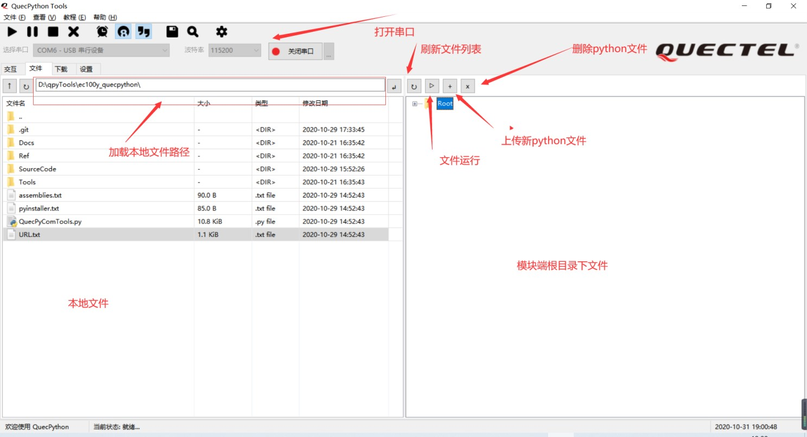

### QuecPython 基础操作说明

本文主要介绍 QuecPython 基础操作，包括文件系统以及指令执行。在 QuecPython中，使用主串口作为指令和数据接收通道，所有操作都通过主串口完成。

适用模块：

-   EC100Y-CN（本文以该模块为例进行介绍）

-   EC600S-CN

#### 系统启动

QuecPython 启动后，将在主串口启动交互式解释器，类似于 Linux Shell。通过该交互式解释器，用户可实时地执行命令，并查看返回的结果。


交互式解释器 

其中：

-   执行 **help(obj)**指令，查看帮助；

-   执行 **dir(obj)**指令，查看模块提供的详细方法；

-   执行**help('modules')**指令，查看当前支持的类库。系统启动时，除了进行硬件资源初始化外，还会进行分区挂载，执行初始化脚本操作。启动脚本主要包括两个：

-   *boot.py*：资源初始化等，如启动时挂载分区，该脚本被冻结在出厂固件中；

-   *main.py*：用户初始化脚本，系统初始化完成后执行。

#### 文件系统

在 QuecPython 中，划分了 5 MB
的空间作为用户分区，用户可以将一些配置、脚本等文件存储在该分区中。在系统启动时，会自动挂载该分区，该分区挂载在‘/’目录。

>   在 QuecPython 中，提供了对文件系统访问的类库*uos*，可用于操作和访问文件系统。
>   以下代码示例为如何在当前目录下创建文件、写入内容及读取内容。

```
import uos    # create a file
f=open('test.txt','w')  
f.write('hello quecpython!\n')  
f.write('123456789abcdefg!\n')  
f.close() # read a file 
f=open('test.txt', 'r') 
print(f.readline()) 
print(f.readline()) 
f.close() 
```


>   为方便操作，可使用 *QPYcom.exe* 工具进行常规的文件系统操作。

脚本下载

步骤 **1**：解压 SDK 压缩包内 *tools* 目录下的 *QPYcom.zip*，获取*QPYcom.exe*，并双击运行；

步骤**2**：进入“下载”Tab，点击“创建”按钮，根据需求创建用户项目；

步骤**3**：点击“**+**”按钮，选择需要下载到模块的脚本；

步骤 **4**：点击界面右下方倒三角按钮，切换到“下载脚本”模式；

步骤**5**：点击“**Download FW**”按钮，下载脚本；

步骤 **6**：进度条显示为“**100%**”时，表示下载完成，可进入“文件”Tab查看模块内文件详情。


>  **2**：脚本下载界面

查看文件

运行 *QPYcom.exe* 工具，点击“查看”-->“文件浏览”，可实现本地与模块进行 Python
文件的上传、查看、添加、删除操作，操作界面及按钮如下图所示。



本地与模块进行 **Python** 文件的上传、查看、添加、删除操作 

命令交互

运行 *QPYcom.exe*工具，点击“查看”-->“交互命令行”，进入交互主界面。在交互界面可以通过交互窗口与模块进行手动输入交互，交互主界面说明如图所示。


交互界面说明 

>  **4** 执行脚本

>   步骤 **1**：解压 SDK 压缩包内 *tools* 目录下的 *QPYcom.zip*，获取*QPYcom.exe*，并双击运行；
>   步骤 **2**：进入“文件”Tab；
>   步骤 **3**：点击下图红框所示按钮，执行脚本文件。


执行脚本界面 

#### 字节码编译

为了提高代码执行速度以及客户代码安全，移远通信提供了 mpy-cross 工具将用户 Python脚本编译为字节码。字节码可固化在固件中，也可以存放在文件系统中供脚本使用。详情请参考

>  《Quectel_QuecPython_mpy-cross 用户指导》

>   Python 脚本编译为字节码的命令为：

>   mpy-cross.exe -o test.mpy -s test.py -march=armv7m test.py

#### 附录 **A** 术语缩写

表 **1**：术语缩写

| 缩写 | 英文全称                                    | 中文全称           |
| ---- | ------------------------------------------- | ------------------ |
| UART | Universal Asynchronous Receiver/Transmitter | 通用异步收发传输器 |


