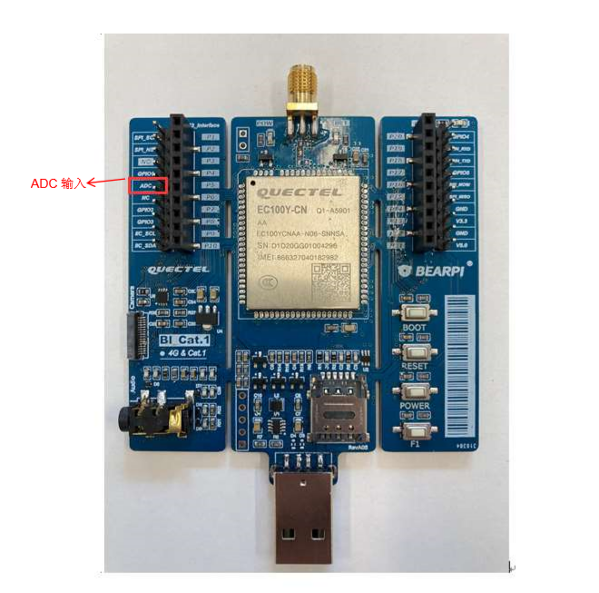
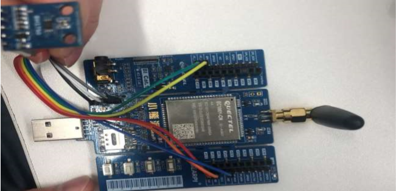

### 总线 使用指导

#### ADC 数模 转换 

​		数字信号和模拟信号转换器 ADC，称为数模转换器， CPU 本身是数字的，但是外 部的一些变量是模拟 的，所以需要利用数字技术处理外部模拟的物理量。 模拟信号，是一个连续的信号，现实生活中的时间，电 压，高度等就是模拟信号，反应在数学里就是无限细分的值。

​		数模转换就是把模拟信号按照一定精度进行采样，变成有限多个数字量，这个过程就是数模转换，数字 化之后就可以在计算机中用数字来描述模拟量，是计算机技术的基础，计算机所有参与运算的都是数字量， 如果参与计算的有模拟量，就需要使用数模转换器将模拟量转换为数字量来参与运算，同样，也 可以通过使 用有积分和微分效果的器件来将数字信号转换为模拟信号。

QuecPython 开发板中ADC输入引脚如下图所示 。 



​																		图 **1**： **ADC** 输入 引脚

将 GPIO1 串口和 ADC 串口连接 ， 在 QuecPython 中通过 *misc* 模块 ADC 类读取通道电压值 ，通过 *machine* 模块 *Pin* 类中 *Pin.write(value)*方法设置 PIN 脚电平，详细使用方法和 API 接口说明见 《Quectel_QuecPython_类库 API 说明 》。 

```python
from machine import Pin 
from misc import ADC 
adc = ADC 
adc.open() 

gpio1 = Pin(Pin.GPIO1, Pin.OUT, Pin.PULL_DISABLE, 0) 
gpio1.read()# 获取 gpio 的当前高低状态
gpio1.write(1) # 设置 gpio1 输出高 
adc.read(ADC.ADC0) 
gpio1.write(0) # 设置 gpio1 输出 低 
adc.read(ADC.ADC0) 
```

命令行运行结果可见 ADC通道电压变为 1.8 V，如 图所示： 


​																图 **2**： **ADC** 通道 电压变化 

#### UART

​		UART 是一种串行异步收发协议，应用十分广泛。 UART 工作原理是将数据的二进制位一位一位的进行

传输。在 UART 通讯协议中信号线上的状态位高电平代表 *1*，低电平代表 *0*。当然两个设备使用 UART 串 口通讯时，必须先约定好传输速率和一些数据位。

硬件连接比较简单，仅需要 3 条线，注意连接时若两个设备UART电平范围不一致请做电平转换后再 连接 。 

- TX：发送数据端，要接对面设备的 RX； 
- RX：接收数据端，要接对面设备的 TX； 
- GND：保证两设备共地，有统一的参考平面 。 


​																	图 **3**： **UART** 硬件连接 

在 EC100Y-CN 模块 上使用 UART 串口传输 数据时，需将发送数据端 TX 与 对面的 RX 相连 ，将接受数 据端 RX 与 对面的 TX 相连 ，在 QuecPython 中 通过 machine 模块 UART 类 可以实现串口数据传输功能 ， 详细使用方法和 API 接口说明见 《Quectel_QuecPython_类库 API 说明 》。 


​																	图 **4**： **UART API** 示例代码 

#### SPI通信 

SPI 协议是串行外围设备接口，是一种高速全双工的通信总线 。SPI 总线包含 4 条总线，分别为 SS、 SCK、MOSI、MISO。

（1）SS：片选信号线，当有多个 SPI 设备与 MCU 相连时，每个设备的这个片选信号线是与 MCU 单 独的引脚相连的，而其他的 SCK、MOSI、MISO 线则为多个设备并联到相同的 SPI 总线上，低电平有效。

（2）SCK：时钟信号线，由主通信设备产生。 不同的设备支持的时钟频率不一样，如 STM32 的 SPI 时钟频率最大为 f PCLK / 2。 

（3）MOSI：主设备输出 /  从设备输入引脚。主机的数据从这条信号线输出，从机由这条信号线读入 数据，即这条线上数据的方向为主机到从机。

（4）MISO：主设备输入 /  从设备输出引脚。主机从这条信号线读入数据，从机的数据则由这条信号 线输出，即在这条线上数据的方向为从机到主机。


​																图 **5**： **SPI** 硬件连接

#### I2C通信 

I2C 接口只有两根线， SCL 和 SDA： 

- SCL： 传输时钟信号，由主设备向从设备传输时钟信号。

- SDA： 传输数据信号，主从设备之间相互传递数据的通道 。 

I2C 属于串行通信，数据以 bit 为单位在 SDA 线上串行依次传输，同步工作状态，主从设备工作在同一 个时钟频率下，通过 SCL 线同步时钟， I2C 传输电平信号，不需要很高的速度，通信双方距离很近，所以 不需要差分信号来抗干扰， I2C 通常用在同一块板子上的两个 IC 之间的通信，数据量不大且速度较低。


​																		图 **6**： **I2C** 硬件连接

以下数据以 I2C 连接 光照传感器为例 。 




​																图 **7**： **I2C** 连接 光照传感器

#### 附录 术语缩写 

表 **1**： 术语缩写 

| ADC  | Analog-to-Digital Converter                 | 模数转换器             |
| ---- | ------------------------------------------- | ---------------------- |
| API  | Application Programming Interface           | 应用程序编程接口       |
| CPU  | Central Processing Unit                     | 中央处理器             |
| UART | Universal Asynchronous Receiver/Transmitter | 通用异步收发传输器     |
| GND  | Ground                                      | 地                     |
| IC   | Integrated Circuit                          | 集成电路               |
| I2C  | Inter-Integrated Circuit                    | 双向二线制同步串行总线 |
| LCD  | Liquid Crystal Display                      | 液晶显示屏             |
| MCU  | Microprogrammed Control Unit                | 微程序控制器           |
| MISO | Master In Slave Out                         | 主机输入从机输出       |
| MOSI | Master Out Slave In                         | 主机输出从机输入       |
| RX   | Receive                                     | 接收                   |
| TX   | Transmit                                    | 发送                   |
| SCK  | Serial Clock                                | 时钟信号线             |
| SCL  | Serial Clock Line                           | 串行 时钟线            |
| SDA  | Serial Data Line                            | 串行 数据线            |
| SPI  | Serial Peripheral Interface                 | 串行外设接口           |
| SS   | Slave Select                                | 片选信号线             |