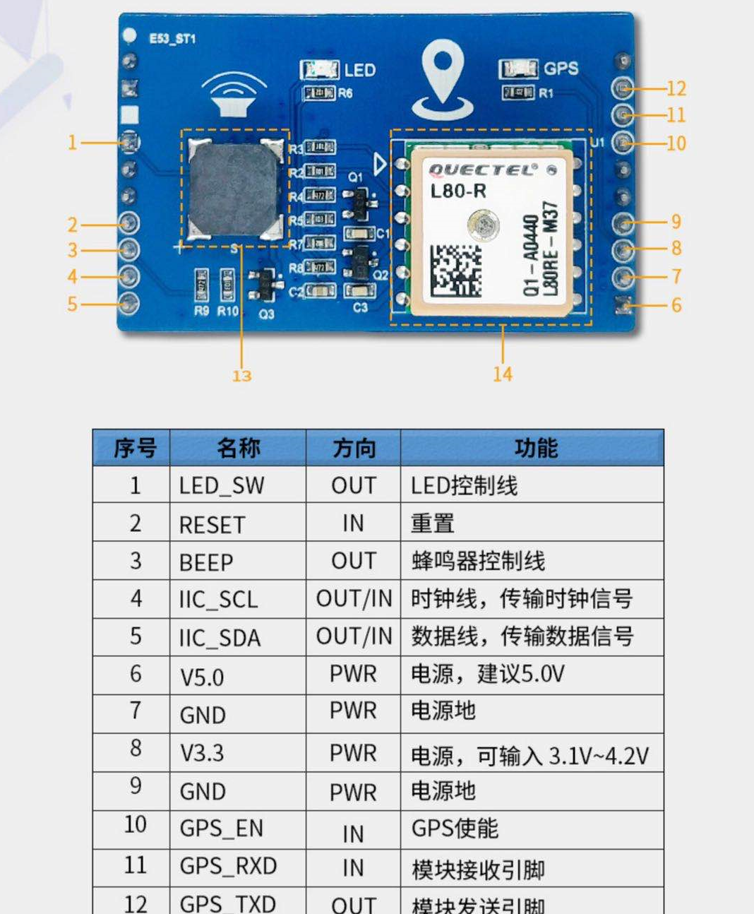
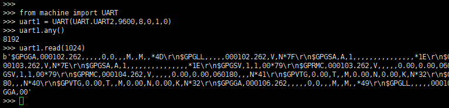

### GPS 使用指导

#### GPS概述

利用GPS定位卫星，在全球范围内实时进行[定位](https://baike.baidu.com/item/%E5%AE%9A%E4%BD%8D)、[导航](https://baike.baidu.com/item/%E5%AF%BC%E8%88%AA)的系统，称为全球卫星定位系统，简称GPS。NEMA-0183，是[GPS接收机](https://baike.baidu.com/item/GPS%E6%8E%A5%E6%94%B6%E6%9C%BA/3475821)应当遵守的标准协议，也是目前[GPS](https://baike.baidu.com/item/GPS/214654)接收机上使用最广泛的协议，大多数常见的GPS接收机、GPS数据处理软件、[导航软件](https://baike.baidu.com/item/%E5%AF%BC%E8%88%AA%E8%BD%AF%E4%BB%B6/1401586)都遵守或者至少兼容这个协议。GPS现已被广泛应用于[交通](https://baike.baidu.com/item/%E4%BA%A4%E9%80%9A/30183)、[测绘](https://baike.baidu.com/item/%E6%B5%8B%E7%BB%98/2271120)等许多行业。GPS的所有应用领域，都是基于定位、或从定位延伸出去的，主要包括：运动导航，轨迹记录、大地测量、周边信息查询等。

#### GPS模块使用流程

**准备工作**

**步骤1：**首先准备EC100Y-CN开发板和L80-R GPS模块，将L80-R GPS模块与开发板相连。注意使用时应处于室外环境以便于接收GPS信号。如下图所示：


L80-R GPS模块功能如下图所示：




**步骤2：**通过xshell工具连接开发板，进入交互页面，由上文模块功能图可知*GPS_EN*引脚对应的开发板上的串口为GPIO5，故通过GPIO5启动GPS功能。

​              执行代码如下：


**步骤3：**执行完以上代码后，即可看到模块的GPS指示灯常亮，同理也可以通过设置GPIO1的电压来点亮LED灯。

#### 数据处理

**步骤1：**启用模块的GPS功能后，GPS数据会通过模块的GPS_TXD串口发送到开发板中，接下来通过EC100Y-CN QuecPython的machine模块UART串口的数据传输           功能将数据输出，代码如下图所示：



machine模块的详细API接口说明请参考文档《Quectel QuecPython类库API说明》。


**步骤2：**然后，对接收的NMEA-0183协议定义的数据格式进行处理，这里需要处理的语句是$GNGGA。

​              例如： $GNGGA,092204.999,4250.5589,S,14718.5084,E,1,04,24.4,19.7,M,,,,0000*1F

字段0：$GPGGA，语句ID，表明该语句为Global Positioning System Fix Data（GPS定位信息）

字段1：UTC时间，hhmmss.sss，时分秒格式

字段2：纬度，ddmm.mmmm，度分格式（前导位数不足则补0）

字段3：纬度N（北纬）或S（南纬）

字段4：经度，dddmm.mmmm，度分格式（前导位数不足则补0）

字段5：经度E（东经）或W（西经）

字段6：GPS状态，0=未定位，1=非差分定位，2=差分定位，3=无效PPS，6=正在估算

字段7：正在使用的卫星数量（00~12）（前导位数不足则补0）

字段8：HDOP水平精度因子（0.5~99.9）

字段9：海拔高度（-9999.9~99999.9）

字段10：地球椭球面相对大地水准面的高度

字段11：差分时间（从最近一次接收到差分信号开始的秒数，如果不是差分定位将为空）

字段12：差分站ID号（0000~1023）（前导位数不足则补0，如果不是差分定位将为空）

字段13：校验值


**步骤3：**最后，运行以下代码获取GPS信息中的时间和经纬度，通过不断获取时间和经纬度可以实时追踪位置。

​              详细运行方法请参考文档《Quectel_QuecPython_基础操作说明》。


```python
from machine import UART  
import utime  
import modem  
import _thread  
uart = UART(2,115200,8,0,1,0)  
def gngga():  
while True:  
#获取当前RTC时间  
time = utime.localtime( )  
#获取设备IMET  
imei = modem.getDevImei( )  
if uart.any() > 0:  
buf = uart.read(uart.any())  
buf = str(buf,"utf8" )  
try :  
gngga1 = buf.split("$GNGGA,")[1].split("\r\n" )[0].split(",")  
# UTC时间，hhmmss.sss,时分秒格式  
time_gps = gngga1[0]  
#纬度ddmm.mmmm,度分格式前导位数不足则补0  
_latitude = float(gngga1[1])  
#经度dddmm.mmmm,度分格式前导位数不足则补0  
_longitude = float(gngga1[3])  
# UTC时间转化  
_Clock = int(time[0:2])  
_Minute = time[2:4]  
_Second = time[4:6]  
_Clock =_Clock + 8  
#防止超过24小时  
if (_Clock >= 24):  
_Clock = _Clock % 24  
#最终获得时间  
Effect_time = str(_clock) + ':' +_Minute + ':' +_Second  
#最终获得纬度  
Effect_latitude = int(_latitude / 100)+ ((_latitude % 100) / 60)  
#最终获得经度  
Effect_longitude = int(_longitude / 100) +((_longitude % 100)/ 60)  
print( '当前时间:',time)  
print( 'GPS时间:',Effect_time)  
print('设备IMET',imei)  
print(gngga1[2],'',str(Effect_latitude ))  
print(gngga1[4],'',str(Effect_longitude ))  

utime.sleep(2)  
except:  
print('数据格式有误或数据受损')  
continue  
def run():  
_thread.start_new_thread(gngga, ())  

run()
```


#### 附录

表1：术语缩写

| **缩写** | **英文全称**                       | **中文全称**         |
| -------- | ---------------------------------- | -------------------- |
| API      | Application Programming Interface  | 应用程序编程接口     |
| GPS      | Global Positioning System          | 全球定位系统         |
| GPIO     | General-Purpose Input/Output       | 通用型输入/输出      |
| GGA      | Global Positioning System Fix Data | 全球定位系统定位数据 |
| HDOP     | Horizontal Dilution of Precision   | 水平精度因子         |
| LED      | Light Emitting Diode               | 发光二极管           |