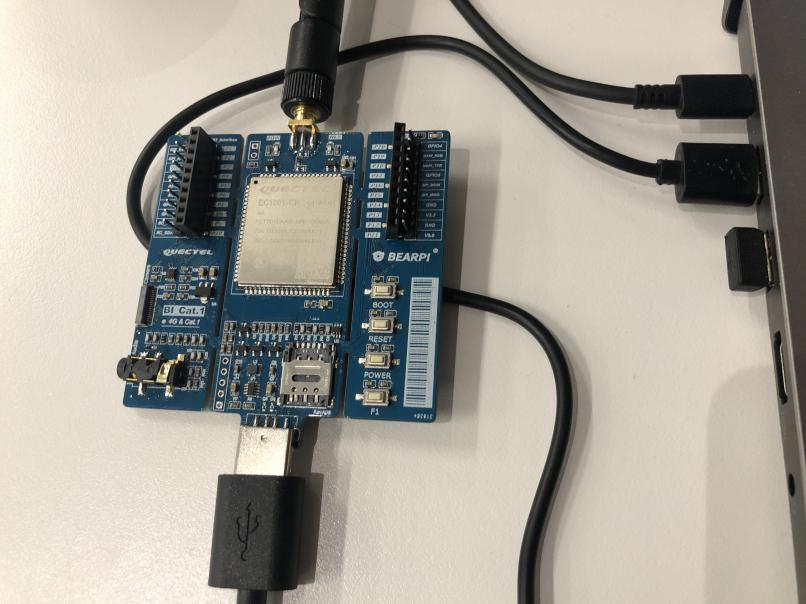
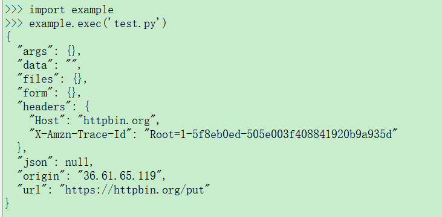
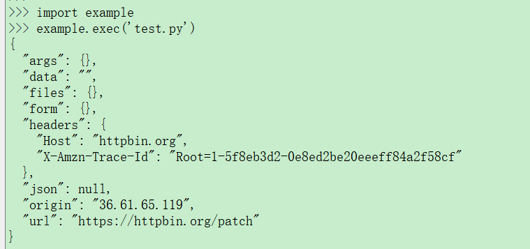
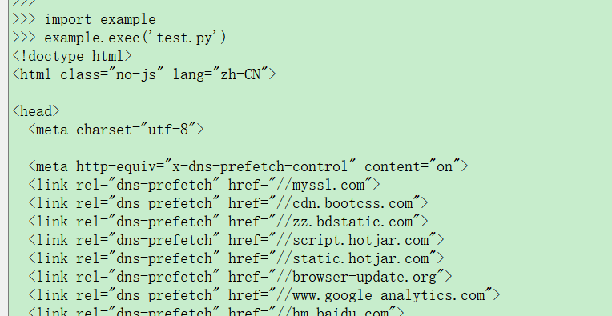

### HTTP应用 开发指导

#### **HTTP协议基础**

**HTTP协议**

HTTP协议是用于从万维网服务器传输超文本到本地浏览器的传送协议。基于TCP的应用层协议，它不关心数据传输的细节，HTTP（超文本传输协议）是一个基于请求与响应模式的、无状态的、应用层的协议，只有遵循统一的HTTP请求格式，服务器才能正确解析不同客户端发的请求，同样地，服务器遵循统一的响应格式，客户端才得以正确解析不同网站发过来的响应。

#### HTTP请求

HTTP请求由请求行、请求头、空行、请求体组成。

**请求行**

请求行由请求方式 + URL+ 协议版本组成。

-   常见的请求方法有GET、POST、PUT、DELETE、HEAD；

-   URL：客户端要获取的资源路径；

-   协议版本：客户端使用的HTTP协议版本号（目前使用的是http1.1）。

**请求头**

请求头是客户端向服务器发送请求的补充说明。

-   host：请求地址；

-   User-Agent：客户端使用的操作系统和浏览器的名称和版本；

-   Content-Length：发送给HTTP服务器数据的长度；

-   Content-Type：参数的数据类型；

-   Cookie：将cookie的值发送给HTTP 服务器；

-   Accept-Charset：浏览器可接受的字符集；

-   Accept-Language：浏览器可接受的语言；

-   Accept：浏览器可接受的媒体类型。

**请求体**

请求体携带请求参数。

-   application/json：{"name":"value","name1":"value2”}；

-   application/x-www-form-urlencoded： name1=value1&name2=value2；

-   multipart/from-data：表格形式；

-   text/xml；

-   content-type：octets/stream。

#### HTTP响应

HTTP响应由状态行、响应头、空行、响应体组成。

**状态行**

状态行由HTTP 版本号 + 响应状态码 + 状态说明组成。

响应状态码有1XX、2XX、3XX、4XX、5XX。

-   1XX：提示信息 - 表示请求已被成功接收，继续处理；

-   2XX：成功 - 表示请求已被成功接收，理解，接受；

-   3XX：重定向 - 要完成请求必须进行更进一步的处理；

-   4XX：客户端错误 - 请求有语法错误或请求无法实现；

-   5XX：服务器端错误 - 服务器未能实现合法的请求响应头。

**响应头**

响应头与请求头对应，是服务器对该响应的一些附加说明。

**响应体**

为真正的响应数据，即为网页的HTML源代码。

#### URL

URL是WWW的统一资源定位标志，就是指网络地址。

URL格式：https://host:port/path?xxx=aaa&ooo=bbb

其中：

-   http/https：这个是协议类型

-   host：服务器的IP地址或者域名

-   port：HTTP服务器的端口，默认端口是80

-   path：访问资源的路径

-   url里面的？这个符号是个分割线，用来区分问号前面的是path，问号后面的是参数

-   url-params：问号后面的是请求参数，格式：xxx=aaa。多个参数用&符号连接

#### HTTP协议请求方法

HTTP1.0定义了三种请求方法：GET、POST和HEAD方法。HTTP1.1新增了五种请求方法：OPTIONS、PUT、DELETE、TRACE和CONNECT方法。

-   GET：请求指定的页面信息，并返回实体主体。

-   POST：向指定资源提交数据进行处理请求，数据被包含在请求体中。

-   HEAD：返回的响应中没有具体的内容，用于获取报头。

-   OPTIONS：返回服务器针对特定资源所支持的HTTP请求方法，也可以利用向web服务器发送‘*’
    的请求来测试服务器的功能性

-   PUT：向指定资源位置上传其最新内容

-   DELETE：请求服务器删除Request-URL所标识的资源

-   TRACE：回显服务器收到的请求，主要用于测试或诊断

-   CONNECT：*HTTP1.1*协议中预留给能够将连接改为管道方式的代理服务器。

#### HTTP接口

**request.get**

该函数用于发送GET请求。

-   **函数原型**

request.get(url, data, json, headers) 

-   **参数**

*url*：网址，字符串类型。

*data*：（可选参数）附加到请求的正文，json字典类型，默认为None。

*json*：（可选参数）json格式用于附加到请求的主体，默认为None。

*headers*：（可选参数）请求头，默认为None。

-   **返回值**

返回请求对象

**request.post**

该函数用于发送POST请求。

-   **函数原型**

request.post(url, data, json, headers)

-   **参数**

*url*：网址，字符串类型。

*data*：（可选参数）附加到请求的正文，json字典类型，默认为None。

*json*：（可选参数）json格式用于附加到请求的主体，默认为None。

*headers*：（可选参数）请求头，默认为None。

-   **返回值**

返回请求对象

**request.put**

该函数用于发送PUT请求。

-   **函数原型**

request.put(url, data, json, headers)

-   **参数**

*url*：网址，字符串类型。

*data*：（可选参数）附加到请求的正文，json字典类型，默认为None。

*json*：（可选参数）json格式用于附加到请求的主体，默认为None。

*headers*：（可选参数）请求头，默认为None。

-   **返回值**

返回请求对象

**request.head**

该函数用于发送HEAD请求。

-   **函数原型**

request.head(url, data, json, headers)

-   **参数**

*url*：网址，字符串类型。

*data*：（可选参数）附加到请求的正文，json字典类型，默认为None。

*json*：（可选参数）json格式用于附加到请求的主体，默认为None。

*headers*：（可选参数）请求头，默认为None。

-   **返回值**

返回请求对象

**request.patch**

该函数用于发送PATCH请求。

-   **函数原型**

request.patch(url, data, json, headers)

-   **参数**	

*url*：网址，字符串类型。

*data*：（可选参数）附加到请求的正文，json字典类型，默认为None。

*json*：（可选参数）json格式用于附加到请求的主体，默认为None。

*headers*：（可选参数）请求头，默认为None。

-   **返回值**

返回请求对象

**request.delete**

该函数用于发送DELETE请求。

-   **函数原型**

request.delete(url, data, json, headers) 

-   **参数**

*url*：网址，字符串类型。

*data*：（可选参数）附加到请求的正文，json字典类型，默认为None。

*json*：（可选参数）json格式用于附加到请求的主体，默认为None。

*headers*：（可选参数）请求头，默认为None。

-   **返回值**

返回请求对象

**reponse类方法说明**

response =request.get(url)

| **方法**         | **说明**                                |
| ---------------- | --------------------------------------- |
| response.content | 返回响应的内容，以字节为单位            |
| response.text    | 以文本方式返回响应的内容，编码为unicode |
| response.json()  | 返回响应的json编码内容并转为dict类型    |
| response.close() | 关闭socket                              |

#### 示例

将QuecPython开发板连接至电脑，接入后的操作方法详见《Quectel_QuecPython_基础操作说明》。

开发板连接至电脑后，创建*test.py*文件，导入QuecPython的*request*模块，分别创建HTTP GET/PUT/POST/DELETE等请求代码，编写完成后，将文件上传到开发板内并运行*test.py*文件，方法详见《Quectel_QuecPython_基础操作说明》。示例代码及运行结果详见如下章节。

**请求POST**

-   **示例代码**

import request 

import ujson  

url = "http://httpbin.org/post" 

data = {"key1": "value1", "key2": "value2", "key3": "value3"}  

**POST请求** 

response = request.post(url, data=ujson.dumps(data)) 

print(response.text) 

-   **代码运行结果**

**请求GET**

-   **示例代码**

import request  

url = "http://httpbin.org/get"  

**GET请求**

response = request.get(url) 

print(response.text)

-   **代码运行结果**

**请求PUT**

-   **示例代码**

import request 

url = "http://httpbin.org/put"  

**PUT请求** 

response = request.put(url) 

print(response.text)

**请求**PATCH

-   **示例代码**

import request  

url = "http://httpbin.org/patch"  

**PATCH请求** 

response = request.patch(url) 

print(response.text)

-   **代码运行结果**

**请求DELETE**

-   **示例代码**

import request 

url = "http://httpbin.org/delete"  

**DELETE请求** 

response = request.delete(url) 

print(response.text)

-   **代码运行结果**

**请求HTTP连接**

-   **示例代码**

import request 

url = "https://myssl.com" 

**HTTPS请求** 

response = request.get(url) 

print(response.text)

-   **代码运行结果**

#### 附录A术语缩写

表1：术语缩写

| **缩写** | **英文全称**                      | **中文全称**     |
| -------- | --------------------------------- | ---------------- |
| API      | Application Programming Interface | 应用程序编程接口 |
| HTTP     | Hyper Text Transfer Protocol      | 超文本传输协议   |
| SDK      | Software Development Kit          | 软件开发工具包   |
| TCP      | Transmission Control Protocol     | 传输控制协议     |
| URL      | Uniform Resource Locator,         | 统一资源定位符   |
| WWW      | World Wide Web                    | 万维网           |