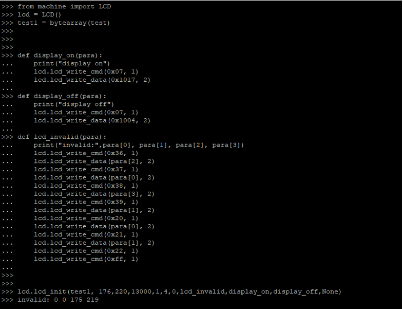
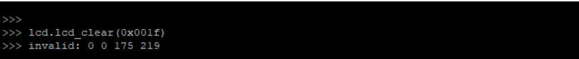

### LCD 使用指导

#### LCD相关接口

**创建LCD对象**

首先，导入machine模块下的LCD，然后创建LCD对象。有关示例代码，请参考以下代码清单：

```
from machine import LCD
lcd = LCD()
```

**lcd.lcd_init**

该方法用于初始化LCD。

**函数原型**

```
lcd.lcd_init(lcd_init_data, lcd_width, lcd_hight, lcd_clk, data_line, line_num, lcd_type, lcd_invalid,lcd_display_on, lcd_display_off, lcd_set_brightness)
```

**参数**

lcd_init_data：
传入LCD的配置命令

lcd_width：
LCD屏幕的宽度。宽度不超过 500 。

lcd_hight：
LCD屏幕的高度。高度不超过 500 。

lcd_clk：
LCD SPI时钟。SPI时钟为6.5K/13K/26K/52K。

data_line：
数据线数。参数值为 1 和 2 。
line_num：
线的数量。参数值为 3 和 4 。

lcd_type：
屏幕类型。 0 ：fstn； 1 ：rgb

lcd_invalid：
LCD写屏时xy的设置

lcd_display_on：
LCD屏亮

lcd_display_off：
LCD屏灭

lcd_set_brightness：
LCD设置亮度值。设置为none表示由LCD_BL_K控制亮度（有些屏幕是由寄存器控制屏幕亮度，有些是通过LCD_BL_K控制屏幕亮度）

**返回值**

0 成功

-1 已经初始化

-2 屏初始化参数错误（为空或过大（大于 1000 像素点））

-3 初始化参数解析错误

-4 屏幕缓存申请失败

-5 配置参数错误

**lcd.lcd_clear**

该方法用于清除屏幕。

函数原型

```
lcd.lcd_clear(color)
```

**参数**

color：
需要刷屏的颜色值

**返回值**

0 成功

-1 屏幕未初始化


**lcd.lcd_write**

该方法用于区域写屏。

**函数原型**

lcd.lcd_write(color_buffer,start_x,start_y,end_x,end_y)

**参数**

Color_buffer：
屏幕的颜色值缓存。

start_x：
起始x坐标

start_y：
起始y坐标

end_x：
结束x坐标

end_y：
结束y坐标

**返回值**

0 成功

-1 屏幕未初始化

-2 宽度和高度设置错误

-3 数据缓存为空

**lcd.lcd_brightness**

该方法用于设置屏幕亮度。

**函数原型**

```
lcd.lcd_brightness(level)
```

**参数**

level：
亮度等级。此处会调用lcd.lcd_init()中的lcd_set_brightness参数。若该参数为None，亮度调节则由
背光亮度调节引脚来控制。

**返回值**

0 成功

-1 屏幕未初始化


**lcd.lcd_display_on**

该方法用于设置亮屏。调用此接口后调用lcd.lcd_init()中的lcd_display_on回调。

**函数原型**

```
lcd.lcd_display_on ()
```

**参数**

无

**返回值**

0 成功

-1 屏幕未初始化

**lcd.lcd_display_off**

该方法用于灭屏设置。调用此接口后调用lcd.lcd_init()中的lcd_display_off回调。

**函数原型**

```
lcd.lcd_display_off ()
```

**参数**

无

**返回值**

0 成功

- 1 屏幕未初始化

**lcd.lcd_write_cmd**

该方法用于写入命令。

**函数原型**

```
lcd.lcd_write_cmd (cmd_value, cmd_value_len)
```

**参数**

cmd_value：
命令值

cmd_value_len：
命令值长度

**返回值**

0 				成功
其他值 	   失败

lcd.lcd_write_data

该方法用于写入数据。

**函数原型**

```
lcd.lcd_write_data (data_value, data_value_len)
```

**参数**

data_value：

数据值

data_value_len：
数据值长度

**返回值**

0 				成功
其他值 	   失败


#### LCD配置流程

**LCD硬件接线**

如下表所示，LCD引脚对应模块使用的LCD模块引脚，如下表所示：

表 1 ：引脚对应表

```
LCD引脚  				   LCD模块引脚
LCD_SPI_CLK  			gpio[20]
LCD_SPI_DOUT 			gpio[24]
LCD_SPI_CS  			gpio[22]
LCD_SPI_RS  			gpio[21]
LCD_SPI_RST  			gpio[26]
LCD_BL_K 				/
```

**编写屏幕初始化参数**

在交互式命令行窗口中键入以下内容，准备LCD屏幕初始化参数，参数格式为：类型+长度+参数值：

类型： 0 表示命令； 1 表示数据； 2 表示延时

长度：若类型为 0 ，则长度表示命令后的数据数量；若类型为 1 ，则长度表示数据的长度

参数值：对应值

以下以ili9225为例：

```
Ili9225_init = (
0,1,0x02, 			#命令，后接一个data, cmd值为0x
1,2,0x01,0x00, 		#数据，数据长度为 2 ， data值为0x
0,1,0x01,

1,2,0x01,0x1C,
0,1,0x03,
1,2,0x10,0x30,
0,1,0x08,
1,2,0x08,0x08,
0,1,0x0B,
1,2,0x11,0x00,
0,1,0x0C,
1,2,0x00,0x00,
0,1,0x0F,
1,2,0x14,0x01,
0,1,0x15,
1,2,0x00,0x00,
0,1,0x20,
1,2,0x00,0x00,
0,1,0x21,
1,2,0x00,0x00,
0,1,0x10,
1,2,0x08,0x00,
0,1,0x11,
1,2,0x1F,0x3F,
0,1,0x12,
1,2,0x01,0x21,
0,1,0x13,
1,2,0x00,0x0F,
0,1,0x14,
1,2,0x43,0x49,
0,1,0x30,
1,2,0x00,0x00,
0,1,0x31,
1,2,0x00,0xDB,
0,1,0x32,
1,2,0x00,0x00,
0,1,0x33,
1,2,0x00,0x00,
0,1,0x34,
1,2,0x00,0xDB,
0,1,0x35,
1,2,0x00,0x00,
0,1,0x36,
1,2,0x00,0xAF,
0,1,0x37,
1,2,0x00,0x00,
0,1,0x38,

1,2,0x00,0xDB,
0,1,0x39,
1,2,0x00,0x00,
0,1,0x50,
1,2,0x00,0x01,
0,1,0x51,
1,2,0x20,0x0B,
0,1,0x52,
1,2,0x00,0x00,
0,1,0x53,
1,2,0x04,0x04,
0,1,0x54,
1,2,0x0C,0x0C,
0,1,0x55,
1,2,0x00,0x0C,
0,1,0x56,
1,2,0x01,0x01,
0,1,0x57,
1,2,0x04,0x00,
0,1,0x58,
1,2,0x11,0x08,
0,1,0x59,
1,2,0x05,0x0C,
0,1,0x07,
1,2,0x10,0x17,
0,1,0x22,
)
Ili9225_init_data = bytearray(Ili9225_init)
```


**执行初始化接口**

本节以ili 9225 为例，演示如何驱动屏幕。

创建LCD对象

在交互式命令行窗口中键入以下命令，创建LCD对象。

```
from machine import LCD
lcd = LCD()
```

打开屏显

在交互式命令行窗口中键入以下命令，打开屏显：

```
def display_on(para):
	print("display on")
	lcd.lcd_write_cmd(0x07, 1)
	lcd.lcd_write_data(0x1017, 2)
```

关闭屏显

在交互式命令行窗口中键入以下命令，关闭屏显：

```
def display_off(para):
	print("display off")
	lcd.lcd_write_cmd(0x07, 1)
	lcd.lcd_write_data(0x1004, 2)
```

编写写屏时区域值

不同的LCD屏有不同的设置区域方式，故放置python层实现。在底层实现lcd_write时，会调用该函
数在交互式命令行窗口中键入以下命令，实现lcd_invalid：

```
def lcd_invalid(para):
    print("invalid:",para[0], para[1], para[2], para[3])
    lcd.lcd_write_cmd(0x36, 1)
    lcd.lcd_write_data(para[2], 2)
    lcd.lcd_write_cmd(0x37, 1)
    lcd.lcd_write_data(para[0], 2)
    lcd.lcd_write_cmd(0x38, 1)
    lcd.lcd_write_data(para[3], 2)
    lcd.lcd_write_cmd(0x39, 1)
    lcd.lcd_write_data(para[1], 2)
    lcd.lcd_write_cmd(0x20, 1)
    lcd.lcd_write_data(para[0], 2)
    lcd.lcd_write_cmd(0x21, 1)
    lcd.lcd_write_data(para[1], 2)
    lcd.lcd_write_cmd(0x22, 1)
    lcd.lcd_write_cmd(0xff, 1) #此0xff尤为重要，此值时配置区域完成的标志
```

初始化配置

在交互式命令行窗口中键入以下命令，实现LCD配置：


```
lcd.lcd_init(Ili9225_init_data,176,220,13000,1,4,0,lcd_invalid,display_on,display_off,None))
Ili9225_init_data：	2.1配置的初始化参数
176 ： 				lcd宽度
220 ： 				lcd高度
13000 ： 			spi clk
1 ： 				1 根数据线
4 ： 				4 根线
0 ： 				type， 0 表示rgb
lcd_invalid： 		区域写屏，设置范围
display_on： 		亮屏
display_off: 		 息屏
None: 				 表示LCD亮度由IO口控制
```

清屏

在交互式命令行窗口中键入以下命令，实现清屏：

```
lcd.lcd_clear(0x001f)
```

区域写屏

在交互式命令行窗口中键入以下命令，实现区域写屏：

```
test_buf = (
0x00,0x1f,0x00,0x1f,0x00,0x1f,0x00,0x1f,0x00,0x1f,0x00,0x1f,0x00,0x1f,0x00,0x1f,0x00,0x1f,0x00,
0x1f,
0x00,0x1f,0x00,0x1f,0x00,0x1f,0x00,0x1f,0x00,0x1f,0x00,0x1f,0x00,0x1f,0x00,0x1f,0x00,0x1f,0x00,
0x1f,
0x00,0x1f,0x00,0x1f,0x00,0x1f,0x00,0x1f,0x00,0x1f,0x00,0x1f,0x00,0x1f,0x00,0x1f,0x00,0x1f,0x00,
0x1f,
0x00,0x1f,0x00,0x1f,0x00,0x1f,0x00,0x1f,0x00,0x1f,0x00,0x1f,0x00,0x1f,0x00,0x1f,0x00,0x1f,0x00,
0x1f,
0x00,0x1f,0x00,0x1f,0x00,0x1f,0x00,0x1f,0x00,0x1f,0x00,0x1f,0x00,0x1f,0x00,0x1f,0x00,0x1f,0x00,
0x1f,
0x00,0x1f,0x00,0x1f,0x00,0x1f,0x00,0x1f,0x00,0x1f,0x00,0x1f,0x00,0x1f,0x00,0x1f,0x00,0x1f,0x00,
0x1f,
0x00,0x1f,0x00,0x1f,0x00,0x1f,0x00,0x1f,0x00,0x1f,0x00,0x1f,0x00,0x1f,0x00,0x1f,0x00,0x1f,0x00,
0x1f,
0x00,0x1f,0x00,0x1f,0x00,0x1f,0x00,0x1f,0x00,0x1f,0x00,0x1f,0x00,0x1f,0x00,0x1f,0x00,0x1f,0x00,
0x1f,
0x00,0x1f,0x00,0x1f,0x00,0x1f,0x00,0x1f,0x00,0x1f,0x00,0x1f,0x00,0x1f,0x00,0x1f,0x00,0x1f,0x00,
0x1f,
```

```
0x00,0x1f,0x00,0x1f,0x00,0x1f,0x00,0x1f,0x00,0x1f,0x00,0x1f,0x00,0x1f,0x00,0x1f,0x00,0x1f,0x00,
0x1f,
0x00,0x1f,0x00,0x1f,0x00,0x1f,0x00,0x1f,0x00,0x1f,0x00,0x1f,0x00,0x1f,0x00,0x1f,0x00,0x1f,0x00,
0x1f,
0x00,0x1f,0x00,0x1f,0x00,0x1f,0x00,0x1f,0x00,0x1f,0x00,0x1f,0x00,0x1f,0x00,0x1f,0x00,0x1f,0x00,
0x1f,
0x00,0x1f,0x00,0x1f,0x00,0x1f,0x00,0x1f,0x00,0x1f,0x00,0x1f,0x00,0x1f,0x00,0x1f,0x00,0x1f,0x00,
0x1f,
0x00,0x1f,0x00,0x1f,0x00,0x1f,0x00,0x1f,0x00,0x1f,0x00,0x1f,0x00,0x1f,0x00,0x1f,0x00,0x1f,0x00,
0x1f,
0x00,0x1f,0x00,0x1f,0x00,0x1f,0x00,0x1f,0x00,0x1f,0x00,0x1f,0x00,0x1f,0x00,0x1f,0x00,0x1f,0x00,
0x1f,
0x00,0x1f,0x00,0x1f,0x00,0x1f,0x00,0x1f,0x00,0x1f,0x00,0x1f,0x00,0x1f,0x00,0x1f,0x00,0x1f,0x00,
0x1f,
0x00,0x1f,0x00,0x1f,0x00,0x1f,0x00,0x1f,0x00,0x1f,0x00,0x1f,0x00,0x1f,0x00,0x1f,0x00,0x1f,0x00,
0x1f,
0x00,0x1f,0x00,0x1f,0x00,0x1f,0x00,0x1f,0x00,0x1f,0x00,0x1f,0x00,0x1f,0x00,0x1f,0x00,0x1f,0x00,
0x1f,
0x00,0x1f,0x00,0x1f,0x00,0x1f,0x00,0x1f,0x00,0x1f,0x00,0x1f,0x00,0x1f,0x00,0x1f,0x00,0x1f,0x00,
0x1f,
0x00,0x1f,0x00,0x1f,0x00,0x1f,0x00,0x1f,0x00,0x1f,0x00,0x1f,0x00,0x1f,0x00,0x1f,0x00,0x1f,0x00,
0x1f,
)
test_buf1 = bytearray(test_buf)
lcd.lcd_write(test_buf1,10,10,20,20)
```

备注

因设计原因，该示例目标显示为0x001f（蓝色），当前为0x1f00。

#### LCD执行示例

本章节以ili9225为例，汇总LCD流程脚本命令以及执行结果。

LCD流程脚本命令

```
test=(
0,1,0x02,
1,2,0x01,0x00,
0,1,0x01,
1,2,0x01,0x1C,
0,1,0x03,
1,2,0x10,0x30,
0,1,0x08,
1,2,0x08,0x08,
0,1,0x0B,
1,2,0x11,0x00,
0,1,0x0C,
1,2,0x00,0x00,
0,1,0x0F,
1,2,0x14,0x01,
0,1,0x15,
1,2,0x00,0x00,
0,1,0x20,
1,2,0x00,0x00,
0,1,0x21,
1,2,0x00,0x00,
0,1,0x10,
1,2,0x08,0x00,
0,1,0x11,
1,2,0x1F,0x3F,
0,1,0x12,
1,2,0x01,0x21,
0,1,0x13,
1,2,0x00,0x0F,
0,1,0x14,
1,2,0x43,0x49,

0,1,0x30,
1,2,0x00,0x00,
0,1,0x31,
1,2,0x00,0xDB,
0,1,0x32,
1,2,0x00,0x00,
0,1,0x33,
1,2,0x00,0x00,
0,1,0x34,
1,2,0x00,0xDB,
0,1,0x35,
1,2,0x00,0x00,
0,1,0x36,
1,2,0x00,0xAF,
0,1,0x37,
1,2,0x00,0x00,
0,1,0x38,
1,2,0x00,0xDB,
0,1,0x39,
1,2,0x00,0x00,
0,1,0x50,
1,2,0x00,0x01,
0,1,0x51,
1,2,0x20,0x0B,
0,1,0x52,
1,2,0x00,0x00,
0,1,0x53,
1,2,0x04,0x04,
0,1,0x54,
1,2,0x0C,0x0C,
0,1,0x55,
1,2,0x00,0x0C,
0,1,0x56,
1,2,0x01,0x01,
0,1,0x57,
1,2,0x04,0x00,
0,1,0x58,
1,2,0x11,0x08,
0,1,0x59,
1,2,0x05,0x0C,
0,1,0x07,
1,2,0x10,0x17,
0,1,0x22,
)


from machine import LCD
lcd = LCD()
test1 = bytearray(test)

def display_on(para):
print("display on")
lcd.lcd_write_cmd(0x07, 1)
lcd.lcd_write_data(0x1017, 2)

def display_off(para):
print("display off")
lcd.lcd_write_cmd(0x07, 1)
lcd.lcd_write_data(0x1004, 2)

def display_light(para):
print("display_light")
lcd.lcd_write_cmd(0x13, 1)
lcd.lcd_write_data(para, 2)

def lcd_invalid(para):
print("invalid:",para[0], para[1], para[2], para[3])
lcd.lcd_write_cmd(0x36, 1)
lcd.lcd_write_data(para[2], 2)
lcd.lcd_write_cmd(0x37, 1)
lcd.lcd_write_data(para[0], 2)
lcd.lcd_write_cmd(0x38, 1)
lcd.lcd_write_data(para[3], 2)
lcd.lcd_write_cmd(0x39, 1)
lcd.lcd_write_data(para[1], 2)
lcd.lcd_write_cmd(0x20, 1)
lcd.lcd_write_data(para[0], 2)
lcd.lcd_write_cmd(0x21, 1)
lcd.lcd_write_data(para[1], 2)
lcd.lcd_write_cmd(0x22, 1)
lcd.lcd_write_cmd(0xff, 1)

lcd.lcd_init(test1, 176,220,13000,1,4,0,lcd_invalid,display_on,display_off,display_light)

test_buf = (
0x00,0x1f,0x00,0x1f,0x00,0x1f,0x00,0x1f,0x00,0x1f,0x00,0x1f,0x00,0x1f,0x00,0x1f,0x00,0x1f,0x00,
0x1f,
0x00,0x1f,0x00,0x1f,0x00,0x1f,0x00,0x1f,0x00,0x1f,0x00,0x1f,0x00,0x1f,0x00,0x1f,0x00,0x1f,0x00,
0x1f,

0x00,0x1f,0x00,0x1f,0x00,0x1f,0x00,0x1f,0x00,0x1f,0x00,0x1f,0x00,0x1f,0x00,0x1f,0x00,0x1f,0x00,
0x1f,
0x00,0x1f,0x00,0x1f,0x00,0x1f,0x00,0x1f,0x00,0x1f,0x00,0x1f,0x00,0x1f,0x00,0x1f,0x00,0x1f,0x00,
0x1f,
0x00,0x1f,0x00,0x1f,0x00,0x1f,0x00,0x1f,0x00,0x1f,0x00,0x1f,0x00,0x1f,0x00,0x1f,0x00,0x1f,0x00,
0x1f,
0x00,0x1f,0x00,0x1f,0x00,0x1f,0x00,0x1f,0x00,0x1f,0x00,0x1f,0x00,0x1f,0x00,0x1f,0x00,0x1f,0x00,
0x1f,
0x00,0x1f,0x00,0x1f,0x00,0x1f,0x00,0x1f,0x00,0x1f,0x00,0x1f,0x00,0x1f,0x00,0x1f,0x00,0x1f,0x00,
0x1f,
0x00,0x1f,0x00,0x1f,0x00,0x1f,0x00,0x1f,0x00,0x1f,0x00,0x1f,0x00,0x1f,0x00,0x1f,0x00,0x1f,0x00,
0x1f,
0x00,0x1f,0x00,0x1f,0x00,0x1f,0x00,0x1f,0x00,0x1f,0x00,0x1f,0x00,0x1f,0x00,0x1f,0x00,0x1f,0x00,
0x1f,
0x00,0x1f,0x00,0x1f,0x00,0x1f,0x00,0x1f,0x00,0x1f,0x00,0x1f,0x00,0x1f,0x00,0x1f,0x00,0x1f,0x00,
0x1f,
0x00,0x1f,0x00,0x1f,0x00,0x1f,0x00,0x1f,0x00,0x1f,0x00,0x1f,0x00,0x1f,0x00,0x1f,0x00,0x1f,0x00,
0x1f,
0x00,0x1f,0x00,0x1f,0x00,0x1f,0x00,0x1f,0x00,0x1f,0x00,0x1f,0x00,0x1f,0x00,0x1f,0x00,0x1f,0x00,
0x1f,
0x00,0x1f,0x00,0x1f,0x00,0x1f,0x00,0x1f,0x00,0x1f,0x00,0x1f,0x00,0x1f,0x00,0x1f,0x00,0x1f,0x00,
0x1f,
0x00,0x1f,0x00,0x1f,0x00,0x1f,0x00,0x1f,0x00,0x1f,0x00,0x1f,0x00,0x1f,0x00,0x1f,0x00,0x1f,0x00,
0x1f,
0x00,0x1f,0x00,0x1f,0x00,0x1f,0x00,0x1f,0x00,0x1f,0x00,0x1f,0x00,0x1f,0x00,0x1f,0x00,0x1f,0x00,
0x1f,
0x00,0x1f,0x00,0x1f,0x00,0x1f,0x00,0x1f,0x00,0x1f,0x00,0x1f,0x00,0x1f,0x00,0x1f,0x00,0x1f,0x00,
0x1f,
0x00,0x1f,0x00,0x1f,0x00,0x1f,0x00,0x1f,0x00,0x1f,0x00,0x1f,0x00,0x1f,0x00,0x1f,0x00,0x1f,0x00,
0x1f,
0x00,0x1f,0x00,0x1f,0x00,0x1f,0x00,0x1f,0x00,0x1f,0x00,0x1f,0x00,0x1f,0x00,0x1f,0x00,0x1f,0x00,
0x1f,
0x00,0x1f,0x00,0x1f,0x00,0x1f,0x00,0x1f,0x00,0x1f,0x00,0x1f,0x00,0x1f,0x00,0x1f,0x00,0x1f,0x00,
0x1f,
0x00,0x1f,0x00,0x1f,0x00,0x1f,0x00,0x1f,0x00,0x1f,0x00,0x1f,0x00,0x1f,0x00,0x1f,0x00,0x1f,0x00,
0x1f,
)
test_buf1 = bytearray(test_buf)

lcd.lcd_write(test_buf1,10,10,20,20)

lcd.lcd_clear(0xf800) //红色
```


LCD流程脚本执行结果

LCD流程脚本执行结果分别如图所示：







#### 附录术语缩写

表 2 ：术语缩写

| 缩写 | 英文全称                    | 中文全称     |
| ---- | --------------------------- | ------------ |
| LCD  | Liquid Crystal Display      | 液晶显示器   |
| SPI  | Serial Peripheral Interface | 串行外设接口 |

