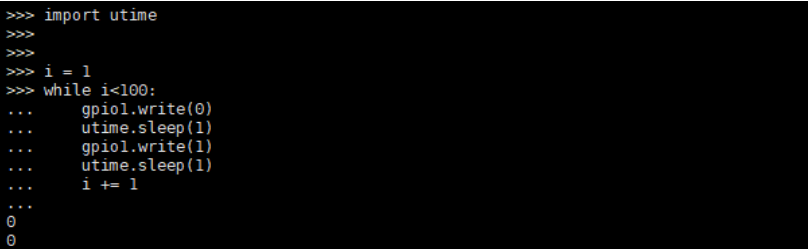
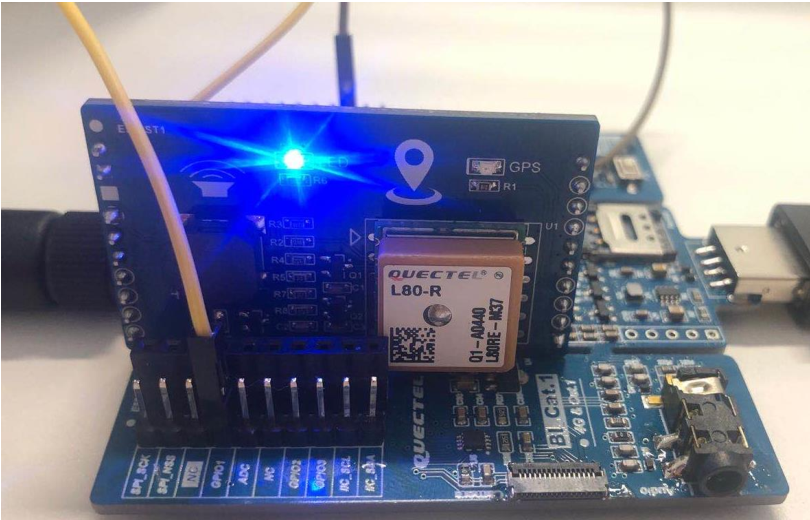

### LED 使用指导

#### 基本概述

在使用LED功能之前，需要先了解开发板的GPIO串口，GPIO即通用I/O端口。GPIO即开发板的引脚输出输入功能。输出功能，即控制引脚变高和变低；输入功能，即检测引脚上的电平是高电平还是低电平。当需要控制引脚为高电平或低电平时，即使用GPIO的输出功能使用。例如，控制LED灯的亮灭时，需要通过控制输出的高低电平来实现LED灯的亮灭。

以EC100Y-CN模块为例，如图所示为GPIO串口：


​																				图 1 ：GPIO串口


#### LED功能实现

​     	在开发板中实现LED功能需要用到QuecPython中的Pin类功能，以EC100Y-CN模块为例，将模块
的LED控制线与开发板的GPIO1串口相连，再将模块V3.3串口与开发板的V3.3串口相连，为模块供电。连接完成后给开发板上电。

步骤 1 ： 首先导入machine模块，创建GPIO对象。代码示例如下：

```
from machine import Pin
gpio1 = Pin(GPIO1, Pin.OUT, Pin.PULL_DISABLE, 0)
```


GPIOn 				整型。引脚号。
							引脚对应关系如下：
							GPIO 1 – 引脚号 22
							GPIO2–引脚号 23
							GPIO3–引脚号 178
							GPIO4–引脚号 199
							GPIO5–引脚号 204

direction 			整型。
							IN 输入模式
							OUT 输出模式

pullMode 			整型。
								PULL_DISABLE 浮空模式
								PULL_PU 上拉模式
								PULL_PD 下拉模式

level 整型。		引脚电平。
								0 设置引脚为低电平
								1 设置引脚为高电平

步骤 2 ： 获取引脚电压，执行代码如下：

```
gpio1.read()
```

步骤 3 ： 设置引脚电平。执行代码如下：

```
gpio1.write(1)
```


步骤 4 ： 通过给引脚设置一串变化的电压来实现LED灯的闪烁效果。执行代码如下：

```
import utime
i = 1

while i<100：
	gpio1.write(0)
	utime.sleep(1)
	gpio1.write(1)
	utime.sleep(1)
	i += 1
```




​	运行以上代码后即可观察到EC100Y-CN模块的LED灯每隔 1 秒闪烁，并且可通过修改代码和连接多

组外设实现更多功能。



​																			图 2 ：LED灯闪烁

备注

```
以上部分代码可见于移远通信提供的SDK工具包中，路径为modules/gpio/example_pin.py。
```

#### 附录

表 1 ：术语缩写


| 缩写 	| 英文全称 							| 中文全称         |
| ----- | --------------------------------- | ---------------- |
| GPIO 	| General-Purpose Input/Output 		| 通用型输入/输出  |
| LED 	| Light Emitting Diode 				| 发光二极管       |
| SDK 	| Software Development Kit 			| 软件开发工具包   |


