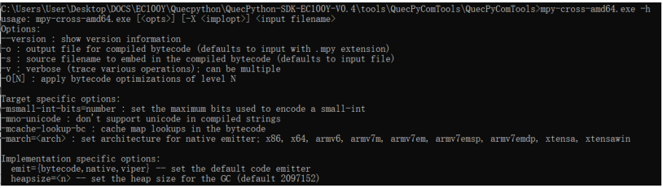
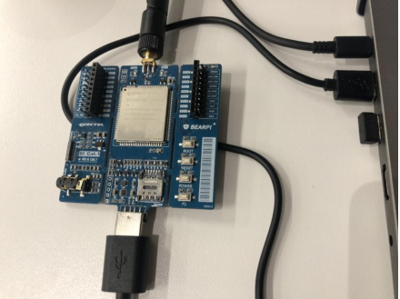
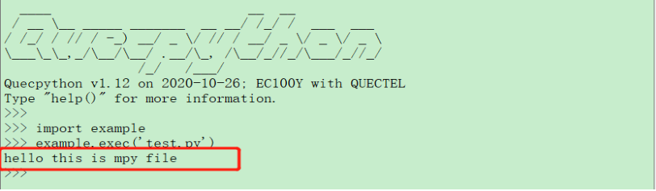

### mpy-cross工具 使用指导

#### **工具介绍**

在Python中，可将.py文件编译为.pyc文件。编译后的.pyc文件是二进制格式，可加快加载速度，更重要的是可以保护原始代码。micropython使用mpy-cross工具完成.py文件编译并加密，编译后的文件为.mpy。

**文件说明**

**.py文件**
Python源代码文件

**.pyc文件**
二进制文件，Python源代码文件经过编译后生成的字节码文件。.pyc文件加载速度有所提高，且pyc是一种跨平台的字节码，由Python虚拟机来执行。

**.mpy文件**
Micropython提供mpy-cross工具，用于将Python源代码文件编译成.mpy文件。该文件和.pyc文件均为二进制字节码文件。

**参数说明**



​														图 1 ：mpy-cross参数使用说明 图片索引

**备注**

可访问如下链接获取更多有关工具mpy-cross的说明：
https://pypi.org/project/mpy-cross/1.9.3/
https://makeblock-micropython-api.readthedocs.io/zh/latest/novapi/tutorial/precompiled_to_mpy.html

#### 工具使用

1. 连接EC100Y-CN开发板至电脑，如下图所示。接入后操作方法详见《Quectel_QuecPython_基础操作说明》。

   

   ​															图 2 ：开发板接入电脑

2. 使用mpy-cross-amd64.exe工具。在工具同目录下编写usertest.py文件，文件内编写测试函数，
   如下所示：

   ```
   def test_mpy():
   	print(“hello this is mpy file”)
   ```

   

3. 打开Windows下cmd命令行，进入mpy-cross-amd64.exe工具所在目录，如下图所示。

   

   ​														图 3 ：命令行进入工具目录


4. 随后执行如下命令及参数生成.mpy文件：

   ```
   mpy-cross-amd64.exe -mno-unicode usertest.py
   ```

   生成的.mpy如下图所示

   

   ​																	图 4 ：mpy文件

5. 在test.py文件中使用import导入usertest模块，直接调用usertest文件中的方法，如下所示：

   ```
   import usertest
   usertest.test_mpy()
   ```

   

6. 把test.py文件和usertest.mpy文件分别上传到移远通信EC100Y-CN开发板内，上传方法详见
   《Quectel_QuecPython_基础操作说明》。

   

7. 在开发板中运行test.py文件，可看到经过mpy-cross工具加密过的usertest模块执行结果，如下
   图所示。

   

   ​																图 5 ：test.py运行结果

