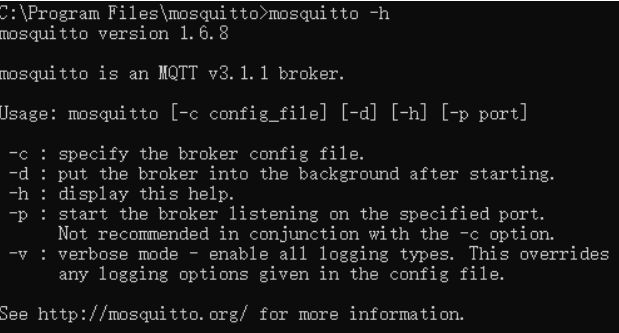
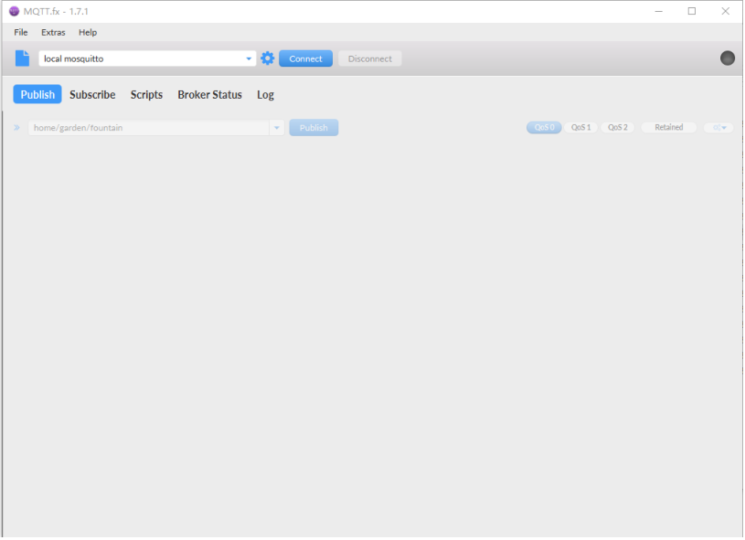
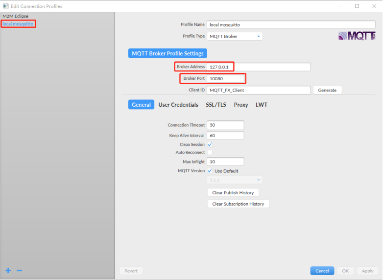
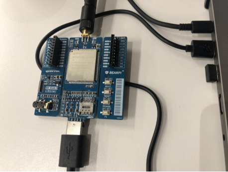

### MQTT应用 开发指导

#### MQTT概述

**MQTT简介**

MQTT是基于代理的发布/订阅模式通讯协议，具有开放、简单、轻量和易于实现等特点。MQTT最大优点在于，可以以极少的代码和有限的网络带宽，为远程设备连接提供实时可靠的消息服务。由于规范简单，适合对低功耗要求严格和网络带宽有限的物联网场景，例如：遥感数据、汽车、智能家居、智慧城市和医疗医护等。

**MQTT设计原则**

MQTT协议遵循以下设计原则：

1.  功能精简。

2.  采用发布/订阅（Pub/Sub）模式，方便消息传递。
3.  允许用户动态创建主题，降低运营成本。
4.  降低传输量至最低，提高传输效率。
5.  关注低带宽、高延迟、不稳定的网络等因素。
6.  支持连续会话控制。
7.  对客户端计算能力包容性强。
8.  提供服务质量管理。
9.  对传输数据的类型与格式无强制要求，保持灵活性。

**MQTT业务场景**

运用MQTT协议，设备可以方便地连接到物联网云服务，管理设备并处理数据，最后应用到各种业务场景，如下图所示：


图 1 ：MQTT业务场景

**MQTT发布/订阅模式**

发布/订阅模式提供传统客户端-服务器体系结构的替代方法。在客户端服务器模型中，客户端直接与端点进行通信。发布/订阅模型解耦了发送消息的客户端（发布者）与接收消息的客户端（订阅者）之间的关系，二者并不直接建立联系。发布者与订阅者之间由第三个组件（代理）进行连接，代理过滤所有传入的消息，并将其正确分发给订阅者。

发布/订阅模式优点如下：

​		1. 发布者与订阅者无需互相知悉，只需使用同一个代理即可。

​		2. 发布者和订阅者无需交互，发布者不必因等待订阅者确认而导致锁定。

​		3. 发布者和订阅者无需同时在线，可自由选择时间发布/接收消息。

**MQTT协议原理**


​															图 2 ：MQTT协议原理图示

1. 实现MQTT协议需要：客户端和服务器端。

2. MQTT协议中有三种身份：发布者（Publisher）、代理（Broker）、订阅者（Subscriber）。其

中，消息的发布者和订阅者都是客户端，消息代理是服务器，消息发布者可以同时是订阅者。

3. MQTT传输的消息分为：主题（Topic）和负载（Payload）两部分：
   	Topic，可以理解为消息的类型，订阅者订阅后，就会收到该主题的消息内容；
       		Payload，可以理解为消息的内容，是指订阅者具体要使用的内容。

**MQTT中的相关方法**

​		MQTT中定义了一些方法（或动作），来于表示对确定资源所进行操作。这个资源可以代表预先存在的数据或动态生成数据，这取决于服务器的实现。通常来说，资源是指服务器上的文件或输出：

 Connect，等待与服务器建立连接；
 Disconnect，等待MQTT客户端完成所做的工作，并与服务器断开TCP/IP会话；
 Subscribe，等待完成订阅；
 UnSubscribe，等待服务器取消客户端的一个或多个topics订阅；
 Publish，MQTT客户端发送消息请求，发送完成后返回应用程序线程。

**MQTT主题**

​		MQTT通过主题对消息进行分类。主题一般是一个UTF- 8 的字符串，可通过符号“/”表示层级关系。主题可直接使用，无需再次创建。主题还可以通过通配符进行过滤，其中，“+”用于过滤一个层级，“#”一般位于主题后表示过滤任意级别的层级。示例如下：

1. building-b/floor- 5 ：代表B楼 5 层的设备。
2. +/floor- 5 ：代表任何一个楼的 5 层的设备。
3. building-b/#：代表B楼所有的设备。

备注

MQTT允许使用通配符订阅主题，但并不允许使用通配符广播。


**MQTT服务质量**

MQTT支持三种不同级别的服务质量，为不同场景保证消息传输的可靠性。

​		级别 0 ：最多一次。

​				消息发送者仅发送一次，不会重复发送。一般用于传输不重要数据的场景。

​	 	级别 1 ：至少一次。

​				消息发送者发送消息以后，若未收到消息接收者的确认信息，则会再次发送，直到接收到消息接受者的确认信息。这种情况可能导致重复消息。一般用于日志处理的场景。

 		级别 2 ：只发送一次。

​				消息发送者发送消息以后等待消息接收者的确认消息，接收到确认消息后消息发送者删除消息并通知消息接收者。如此会减少并发或者增加延时，但是若数据丢失或者重复消息不可接受时，可

设置为级别 2 。


#### MQTT API

**MQTTClient**

该函数用于构建MQTT连接对象。

函数原型

```
MQTTClient(client_id, server, port=0, user=None, password=None, keepalive=0, ssl=False,ssl_params={})
```


参数

client_id：

字符串类型。客户端ID，具有唯一性，也可能是经过加密处理后的client_id，例如阿里云。

server：
字符串类型。服务端地址，可以是IP或者域名。

port：
（可选）整型。服务器端口，默认为 1883 ，通过SSL/TLS的MQTT的默认端口是 8883 。

user：
（可选）字符串类型。在服务器上注册的用户名，也可能是经过加密处理的用户名，例如阿里云。

password：
（可选）字符串类型。在服务器上注册的密码，也可能是经过加密处理的密 码，例如阿里云。

keepalive：
（可选）整型。客户端的keepalive超时值。默认为 60 秒，范围为60~120秒。

ssl：
（可选）布尔型。是否使能支持SSL/TLS。

ssl_params：
（可选）字符串类型。SSL/TLS参数。


返回值

MQTT对象。


**MQTTClient.set_callback**

该函数用于设置回调函数。

函数原型

```
MQTTClient.set_callback(callback)
```

参数

```
callback：
消息回调函数。
```

返回值

无。


**MQTTClient.connect**

该函数用于与服务器建立连接。

函数原型

```
MQTTClient.connect(clean_session=True)
```

参数

clean_session：
布尔型。可选参数，一个决定客户端类型的布尔值。如果为True，那么代理将在其断开连接时删除有
关此客户端的所有信息。如果为False，则客户端是持久客户端，当客户端断开连接时，订阅信息和排
队消息将被保留。默认为False。

返回值

无。

**MQTTClient.disconnect**

该函数用于与服务器断开连接。

函数原型

```
MQTTClient.disconnect()
```

参数

无。

返回值

无。


**MQTTClient.ping**

该函数用于向服务器发送ping包，检测保持连通性。

函数原型

```
MQTTClient.ping()
```

参数

无。

返回值

无。


**MQTTClient.publish**

该函数用于发布消息。

函数原型

```
MQTTClient.publish(topic,msg)
```

参数

topic：
字符串类型。消息主题。

msg：
字符串类型。需要发送的数据。

返回值

无。


**MQTTClient.subscribe**

该函数用于订阅MQTT主题。

函数原型

```
MQTTClient.subscribe(topic,qos)
```

参数

topic：
字符串类型。MQTT主题。

msg：
字符串类型。MQTT消息服务质量，默认为 0 ，可选择 0 或 1 。

返回值

无。

**MQTTClient.check_msg**

该函数用于检查服务器是否有待处理消息。

函数原型

```
MQTTClient.check_msg()
```

参数

无。

返回值

无。


**MQTTClient.wait_msg**

该函数用于等待服务器消息响应。

函数原型

```
MQTTClient.wait_msg()
```

参数

无。

返回值

无。


**MQTTClient.set_last_will**

​		该函数用于设置要发送给服务器的遗嘱，客户端没有调用disconnect()异常断开，则发送通知到客户端。

函数原型

```
MQTTClient.set_last_will(topic,msg,retain=False,qos=0)
```

参数

topic：
字符串类型。遗嘱主题。

msg：
字符串类型。遗嘱内容。

retain：
布尔型。retain=True boker会一直保留消息，默认为False。

qos：
整型。消息服务质量，范围为0~2。

返回值

无。


#### MQTT开发说明

**MQTT服务器搭建和测试**

​	上位机安装MQTT服务器，即消息代理。本文档以mosquitto开源消息代理软件为例。

**搭建MQTT服务器**

1. Linux系统通过以下命令进行安装。
2. Windows系统访问https://mosquitto.org/download/下载适配版本的.exe安装包。

以Windows 系统为例，安装完成后进入 mosquitto 安装目录，启动命令行执行如下命令，查看
mosquitto的用法：

```
mosquitto -h
```



​															图 3 ：mosquitto帮助信息

​		上图中的两个关键参数-c和-p，-c用于指定MQTT服务的配置，-p用于指定服务端口。

**启动MQTT服务器**

​		启动MQTT 服务器前，要确保服务器所在网络能够被设备访问。在命令行中键入以下命令，启动

MQTT服务：

```
mosquitto -c mosquitto.conf -p 10080 –v
```

​		测试阶段，配置文件直接使用安装目录下的默认配置即可；本测试本地端口使用 10080 。


​														图 4 ：MQTT服务器启动成功

**验证MQTT服务器有效性**

**安装MQTT客户端**

本文档以MQTT.fx的客户端为例。访问http://mqttfx.bceapp.com，下载并安装客户端软件。

安装完成后，打开MQTT.fx，默认进入发布界面，如下图所示：



​																		图 5 ：MQTT.fx启动界面

**配置MQTT客户端**

​		点击上图中配置按钮 ，添加MQTT连接配置。

​		配置界面默认添加了m2m.eclipse.org和mosquitto服务的配置。可修改任意配置，主要修改“Broker
Address”（代理地址）和“Broker Port”（代理端口）两项。亦可点击配置界面左下角的加号，添加自定义服务连接配置。

​			配置选项“General”、“User Credentials”、“SSL/TLS”、“Proxy”和“LWT”，可根据服务
器的要求进行配置，包括连接超时时间、保活时间间隔、MQTT协议版本、用户名/密码及SSL相关配置。

本文中采用默认配置。



​																			图 6 ：MQTT连接配置

**MQTT交互测试**

1. 建立MQTT连接

​      在 MQTT.fx 启动后进入的默认界面点击“Connect”按钮，建立 MQTT 连接。连接成功后mosquitto服务器打印的日志请参考MQTT服务器与客户端交互。连接成功后即可发布消息、订阅主题，默认已填充待订阅和发布的消息主题。


​														图 7 ：MQTT服务器与客户端交互


​														图 8 ：发布消息


​														图 9 ：订阅主题

​		MQTT允许用户动态创建主题，也可动态修改主题。将待订阅和发布的消息主题配置一致，如此可实现回显功能。客户端向服务器发布的消息可立即分发至到客户端。


#### 使用MQTT进行数据发布订阅

本测试采用echo功能作为测试示例。

步骤 1 ： 开发板接入电脑，接入后详细操作方法，请参考《Quectel_QuecPython_基础操作说明》。



​															图 10 ：接入开发板

步骤 2 ： 建立test.py文件，导入umqtt模块，我们以连接mq.tongxinmao.com网址为例创建以下代
码：

```python
from umqtt import MQTTClient
state = 0
def sub_cb(topic, msg):
	global state
	print("subscribe recv:")
	print(topic, msg)
	state = 1

#创建一个mqtt实例
c = MQTTClient("umqtt_client", "mq.tongxinmao.com", '18830')
#设置消息回调
c.set_callback(sub_cb)
#建立连接

c.connect()
#订阅主题
c.subscribe(b"/public/TEST/quecpython")
print("Connected to mq.tongxinmao.com, subscribed to /public/TEST/quecpython topic" )
#发布消息
c.publish(b"/public/TEST/quecpython", b"my name is Kingka!")
print("Publish topic: /public/TEST/quecpython, msg: my name is Quecpython")

while True:
	c.wait_msg() #阻塞函数，监听消息
	if state == 1:
		break

#关闭连接
c.disconnect()
```


备注

也 可 以 通过访 问 通 信 猫 在 线 客 户 端 服 务 器 进 行 MQTT 验 证 ：

http://www.tongxinmao.com/txm/webmqtt.php。


​														图 11 ：通信猫在线客户端服务器


步骤 3 ： 将 test.py 文件上传至 EC1 00 Y-CN QuecPython 开发板内，详细上传方法请参考
《Quectel_QuecPython_基础操作说明》。


步骤 4 ： 在开发板中运行test.py文件，即可以看到模块执行结果，如下图所示：


#### 附录

表 1 ：术语缩写

| 缩写 | 英文全称                            | 中文全称           |
| ---- | ----------------------------------- | ------------------ |
| API  | Application Programming Interface   | 应用程序编程接口   |
| IP   | Internet Protocol                   | 网际互连协议       |
| MQTT | Message Queuing Telemetry Transport | 消息队列遥测传输   |
| SSL  | Secure Sockets Layer                | 安全套接层         |
| TLS  | Transport Layer Security            | 传输层安全（协议） |


