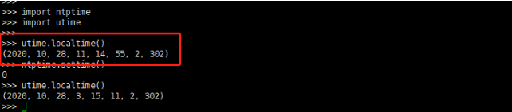

### NTP 使用指导

####  概述

​		NTP又称网络时间协议，用于同步计算机时间的一种协议。该协议可以使计算机对其服务器或时钟源（如石英钟，GPS等等）进行同步，同时提供高精准度的时间校正（LAN上与标准时间差小于 1 毫秒，WAN上与标准时间差大约有几十毫秒），且可介由加密确认的方式来防止恶毒的协议攻击。NTP的目的是在无序的互联网环境中提供精确和健壮的时间服务。

​		NTP提供准确时间，首先要有准确的时间来源，即国际标准时间UTC。NTP获得UTC的时间来源可

以是原子钟、天文台、卫星，也可以从互联网上获取。时间按NTP服务器的等级传播，按照离外部UTC时间源的远近将所有服务器归入不同的Stratum（层）中。Stratum- 1 在顶层，有外部UTC接入；Stratum- 2从Stratum- 1 获取时间；Stratum- 3 从Stratum- 2 获取时间，......，以此类推，但Stratum的总数限制在 15以内。所有这些服务器在逻辑上形成阶梯式的架构相互连接，而Stratum- 1 的时间服务器是整个系统的基础。计算机主机一般同多个时间服务器连接，利用统计学的算法过滤来自不同服务器的时间，以选择最佳的路径和来源来校正主机时间，即使主机在长时间无法与某一时间服务器相联系的情况下，NTP服务依然有效运转。

​		为防止对时间服务器的恶意破坏，NTP使用了识别(Authentication)机制，检查来对时的信息是否是真正来自所宣称的服务器并检查资料的返回路径，以提供对抗干扰的保护机制。NTP时间同步报文中包含的时间是格林威治时间，是从 1900 年开始计算的秒数。

#### 功能实现

NTP对时需要从NTP服务器上获取时间，故在实现NTP对时功能之前需连接网络。本文档以通过SIM

卡进行联网为例。

1. 准备一张可用的Nano SIM卡，滑动打开开发板上SIM卡槽，放入SIM卡后合上卡槽盖子并通电，
   等待自动拨号。以EC100Y-CN为例，SIM卡槽位置如图所示：

   

   ​															图 1 ：插入SIM卡

   自动拨号后，可通过如下方法验证是否拨号成功：


​															图 2 ：自动拨号成功验证

2. 拨号成功后，导入ntptime模块

   ```
   import ntptime
   ntptime.host
   ```

   

   返回当前的NTP服务器，默认为"ntp.aliyun.com"。

   

   ​														图 3 ：当前NTP服务器

3. 设置NTP服务器。设置成功返回 0 ，设置失败返回- 1 。

   ```
   ntptime.sethost(host)
   ```

   

   ​														图 4 ：设置NTP服务器

4. 同步NTP时间。同步成功返回 0 ，同步失败返回- 1 。

   ```
   ntptime.settime()
   ```

   ​		对时结果可使用utime.localtime()验证。执行utime.localtime()后返回当前时间，返回值为一个元组：(year, month, mday, hour, minute, second, weekday, yearday)。详细说明请参考《QuectelQuecPython类库API说明》。

   ​		ntptime.settime()对时后返回时间为UTC时间，北京时间领先UTC八个小时，所以对时后，对比当前时间可发现时间后退八小时。

   

   ​																		图 5 ：对时成功


#### 附录术语缩写

表 1 ：术语缩写

|术语 		 | 英文描述 					     | 中文描述   |
| ---------- | --------------------------------- |----------- |
| GPS 		| Global Positioning System 			| 全球定位系统|
| LAN 		| Local Area Network 					| 局域网|
| NTP 		| Network Time Protocol				 | 网络时间协议|
| RTC 		| Real_Time Clock 					| 实时时钟|
| SIM 		| Subscriber Identity Module 			| 用户身份识别模块|
| UTC 		| Coordinated Universal Time 			| 协调世界时|
| WAN 		| Wide Area Network 					| 广域网|

