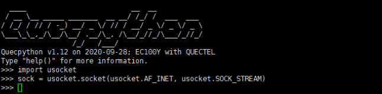

### Socket应用 开发指导

#### Socket概述

​		所谓Socket（套接字），就是对网络中不同主机上的应用进程之间进行双向通信的端点的抽象。一个Socket就是网络上进程通信的一端，提供了应用层进程利用网络协议交换数据的机制。从所处的地位来讲，Socket上联应用进程，下联网络协议栈，是应用程序通过网络协议进行通信的接口，是应用程序与网络协议根进行交互的接口。

​		Socket可以看成是两个网络应用程序进行通信时，各自通信连接中的端点，这是一个逻辑上的概念。它是网络环境中进程间通信的API（应用程序编程接口），也是可以被命名和寻址的通信端点，使用中的每一个Socket都有其类型和一个与之相连进程。通信时其中一个网络应用程序将要传输的一段信息写入它所在主机的Socket中，该Socket通过与网络接口卡（NIC）相连的传输介质将这段信息送到另外一台主机的Socket中，使对方能够接收到这段信息。Socket是由IP地址和端口结合的，提供向应用层进程传送数据包的机制。

**Socket的应用**

​		Socket可以使一个应用从网络中读取和写入数据，不同计算机上的两个应用可以通过连接发送和接受字节流，注意，当发送消息时，需要知道对方的IP和端口。在日常生活中有很多应用场景，当你浏览网页时，浏览器进程怎么与web服务器进程通信；当你用QQ聊天时，QQ进程怎么与服务器或好友所在的QQ进程通信，这些都是通过socket来实现的。

#### QuecPython Socket API详解

​		Socket起源于Unix，而Unix/Linux基本哲学之一就是“一切皆文件”，都可以用“打开（open）→
读写（write/read）→关闭（close）”模式来操作。在实现过程中服务端可以看作是web服务器，客户端可以看作是要访问web服务器的浏览器，访问过程就可以和打开→读写→关闭一一对应。

​		QuecPython类库中通过usocket实现Socket功能，usocket 模块提供对BSD套接字接口的访问。该模块实现相应CPython模块的子集，更多信息请参阅CPython文档：socket。其中usocket对Socket功能的具体流程及实现的相关API介绍如下。

**usocket.socket**

​		该函数用于服务端或客户端创建一个Socket对象。

函数原型

```
sock=usocket.socket(usocket.AF_INET, usocket.SOCK_STREAM)
```

参数

usocket.AF_INET：
网络协议，IPv

usocket.SOCK_STREAM：
对应TCP的流式Socket。更多常量定义详见Quectel QuecPython 类库API说明。

返回值

无。

**usock.getaddrinfo**

​		该函数用于将主机域名（host）和端口（port）转换为用于创建套接字的 5 元组序列，元组结构如下：
(family, type, proto, canonname, sockaddr)

函数原型

```
usocket.getaddrinfo(host, port)
```

参数

host：
主机域名。

port：
端口。

返回值

无。


**sock.bind**

​		该函数用于将Socket对象和服务端IP：端口绑定。由于TCP口是动态的，客户端无需进行绑定。使用该函数之前，Socket必须未进行绑定。

函数原型

```
sock.bind(address)
```

参数

address：
由地址端口号组成的列表或者元组。

返回值

无。


**sock.listen**

​		该函数允许服务端接受Socket连接，可指定最大连接数。

函数原型

```
sock.listen(backlog)
```

参数

backlog：
接受的最大Socket连接数，至少为 0 。

返回值

无。


**sock.accept**

​		该函数用于服务端接受客户端连接请求。

函数原型

```
(conn, addres) = sock.accept()
```

参数

无。

返回值

返回元组，包含新的Socket和客户端地址，形式为：(conn, address)。

conn：
新的Socket对象，用来发送和接收数据。

address：
连接到服务器的客户端地址。


**sock.connect**

​		客户端使用该函数连接到指定地址的服务器。

函数原型

```
sock.connect(address)
```

参数

address：
连接到客户端的服务端地址。

返回值

无。


**2.3.7. sock.recv**

​		该函数用于接受客户端或服务端发送的数据。

函数原型

```
recv_data = sock.recv(bufsize)
```

参数

bufsize：
一次接收的最大数据量。

返回值

返回值是一个字节对象，表示接收到的数据。


**sock.send**

​		该函数用于发送数据到服务端或客户端。

函数原型

```
sock.send(send_data.encode("utf8"))
```

参数

send_data：
表示要发送的数据。

返回值

返回实际发送的字节数。

备注

​		TCP协议的Socket是基于字节流的，通过Socket发送数据之前，需先使用encode("utf8")对数据进行编码，其中"utf8"为编码方式。


**sock.close**

​		该函数用于关闭Socket通信。

函数原型

```
sock.close()
```

参数

无。

返回值

无。


**sock.read**

​		该函数用于从Socket中读取size字节数据，如果没有指定size，则会从套接字读取所有可读数据，直到读取到数据结束。

函数原型

```
socket.read([ size ])
```

参数

[ size ]：
要读取的字节数。

返回值

字节对象。


**sock.readinto**

​		该函数用于将字节读取到缓冲区中。

函数原型

```
sock.readinto(buf [ , nbytes ])
```

参数

buf：
存放读取字节的缓冲区。

nbytes：
读取的字节数。

返回值

实际读取的字节数。


**sock.readline**

​		该函数用于按行读取数据，遇到换行符结束。

函数原型

```
sock.readline()
```

参数

无。

返回值

返回读取的数据行。


**sock.write**

​		该函数用于向缓存区写入数据。

函数原型

```
sock.write(buf)
```

参数

buf：
写入缓冲区的数据。

返回值

返回实际写入的字节数。


**sock.sendall**

​		该函数用于将所有数据都发送到Socket。

函数原型

```
sock.sendall(bytes)
```

参数

bytes：
缓存buffer，存放bytes型数据。

返回值

无。


**sock.sendto**

​		该函数用于将数据发送到Socket。该Socket不应连接到远程Socket，因为目标Socket是由address指定的。

函数原型

```
sock.sendto(bytes, address)
```

参数

bytes：
缓存buffer，存放bytes型数据。

address：

包含地址和端口号的元组或列表。

返回值

无。


**sock.recvfrom**

​		该函数用于从Socket接收数据。返回一个元组，包含字节对象和地址。

函数原型

```
socket.recvfrom(bufsize)
```

参数

bufsize：
接收的缓存数据。

返回值

返回一个元组，包含字节对象和地址，形式为：(bytes, address)。

bytes：
接收数据的字节对象。

address：

发送数据的Socket的地址。


**sock.setsockopt**

​		该函数用于设置socket选项的值。

函数原型

```
socket.setsockopt(level, optname, value)
```

参数

level：
socket选项级别。

optname：
socket选项。

value：
既可以是一个整数，也可以是一个表示缓冲区的bytes类对象。

返回值

无。


**sock.setblocking**

​		该函数用于设置Socket为阻塞模式或者非阻塞模式。如果flag为false，则将Socket设置为非阻塞模式，否则设置为阻塞模式。

函数原型

```
socket.setblocking(flag)
```

参数

flag：
Ture 阻塞模式
False 非阻塞模式

返回值

无。


**sock.settimeout**

​		该函数用于设置Socket的超时时间，单位：秒。

函数原型

```
socket.settimeout(value)
```

参数

value：
		可以是秒的非负浮点数，也可以是None。如果将其设置为一个非零值，OSError在该操作完成之前已超过超时时间值，则随后的Socket操作将引发异常；如果将其设置为零，则将Socket置于非阻塞模式。如果未指定该值，则Socket将处于阻塞模式。

返回值

无。


**Socket.makefile**

​		该函数用于生成一个文件与socket对象关联，之后即可像读取普通文件一样使用socket。（普通文件的操作有open和write等。）

函数原型

```
socket.makefile(mode='rb')、
```

参数

mode：
二进制模式（rb和wb）。

返回值

返回与套接字关联的文件对象。


#### Socket功能实现

​		为了使用户更清楚的了解Socket功能，本章节提供了一个在QuecPython上创建Socket的实例，即模拟浏览器访问web服务器获取网页内容。首先在Xshell中，连接模块主串口，进入交互界面，然后按如下步骤实现Socket功能：

1. 导入usocket模块，创建一个Socket实例：

   ```
   import usocket
   sock = usocket.socket(usocket.AF_INET, usocket.SOCK_STREAM)
   ```

   

2. 解析域名

   ```
   sockaddr=usocket.getaddrinfo('www.tongxinmao.com',80)[0][-1]
   ```

   ​	将主机域名（host）和端口（port）转换为用于创建Socket的 5 元组序列，元组结构如下：

(family, type, proto, canonname, sockaddr)


3. 建立与服务端的连接：

   ```
   sock.connect(sockaddr)
   ```


4. 向服务端发送消息：

   ```
   ret=sock.send('GET  /News  HTTP/1.1\r\nHost:  www.tongxinmao.com\r\nAccept-Encoding:deflate\r\nConnection: keep-alive\r\n\r\n')
   print('send %d bytes' % ret)
   ```

   

5. 接收服务端的消息：

   ```
   data=sock.recv(1024)
   print('recv %s bytes:' % len(data))
   print(data.decode())
   ```

   

   ​		服务端消息接收完成后，可在浏览器上发起请求，验证返回消息是否与Socket接收的消息一致，如下所示：

   

6. 关闭连接：

   ```
   sock.close()
   ```

   

   ​		以上部分代码可见于移远通信提供的SDK工具包中，路径为moudles/socket/example_socket.py，也可通过example模块来执行该脚本文件。

   

   usocket服务端功能实现代码如下图：

```python
#导入usocket模块
import usocket

#创建一个socket实例
sock = usocket.socket(usocket.AF_INET, usocket.SOCK_STREAM)
#设置端口复用
sock.setsockopt(usocket.SOL_SOCKET, usocket.SO_REUSEADDR, 1)

sock.bind(('127.0.0.1', 6000))

sock.listen(50)

sock.close()

while True:
	newSock, addr = sock.accept()
	newSock.send('hello world')
	recv_data = newSock.recv(256)
	print(recv_data.decode())
	newSock.close()
	break
```

#### 附录

表 1 ：术语缩写

| **缩写** | **英文全称**                      | **中文全称**     |
| -------- | --------------------------------- | ---------------- |
| API      | Application Programming Interface | 应用程序编程接口 |
| HTTP     | Hyper Text Transfer Protocol      | 超文本传输协议   |
| SDK      | Software Development Kit          | 软件开发工具包   |
| TCP      | Transmission Control Protocol     | 传输控制协议     |
| IPv4     | Internet Protocol version 4       | 第 4 版互联网协议|
| NIC      | Network Interface Controller      | 网络接口控制器   |
|BSD       | Berkeley Socket Berkeley	       |套接字            |

