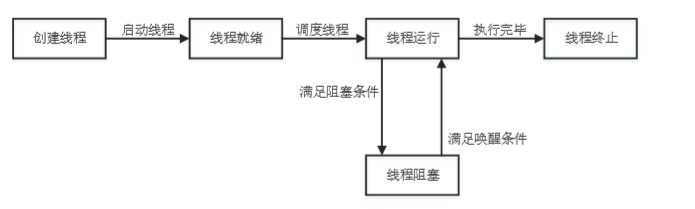
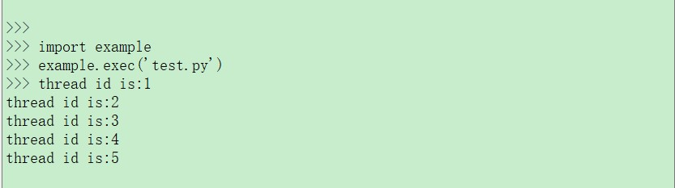

### 多线程 应用开发指导

#### 多线程/进程的基本概念 

Python 运行在 Python 虚拟机中，用户创建的多线程只是在 Python
虚拟机中的虚拟线程，而非在操作系统中的真正的线程。也就是说，Python
中的多线程是由 Python 虚拟机来进行轮询调度，而不是操作系统。

多线程可以使同一程序同时执行多个任务。线程在执行过程中与进程存在区别，在每个独立的线程中，都分别存在程序运行的入口、顺序执行序列以及程序的出口。并且线程必须依附在某个程序中，由程序来控制多个线程的运行。

**线程的基本操作** 

>   线程具有 5 种状态，状态转换的过程如下：



>   图 **1**：线程的 **5** 种状态

**线程和进程的主要区别** 

线程和进程都是操作系统控制程序运行的基本单位，系统可以利用这两个特性对程序实现高并发。而线程和进程的主要区别如下：

1.  一个程序至少有一个进程；一个进程中至少包含一个线程。

2.  进程在内存中拥有独立的存储空间，而多个线程则共享它所依赖的进程的存储空间。

3.  进程和线程对操作系统的资源管理的方式不同。

#### 多线程 **API** 详解 

**_thread.allocate_lock** 

>   该函数用于创建一个互斥锁对象。

- 函数原型

  _thread.allocate_lock()

- 参数

  无

  返回值

  返回互斥锁对象。互斥锁对象的函数详见第**3.1.1**章。

**互斥锁对象函数** 

**lock.acquire** 

>   该方法用于获取锁。

- 函数原型

  lock.acquire()

- 参数

  无

- 返回值

True 成功

>   False 失败

**lock.release** 

>   该方法用于释放锁。

- 函数原型

  lock.release()

- 参数

  无

- 返回值

  无

**lock.locked** 

>   该方法用于返回锁的状态。

- 函数原型

  lock.locked()

- 参数

  无

- 返回值

True 表示被某个线程获取

>   False 表示没有被线程获取

**_thread.get_ident** 

>   该方法用于获取当前线程号。

- 函数原型

  _thread.get_ident()

- 参数

  无

- 返回值

  返回当前线程号。

**_thread.stack_size** 

>   该方法用于设置创建新线程使用的堆栈大小。单位：字节。

- 函数原型

  _thread.stack_size(size)

- 参数

  *size*：堆栈大小。默认值：8192。

- 返回值

  返回当前堆栈大小。

**_thread.start_new_thread** 

>   该方法用于创建一个新线程。

- 函数原型

  _thread.start_new_thread(function, args)

- 参数

  *function*：

  接收执行函数

  *args*：

  被执行函数参数

- 返回值

  无

#### 多线程使用示例 

>   步骤**1**：
>   将开发板接入电脑。接入后的操作方法详见《Quectel_QuecPython_基础操作说明》。

>   

>   图 **2**：开发板接入电脑

>   步骤**2**： 创建 *test.py* 文件，在文件内导入 QuecPython 中的_thread
>   模块，编写多线程代码。

```python
import _thread

def th_func(thread_id):

	Print("thread id is:%d" % thread_id)

for i in range(5):

	_thread.start_new_thread(th_func,(i+1,))
```


>   步骤**3**： 将 test.py
>   文件上传到开发板，上传方法详见《Quectel_QuecPython_基础操作说明》。

>   步骤**4**： 程序运行结果，如图所示：



#### 附录参考文档 

>   表 **1**：参考文档

| 序号 | 文档名称                        | 备注                        |
| ---- | ------------------------------- | --------------------------- |
| [1]  | Quectel_QuecPython_基础操作说明 | QuecPython 上传下载文件说明 |