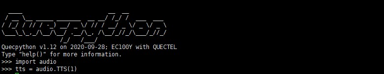
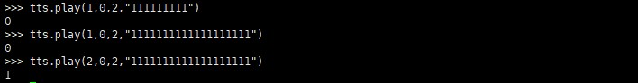
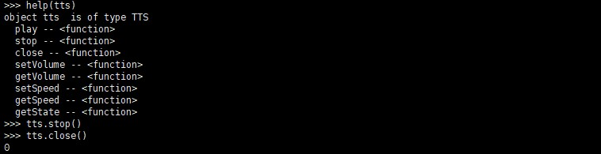
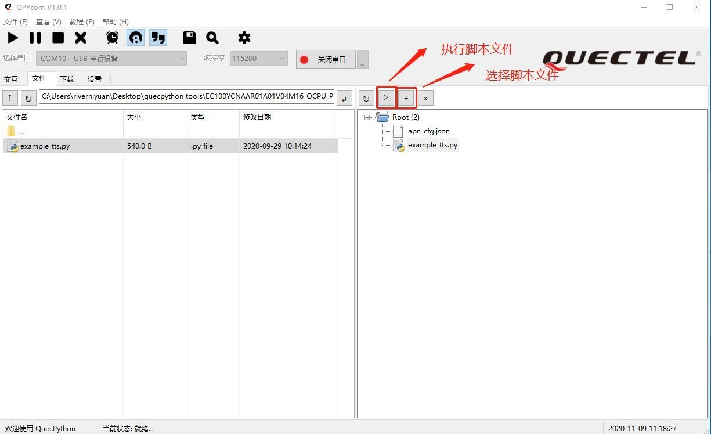

### TTS 使用指导 

#### 概述 

TTS 是 Text To Speech的缩写，即“从文本到语音”，是人机对话的一部分，让机器能够说话。它是同时运用语言学和心理学的杰出之作，在内置芯片的支持之下，通过神经网络的设计，把文字智能地转化为自然语音流。TTS技术对文本文件进行实时转换，转换时间之短可以秒计算。在其特有智能语音控制器作用下，文本输出的语音音律流畅，使得听者在听取信息时感觉自然，毫无机器语音输出的冷漠与生涩感。在使用开发板的TTS 模块功能之前我们需要先了解模块的 Audio 接口，如下图（以 EC100Y-CN模块为例）：

>   图 **1**：**EC100Y-CN** 模块 **Audio** 接口

>   连接 3.5mm 音频接口后按照《Quectel-QuecPython-Cat1开发板使用说明》进行驱动下载和固件安装。

#### TTS API 详解 

>   本章节介绍 TTS 相关 API。

**tts = audio.TTS** 

>   该函数用于导入音频（audio）库并创建 TTS 对象。

- 函数原型

  import audio 

  tts = audio.TTS(device)

- 参数

  *device*：

  表示设备类型，取值如下：

1.  话筒

2.  耳机

3.  喇叭

>   ⚫ 返回值

>   无。

**tts.play** 

>   该函数用于播放语音。

- 函数原型

  tts.play(priority, breakin, mode, str)

- 参数

  *priority*：整型。播放优先级，支持优先级 0~4，数值越大优先级越高。

  *breakin*：整型。打断模式，0 表示不允许被打断，1 表示允许被打断。

  *mode*：

  整型。编码模式：

1. UNICODE16 (Size end conversion)

2. UTF-8

3. UNICODE16 (Don't convert)

   *str*：字符串。待播放字符串。

   ⚫ 返回值

0 播放成功

>   -1 播放失败

>   1 无法立即播放，加入播放队列

-2 无法立即播放，且该请求的优先级组队列任务已达上限，无法加入播放队列备注

>   支持优先级 0~4，数字越大优先级越高，每个优先级组可同时最多加入 10
>   个播放任务，播放队列策略见

>   《Quectel QuecPython 类库 API 说明》。

**tts.setSpeed** 

>   该函数用于设置播放速度。

- 函数原型

  tts.setSpeed(speed)

- 参数

  *speed*：整型。播放速度，范围：0~9。值越大，速度越快。

- 返回值

  设置成功返回当前播放速度，失败返回整型-1。

**tts.setVolume** 

>   该函数用于设置播放音量。

- 函数原型

  tts.setVolume(vol)

- 参数

  *vol*：整型。播放音量。范围：0~9，0 表示静音。

- 返回值

  设置成功返回当前音量，失败返回整型-1。

**tts.getSpeed** 

>   该函数用于获取当前播放速度。

- 函数原型

  tts.getSpeed()

- 参数

  无。

- 返回值

  成功返回当前播放速度，失败返回整型-1。

**tts.getVolume** 

>   该函数用于获取播放音量。

- 函数原型

  tts.getVolume()

- 参数

  无。

- 返回值

  成功返回当前播放音量，失败返回整型-1。

**tts.getState** 

>   该函数用于获取当前播放状态。

- 函数原型

  tts.getState()

- 参数

  无。

- 返回值

1.  当前无 TTS 播放

2.  当前有 TTS 正在播放

**tts.stop** 

>   该函数用于暂停播放。

- 函数原型

  tts.stop()

- 参数

>   无。

-   返回值

0 暂停播放成功

>   -1 暂停播放失败

**tts.close** 

>   该函数用于关闭 TTS 功能。

- 函数原型

  tts.close()

- 参数

  无。

- 返回值

0 关闭 TTS 成功

>   -1 关闭 TTS 失败

#### TTS 功能实现 

**命令行执行** 

1. 通过 Xshell
   连接开发板主串口后按以下步骤执行，通过以下函数导入音频（audio）库并创建 TTS
   对象：

   import audio tts = audio.TTS(device)

1. 使用以下函数播放语音：

   tts.play(priority, breakin, mode, str)

1.  此时可在耳机中听到播放文本内容的语音，可通过 *tts.setSpeed(speed)*和
    *tts.setVolume(vol)*来设置播放速度和播放音量。

1.  通过 *tts.getSpeed()*和
    *tts.getVolume()*来获取当前播放速度和音量。另外，可通过
    *tts.getState()*来获取当前播放状态。

1.  播放过程中可通过 *tts.stop()*来暂停播放。播放完成后可通过 *tts.close()*关闭
    TTS 功能。

**执行 py 文件** 

1.  首先在提供的 SDK 工具包中进入 demo 目录，找到 TTS 文件夹，通过 QPYcom 工具将
    TTS 目录下的 example_tts.py
    脚本文件发送到模块中，脚本文件发送和执行具体步骤，参见《QPYcom
    工具使用说明》。

1.  在 Xshell 中，连接模块主串口，进入交互界面，通过
    *uos.listdir()*方法确认上一步骤发送的脚本文件是否在当前目录下，然后执行如下步骤：

通过 import example 导入 example 模块，该模块提供了 *exec()*方法用来执行 python
脚本程序，通过 *example.exec(‘example.tts.py’)*来执行 example.tts.py
脚本，执行完成后即可在耳机中听到播放脚本中文本内容的语音。

#### 附录 

>   表 **1**：术语缩写

| 术语    | 英文全称                                               | 中文全称                        |
| ------- | ------------------------------------------------------ | ------------------------------- |
| API     | Application Programming Interface                      | 应用程序编程接口                |
| LTE     | Long Term Evolution                                    | 长期演进                        |
| SDK     | Software Development Kit                               | 软件开发工具包                  |
| TTS     | Text To Speech                                         | 从文本到语音                    |
| UNICODE | Unicode                                                | 统一码                          |
| UTF     | Universal Character Set/Unicode  Transformation Format | 针对 Unicode 的可变长度字符编码 |